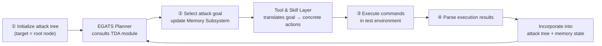
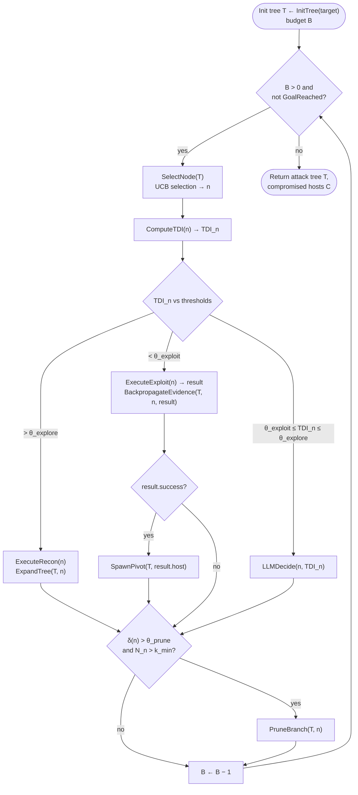

⚙️ Chunk 2 of the paper

## 3.3.2 Design Implications

📌 **Two-part strategy** for advancing LLM-based penetration testing, following from the failure-mode analysis in §3.3:

- **Eliminating Type A failures** requires comprehensive tool interfaces with typed schemas, RAG systems for exploit documentation and CVE databases, and standardized execution environments.
  - Tedious engineering work, but produces predictable returns — each tool added directly enables new attack capabilities.
- **Addressing Type B failures** requires a different approach:
  - Real-time difficulty estimation
  - Principled exploration-exploitation decisions guided by those estimates
  - Active pruning of intractable branches to prevent search collapse
  - State maintenance external to conversation context, to prevent information loss
  - → These requirements point toward tree-based search algorithms that maintain state explicitly rather than relying on the LLM's context window.

⚠️ **Neither approach alone is sufficient:**
- Capability engineering → strong short-horizon performance, but fails on complex tasks where navigation is the bottleneck.
- Planning innovation without adequate tooling → agents that reason well but cannot execute.
- Effective systems must address both failure categories simultaneously, and agents need real-time task-difficulty assessment to avoid exploration-exploitation imbalance and chain failures.

---

## 4 Design of PentestGPT V2

### 4.1 Overview

PentestGPT V2 is a **single-agent system**, designed around the §3.3 analysis to address both failure categories through dedicated architectural components:

1. **Tool and Skill Layer** — eliminates Type A failures via structured tool interfaces and knowledge augmentation (§4.2).
2. **Task Difficulty Assessment (TDA)** — estimates tractability in real time (§4.3), integrated into an **Evidence-Guided Attack Tree Search (EGATS)** that replaces the traditional PTT structure for exploration-exploitation decisions (§4.4).
3. **Memory Subsystem** — maintains state across attack phases to prevent context forgetting (§4.5).

🔬 **Operating loop**, given a target:

🖼️ **Figure 2 (architecture diagram):** shows the pipeline — Attack Target (as tree structure) → Excalibur Agent, comprising the TDA-EGATS Planner (Task Difficulty Assessment: Horizon/Evidence/Context/Success → EGATS Operations → Attack Tree; TDI-Guided Mode: BFS/LLM/DFS), the Memory Subsystem (State, Context, Branch Summaries), and the Tool & Skill Layer (Tool Interfaces, Skill Composition) → Attack Instruction → Execution Results → Output (Attack Path, Completed nodes). The TDA-EGATS Planner addresses Type B failures via difficulty-aware tree search with UCB selection, TDI-guided mode switching, and evidence-based pruning; the Tool & Skill Layer addresses Type A failures via typed tool interfaces and RAG-augmented knowledge; the Memory Subsystem maintains structured state and enables selective context injection based on tree position.

---

### 4.2 Tool and Skill Layer

📌 Type A failures arise not from fundamental capability limits, but from **inconsistent tool usage**: incorrect parameters, misparsed outputs, missing domain knowledge about tool capabilities.

> Rather than proposing novel techniques, the Tool and Skill Layer is careful engineering to ensure LLM agents interact with security tools consistently and reliably, building on Anthropic's Agent Skills concepts (typed interfaces, skill composition, RAG), adapted to penetration testing where tool reliability directly determines attack success.

**Typed Tool Interfaces**
- Each tool exposed via a typed interface: input schema (params, types, defaults, validation), output schema (structured parse of command output), pre/postconditions (required state before invocation, expected effects after).
- LLM gets explicit documentation instead of relying on parametric knowledge.
- Input validation catches errors pre-execution; structured outputs remove parsing ambiguity.
- **38 tools** across six categories: reconnaissance, web exploitation, network exploitation, credential attacks, Active Directory attacks, privilege escalation (full list in Appendix B).

**Skill Composition**
- Skills compose multiple tool invocations into higher-level attack capabilities encoding expert knowledge of common attack patterns.
- Provide fallback logic — if a preferred tool fails, the system tries alternatives automatically.
- Aggregate multi-tool results into coherent findings.
- Encode multi-step attack patterns reflecting how human testers chain operations.

**Knowledge Augmentation**
- RAG system containing:
  - Tool documentation
  - Exploit database (CVE descriptions indexed by service version)
  - Attack playbooks (step-by-step procedures, e.g. Kerberoasting, AS-REP roasting, pass-the-hash)
- Knowledge base restricted to **generic public techniques** (MITRE ATT&CK, OWASP, tool docs); excludes CTF writeups, HTB walkthroughs, or benchmark-specific solutions — to prevent data leakage in evaluation.
- Relevant documentation is retrieved and auto-injected into context when the agent hits an unfamiliar service/vulnerability class.

📊 None of the three mechanisms (typed interfaces, skill composition, knowledge augmentation) is individually novel — the contribution is their **combination**, minimizing tool-invocation errors that otherwise cascade into attack failures. Per the ablation study (§5.3): the Tool Layer alone improves XBOW completion by **14 points (54% → 68%)**, letting agents focus reasoning on harder planning/strategy problems.

---

### 4.3 Task Difficulty Assessment (TDA)

Root cause of Type B failures (per §3.3): agents cannot assess task difficulty.

| Type B failure | Cause |
|---|---|
| Premature commitment | Agents can't estimate whether a path needs 3 or 30 steps |
| Exploration-exploitation imbalance | No metric for "reconnaissance is sufficient" |
| Chain failures | Can't judge if accumulated context suffices for the current task |

> Human testers face the same problem — they don't know difficulty a priori, but estimate it from accumulating signals: failed attempts on a path, quality of gathered evidence, intuitions about remaining work.

TDA operationalizes this via **four measurable dimensions**, plus context-window consumption as a signal unique to LLMs.

#### 4.3.1 TDA Dimensions

**Horizon Estimation (H)**
- Estimated remaining steps to goal from current position, normalized across active branches.
- Pilot study (50 traces, independent GOAD deployment, GPT-4o, separate from evaluation): absolute estimates poorly calibrated (MAE 4.2 steps), but rank correlation strong (Spearman's ρ = 0.71, p < 0.001).
- TDI formula therefore uses $\hat{H}$, the min-max normalized horizon estimate across active branches — converting absolute estimates into relative rankings where LLM judgment is reliable.

**Historical Success Rate (S)**
- Laplace-smoothed success rate on the current branch.
- Low values → repeated failures → path likely intractable.
- Directly addresses premature commitment: agents learn to abandon unproductive paths.

**Context Load (C)**
- Fraction of context window consumed (directly measurable from token counts).
- LLM performance degrades as context fills — retrieval accuracy drops, earlier info forgotten, reasoning quality declines.
- Ideal working window defined as **40%** of context capacity, based on a controlled degradation study: 94% → 78% accuracy at 60% load, 61% at 80% load (Appendix D.6).
- Beyond the 40% threshold, context pruning becomes necessary.
- Addresses context forgetting by tracking when accumulated history threatens the model's effective memory.

**Evidence Confidence (E)**
- Mean confidence score across the path from root to current node, from evidence categories per node.

| Evidence type | Score |
|---|---|
| Verified exploits / valid credentials | 1.0 |
| Confirmed vulnerabilities w/ available exploit | 0.8 |
| Plausible hypotheses (version-matched vulns, misconfigs) | 0.5 |
| Speculative hypotheses | 0.3 |

- Parsed from tool outputs: successful auth/shell access → verified; scanner confirmations w/ CVE match → confirmed; service-version match against exploit DB → plausible. (Full rubric: Appendix C.)
- Addresses exploration-exploitation imbalance: high confidence → ready to exploit; low confidence → needs more recon.

#### 4.3.2 Task Difficulty Index

$$
TDI = w_H \cdot \hat{H} + w_E \cdot (1-E) + w_C \cdot C + w_S \cdot (1-S)
$$

- All weights sum to 1; **higher TDI = greater difficulty**.
- Set $w_H = w_E = 0.3$, $w_C = w_S = 0.2$ via grid search over a 30-trace HTB validation set (retired machines from 2022–2023, predating the evaluation set, disjoint from the PentestGPT benchmark).
- 256 configurations tested (each weight ∈ {0.1, 0.2, 0.3, 0.4}, constrained to sum to 1.0); task completion varies only ±3% across configurations where all weights stay in [0.1, 0.4] → approach is not sensitive to precise weight selection.

**TDI drives three operational decisions:**

1. **Mode selection**
   - $TDI > \theta_{explore} = 0.6$ → reconnaissance (BFS)
   - $TDI < \theta_{exploit} = 0.3$ → exploitation (DFS)
   - $0.3 \le TDI \le 0.6$ → `LLM-DECIDE`: LLM receives node state, TDI, and per-dimension scores (H, S, C, E), then picks recon vs. exploitation with brief justification.
     - Rationale: intermediate difficulty may warrant either approach depending on context the formula can't fully capture (e.g. moderate difficulty + high evidence confidence → exploit; moderate difficulty + low confidence → recon).
2. **Branch prioritization** — TDI ranks paths beyond promise scores alone, since two similarly-promising branches may differ substantially in tractability (horizon, success history).
3. **Pruning** — branches with persistently high TDI ($> \theta_{prune} = 0.8$) after $k_{min} = 3$ attempts are pruned, preventing search collapse into unproductive regions.

Thresholds derived via grid search on the same validation set as the TDI weights; Appendix D shows robustness across threshold ranges.

> **Table 4 — Search strategy comparison** (EGATS is the only approach combining external structure, evidence-based pruning, and TDA-guided mode selection):

| Approach | Structure | Pruning | Difficulty-aware | TDA |
|---|---|---|---|---|
| ReAct | None | – | – | – |
| PTT | Tree (text) | Manual | – | – |
| PSM | Finite state machine | – | – | – |
| PMT | Tree | – | – | – |
| **EGATS** | Tree (external) | Evidence-based | ✓ | ✓ |

---

### 4.4 Evidence-Guided Attack Tree Search (EGATS)

EGATS integrates TDA into a tree-based search framework, adapting Monte Carlo Tree Search (MCTS) to penetration testing. Differs from standard MCTS in three ways:

1. Explicitly separates reconnaissance (BFS) and exploitation (TDI-guided) phases.
2. Replaces simulation-based value estimates with TDA-based difficulty assessment.
3. Prunes intractable branches based on evidence.

#### 4.4.1 Attack Tree Structure

Attack Tree $T = (V, E, \phi, \psi, \delta)$:

- $V$ — nodes representing attack states (categorized as **observation**, **hypothesis**, or **action**)
- $E$ — edges representing actions
- $\phi : V \to [0,1]$ — promise scores
- $\psi : V \to S$ — maps nodes to state snapshots
- $\delta : V \to [0,1]$ — TDI scores

**Promise score $\phi(n)$** estimates likelihood that node $n$ leads to successful exploitation:
- Hypothesis nodes: initialized via LLM assessment of vulnerability severity, exploit availability, prerequisite satisfaction.
- Action nodes: updated from execution outcomes — successes propagate increased promise up to ancestors, failures decrease promise along the path.

After action $a$ with outcome $o \in \{success, partial, failure\}$:

$$
\phi(n) \leftarrow \alpha \cdot \phi(n) + (1-\alpha) \cdot r(o)
$$

where $r(success) = 1.0$, $r(partial) = 0.5$, $r(failure) = 0.1$, and $\alpha = 0.7$ (learning rate). Through this backpropagation, consistently-successful branches accumulate high promise while repeatedly-failing branches see diminishing scores.

Unlike PentestGPT's text-based PTT, EGATS maintains structure **externally** via algorithmic operations — preventing corruption and enabling systematic search guidance.

#### 4.4.2 The EGATS Algorithm

**UCB selection** balances exploitation and exploration:

$$
UCB(n) = \phi(n) + c\sqrt{\frac{\ln N}{N_n}} - \lambda \cdot \delta(n)
$$

- $\phi(n)$ — promise score
- $N$ — total actions; $N_n$ — actions on node $n$'s subtree
- $c = \sqrt{2}$ — exploration constant
- $-\lambda \cdot \delta(n)$ — penalizes high-difficulty nodes ($\lambda = 0.5$, grid-search validated, Appendix D)

After selection, EGATS computes TDI and switches BFS (recon) ↔ DFS (exploitation) per the thresholds in §4.3.2. Evidence backpropagates after each action, updating promise and TDI along affected paths.

- **Pivot spawning**: on exploitation success, the compromised host becomes a new subtree root; discovered credentials propagate to relevant hypothesis nodes elsewhere in the tree.
- **Pruning**: removes branches when TDI > 0.8 after 3 attempts, preventing infinite loops on intractable paths.
- **Credential propagation**: re-evaluates pruned branches when new credentials are discovered that may satisfy their preconditions — avoiding premature pruning.

---

### 4.5 Memory Subsystem

Long-context forgetting is a primary cause of Type B failures (§3.2). The Memory Subsystem uses a **hybrid architecture** separating persistent state from conversational context, integrated with TDA via the context-load dimension.

**State Store**
- Structured database of discovered facts, independent of conversation context.
- Tracks five entity types:
  1. **Hosts** — IPs, hostnames, OS fingerprints
  2. **Services** — ports, versions, configurations
  3. **Credentials** — usernames, passwords, hashes, tickets
  4. **Sessions** — active shells, tunnels, pivots
  5. **Vulnerabilities** — CVE identifiers, exploitation status, prerequisites
- Each entry timestamped and linked to its discovery node in the attack tree → provenance tracking, facts persist regardless of conversation length.
- Supports accurate TDA context-load computation by providing ground truth on what the agent "knows" vs. what must be re-derived from context.

**Selective Context Injection** (replaces full history maintenance) — assembled from:
- **Path context** — sequence of actions from root to current node $n$
- **Node state snapshot** — complete state at $n$, including all relevant entity relationships
- **Target-relevant facts** — State Store entries for $n$'s target host/service
- **Sibling branch summaries** — compressed representations of parallel exploration paths

- As context load approaches the 40% ideal-window threshold → less-relevant context progressively compressed via LLM-generated summaries.
- Beyond **70%** → aggressive pruning removes older path segments while preserving findings, to prevent performance degradation.

**Branch Summaries** — compress detailed execution history when switching branches. Each preserves:
- Current status (active / pruned / completed)
- Findings (discovered credentials, confirmed vulnerabilities)
- TDI at time of suspension
- Recommended next actions

Stored TDI informs revisit decisions: when new credentials appear elsewhere in the tree, branches with matching preconditions and previously-high TDI are re-evaluated for potential reactivation.

---

## 5 Evaluation

Four research questions:

- **RQ1** — Does PentestGPT V2 outperform existing systems across different penetration-testing scenarios?
- **RQ2** — What is the contribution of each architectural component?
- **RQ3** — How does TDA-EGATS change the agent's attack strategy vs. prior approaches?
- **RQ4** — Can PentestGPT V2 be practically deployed for real-world penetration testing?

### 5.1 Experimental Setup

- Implemented in Python (~8,500 lines); Tool Layer, TDA-EGATS Planner, and Memory Subsystem as separate modules. Open-sourced.
- Evaluated on **three benchmarks of increasing complexity**:
  - **XBOW** (104 tasks) — CTF-style web security challenges (SQLi, XSS, auth bypass, file inclusion); short-horizon tasks isolating Type A failures.
  - **PentestGPT Benchmark** (13 machines, HTB + VulnHub) — end-to-end pentesting, recon through privesc to root; Easy–Hard difficulty, 9–22 subtasks/machine; realistic multi-step attack chains.
  - **GOAD** (5-host multi-domain AD environment) — credential harvesting, Kerberoasting, lateral movement, domain escalation; complex enterprise scenarios dominated by Type B failures.
- **Baselines**: PentestGPT v1.0, AutoPT, PentestAgent, VulnBot. (Cochise excluded — its AD-specialized architecture would create an uneven comparison, per §3.2.) Baselines use their original tool-invocation mechanisms, so reported improvements reflect both tool integration and architectural contributions.
- **Models**: GPT-5.2, Claude-Opus-4.5, Gemini-3.0-Pro — chosen as state-of-the-art at evaluation time and because all three support standard/thinking-mode toggling, enabling controlled comparison of extended reasoning effects.
- **Metrics**: task completion rate, subtask progress, exploration metrics (branch diversity, backtrack frequency, time-to-pivot).
  - Discrete outcomes (machines rooted, hosts compromised) → best-of-three reported (following prior work), since std. dev. on small integers has limited insight.
  - XBOW's continuous completion rates → both best-of-three headline results and trial statistics (mean μ, std. dev. σ).
- **Scale**: 5 systems × 118 evaluation units × 6 model configurations × 3 trials = **10,620 evaluation runs**, ≈ **$2,760 USD** in API tokens (PentestGPT V2-specific costs in Table 8).

### 5.2 RQ1: Overall Performance

> **Table 5 — Performance comparison** (XBOW: task completion %; PentestGPT-Ben: machines rooted /13; GOAD: hosts compromised /5; best-of-3; each model split into non-thinking "–" and thinking "T" modes; variance ±2–3% on XBOW, ±1 machine on PentestGPT-Ben):

| System | XBOW GPT-5.2 (–/T) | XBOW Opus 4.5 (–/T) | XBOW Gemini 3 (–/T) | PB GPT-5.2 (–/T) | PB Opus 4.5 (–/T) | PB Gemini 3 (–/T) | GOAD GPT-5.2 (–/T) | GOAD Opus 4.5 (–/T) | GOAD Gemini 3 (–/T) |
|---|---|---|---|---|---|---|---|---|---|
| PentestGPT | 45/53 | 47/54 | 41/48 | 7/8 | 6/7 | 6/7 | 1/1 | 1/2 | 1/1 |
| AutoPT | 43/50 | 44/51 | 38/45 | 6/7 | 7/8 | 5/6 | 1/1 | 0/1 | 1/1 |
| PentestAgent | 52/61 | 54/60 | 46/54 | 8/9 | 7/9 | 7/8 | 1/2 | 2/2 | 1/1 |
| VulnBot | 48/56 | 50/58 | 43/51 | 8/9 | 8/9 | 6/8 | 2/2 | 1/2 | 1/2 |
| **PentestGPT V2** | **76/85** | **81/91** | **76/79** | **11/12** | **10/12** | **10/11** | **3/4** | **3/4** | **3/3** |

📊 **Key results:**

- **XBOW**: PentestGPT V2 hits **91% completion** (best-of-3; μ=89%, σ=2.1%) with Opus 4.5 thinking mode — a **49% relative improvement** over the best baseline (PentestAgent, 61%; μ=59%, σ=1.8%). With GPT-5.2 thinking: 85% (μ=83%, σ=2.4%) vs. 61% for PentestAgent.
  - Even comparing means, the gap (89% vs. 59%) exceeds **15 standard deviations** — robust architectural difference: the Tool Layer eliminates Type A failures while TDA-EGATS prevents trial-and-error loops that consume baseline attempts.
  - Thinking mode gives 6–10 point improvements across all systems/configs, but doesn't close the architectural gap.
- **PentestGPT Benchmark**: larger architectural differences. PentestGPT V2 roots **12/13 machines** with both GPT-5.2 and Opus 4.5 thinking (consistent across all 3 trials), vs. 9 for the best baseline (VulnBot) — a **33% relative improvement**.
  - Solves both Hard-rated machines (Joker, Falafel), where baselines got "stuck at initial steps"; also completes machines requiring non-obvious attack chains.
  - Improvement concentrates on machines needing **non-linear attack paths**: baseline PTT structures lead to premature commitment on initial hypotheses, while TDA-EGATS enables strategic backtracking when evidence confidence drops, surfacing alternative attack vectors.
  - Thinking mode amplifies architectural differences further: PentestGPT V2 gains 1–2 machines from thinking, reaching near-complete coverage.

*(Section continues in the next chunk — GOAD results and RQ2 onward not yet covered in this excerpt.)*
