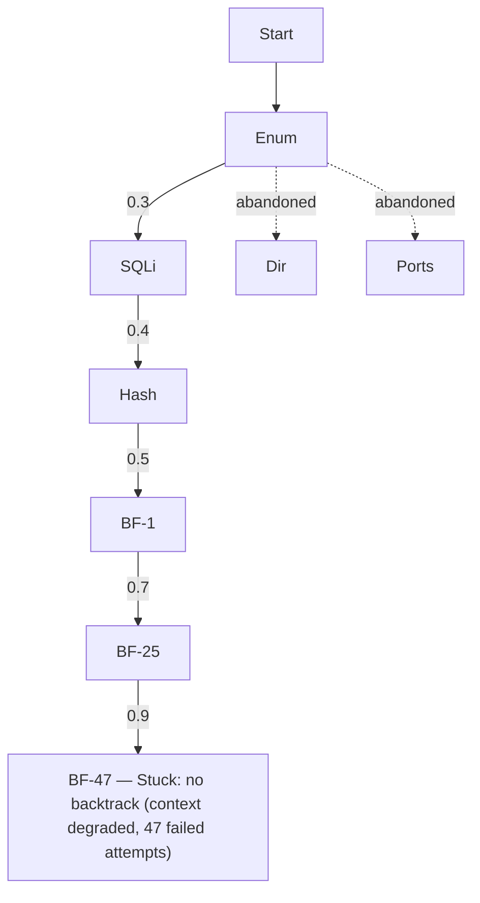
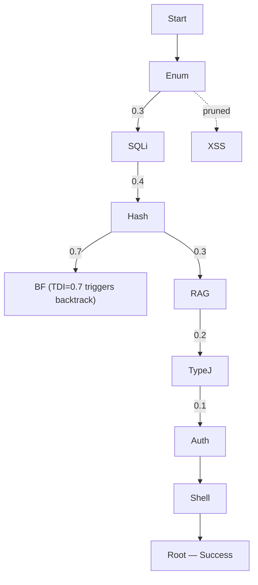

⚙️ Chunk 3 of the paper

### 5.2.3 GOAD Results (cont.)

GOAD shows the largest improvement. PentestGPT V2 compromises 4 of 5 hosts with GPT-5.2 and Opus 4.5 thinking (4 hosts in all three trials; the same four hosts each time) versus at most 2 for baselines — doubling the compromise rate (80% vs. 40%). This pattern holds consistently across all three models and both reasoning modes (even Gemini 3 achieves 3 hosts vs. 1–2 for baselines), indicating a robust architectural effect. Baselines achieve initial foothold but fail to progress through lateral movement; PentestGPT V2 executes coherent multi-host attack chains using the Memory Subsystem for credential persistence and TDA for exploration guidance.

## 5.3 RQ2: Ablation Study

To isolate each component's contribution, system variants are evaluated with individual components disabled.

- Table 6 presents results using **GPT-5.2 thinking mode**
- Base configuration = raw shell access with reactive prompting + sliding-window context management
- Figure 3 visualizes component contributions across all model configurations

**Table 6: Ablation study results (GPT-5.2 thinking).** Each row adds a component cumulatively.

| Configuration | XBOW | Pentest-Ben | GOAD |
|---|---|---|---|
| Base | 54 | 8 | 2 |
| + Tool Layer | 68 | 9 | 2 |
| + TDA-EGATS | 77 | 11 | 3 |
| + Memory (Full) | 85 | 12 | 4 |

🖼️ **Figure 3:** Ablation study across benchmarks (GPT-5.2 thinking), normalized to percentage scale — three waterfall/bar charts (XBOW, PentestGPT-Ben, GOAD) showing cumulative gains from Base → +Tool → +EGATS → +Memory → Full. Largest single gains: +Tool (+14%) on XBOW, +EGATS (+15%) on PentestGPT-Ben, +EGATS (+20%) on GOAD. Final scores: 85% (XBOW), 92% (PentestGPT-Ben), 80% (GOAD).

> 📌 **Key finding:** Results align with the Type A/B failure framework.
> - The **Tool Layer** gives the largest improvement on XBOW (+14 pts, 54→68) — consistent with CTF failures being predominantly *engineering* problems addressable through better tooling.
> - The Tool Layer alone yields **zero improvement on GOAD** (stays at 2 hosts) — where *planning*, not capability, determines success.

**Table 7: Search behavior comparison on the PentestGPT benchmark** (mean across 13 machines).

| Metric | PentestGPT | PentestGPT V2 |
|---|---|---|
| Branches explored | 3.2 | 7.8 |
| Backtrack rate (%) | 8 | 34 |
| Avg. depth before pivot | 12.4 | 5.1 |
| Successful pivots | 0.4 | 2.6 |
| Pruned branches | – | 4.2 |

**TDA-EGATS contributions:**
- +9 points on XBOW (68→77) — via reduced trial-and-error
- +2 machines on PentestGPT benchmark (9→11)
- +1 host on GOAD (2→3)
- Spans both Type A failures (more efficient search) and Type B failures (principled exploration-exploitation)

**Memory Subsystem contributions:**
- +8 points on XBOW (77→85)
- +1 machine on PentestGPT benchmark (11→12)
- +1 host on GOAD (3→4)

> ⚠️ The GOAD improvement is notable: extended attack campaigns cause context forgetting in systems without explicit state management; Memory enables the credential persistence required for the fourth compromise.

## 5.4 RQ3: Strategy Analysis

Analyzing how TDA-EGATS changes attack strategy vs. PentestGPT's PTT-based approach.

### 5.4.1 Search Behavior

Table 7 (above) compares exploration patterns — qualitatively different search behaviors emerge:

- **PentestGPT**: deep-first pattern — fewer branches explored (3.2 vs. 7.8) but commits to each for longer (avg. depth 12.4 steps before pivoting vs. 5.1). Reflects the *premature commitment* failure mode: agents persist on initial hypotheses without signals to recognize intractability.
- **PentestGPT V2 (TDA-EGATS)**: adaptive pattern — TDI (Task Difficulty Index) monitoring triggers backtracking when success rate drops; evidence confidence guides exploitation timing. 4.2 pruned branches per machine = paths abandoned due to persistently high TDI, preventing infinite loops seen in baselines.

### 5.4.2 Case Study: HTB Falafel

Falafel is a **Hard-rated** HTB machine requiring a multi-stage attack chain combining web exploitation, cryptographic quirks, and privilege escalation via Linux group memberships.

**Attack chain:**
1. Web enumeration reveals a login form with different error messages for valid vs. invalid usernames → user discovery via fuzzing
2. Boolean-based blind SQL injection in the username field → extracts password hashes from the database
3. Admin hash begins with `"0e462..."` — a format PHP's loose comparison operator (`==`) interprets as scientific notation
4. Submitting the string `"240610708"` produces an MD5 hash also starting with `"0e"` → both values compare as zero → authentication bypass without password cracking
5. Post-authentication: a **filename truncation vulnerability** enables code execution — filenames exceeding 237 characters are truncated, so uploading `[232 A's].php.png` yields an executable `.php` file after truncation removes `.png`
6. Privilege escalation (three stages):
   - Database credentials in the PHP config → user `moshe`
   - Membership in the `video` group → framebuffer capture reveals `yossi`'s password displayed on screen
   - Membership in the `disk` group → reading root's files directly via `debugfs`

**How the two systems diverge:**

- **PentestGPT**: extracts the password hashes successfully but commits to direct cracking via hashcat. After 47 failed attempts with various wordlists/rules, context degradation prevents revisiting the hash format — the type juggling vector is never considered.
- **PentestGPT V2 (EGATS)**: when hash cracking yields repeated failures, rising TDI triggers exploration of authentication alternatives. Knowledge Augmentation surfaces PHP type-juggling documentation when queried about hashes starting with `"0e"`, enabling the bypass. The Memory Subsystem preserves credentials discovered at each privilege escalation stage, enabling the complete chain from `www-data` through `moshe` and `yossi` to `root`.

🖼️ **Figure 4:** HTB Falafel exploration comparison — (a) PentestGPT's PTT tree commits to password brute-force after extracting hashes and stalls after 47 attempts (no backtrack); (b) PentestGPT V2's EGATS tree, TDI-guided, discovers the type-juggling bypass when hash cracking fails, then navigates privilege escalation to Root. Represented below as Mermaid graphs:

*(a) PentestGPT / PTT — deep commitment, no pivot*

*(b) PentestGPT V2 / EGATS — TDI-triggered pivot to type-juggling path*

### 5.4.3 Failure Case: PlayerTwo

The only PentestGPT Benchmark machine PentestGPT V2 fails to compromise.

- Requires exploiting a **custom Protobuf-based game protocol** with no public documentation
- PentestGPT V2 correctly identifies the service via reconnaissance, spawns hypothesis branches for protocol fuzzing
- TDI rises rapidly due to repeated failures (low *S*) and high horizon estimates (LLM cannot predict steps for an unknown protocol)
- After three unsuccessful fuzzing attempts, the branch is correctly pruned by TDA's design logic

> ⚠️ **TDA limitation exposed:** it cannot distinguish "difficult but tractable" from "novel requiring creative reasoning" — both present as high TDI. When RAG retrieval finds no relevant documentation and the LLM lacks parametric knowledge, TDA's evidence-based signals provide no useful guidance. TDA-EGATS improves navigation through *known* attack spaces but does not address *novel* exploitation requiring genuine invention.

## 5.5 RQ4: Real-World Deployment

Evaluates PentestGPT V2's resource consumption and deploys it in a live competition environment.

### 5.5.1 Cost Analysis

**Table 8: Resource consumption per task** (median values, GPT-5.2 thinking).

| Benchmark | LLM Calls | Time (min) | Cost ($) |
|---|---|---|---|
| XBOW | 12 | 3.2 | 0.18 |
| PentestGPT-Ben | 87 | 42 | 4.20 |
| GOAD | 234 | 186 | 28.50 |

- **XBOW**: 23% fewer LLM calls than baseline average (12 vs. 15.6 median) due to reduced trial-and-error from structured tool interfaces, while achieving 39% higher success rates (85% vs. 61%)
- **GOAD**: total calls increase 18% due to more thorough EGATS exploration, but yields 2× more compromised hosts (4 vs. 2)
- **Cost-effectiveness (per-success basis)**: 1.8× more cost-effective on XBOW, 1.7× more cost-effective on GOAD — EGATS overhead more than offset by higher success rates
- A complete GOAD engagement costs ≈ **$28.50** and achieves **80% environment compromise** (4 of 5 hosts) — making automated penetration testing economically viable for enterprise security assessments

### 5.5.2 Live Competition Deployment

Deployed during **HTB Season 8** (May–August 2025) — 13 newly released machines with solutions unavailable until season conclusion. Tests real-world viability: unlike retired benchmark machines, Season machines incorporate recent CVEs and novel attack chains with no public walkthroughs.

- PentestGPT V2 with **Opus 4.1** completed **10 of 13 machines (76.9%)**
- Achieved a global ranking in the **top 100 out of 8,036** active participants

**Table 9: HTB Season 8 performance by difficulty** (May–August 2025). Total: 10/13 machines (76.9%).

| Difficulty | Completed | Total | Rate |
|---|---|---|---|
| Easy | 4 | 4 | 100% |
| Medium | 4 | 4 | 100% |
| Hard | 2 | 3 | 67% |
| Insane | 0 | 2 | 0% |
| **Total** | **10** | **13** | **76.9%** |

- All 4 Easy and all 4 Medium machines compromised successfully
- Among Hard machines: completed **Certificate** and **RustyKey**, failed on **Mirage**
- Both Insane machines (**Sorcery**, **Cobblestone**) remained unsolved
- Failures represent machines where PentestGPT V2 exhausted its search space without finding viable attack paths — aligns with the PlayerTwo analysis (§5.4): when RAG retrieval yields no relevant documentation and the model lacks parametric knowledge of the vulnerability class, TDA-EGATS cannot guide exploration effectively

> 📌 The 100% success rate on Easy/Medium suggests readiness for deployment on typical enterprise targets; Hard/Insane failures mark current boundaries where human expertise is still required.

## 6 Discussion

### 6.1 Limitations and Threats to Validity

**Benchmark Scope**
- Covers web security, network pentesting, and Active Directory attacks
- Omits binary exploitation, mobile security, and cloud-specific attack scenarios
- Binary exploitation requiring precise memory-layout reasoning poses distinct challenges not captured here
- PentestGPT Benchmark uses retired machines with public walkthroughs, which may inflate absolute numbers via data contamination; however TDA, EGATS, and Memory target planning challenges orthogonal to specific vulnerability knowledge and thus should transfer to novel scenarios
- Real-world engagements also involve active defenses and novel vulnerability classes absent from historical benchmarks

**Model-Specific Effects**
- Results obtained with three frontier models: GPT-5.2, Claude-Opus-4.5, Gemini-3.0-Pro
- Opus 4.5 achieves the highest XBOW performance (91%) — architectural contributions may interact differently across model families
- Future model generations may shift the easy/hard boundary

**Baseline Fairness**
- Published baseline code used with default parameters; original authors might achieve better results through tuning (though this reflects realistic deployment scenarios)
- Baselines use their original tool invocation mechanisms, so reported improvements reflect both tool integration and architectural contributions

**Failure Analysis**
- **XBOW**: 9 failed tasks (9%) fall into two categories — blind injection requiring extensive timing-based exfiltration (4 tasks), and multi-stage attacks requiring creative payload chaining not present in the RAG corpus (5 tasks)
- **PentestGPT Benchmark**: single unsolved machine (PlayerTwo, Hard) — custom protocol with no public documentation, demands reasoning beyond pattern matching
- **GOAD**: fifth host (forest root domain controller) requires a specific chain (PrintNightmare → DCSync) that PentestGPT V2 identifies but fails to execute due to token constraints
- Overall: PentestGPT V2 addresses Type B failures effectively, but novel exploitation requiring creative reasoning remains an open problem

### 6.2 What Remains Hard

Three categories of irreducible Type B failures that better tooling, larger corpora, or improved prompting cannot resolve:

1. **The Creativity Barrier** — LLMs pattern-match well but struggle with out-of-distribution generalization. PlayerTwo illustrates this: systematic exploration fails because no documented exploitation pattern exists for the custom Protobuf protocol. "Difficult" tasks respond to improved search; "novel" tasks require reasoning capabilities current architectures don't provide.

2. **The Adversarial Environment Barrier** — Pentesting occurs against active defenders who can exploit agent reasoning patterns. Honeypots, canary tokens, and deceptive services can poison the agent's state representation, causing pursuit of false attack paths or triggering detection. Evidence grounding protects against self-generated hallucinations but offers limited defense against environmentally-induced false beliefs — the agent cannot tell if a convincing vulnerable service is genuine or a trap. This asymmetry favors defenders.

3. **The Temporal Scale Barrier** — Human pentesters maintain mental models across engagements spanning weeks, correlating information across sessions and exercising strategic patience. EGATS improves multi-step reasoning *within* sessions and Memory preserves state, but neither addresses cross-session continuity. Long-horizon planning ≠ long-context processing — it requires hierarchical abstraction, goal decomposition, and progress monitoring, none of which current transformer architectures natively support.

## 7 Conclusion

- Presents a systematic analysis of LLM-based penetration testing distinguishing:
  - **Type A failures**: capability gaps addressable through engineering
  - **Type B failures**: complexity barriers requiring architectural innovation
- Introduces **PentestGPT V2**, which:
  - Addresses Type A failures via a Tool and Skill Layer with typed interfaces and RAG
  - Addresses Type B failures via Task Difficulty Assessment (TDA) integrated into Evidence-Guided Attack Tree Search (EGATS)
- **Results**: 91% task completion on CTF benchmarks (49% improvement over baselines); compromises 4 of 5 hosts on GOAD vs. 2 for prior systems
- Ablation studies show TDA-guided exploration provides benefits beyond tree structure alone — difficulty-aware planning produces value that model improvements cannot replicate

## References (partial — items 1–19)

1. Vulnhub: Vulnerable by design. vulnhub.com, 2012–2026.
2. XBOW — AI-Powered Offensive Security Platform. xbow.com, 2024.
3. Anonymous. Excalibur: Source code and artifacts (anonymous repo, double-blind review), 2025.
4. Anthropic. Equipping agents for the real world with Agent Skills, Oct 2024.
5. Anthropic. Model Context Protocol. modelcontextprotocol.io, 2024.
6. Coulom, R. Efficient selectivity and backup operators in Monte-Carlo tree search. CG 2006.
7. David, I. & Gervais, A. Multi-agent penetration testing AI for the web. arXiv:2508.20816, 2025.
8. Deng, G. et al. PentestGPT: Evaluating and harnessing LLMs for automated penetration testing. USENIX Security 24, pp. 847–864.
9. Gioacchini, L. et al. AutoPenBench: Benchmarking generative agents for penetration testing. arXiv:2410.03225, 2024.
10. Google Project Zero. From Naptime to Big Sleep, Oct 2024.
11. Hack The Box. hackthebox.com, 2024.
12. Happe, A. & Cito, J. Can LLMs hack enterprise networks? ACM TOSEM, 2025.
13. Heelan, S. How I used o3 to find CVE-2025-37899, May 2025.
14. ISC2. ISC2 Cybersecurity Workforce Study 2024.
15. Jimenez, C. et al. SWE-bench: Can language models resolve real-world GitHub issues? ICLR 2024.
16. Kocsis, L. & Szepesvári, C. Bandit based Monte-Carlo planning. ECML 2006, pp. 282–293.
17. Kong, H. et al. VulnBot: Autonomous penetration testing for a multi-agent collaborative framework. arXiv:2501.13411, 2025.
18. Liu, N. F. et al. Lost in the middle: How language models use long contexts. TACL, 12:157–173, 2024.
19. Luong, P. D. et al. xOffense: An AI-driven autonomous penetration testing framework. arXiv:2509.13021, 2025.

*(reference list continues in the next chunk)*
