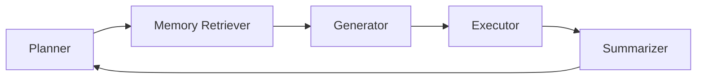

⚙️ Chunk 1 of the paper

# VulnBot: Autonomous Penetration Testing for A Multi-Agent Collaborative Framework

**Authors:** He Kong¹ ² , Die Hu¹ ² , Jingguo Ge¹ ² , Liangxiong Li¹, Tong Li¹, Bingzhen Wu¹
¹ State Key Laboratory of Cyberspace Security Defense, Institute of Information Engineering, Chinese Academy of Sciences
² School of Cyber Security, University of Chinese Academy of Sciences

> arXiv:2501.13411v1 [cs.SE] 23 Jan 2025

## 📌 Abstract

Penetration testing is a vital cybersecurity practice, but manual execution is labor-intensive and time-consuming. Existing LLM-assisted or automated approaches suffer from inefficiencies — lack of contextual understanding and excessive, unstructured data generation.

**VulnBot** is proposed: an automated penetration testing framework that uses LLMs to simulate the collaborative workflow of human pentest teams via a multi-agent system.

- Decomposes complex tasks into **3 phases**: reconnaissance, scanning, exploitation
- Guided by a **Penetration Task Graph (PTG)** for logical task execution
- Key features: role specialization, penetration path planning, inter-agent communication, generative penetration behavior
- Outperforms baselines (GPT-4, Llama3) in automated pentest tasks, especially in fully autonomous testing on real-world machines

---

## 1. Introduction

Penetration testing proactively identifies network vulnerabilities and mitigates cyberattacks. The pentest market is projected to grow from **US $1.92B (2023)** to **US $6.98B by 2032**. Despite its importance, it remains labor-intensive, requiring skilled professionals to run complex manual workflows — driving demand for automation.

### 🔬 Related Work

- **PentestGPT** (Deng et al.): pioneered LLM-based pentest automation via reasoning, generation, and parsing modules to address context loss. *Limitation:* heavily relies on human intervention, with no way to measure how much — limiting agent autonomy.
- **AutoAttacker**: automates the post-penetration ("keyboard-operated") phase using planning, summarization, and code generation combined with tools like Metasploit. *Limitation:* targets specific tasks rather than real-world environments.
- Most prior work depends on GPT-4, making it hard to apply to open-source models.

### 🎯 VulnBot Overview

VulnBot emulates human pentest team collaboration through specialized roles (reconnaissance, scanning, exploitation) plus a PTG-based approach to path planning, inter-agent communication, and generative behavior.

- A **Summarizer** module bridges phases — condensing key outcomes so critical info survives across stages, minimizing redundancy and preserving clarity.
- **Generator** and **Executor** modules translate tasks into tool-specific commands and execute them autonomously.
- Three operational modes: **automatic**, **semi-automatic**, **human-involved** (evaluation focuses on automatic mode, since human involvement adds unquantifiable subjectivity).

### 📊 Key Results (preview)

| Benchmark | Model | Result |
|---|---|---|
| AUTOPENBENCH | VulnBot-Llama3.1-405B | 30.3% completion rate |
| AUTOPENBENCH | Llama3.1-405B (baseline) | 9.09% completion rate |
| AUTOPENBENCH | GPT-4o (baseline) | 21.21% completion rate |

- VulnBot shows stronger performance in early test stages by delaying automation to later stages, executing critical subtasks with greater precision.
- On the **AI-Pentest-Benchmark** (real-world machines), VulnBot + Llama3.1-405B + DeepSeek-v3 surpassed baselines; adding **RAG** improved performance further.
- With RAG, VulnBot autonomously completed real-world machine pentests **end-to-end** — a feat GPT-4o and Llama3.1-405B could not achieve without human intervention.

### 🧩 Contributions

1. **VulnBot framework** — tri-phase design (reconnaissance, scanning, exploitation) minimizing information loss and boosting efficiency.
2. **PTG-based task-driven mechanism** — models tasks/dependencies as a directed acyclic graph, combined with a **Check and Reflection Mechanism** for iterative plan adaptation and error handling.
3. **Open-source model validation** — using Llama3.3-70B, Llama3.1-405B, DeepSeek-V3: outperforms GPT-4/Llama3 baselines, achieving **69.05%** subtask completion and **30.3%** overall completion on AUTOPENBENCH; best performance on 6 real-world AI-Pentest-Benchmark machines; full end-to-end pentest via RAG integration.

---

## 2. Background & Motivation

### 2.1 Background

Penetration testing ("ethical hacking") simulates malicious attacks against systems/networks/applications to find and remediate vulnerabilities before real attackers exploit them.

Per the **OWASP Testing Guide**, pentesting has five key phases:

1. Reconnaissance
2. Scanning
3. Vulnerability exploitation
4. Maintaining access
5. Reporting

- Average full process duration: **~10 days**; reconnaissance is the most time-consuming (**4–6 days**).
- Cost varies by scope: basic website scan **US $349–$1,499**; comprehensive assessments (SaaS/web app) **US $700–$5,999**.

### 2.2 Motivation

Traditional pentesting is time-intensive and costly. Current LLM-based approaches have notable inefficiencies (see Figure 1 comparison below):

```mermaid
flowchart TB
    subgraph A["(a) LLM Assistant-Guided Pentest Agent"]
        A1["Task Description"] --> A2["LLM Assistant<br/>(Analyse)"]
        A2 <--> A3["Human<br/>(Help)"]
        A2 --> A4["Action: nmap -sS -p- 10.10.0.4"]
        A4 --> A5["Target Environment"]
        A2 -.->|"😕 Inefficient"| A2
    end

    subgraph B["(b) Conventional Automated Pentest Agent"]
        B1["Task Description"] --> B2["Agent<br/>(Extract)"]
        B2 --> B3["Action: nmap -sS -p- [Target IP]"]
        B3 --> B4["Target Environment"]
        B4 -.->|"Failed Command /<br/>Context Loss"| B2
        B2 -.->|"😕 Too many information"| B2
    end

    subgraph C["(c) Collaborative Multi-Agent (Ours)"]
        C1["Task Description"] --> C2["Planner<br/>(Thinking → Plan & Next Task)"]
        C2 --> C3["Generator<br/>(Extract → Command)"]
        C3 --> C4["Action: nmap -sS -p- 10.10.0.4"]
        C4 --> C5["Target Environment"]
        C5 --> C6["Summarizer"]
        C6 --> C2
        C2 -.->|"🙂 Good"| C2
        C3 -.->|"🙂 Good"| C3
    end
```

- **(a) LLM Assistant-Guided Pentest Agent** — lacks autonomy, needs frequent human clarification → inefficient.
- **(b) Conventional Automated Pentest Agent** — generates excessive unstructured data without actionable next steps → context loss, command failures.
- **(c) Collaborative Multi-Agent (VulnBot)** — specialized agents for reconnaissance/scanning/exploitation, coordinated via planning, generation, and summarization → higher efficiency and autonomy.

#### 2.2.1 Task Definition

Autonomous penetration testing here covers two task types:
- Tasks requiring human guidance
- Tasks conducted **entirely without** human intervention ← **this paper's focus**

Open-source models are used to minimize cost.

#### 2.2.2 Exploratory Study

Three research questions (RQs) guided the empirical study of open-source LLMs in pentesting:

> **RQ1:** To what extent can open-source LLMs perform penetration testing tasks?

- Prior work (Isozaki et al.) introduced the **AI-Pentest-Benchmark** (13 real Vulnhub machines), testing GPT-4o and Llama3.1-405B via PentestGPT.
- Finding: Llama3.1-405B outperformed GPT-4o on reconnaissance/exploitation for easy/medium machines; both struggled with **privilege escalation** and **high-difficulty** machines.

> **RQ2:** What are the reasons for failure of open-source-LLM-driven pentesting?
> **RQ3:** How do open-source LLMs perform across different pentest phases?

- Evaluated using **AUTOPENBENCH** (33 tasks: in-vitro basic scenarios + real-world CVE-based scenarios).
- Further analysis used 128k-context Llama3.3-70B and Llama3.1-405B, 5 runs per test (220 experiments total).

##### 📊 Table 1 — Failure Counts & Causes by Phase

| Model | Phase | Failures | Session Context Loss | False Output Interpretation | Failed Tool | Deadlock | Operation Failed | Command Param | Other |
|---|---|---|---|---|---|---|---|---|---|
| Llama3.3-70B | Reconnaissance | 28 | 18 (64.29%) | 3 (10.71%) | 2 (7.14%) | 0 (0.00%) | 4 (14.29%) | 1 (3.57%) |
| Llama3.3-70B | Scanning | 27 | 5 (18.52%) | 2 (7.41%) | 8 (29.63%) | 3 (11.11%) | 7 (25.93%) | 2 (7.41%) |
| Llama3.3-70B | Exploitation | 45 | 16 (35.56%) | 4 (8.89%) | 13 (28.89%) | 2 (4.44%) | 8 (17.78%) | 2 (4.44%) |
| Llama3.1-405B | Reconnaissance | 43 | 28 (65.12%) | 4 (9.30%) | 1 (2.33%) | 5 (11.63%) | 3 (6.98%) | 2 (4.65%) |
| Llama3.1-405B | Scanning | 27 | 4 (14.81%) | 3 (11.11%) | 9 (33.33%) | 0 (0.00%) | 11 (40.74%) | 0 (0.00%) |
| Llama3.1-405B | Exploitation | 33 | 15 (45.45%) | 2 (6.06%) | 7 (21.21%) | 1 (3.03%) | 6 (18.18%) | 1 (3.03%) |
| **Total** | — | **203** | **86 (42.36%)** | **18 (8.87%)** | **40 (19.70%)** | **11 (5.42%)** | **39 (19.21%)** | **8 (3.94%)** |

> Note: "Command Param" column values appear merged with "Other" in source layout ambiguity; totals row reflects the paper's reported aggregate.

**Findings:**
- Primary failure cause in reconnaissance & exploitation: **session context loss**.
- Reconnaissance: models often fail to correctly interpret the initial task description (e.g., failing to run a full port scan like `nmap -p 10.10.1.x`).
- Exploitation: models frequently forget previously scanned targets or earlier findings.
- Root causes: **limited context window** + **token constraints** → truncation of critical data, or context overload from excessively long execution results.

### 2.3 Challenges (Takeaways)

> ⚠️ **Takeaway #1 — LLM Context Length**
> Fixed context length prevents coherent understanding across the full pentest process; models lose track of earlier discoveries, hindering task completion.

> ⚠️ **Takeaway #2 — Penetration Command Generation**
> LLMs often produce incorrect tool usage or fabricate non-existent parameters, undermining accurate translation of instructions into executable commands.

> ⚠️ **Takeaway #3 — Lack of Effective Error-Handling**
> No mechanism to autonomously diagnose/correct command execution failures → manual intervention needed, reducing automation.

> ⚠️ **Takeaway #4 — Dynamic Reasoning Across Phases**
> Reconnaissance → scanning → exploitation → post-exploitation are interdependent. Systems must integrate findings dynamically (e.g., scanning insights should inform exploitation strategy), but current systems struggle, often needing human oversight to connect findings across phases.

---

## 3. Design

Presents VulnBot's architecture for LLM-based multi-agent pentesting, organized around:

1. **Role specialization** (§3.2)
2. **Penetration path planning** — Planner + Memory Retriever modules (§3.3)
3. **Inter-agent communication** — Summarizer module (§3.4)
4. **Generative penetration behavior/interaction** — Generator + Executor modules (§3.5)

### 3.1 Overview

VulnBot's architecture centers on **five core modules**:

These modules jointly automate the three pentest phases: **Reconnaissance → Scanning → Exploitation**, balancing task-automation complexity with adaptability to unforeseen challenges.

### 3.2 Specialization of Roles

Motivated by Takeaways #1 and #4. Decomposing tasks into well-defined subtasks lets specialized agents focus and leverage targeted expertise.

**Challenge:** context-length limits mean info from earlier phases gets lost/diluted, since each phase should reference *all* preceding phases, not just the last one.

**Solution:** restructure into **3 specialized phases** (reconnaissance, scanning, exploitation) to keep each phase focused while minimizing cross-transition information loss. Agents receive task instructions as text: task description, a role-playing jailbreak method to bypass LLM usage policies, and preliminary agent context.

#### 🕵️ Reconnaissance
- Foundation phase — gather comprehensive info about the target.
- Full scan for open ports/services.
- Tools: **Nmap**, **Dirb**.
- Output feeds the scanning phase.

#### 🔎 Scanning
- Identify vulnerabilities/misconfigurations using reconnaissance data.
- Tools: **Nikto** (web server vuln scanning), **WPScan** (WordPress issue detection).
- Narrows the attack surface, prioritizes exploitable vulnerabilities.
- Kept separate from reconnaissance to avoid agent information overload.

#### 💥 Exploitation
- Culmination phase — exploit discovered vulnerabilities to gain access and escalate privileges.
- Tools: **Metasploit** (exploit development/execution), **Hydra** (credential brute-forcing).

Each phase builds on the previous one for a seamless, adaptive workflow.

### 3.3 Penetration Path Planning

Core components: **Planner** and **Memory Retriever** modules. The Planner operates through two sessions:

#### Plan Session
- Generates a JSON-structured action plan tailored to user requirements and target characteristics.
- Plan → structured task lists (unique IDs, dependencies, instructions, action types).
- Goal: construct the **Penetration Testing Task Graph (PTG)** — the logical task execution sequence.
- Plan is dynamically updated based on execution feedback (success/failure).
- Governed by:
  - **Task-driven Mechanism** (§3.3.1) — organizes tasks into a directed acyclic graph.
  - **Check and Reflection Mechanism** (§3.3.2) — iterative plan adaptation from execution feedback.

#### Task Session
- Generates specific task details per instruction, fed to the **Generator** for execution.
- Also checks task execution success.

To mitigate hallucination, VulnBot uses a third-party **Retrieval-Augmented Generation (RAG)** framework: **Langchain-Chatchat**. The Memory Re[triever module continues in next chunk...]
