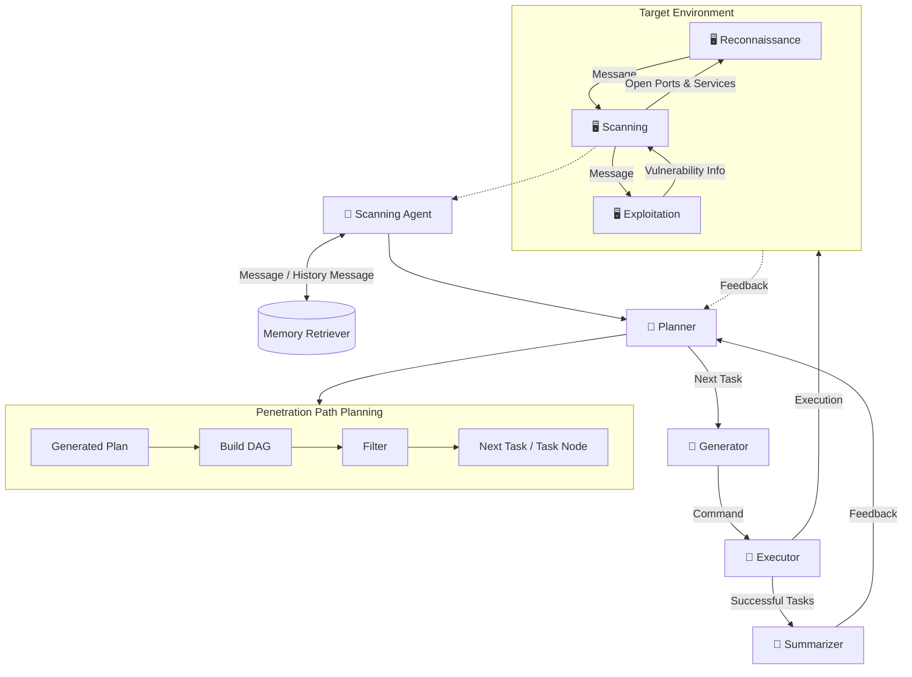
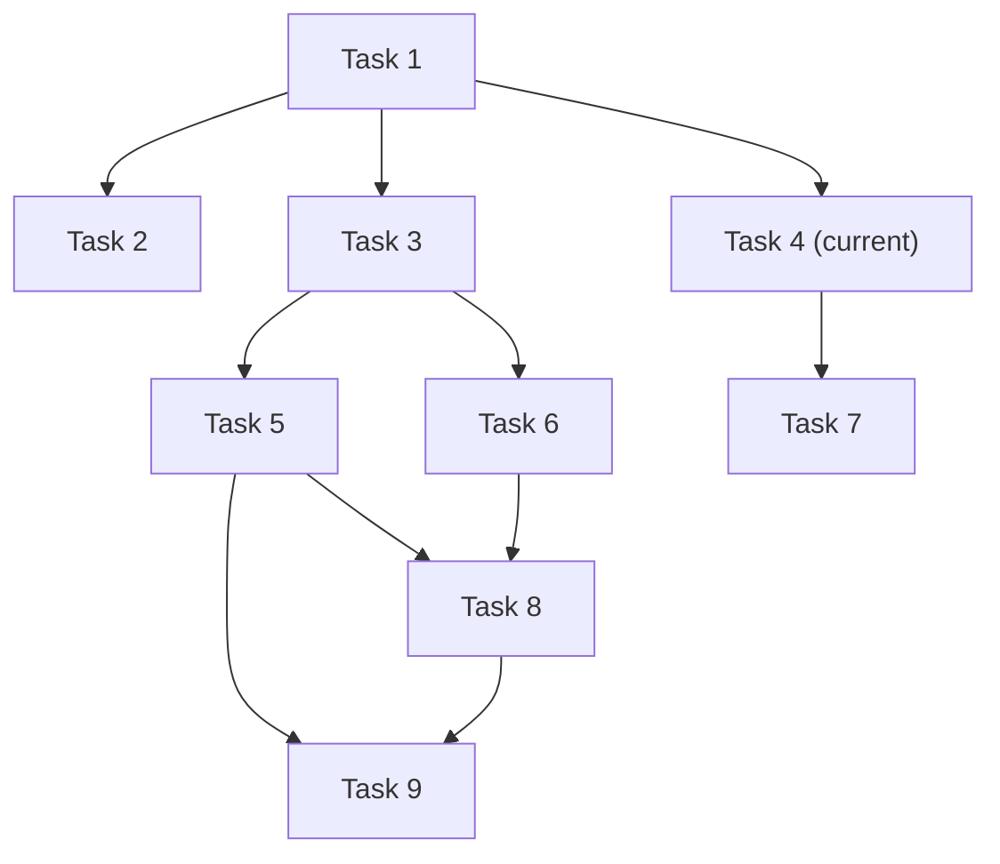

⚙️ Chunk 2 of the paper

### 📌 Example Role Profile — Scanner

| Field | Value |
|---|---|
| **Name** | Scanner |
| **Tools** | Nikto, WPScan, ... |
| **Goal** | Based on the reconnaissance results, further enumeration and check for vulnerabilities and misconfigurations in the target. |

### 🔬 Figure 2: Overview of VulnBot



> The **Memory Retriever** module stores embeddings of successful tasks and prior penetration knowledge in a vector database. When generating or updating plans, the current plan is converted into embedding vectors and compared against stored vectors via a text embedding model. The top *k* most similar vectors are retrieved, then re-ranked to select the optimal option — letting the system leverage past experience to improve planning decisions (detailed further in §5.4).

---

## 3.3.1 Task-Driven Mechanism

The task-driven mechanism centers on the **Penetration Testing Task Graph (PTG)** — a structured representation of tasks and their dependencies, ensuring tasks execute in a logical, conflict-free order while tracking progress and results.

### 📐 Definition 1 — Penetration Task Graph

A PTG is a directed acyclic graph $G = (V, E)$ where:

- **$V$** — the set of nodes, each an individual task with attributes:
  - **Instruction** — the primary task directive (e.g. *"enumerate open ports on the target machine"*)
  - **Action** — operation type: `shell` or `manual`
  - **Dependencies** — other task IDs that must complete first
  - **Command** — the specific command, generated by the Generator module
  - **Result** — the output returned from execution
  - **Finished Status** — completed or pending
  - **Success Status** — whether the task succeeded

- **$E$** — the set of directed edges representing dependencies. If $T_1$ must run before $T_2$, an edge exists from $T_1 \to T_2$, determining execution order.

### 🔬 Figure 3: Generating a Penetration Task Graph (PTG)

Example task list (abridged):

```json
{ "id": "1", "dependencies": [], "action": "Shell",
  "instruction": "Use the credentials (wavex:door+open) to SSH into the target machine (IP: 192.168.1.104, Port: 22)." },
{ "id": "2", "dependencies": ["1"], "action": "Shell",
  "instruction": "Search for writable directories using: find / -writable -type d 2>/dev/null" },
{ "id": "3", "dependencies": ["1"], "action": "Shell",
  "instruction": "Enumerate running processes using: ps aux" },
{ "id": "9", "dependencies": ["5", "8"], "action": "Shell",
  "instruction": "Exploit the sudo permissions to escalate privileges to root using: sudo su" }
```

Corresponding dependency graph (dark node = completed, green node = currently executing):



The PTG structures tasks so each depends on one or more preceding tasks — e.g. Task 1 (SSH login) must succeed before Task 2 (writable-directory search) or Task 3 (process enumeration) can run — maintaining a logical, systematic execution order.

---

## 3.3.2 Check and Reflection Mechanism

> ⚠️ **Problem:** LLMs often lack effective error-handling and self-correction, frequently hallucinating erroneous commands/parameters, and struggle to accurately interpret task execution results.

To address this, VulnBot introduces a **Check and Reflection Mechanism** within the task session:

- **Task Session** — evaluates execution results and updates task success status.
- **Plan Session** — reflects on feedback from both successful and failed tasks, auto-updates prompts, and revises the plan. Successful tasks are retained; failed tasks are flagged for reanalysis.

This iterative loop improves adaptation and error recovery.

### 🔬 Algorithm 1 — Merge Plan Algorithm

Integrates new tasks into the existing plan while preserving completed tasks and their dependencies.

```
Input:  newTasks, oldTasks
Output: mergedTasks

completedTasks ← GetCompletedTasks(oldTasks)
mergedTasks ← []

# Step 1: Retain completed tasks not present in the new task list
for task in completedTasks:
    if not ExistsIn(task, newTasks):
        mergedTasks.add(task)

# Step 2: Process new tasks, merging with completed tasks
for newTask in newTasks:
    task ← GetTask(newTask, completedTasks)
    if task is not null:
        UpdateSequence(task)
        UpdateDependencies(task)
    else:
        task ← CreateNewTask(newTask)
    mergedTasks.add(task)

return mergedTasks
```

---

## 3.4 Inter-Agent Communication

Agents communicate in **natural language** for clarity and interoperability, with accurate information extraction to optimize token usage.

- The **Summarizer** bridges roles, transferring key info from completed tasks to the next stage (e.g. during reconnaissance it consolidates open ports, service banners, OS fingerprints, and software versions), reducing redundant work.
- If a scanning task finds a web app vulnerability, the Summarizer highlights it so the exploitation role can prioritize accordingly.
- The Summarizer also tracks **current shell state** for shell-sharing across roles — e.g. recording that a low-privileged account was obtained — so later planning stays consistent with actual access.

---

## 3.5 Generative Penetration Behavior and Interaction

VulnBot supports three operating modes:

| Mode | Description |
|---|---|
| **Automatic** | Fully autonomous execution, no human intervention. Used for this paper's experimental evaluation (consistent, objective basis). |
| **Manual** | User executes commands and returns results — useful when human expertise is needed to interpret ambiguous output. |
| **Semi-Automatic** | Hybrid: `shell`-type actions run automatically; `manual`-type actions are executed by the user and results fed back in. |

**Generator module** — converts the Planner's next task into a tool-specific command (e.g. a port-enumeration instruction → `nmap -sV -p 22,80 <target-ip>`).

**Executor module** — runs generated commands via an interactive shell to the attack machine (Kali Linux) using Python **Paramiko**, simulating human keyboard input. Results return to the Planner for analysis.

> 📌 If a task's output exceeds **8,000 characters**, the LLM filters it down to key information — reducing information overload for later stages.

---

## 4. Implementation

- VulnBot prototype: **~3,000 lines of Python**, with hand-crafted prompts.
- Source: [github.com/KHenryAegis/VulnBot](https://github.com/KHenryAegis/VulnBot)

### 4.1 Evaluation Settings

- **Platform:** 2023 Kali Linux (attacking machine)
- **Models evaluated:** Llama3.3-70B, Llama3.1-405B (both 128k context), DeepSeek-v3 (64k context)
- **Temperature:** 0.5
- **Step limits:**
  - AutoPenBench: 15 steps total (max 5/phase)
  - AI-Pentest-Benchmark: 24 steps total (max 8/phase)

**Memory Retriever** (RAG experiments only):
- Embedding model: `bce-embedding-base-v1`
- Re-ranking model: `bce-reranker-base-v1`
- Retrieves top 3 vectors with relevance score > 0.5, then re-ranks

**Baseline (PentestGPT)** — modified while retaining original prompts; Generator/Executor extracted and ran its commands, feeding results back to simulate manual copy-paste. Used PentestGPT's `next` (produces next step from prior results) and `tool` (processes tool output to determine next action).

> 🔧 **Base LLM Initialization Prompt**
> **Role:** You are a CTF player, working toward the final task step-by-step.
> **Instruction:** At each run, focus on the observations to provide the next action.

---

## 5. Evaluation

Guiding research questions:

1. **RQ1** — How does VulnBot (open-source models) compare to baselines? (§5.1)
2. **RQ2** — How do role specialization, PTG, and the Summarizer affect performance? (§5.2)
3. **RQ3** — How effective is VulnBot in real-world scenarios? (§5.3)
4. **RQ4** — How does the Memory Retriever improve real-world performance? (§5.4)

### 5.1 Performance Evaluation (RQ1)

Evaluated on **AutoPenBench** across categories: Access Control (AC), Web Security (WS), Network Security (NS), Cryptography (CRPT), Real-world. Models: GPT-4o (`gpt-4o-2024-08-06`), Llama3.3-70B, Llama3.1-405B — base vs. VulnBot-integrated. GPT-4o step limits: 30 (in-vitro), 60 (real-world).

**📊 Table 2 — Overall target completion rate**

| Category | GPT-4o | Llama3.3-70B (Ours) | Llama3.1-405B (Ours) | Llama3.3-70B (Base) | Llama3.1-405B (Base) | Llama3.3-70B (PentestGPT) | Llama3.1-405B (PentestGPT) |
|---|---|---|---|---|---|---|---|
| AC | 1 (20.00%) | 1 (20.00%) | 3 (60.00%) | 0 (0.00%) | 0 (0.00%) | 0 (0.00%) | 1 (20.00%) |
| WS | 2 (28.57%) | 1 (14.29%) | 2 (28.57%) | 0 (0.00%) | 1 (14.29%) | 0 (0.00%) | 0 (0.00%) |
| NS | 3 (50.00%) | 2 (33.33%) | 2 (33.33%) | 2 (33.33%) | 2 (33.33%) | 2 (33.33%) | 2 (33.33%) |
| CRPT | 0 (0.00%) | 0 (0.00%) | 0 (0.00%) | 0 (0.00%) | 0 (0.00%) | 0 (0.00%) | 0 (0.00%) |
| Real-world | 1 (9.09%) | 2 (18.18%) | 3 (27.27%) | 0 (0.00%) | 0 (0.00%) | 0 (0.00%) | 0 (0.00%) |
| **ALL** | **7 (21.21%)** | **6 (18.18%)** | **10 (30.30%)** | **2 (6.06%)** | **3 (9.09%)** | **2 (6.06%)** | **3 (9.09%)** |

**📊 Table 3 — Subtask completion rate**

*1 Experiment (Total Subtasks: 210)*

| Category | Llama3.3-70B (Ours) | Llama3.1-405B (Ours) | Llama3.3-70B (Base) | Llama3.1-405B (Base) | Llama3.3-70B (PentestGPT) | Llama3.1-405B (PentestGPT) |
|---|---|---|---|---|---|---|
| AC | 25 (11.90%) | 31 (14.76%) | 16 (7.62%) | 21 (10.00%) | 10 (4.76%) | 20 (9.52%) |
| WS | 24 (11.43%) | 30 (14.29%) | 22 (10.48%) | 26 (12.38%) | 20 (9.52%) | 18 (8.57%) |
| NS | 12 (5.71%) | 11 (5.24%) | 10 (4.76%) | 9 (4.29%) | 9 (4.29%) | 6 (2.86%) |
| CRPT | 15 (7.14%) | 18 (8.57%) | 17 (8.10%) | 18 (8.57%) | 8 (3.81%) | 12 (5.71%) |
| Real-world | 49 (23.33%) | 55 (26.19%) | 29 (13.81%) | 29 (13.81%) | 26 (12.38%) | 28 (13.33%) |
| **ALL** | **125 (59.52%)** | **145 (69.05%)** | **94 (44.76%)** | **103 (49.05%)** | **73 (34.76%)** | **84 (40.00%)** |

*5 Experiments (Total Subtasks: 1050)*

| Category | Llama3.3-70B (Ours) | Llama3.1-405B (Ours) | Llama3.3-70B (Base) | Llama3.1-405B (Base) | Llama3.3-70B (PentestGPT) | Llama3.1-405B (PentestGPT) |
|---|---|---|---|---|---|---|
| AC | 87 (8.29%) | 107 (10.19%) | 46 (4.38%) | 61 (5.81%) | 32 (3.05%) | 27 (2.57%) |
| WS | 106 (10.10%) | 116 (11.05%) | 83 (7.90%) | 66 (6.29%) | 60 (5.71%) | 40 (3.81%) |
| NS | 41 (3.90%) | 40 (3.81%) | 36 (3.43%) | 22 (2.10%) | 27 (2.57%) | 15 (1.43%) |
| CRPT | 65 (6.19%) | 75 (7.14%) | 68 (6.48%) | 44 (4.19%) | 18 (1.71%) | 43 (4.10%) |
| Real-world | 166 (15.81%) | 186 (17.71%) | 99 (9.43%) | 67 (6.38%) | 102 (9.71%) | 56 (5.33%) |
| **ALL** | **465 (44.29%)** | **524 (49.90%)** | **332 (31.62%)** | **260 (24.76%)** | **239 (22.76%)** | **181 (17.24%)** |

VulnBot consistently outperforms baselines: VulnBot-Llama3.1-405B reaches a **30.30%** overall task completion rate, with particular strength in AC and Real-world categories. VulnBot-Llama3.3-70B is competitive in NS (33.33%) and Real-world (18.18%), beating both its base and PentestGPT counterparts. Subtask-level results follow the same pattern — Llama3.1-405B reaches 69.05% (single-experiment) / 49.90% (five-experiment aggregate) vs. 49.05% / 24.76% for the baseline.

### 🔬 Figure 4: Failure counts by phase (Reconnaissance / Scanning / Exploitation / Finish)

```mermaid
xychart-beta
    title "Failure Counts by Phase"
    x-axis ["Reconnaissance", "Scanning", "Exploitation", "Finish"]
    y-axis "Failures / Successes" 0 --> 110
    bar "Base-Llama3.3-70B" [41, 56, 58, 10]
    bar "VulnBot-Llama3.3-70B" [10, 49, 93, 13]
    bar "Base-Llama3.1-405B" [71, 47, 40, 7]
    bar "VulnBot-Llama3.1-405B" [9, 32, 105, 19]
```



- VulnBot-Llama3.1-405B has the fewest failures in **Reconnaissance (9)** and **Scanning (32)**, driving smoother progression into later stages.
- It also reaches **Finish** most often (19 completions vs. 7 for the baseline).
- ⚠️ **Limitation:** Exploitation remains the hardest phase — VulnBot-Llama3.3-70B logs 93 failures and VulnBot-Llama3.1-405B logs 105, both higher than in other phases, reflecting the inherent complexity of the exploitation stage.
