⚙️ Chunk 3 of the paper

## 5.2 Ablation Study (RQ2)

Impact of key architectural components, evaluated via ablation experiments on **AUTOPENBENCH Real-world tasks**, using **Llama3.1-405B** within a 128k token context.

> 🔬 **Method — Three ablated variants:**
> 1. **VulnBot-without Role** — role specialization deactivated; agents operate without distinct roles
> 2. **VulnBot-without PTG** — Penetration Task Graph removed; eliminates structured task planning and dependency management
> 3. **VulnBot-without Summarizer** — Summarizer module disabled; prevents inter-agent communication and context summarization

```mermaid
xychart-beta
    title "Ablation Study on AUTOPENBENCH"
    x-axis ["Subtask", "Overall"]
    y-axis "Success Rate" 0 --> 60
    bar "VulnBot" [55, 3]
    bar "VulnBot-without Role" [32, 0]
    bar "VulnBot-without PTG" [37, 0]
    bar "VulnBot-without Summarizer" [27, 0]
```

📊 **Results:**
- Removing **role specialization**: subtask success rate drops 55 → 32
- Removing **PTG**: subtask success rate drops 55 → 37
- Removing **Summarizer**: largest decline, subtask success rate drops to 27
- **Overall task success rate goes to 0** when *any* of the three components is removed

📌 **Key point:** Role allocation, task planning, and communication are all necessary — none is individually sufficient — for completing full end-to-end tasks, even though subtasks can still succeed partially without them.

---

## 5.3 Effectiveness for Real-World (RQ3)

> 🔬 **Method:**
> - Benchmark: **AI-Pentest-Benchmark** (13 vulnerable machines total; 6 selected for this evaluation)
> - Selection criterion: tasks not requiring image observation or human intervention
> - Models: **Llama3.1-405B** (128k context), **DeepSeek-v3** (64k context)
> - 5 experimental rounds per machine; best completion rate across the 5 runs reported
> - Metric: subtask completion rate (1.0 = successful penetration)

```mermaid
xychart-beta
    title "Real-World Machine Performance (best completion rate)"
    x-axis ["Victim1", "Library2", "Sar", "WestWild", "Symfonos2", "Funbox"]
    y-axis "Completion Rate" 0 --> 1
    bar "VulnBot-Llama3.1-405B" [0.33, 0.40, 0.27, 0.57, 0.29, 0.33]
    bar "VulnBot-DeepSeek-v3" [0.83, 0.20, 0.36, 0.71, 0.29, 0.44]
```

🖼️ Figure 6 (full): compares six systems — VulnBot and PentestGPT and a plain Base model, each on both Llama3.1-405B and DeepSeek-v3 — across all six machines; only the two VulnBot variants are charted above for readability.

📊 **Results:**
- **VulnBot-Llama3.1-405B** best on: Victim1 (0.33), Library2 (0.40), WestWild (0.57)
- **VulnBot-DeepSeek-v3** competitive, notably: Victim1 (0.83), WestWild (0.71)
- VulnBot consistently outperforms counterparts across diverse machines → robustness in multi-step attack chains

---

## 5.4 Retrieval Augmented Generation (RQ4)

> 🔬 **Method:**
> - Integrated a **Memory Retriever** module into Llama3.1-405B (128k context) using **RAG**
> - Knowledge sources: **HackTricks**, **HackingArticles**, segmented into 750-word chunks
> - Embeddings stored in **Milvus** vector database
> - Compared three systems: Llama3.1-405B+RAG, GPT-4o+Manual (human operator using PentestGPT), Llama3.1-405B+Manual (human operator)
> - GPT-4o/Manual baseline data sourced from prior work [33]

```mermaid
xychart-beta
    title "RAG vs Manual Human-Operated Baselines"
    x-axis ["Victim1", "Library2", "Sar", "WestWild", "Symfonos2", "Funbox"]
    y-axis "Completion Rate" 0 --> 1
    bar "Llama3.1-405B-with RAG" [0.83, 0.60, 0.55, 1.00, 0.29, 0.56]
    bar "GPT-4o-with Manual" [0.33, 0.50, 0.55, 0.57, 0.43, 0.33]
    bar "Llama3.1-405B-with Manual" [0.67, 0.80, 0.73, 0.57, 0.43, 0.56]
```

📊 **Results:**
- RAG integration significantly boosts performance, especially on **Victim1** and **WestWild**
- VulnBot+RAG achieved a **full end-to-end penetration of WestWild** (1.00) — autonomous, no human intervention
- RAG-augmented VulnBot performance is **comparable to or surpasses human operators** (GPT-4o-Manual, Llama3.1-Manual)

---

## 6 Discussion

### 6.1 Limitations in Processing Non-Textual Information

> ⚠️ **Limitation:** VulnBot cannot process non-textual information (images, GUIs from pentest tools).
> - Real-world pentesting often depends on interpreting screenshots / graphical scan output
> - VulnBot currently relies on **manual descriptions** as a workaround → bottleneck to full automation
> - Future direction: incorporate image recognition to autonomously extract info from screenshots/graphics

### 6.2 Real-World Performance and Challenges

- AUTOPENBENCH real-world tasks include **two CVEs from 2024**
- VulnBot solved one of these using Llama3.3/Llama3.1, both models having a **Dec 2023 knowledge cutoff** → demonstrates the method doesn't rely on prior vulnerability knowledge
- ⚠️ Despite this, full end-to-end autonomy across *all* stages on real-world machines remains a significant challenge, due to:
  - Complexity of real-world systems
  - Dynamic nature of security vulnerabilities
  - Need for precise multi-step attack-chain execution

---

## 7 Related Work

### 7.1 Vulnerability Detection and Exploitation

- **Atropos** — snapshot-based, feedback-driven fuzzing integrated with the PHP interpreter, for server-side PHP vulnerabilities
- **NAUTILUS** — RESTful API vulnerability detection via guided testing and parameter generation
- *"Understanding Hackers' Work"* — empirical study of offensive security practitioners' operational methods
- **Liu et al.** — ChatGPT for bug report analysis via a self-heuristic prompt template (few-shot > zero-shot)
- **Fang et al.** — GPT-4 autonomously exploits **87%** of a benchmark of real-world one-day vulnerabilities given CVE descriptions

### 7.2 Automated Penetration Testing

| System | Contribution |
|---|---|
| Al-Sinani & Mitchell | GPT-4 across ethical hacking phases (recon, post-exploitation) |
| AUTOATTACKER | LLM-automated post-breach activities |
| BreachSeek | LLM-simulated cyberattacks |
| CIPHER | Structured augmentation to assist ethical researchers |
| PTGroup, HPTSA | Multi-agent systems / hierarchical planning for zero-day exploitation |
| HackSynth, Pentest Copilot | Crafted prompts + LLM integration for pentest sub-tasks |
| Happe & Cito | Feedback loop: LLM actions executed on a VM via SSH; raises misuse concerns |
| Happe et al. (Wintermute) | Automated privilege escalation; GPT-4-turbo highest success rate with sufficient context/state |
| PenHeal (Huang & Zhu) | Two-stage framework (Planner, Executor, Estimator, Advisor, Evaluator) using counterfactual prompting + Group Knapsack Algorithm for remediation prioritization |

⚠️ **Common limitations across prior approaches:**
- Dependency on detailed vulnerability descriptions (e.g. CVE data)
- Instability/variability across tasks and environments
- Reliance on human intervention for complex/end-to-end scenarios
- Weak long-term planning and adaptability in dynamic environments

### 7.3 Application of LLM in Cybersecurity

- **Cycle** — iterative self-refinement for code generation
- **Guan et al.** — LLMs detecting model-optimization bugs in DL libraries
- **Fang et al.** — LLMs exploiting recently disclosed vulnerabilities at high success rates
- **SecurityBot** — LLM + reinforcement learning for cybersecurity operations
- **AURORA** — automated orchestration of APT attack campaigns
- **PTHelper** — integrates AI with state-of-the-art pentesting tools

---

## 8 Conclusion

- **VulnBot**: autonomous penetration testing framework combining LLMs + multi-agent systems, emulating human pentest team workflows
- Decomposes tasks into specialized phases (**reconnaissance → scanning → exploitation**), using a **PTG** for logical task execution
- Outperforms baselines (GPT-4, Llama3) in experiments
- **RAG integration** further improves capability, enabling autonomous end-to-end penetration without human intervention
- Positioned as a step toward more efficient, scalable, and autonomous penetration testing

---

## References (this chunk)

Selected references cited in this chunk — full list continues beyond this excerpt:

- [3] Al-Sinani & Mitchell — AI-augmented ethical hacking (2024)
- [4] Alshehri et al. — BreachSeek (2024)
- [6] Hacking Articles (2024)
- [12] de Gracia & Sánchez-Macián — PTHelper (2024)
- [14] Deng et al. — PentestGPT, USENIX Security 24
- [15] Deng et al. — NAUTILUS, USENIX Security 23
- [19] Fang et al. — LLM agents exploit one-day vulnerabilities (2024)
- [20] Fang et al. — Teams of LLM agents exploit zero-day vulnerabilities (2024)
- [22] Gioacchini et al. — AUTOPENBENCH (2024)
- [25] Güler et al. — Atropos, USENIX Security 2024
- [26] Hacktricks (2024)
- [27] Happe & Cito — Getting pwn'd by AI (2023)
- [28] Happe & Cito — Understanding hackers' work (2023)
- [29] Happe et al. — Wintermute, LLMs as hackers (2024)
- [31] Huang & Zhu — PenHeal (2023)
- [33] Isozaki et al. — Automated pentesting LLM benchmark (2024)
- [36] Liu et al. — ChatGPT for vulnerability management, USENIX Security 24
- [40] Milvus (2024)
- [41] Muzsai et al. — HackSynth (2024)
- [48] Pratama et al. — CIPHER, Sensors (2024)
