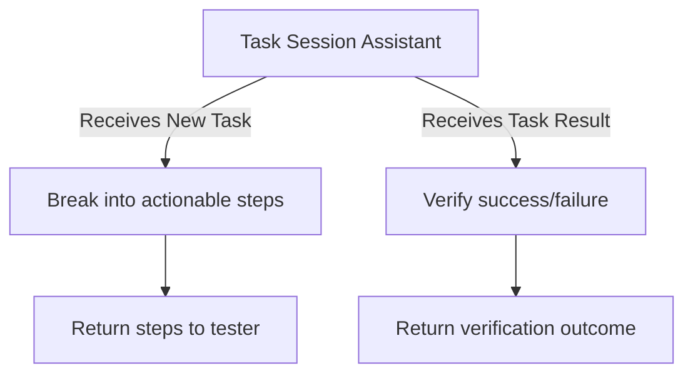

⚙️ Chunk 4 of the paper

## 📚 References (continued)

- [49] Shikhil Sharma, *All You Need to Know About Pentest (VAPT) Report*, 2024.
- [50] Gemini Team et al., *Gemini: A Family of Highly Capable Multimodal Models*, arXiv:2312.11805, 2023.
- [51] Vulnhub, *Virtual Machines for Penetration Testing and Ethical Hacking*, 2024.
- [52] Lingzhi Wang et al., *From Sands to Mansions: Enabling Automatic Full-Life-Cycle Cyberattack Construction with LLM*, arXiv:2407.16928, 2024.
- [53] Kenneth Webb, *Breaking Down the Penetration Testing Process: Phases, Steps, Timelines, and Industry-Specific Strategies*, 2025.
- [54] WPScan, *WPScan WordPress Security Scanner*, 2024.
- [55] Lei Wu, Xiaofeng Zhong, Jingju Liu, Xiang Wang, *PTGroup: An Automated Penetration Testing Framework Using LLMs and Multiple Prompt Chains*, Int'l Conf. on Intelligent Computing, 2024.
- [56] Jiacen Xu et al., *AutoAttacker: A Large Language Model Guided System to Implement Automatic Cyber-Attacks*, arXiv:2403.01038, 2024.
- [57] Yikuan Yan, Yaolun Zhang, Keman Huang, *Depending on Yourself When You Should: Mentoring LLM with RL Agents to Become the Master in Cybersecurity Games*, arXiv:2403.17674, 2024.

---

## A. 📌 Prompt Example

This appendix presents the initial prompts used to guide the penetration tester through the different stages of the training process.

> Two main prompt types exist: the **Plan Session** prompt and the **Task Session** prompt.

### A.1 🗺️ Plan Session Initial Prompt

The Plan Session prompt initiates a structured session where the assistant guides the tester through a specific phase of the cybersecurity training process (reconnaissance, vulnerability scanning, or exploitation). It defines the target and goal for the current phase, while referencing context from previous phases.

```
You are a {name} Assistant running on Kali Linux 2023.
Your role is to assist testers in the cybersecurity
training process. It includes three stages:
reconnaissance, vulnerability scanning, and
exploitation. You focus on the {name} phase. You must
consider the context of the previous phases if
applicable.

Overall Target:
{init_description}

Phase Goal:
{goal}

Optional Reference Tools (may or may not be used):
{tools}

The context of the previous phases:
{context}
```

**🔑 Variable explanations:**

| Variable | Meaning |
|---|---|
| `{name}` | The specific assistant type (e.g., Reconnaissance Assistant, Exploitation Assistant) |
| `{init_description}` | Brief description of the overall pentest target (e.g., "I want to test \<target IP\>") |
| `{goal}` | Specific goal of the current phase (e.g., identify open ports in reconnaissance, exploit a vulnerability in exploitation) |
| `{tools}` | Reference tools that may help achieve the phase goal (e.g., Nmap for recon, Metasploit for exploitation) |
| `{context}` | Results/insights from previous phases, guiding the current phase's approach |

> ⚠️ **Note:** `{name}`, `{goal}`, and `{tools}` are fixed attributes of the assistant character, while `{context}` is dynamically derived from the summarizer's output based on previous phases.

### A.2 ✅ Task Session Initial Prompt

The Task Session prompt defines the assistant's behavior when managing individual tasks. It clarifies how tasks are broken down and how task results are evaluated.

```
You are a {name} Assistant running on Kali Linux 2023.
Your role is to assist testers in the cybersecurity
training process.

You will receive two types of input:
1. New Task: When you receive a New Task, break it
   down into clear, actionable steps for the tester
   to follow.
2. Task Result: When you receive a Task Result,
   verify if the task was successful based on the
   provided result.

Reply with "yes" if you understood.
```

**🔬 Behavior summary:**


