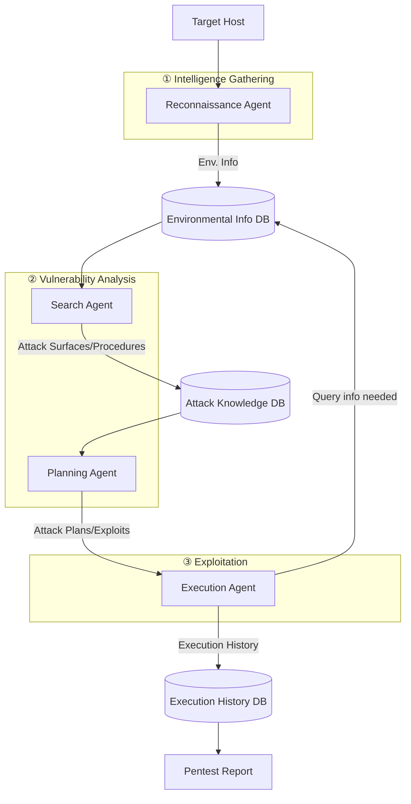
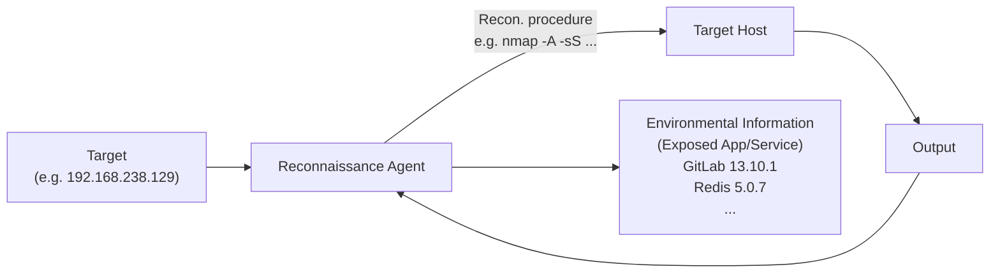

⚙️ Chunk 1 of the paper

# PentestAgent: Incorporating LLM Agents to Automated Penetration Testing

**Authors:** Xiangmin Shen, Lingzhi Wang, Zhenyuan Li, Yan Chen, Wencheng Zhao, Dawei Sun, Jiashui Wang, Wei Ruan
**Venue:** ASIA CCS '25, August 25–29, 2025, Hanoi, Vietnam

## 📌 Abstract

> Penetration testing is a critical technique for identifying security vulnerabilities, traditionally performed manually by skilled specialists — a process that is time-consuming and expensive.

- Existing automated pentesting methods fall short in real-world use due to limited flexibility, adaptability, and implementation.
- **PentestAgent** is proposed: an LLM-based automated pentesting framework using multi-agent collaboration + Retrieval Augmented Generation (RAG).
- Automates: intelligence gathering → vulnerability analysis → exploitation.
- Evaluated on a comprehensive benchmark, showing superior task completion and efficiency.

**Keywords:** Penetration Testing, Large Language Model, Agent

---

## 1. Introduction

### 🧭 Background

Penetration testing = proactively identifying security vulnerabilities via:

1. **Reconnaissance** — gathering info about the target
2. **Entry point identification**
3. **Exploitation**
4. **Reporting**

> ⚠️ According to Rapid7's *Under the Hoodie* report, pentesting takes an average of **80 hours**, with outliers reaching several hundred hours — making it expensive and hard to staff.

### 🕰️ Evolution of Automated Pentesting

| Era | Approach | Limitation |
|---|---|---|
| Early works | Attack graph modeling (deterministic, fully observable) | Assumes full defender-side observability; not flexible/adaptive |
| Later works | Markov Decision Process (MDP) — states, actions, transitions, rewards | Better but still limited |
| Extensions | POMDP + Reinforcement Learning | Accounts for uncertainty, but purely theoretical — **lacks implementation** |
| Recent | LLM-based approaches | Promising, but has knowledge & automation gaps (see below) |

### ❗ Two Gaps in Existing LLM-based Pentesting

1. **Limited pentesting knowledge** — LLMs' pretraining data lacks comprehensive, up-to-date pentesting techniques → limited/outdated state-action space.
2. **Insufficient automation** — existing tools can't validate/debug suggested procedures or dynamically acquire new techniques.

### 📊 Comparison of LLM-based Pentesting Systems (Table 1)

| System | State & Action Space | Online Search Augmentation | Validation & Debugging |
|---|---|---|---|
| **PentestAgent** | Large | Auto | Auto |
| AutoAttacker | Unknown¹ | Manual | Manual |
| PentestGPT | Unknown¹ | Manual | Manual |
| Happe et al. | Small | No | No |

¹ *AutoAttacker and PentestGPT rely solely on the LLM's own knowledge for reconnaissance/attack techniques, which can be limited and outdated.*

### 🔬 PentestAgent's Approach

- **Multi-agent design**: each agent handles a specific pentesting task → customizable toolsets, better adaptability.
- **RAG integration**: leverages supplementary retrieved data during generation, manages context efficiently, reduces manual intervention.

### 🏆 Contributions

1. **PentestAgent** — LLM-based automated pentesting system with minimal human intervention, combining multi-agent design + RAG.
2. **A new benchmark** — built on VulHub's vulnerable Docker environments and HackTheBox CTF challenges, spanning multiple difficulty levels and vulnerability types.
3. **Experiments & metrics** demonstrating superior performance on full pentesting workflows and individual tasks.

> 🔗 Benchmark and framework are publicly released: https://github.com/nbshenxm/pentest-agent

---

## 2. Background and Related Work

### 2.1 Penetration Testing

Per the **Penetration Testing Execution Standard (PTES)**, pentesting has 3 main stages:

- **External assessments**: internet-facing assets (web apps, online services, networks) — via social engineering, red teaming, web pentesting.
- **Internal assessments**: internal networks, source code, physical devices — via code review, internal network compromise.

> 📌 Per Rapid7, **external network compromise makes up over 80%** of pentesting tasks — yet web pentesting remains underexplored in LLM-based research. This paper targets that gap.

#### 🛠️ Existing Specialized Tools

| Tool | Stage | Purpose |
|---|---|---|
| Nmap | Intelligence Gathering | Network configuration analysis |
| Nessus / OpenVAS | Vulnerability Analysis | Scan for known weaknesses via vulnerability DBs |
| Metasploit | Exploitation | Exploits & payloads |

> ⚠️ Effective, but each requires expert knowledge and manual coordination — no seamless integrated workflow.

#### 🤖 AI-Driven Pentesting (pre-LLM)

- ML / MDP-based frameworks (e.g., Chen et al.) incorporate expert knowledge into state-action pairs with reward functions.
- ⚠️ Limitation: static attack plans, can't react to failures or adjust dynamically.

#### 🧠 LLM-Based Pentesting (prior work)

| System | Focus | Limitation |
|---|---|---|
| **AutoAttacker** | Post-breach attacks only | Ignores pre-compromise stages |
| **PentestGPT** | Multi-stage via "pentesting task tree" | Still requires human decisions on which branch to pursue → inefficient, unbalanced task focus |

> Both depend heavily on the LLM's pretrained knowledge + human analysis for gathering info, validating vulnerabilities, and choosing next steps.

**Goal of this paper:** a fully integrated, automated pentesting framework spanning all stages, minimizing reliance on human expertise.

---

### 2.2 Challenges of Applying LLMs to Pentesting

#### C1 — 📚 Limited Pentesting Knowledge

LLMs know general vulnerability concepts but can't autonomously:
- Find real CVE numbers
- Analyze CVE details/exploits
- Set up exploitation tools
- Select & configure the right exploit

> 🗨️ Example: Asking GPT-4 about ActiveMQ 5.17.3 vulnerabilities yields only generic advice (update software, check CVEs, use scanning tools, review config, "do penetration testing," check logs) — not actionable, specific steps.

#### C2 — 🧩 Short-term Memory

Limited context windows cause problems in long-running tasks like pentesting:

1. **Repetition of Tasks**
   - The model forgets earlier actions and repeats them.
   - *Example:* Nmap scan re-run in the Vulnerability Analysis stage even though it was already done during Intelligence Gathering.

2. **Loss of Context**
   - Contextual details (e.g., target OS/IP found earlier) get lost across stage transitions.
   - *Example:* During Exploitation, the LLM asks the user to re-investigate the OS/IP it had already determined during Reconnaissance.

#### C3 — 🔗 Workflow Integration

1. **Output Quality Control**
   - LLM output must be structured/parseable for downstream modules.
   - Hallucination risk → needs validation checks to avoid propagating errors through the pipeline.

2. **Stateful Working Memory Management**
   - Each stage needs different working memory (vulnerabilities found, exploits chosen, target details, session state).
   - Without smooth memory transitions between stages/sessions, progress can be lost — e.g., restarting an exploit from scratch after losing target details.
   - LLMs don't natively support this kind of persistent working memory.

---

### 2.3 LLM Techniques for Overcoming the Challenges

| Technique | What it does | Challenge(s) addressed |
|---|---|---|
| **LLM Agents** | LLM + tools (e.g., online search) to autonomously gather/learn pentesting knowledge | C1 |
| **Retrieval-Augmented Generation (RAG)** | Index → retrieve → synthesize using external data; enables long-term, queryable memory | C2, C3.2 |
| **Chain-of-Thought (CoT)** | Guides the LLM through logical step-by-step reasoning | Improves complex reasoning |
| **Role-playing** | LLM impersonates a character with clear objectives/boundaries | Improves efficiency/effectiveness |
| **Self-reflection** | LLM summarizes past mistakes into long-term memory | Learning across trials |
| **Structured Output** | Reduces ad-hoc parsing/iterative prompting | C3.1 (output quality control) |

> 📌 **Key Idea:** Combining CoT, role-playing, self-reflection, and structured outputs significantly improves LLM output quality — addressing the output quality control challenge (C3.1).

---

## 3. System Design

### 3.1 System Overview

**Four major components:**

1. **Reconnaissance Agent**
2. **Search Agent**
3. **Planning Agent**
4. **Execution Agent**

#### Stage-by-stage flow

**① Intelligence Gathering**
- Reconnaissance agent takes user-specified target → generates & executes recon commands.
- Analyzes results → compiles environmental information summary → stores in DB.

**② Vulnerability Analysis**
- Search agent queries the environmental info DB for exposed services/apps.
- Search agent looks up potential attack surfaces & procedures → stores in separate DBs.
- Planning Agent 1 uses RAG to suggest potential attack surfaces.
- Planning Agent 2 uses these to determine suitable exploits.

**③ Exploitation**
- Execution agent runs the attack plans against the target host.
- Queries environmental info DB as needed; debugs execution errors by modifying code / gathering more info.
- All execution history logged to DB → used to generate the final pentest report.

> 🎯 **Goal:** a structured, fully automated pipeline that streamlines pentesting end-to-end, minimizing manual effort.

---

### 3.2 Reconnaissance Agent

- Takes a specified **target** as input.
- Runs a **reconnaissance loop**: generate command → execute against target → analyze output → repeat.
- Produces a final **environmental information summary** (e.g., exposed apps/services and their versions) as output.

*(Section continues in next chunk — Reconnaissance Agent details cut off at page boundary.)*
