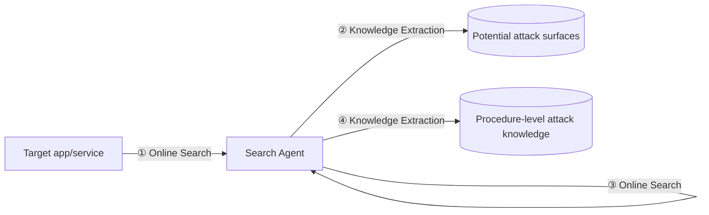
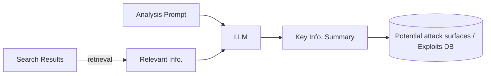
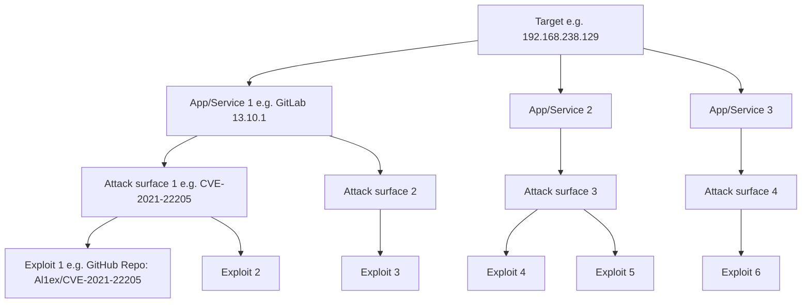
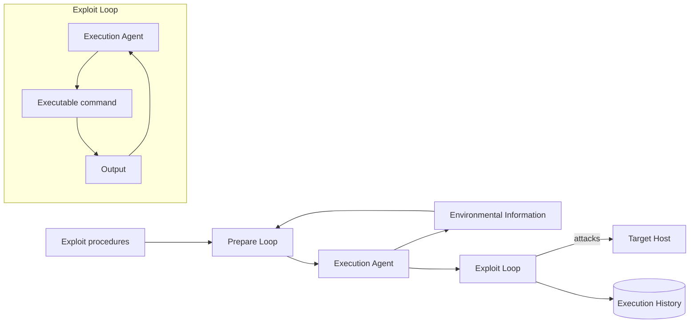

⚙️ Chunk 2 of the paper

## 3.2 Reconnaissance Agent (continued)

The reconnaissance process begins when a target is provided to the reconnaissance agent. The agent operates in a **self-iterating loop**:

1. Generate reconnaissance commands to gather information from the target.
2. Analyze the results of these commands.
3. Repeat until best efforts have been made.
4. Summarize findings and store them in a database (making short-term memory persistent).

The agent follows a general workflow defined with expert knowledge, using external knowledge from a RAG framework to decide on specific procedures or tools.

### 📌 Prompt Engineering Techniques

To achieve the desired workflow, four techniques are used in the reconnaissance agent's system message:

> **Reconnaissance System Message (Simplified)**
>
> **Role-play**
> You're an excellent cybersecurity penetration tester assistant. Guide the tester …
>
> **Chain-of-Thought**
> Use Nmap to identify exposed ports, then use relevant tools in Nmap to analyze these ports on the target host …
>
> **RAG**
> You should use your query tool to learn about available reconnaissance tools …
>
> **Structured Output**
> You should always respond in valid JSON format with the following fields: {FORMAT SPEC.} …

- **Role-play** — proven effective at bypassing LLM safety policies; the agent is framed as a penetration tester assistant to validate reconnaissance behaviors.
- **Chain-of-Thought (CoT)** — breaks complex tasks into sub-tasks, reduces hallucination, and (critically) enforces a **stop condition** so the self-iterating loop doesn't run infinitely.
- **RAG** — lets the agent retrieve up-to-date tool documentation (e.g., web fingerprinting tools like ObserverWard) and persist collected environment info, addressing the short-term memory problem.
- **Structured Output** — enforces adherence to the pipeline and smooth transitions between steps.

Once the agent decides to stop the reconnaissance loop, it summarizes results and stores them in a database.

---

## 3.3 Search Agent

**Input:** target services and applications
**Output:** relevant attack knowledge stored in databases

The search agent performs **two rounds** of hierarchical online search:

1. **Round 1** — search + analyze to extract potential **attack surfaces** relevant to the target.
2. **Round 2** — use those attack surfaces as a guide to search + analyze **procedure-level attack knowledge**.

*Figure 3: Search agent workflow*

### 🔬 Online Search Module

Customizable and extensible search functions:

- General search — Google
- Vulnerability-specific search — Snyk, AVD
- Exploit code search — GitHub, ExploitDB

**Hierarchical search strategy:**
- Round 1: Google + vulnerability databases → identify potential attack surfaces
- Round 2: Google + code repositories → find exploit implementation details

### RAG-based Result Summarization

Raw search results are inefficient to index/store directly, so a RAG pipeline extracts key information:

*Figure 4: RAG workflow for search result summarization (yellow = retrieval, green = generation)*

Each document's summary is generated by sending the analysis prompt + retrieved context to the LLM, then gathering summaries into the potential attack surface / exploit database.

> **Potential Attack Surface Analysis Prompt (Simplified)**
>
> **RAG & CoT**
> Generate a concise summary of the document to answer:
> 1) Does this document describe vulnerabilities targeting a particular service or app; if so, what is the relevant service/app version?
> 2) Provide information that can be used to search for the exploit of the vulnerabilities …
>
> **Structured Output**
> You should always respond in valid JSON format with the following fields: {FORMAT SPEC.} …
> For example, the response looks like this: {OUTPUT FORMAT EXAMPLE}

**Round 2** (procedure-level exploit details) similarly uses RAG + CoT, but relies more on the LLM's **code analysis** capability rather than text summarization:
- Checks whether the repository contains a relevant exploit
- Extracts applicable service/app versions and prerequisites for running the exploit

### 📊 Hierarchical Knowledge Storage

Extracted knowledge is stored in a hierarchical tree structure for efficient searching and systematic management.

*Figure 5: Hierarchical pentesting knowledge database*

---

## 3.4 Planning Agent

**Input:** detected services/applications from the reconnaissance agent
**Output:** exploitation plan

Steps:
1. Use RAG + the pentesting knowledge base (Fig. 5) to generate a list of **potential attack surfaces** relevant to services/applications — using service/app version and vulnerability type as the lookup key.
2. Follow a similar process to generate a list of **exploits** — using attack surface, service/app version, and exploit effect (e.g., remote code execution, authentication bypass) as the lookup key.
3. Categorize and suggest attack surfaces (by vulnerability type) and exploits (by exploit effect).

---

## 3.5 Execution Agent

**Input:** exploit details
**Output:** exploitation summary

Follows the order suggested by the planning agent. Each exploit execution has two stages: **preparation** and **exploitation**.

*Figure 6: Execution agent workflow*

**Example execution history table:**

| Exposed App/Service | Attack Performed | Success |
|---|---|---|
| GitLab 13.10.1 | CVE-2021-22205 | ✅ |
| GitLab 13.10.1 | CVE-2020-10977 | ❌ |
| Redis 5.0.7 | CVE-2022-0543 | ✅ |
| … | … | … |

### 🛠️ Preparation Stage

Analyzes exploit details to determine execution requirements (e.g., parameters needed), then queries the environmental information database. Uses **role-play** again to bypass safety mechanisms that might block exploit-execution behavior.

**CoT approach:** first identify all parameters, then determine what information is needed for each.

> **Execution Preparation System Message (Simplified)**
>
> **Role-play**
> You're an excellent cybersecurity pentesting assistant …
>
> **CoT**
> Analyze the exploit to answer:
> 1) What parameters for executing this exploit?
> 2) What information do you need to execute the exploit?
>
> **RAG**
> Use your query tool to learn the details about …
>
> **Structured Output**
> You should always respond in valid JSON format with the following fields: {FORMAT SPEC.} …

After determining needed info, the agent queries the environmental information database to fill in values, then transitions to the exploitation stage.

### ⚔️ Exploitation Stage

> **Execution Exploit System Message (Simplified)**
>
> Your next task is to provide a step-by-step guide for executing the exploit and debugging errors encountered …
>
> **RAG**
> Use the query tool to learn the code and README of the exploit to figure out how to properly execute it …
>
> **Self-reflection**
> When results indicate an error, analyze the error and try to fix it …
>
> **Structured Output**
> You should always respond in valid JSON format with the following fields: {FORMAT SPEC.} …

- Uses RAG to obtain code execution details, breaks down the execution plan, and generates a step-by-step guide.
- Engages in **iterative loops** (like the reconnaissance agent) to execute the exploit.
- ⚠️ **Self-reflection for error handling**: analyzes and fixes errors based on code + error message, and documents error history to avoid repeating mistakes — enabling continual refinement.

---

## 4 Evaluation

Three research questions guide the evaluation:

- **RQ1 (Effectiveness):** Success rate of finishing the whole penetration testing process automatically?
- **RQ2 (Completion level):** Completion level of individual penetration testing stages?
- **RQ3 (Efficiency):** Time and API cost needed to complete a penetration testing task?

### 4.1 Evaluation Setup

#### 4.1.1 Benchmark Dataset

A good benchmark needs to be **accessible**, contain **diverse tasks**, and have **difficulty labels**.

Candidate platforms considered: HackTheBox, OWASP Benchmark, VulnHub, VulHub.

- OWASP Benchmark / VulnHub: thousands of environments, but high setup effort and no difficulty labels.
- **VulHub** chosen: open-source collection of 100+ pre-built vulnerable Docker environments, widely used, supports Infrastructure as Code (IaC), good isolation, and most environments map to a specific CVE — enabling use of CVSS (difficulty) and EPSS (realism) metrics.
- **HackTheBox** CTF challenges added for realism.

**Final benchmark composition:**

| Category | Count |
|---|---|
| Total targets | 67 |
| CWE categories covered | 32 |
| OWASP Top 10 risks covered | 8 |
| Easy difficulty | 50 |
| Medium difficulty | 11 |
| Hard difficulty | 6 |
| HackTheBox CTF challenges (added) | 11 |

The 11 HackTheBox challenges are used for the practicality study (§4.5) and comparison with PentestGPT (§4.6).

#### 4.1.2 Metrics

**Effectiveness (overall):** Given a target IP, did PentestAgent automatically produce a functional exploit? For HackTheBox, success = obtaining initial access to the target host.

**Completion level (stage-level):** Assesses how far the pipeline got, assuming prior stages succeeded:

| Stage | Completion criterion |
|---|---|
| Information gathering | Target application successfully identified |
| Vulnerability analysis | Functional exploits identified (manually verified) |
| Exploitation | Exploit automatically and successfully executed |

**Efficiency:**
- **Time** — duration for a full pentest cycle (recon → exploitation)
- **API cost** — computational resource cost of running the framework

#### 4.1.3 Environment Setup

- **Victim VM:** 2 CPU cores, 8 GB RAM, Ubuntu 22.04 LTS (listening services like SSH disabled to avoid interference)
- **Attacker VM:** 16 CPU cores, 16 GB RAM, Kali Linux 2024.1 (default pre-installed tools only)
- Network: NAT connectivity between attacker and victim; vulnerable containers exposed via the victim machine's IP to simulate real-world network conditions

Evaluated using a mix of commercial and open-source LLMs (see Table 2).

---

### 4.2 Effectiveness of the Entire Framework

- **GPT-4:** 74.2% overall success rate
- **GPT-3.5:** 60.6% overall success rate
- Both models exceed 60% success, affirming pipeline effectiveness.
- 🖼️ **Figure 7:** Bar chart comparing success rate (%) across Easy / Medium / Hard / Overall for GPT-4 vs GPT-3.5. GPT-4 leads in every category; GPT-3.5 scores 0% on Hard tasks.

**Key observations:**
- Gap between GPT-4 and GPT-3.5 is present but "not substantial," suggesting the framework doesn't rely solely on the LLM's raw general knowledge.
- GPT-3.5 fails entirely on hard tasks — likely due to smaller context window and weaker complex reasoning ability compared to GPT-4.

---

### 4.3 Completion Level of Penetration Testing Stages

🖼️ **Figure 8:** Three grouped bar charts (Easy / Medium / Hard tasks) showing completion % for Intelligence Gathering (I.G.), Vulnerability Analysis (V.A.), and Exploitation (E), for GPT-4 vs GPT-3.5.

**GPT-4:**

| Difficulty | I.G. | V.A. | Exploitation |
|---|---|---|---|
| Easy | 100% | 100% | 81.8% |
| Medium | high | high (minor drop) | high |
| Hard | 50% | — | declined |

- Hard-task performance drops most in intelligence gathering (50%), pointing to limits in advanced reasoning/adaptive strategy for complex recon.

**GPT-3.5:**

| Difficulty | I.G. | V.A. | Exploitation |
|---|---|---|---|
| Easy | 92% | 96% | 72% |
| Medium | 66.7% | 100% | 50% |
| Hard | 0% (failed) | — | 0% (failed) |

**📌 Key takeaway:** GPT-4 consistently outperforms GPT-3.5, especially on complex scenarios — reinforcing the importance of advanced reasoning and reconnaissance strategy for automated pentesting.

---

### 4.4 Ablation Study

**Goal:** assess how different LLM backbones affect performance.

**Setup:** Due to GPU limitations for Llama 3.1, a smaller VulHub subset was used — 6 easy, 5 medium, 2 hard targets.

🖼️ **Figure 9a/9b:** Bar charts of completion levels and overhead (time/cost) across GPT-4, GPT-3.5, o1-mini, and Llama 3.1-8B-Instruct.

**Findings:**
- **Vulnerability analysis:** all models achieve 100% completion — consistent across backbones.
- **Intelligence gathering:** GPT-4 and o1-mini outperform GPT-3.5 and Llama 3.1-8B-Instruct — better context integration/reasoning.
- **Exploitation:** o1-mini performs best (strong at detailed attack procedures); GPT-3.5 and Llama 3.1-8B-Instruct fall behind.

**Overhead trade-offs:**
- GPT-3.5: fastest at intelligence gathering, most cost-effective, but weaker exploitation performance.
- o1-mini: best exploitation completion, but longer processing time during vulnerability analysis.
- Llama 3.1-8B-Instruct: no monetary cost, but significant time overhead and lower exploitation performance — limiting practical use.

**Table 2: LLM models used in evaluation**

| Model | Context Window | Knowledge Cutoff | Input Cost | Output Cost |
|---|---|---|---|---|
| GPT-3.5-turbo-0125 | 16,385 tokens | Sep 2021 | $0.50/1M tokens | $1.50/1M tokens |
| GPT-4o | 128,000 tokens | Oct 2023 | $5.00/1M tokens | $15.00/1M tokens |
| o1-mini | 128,000 tokens | Oct 2023 | $1.10/1M tokens | $4.40/1M tokens |
| Llama 3.1-8B-Instruct | 128,000 tokens | Dec 2023 | Open-source | Open-source |

---

### 4.5 Practicality Study

**Goal:** evaluate PentestAgent in realistic settings using HackTheBox challenges (dynamic, real-world vulnerabilities across various CWEs, unlike standardized benchmarks).

**Setup:** 11 HackTheBox machines — 9 easy, 1 medium, 1 hard.

🖼️ **Figure 10:** Completion level and overhead of PentestAgent on HackTheBox challenges (referenced; full detail in Table 3, Appendix C).

**Results:**
- PentestAgent successfully exploited **6 of 11** machines.
- Some machines (e.g., *Pilgrimage*) achieved only partial completion — only the vulnerability analysis stage succeeded.

**⚠️ Limitation:** Variability in stage completion shows the framework can handle a range of real-world scenarios, but further improvement is needed for consistent, full-stage automation. Failed cases are discussed in detail in §4.7.
