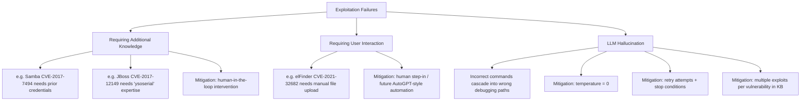

⚙️ Chunk 3 of the paper

## 4.6 Comparison with PentestGPT

> Unlike PentestAgent, **PentestGPT** requires human participation for feedback and decision-making throughout the penetration testing process.

**🔬 Method**
- 10 vulnerabilities from VulHub (5 easy, 3 medium, 2 hard) + 11 HackTheBox challenges (9 easy, 1 medium, 1 hard)
- Two evaluators of different skill levels:
  - Undergraduate student → tested PentestGPT on VulHub targets
  - PhD student → tested HackTheBox challenges
- Both systems configured with **GPT-3.5** for fair comparison

**📊 Results (HackTheBox targets)**

| Stage | PentestAgent | PentestGPT |
|---|---|---|
| Intelligence Gathering | 220s | 1199s |
| Vulnerability Analysis | slightly slower | slightly faster |
| Exploitation | 172s | 364s |

🖼️ Figure 10: Bar charts comparing completion level (%) and time spent (seconds) across Intelligence Gathering (I.G.), Vulnerability Analysis (V.A.), and Exploitation (E.) stages for PentestAgent vs. PentestGPT on HackTheBox targets. PentestAgent shows higher completion levels and lower overall time than PentestGPT.

📌 **Key Point:** PentestGPT's human-in-the-loop involvement slows overall efficiency despite being marginally faster at vulnerability analysis. PentestAgent delivers more consistent, timely testing by minimizing human intervention.

---

## 4.7 Failure Analysis

Most failures occur during **intelligence gathering** and **exploitation** stages.

### Intelligence Gathering Failures
- Struggles to detect fine-grained components (e.g. PHPMailer, PHPUnit, Ghostscript) that are plugins/libraries rather than standalone applications
- Tools like Nmap identify the underlying framework (e.g. Nginx) but can't enumerate these sub-components
- 🛠️ **Mitigation:** integrate additional web component fingerprinting tools and specialized libraries

### Exploitation Failures

⚠️ **Requiring Additional Knowledge:** Some exploits demand domain-specific knowledge beyond an LLM agent's default capability (credentials, specialized tooling like `ysoserial`). PentestAgent's modular, task-decomposed pipeline lets human experts step in at any point.

⚠️ **Requiring User Interaction:** Exploits needing manual UI actions (e.g. file upload via a web interface) require human intervention today; integrating agents like AutoGPT could automate this in future.

⚠️ **LLM Hallucination:** Incorrect/misleading model outputs can cascade into failed debugging paths. Mitigations:
1. Temperature set to zero
2. Multiple execution attempts
3. Hard-coded attempt limits + prompt-based stop conditions (e.g. "stop when you see the same error again")
4. Knowledge base offers multiple exploit alternatives per vulnerability

---

## 5. Discussion

### 5.1 Comparison with Existing Frameworks

| Framework | Scope | Domain Focus | Automation |
|---|---|---|---|
| **AutoAttacker** [48] | Post-breach exploitation only | General hands-on-keyboard | Automated |
| **Enigma** [2] | SWE-agent + interactive tools | Crypto & reverse engineering (CTF) | Human-in-the-loop |
| **PentestAgent** | Full pipeline: recon → vuln analysis → exploitation | General pentesting | Fully autonomous |

📌 **Key Point:** PentestAgent's end-to-end coverage of early-stage reconnaissance *and* post-breach exploitation is what differentiates it — both are critical for real-world engagements.

### 5.2 Limitations on Performing Sophisticated Pentesting

- Current focus: exploiting **individual** vulnerable applications/services
- ⚠️ Real-world red team simulations often need **chained** exploits (e.g. SSRF → internal app access → root privileges)
- PentestAgent can still identify/validate exposed vulnerabilities like SSRF as a **starting point** for further, more advanced exploitation chains — this is left to future work

---

## 6. Conclusion

- **PentestAgent**: an LLM-based, multi-agent framework for automated penetration testing
- Addresses two key limitations of prior frameworks: limited pentesting knowledge and insufficient automation
- Techniques used: retrieval-augmented generation (RAG) + chain-of-thought (CoT)
- Benchmarked on VulHub Docker environments and HackTheBox CTF challenges
- ✅ Achieves strong task completion and overall efficiency versus PentestGPT

---

## Appendix A — Prompts

Five key prompts structure the PentestAgent pipeline, each combining **structured JSON output** + **few-shot examples** to reduce hallucination:

1. **Reconnaissance Summary Prompt** — summarizes recon findings into structured JSON
2. **Search Results Summary Prompt** — lists CVEs, URLs, keywords, and applicable versions relevant to an app's exploits, in JSON
3. **Exploit Procedure Analysis Prompt** (RAG + CoT + few-shot + structured output) — summarizes a repository to determine:
   - Whether it contains an applicable exploit
   - The exploit's effect (e.g. remote command execution)
   - Applicable service/app version (format `x.y.z`)
   - Requirements to run the exploit (OS, dependencies, etc.)
4. **Attack Surface Suggestion Prompt** — ranks vulnerabilities by confidence for a given app/version, checking version applicability and vuln type, output in JSON
5. **Exploit Suggestion Prompt** — ranks candidate exploit repositories by confidence for a given app/version and execution effect, output in JSON
6. **Execution Information Query Prompt** (CoT + RAG + structured output) — queries the environment info database to fill in missing execution parameters one by one

---

## Appendix B — Benchmark Construction

### B.1 VulHub Benchmark Construction

**📌 Difficulty Assignment Method**
- Based on **CVSS v3.x exploitability** sub-score (ease/technical means of exploitation)
- Natural cutoffs found at exploitability scores of **2.0** and **3.0** → separate easy / medium / hard
- Where an app has multiple CVEs, the one with the higher **EPSS score** (real-world likelihood of exploitation) is selected

🖼️ Figure 11: Histogram of exploitability scores — heavily skewed, with ~49 samples clustered at score 3.9, and small counts at 1.2, 1.6, 1.8, 2.2–2.3, 2.8, 3.1.

🖼️ Figure 12: Histogram of EPSS scores — most CVEs cluster near 0 or near 100, few in between.

**🧹 Filtering applied:**
- Removed Docker images without an associated CVE number or CVSS v3.x score
- Removed apps requiring complicated setup (e.g. vendor license keys)
- PentestAgent was **strictly prohibited** from directly accessing the VulHub repository content, to avoid bias

🖼️ Figure 13: Horizontal bar chart of CWE (Common Weakness Enumeration) category frequency in the benchmark. Top categories include OS Command Injection (~9), Deserialization of Untrusted Data, Improper Limitation of..., Code Injection, Information Exposure, Improper Authentication, SQL Injection, Improper Input Validation, down to single-occurrence categories like Improper Access Control and Unrestricted Upload of File.

🖼️ Figure 14: Bar chart of difficulty rating distribution — Easy: 50, Medium: 11, Hard: 6.

### B.2 HackTheBox Benchmark Construction

**Selection criteria:**
- OS diversity: both **Linux and Windows** machines included
- Vulnerabilities spanning roughly a **decade**, covering historical and contemporary exploits
  - *Blue* → EternalBlue (CVE-2017-0144), Windows SMB exploit
  - *Legacy* → MS08-067 (CVE-2008-4250), critical SMB-based attack
- Difficulty progression:
  - Easy: *Lame*, *Optimum* — fundamental exploitation techniques
  - Medium/Hard: *Stratosphere* (CVE-2017-5638), *Reel* (CVE-2017-0199) — deeper recon, multi-step attacks, advanced reasoning

📌 **Key Point:** This progression tests PentestAgent not just on basic automation, but on handling complex, realistic pentesting scenarios (full challenge list in Table 3, not included in this chunk).

### B.3 Benchmark Coverage

- Dataset built from **known vulnerabilities** — raises the question of real-world practicality
- Counter-point: known vulnerabilities remain a significant real-world risk since many organizations struggle with timely patching *(section continues into next chunk)*
