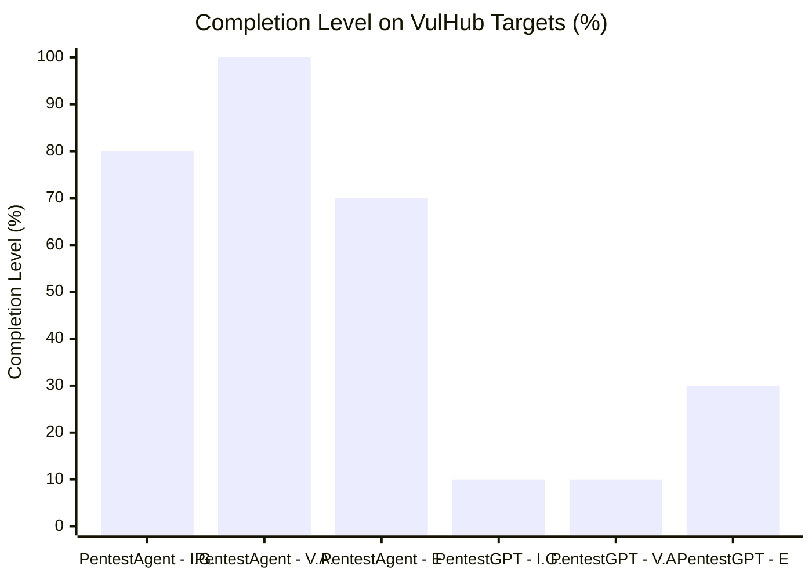
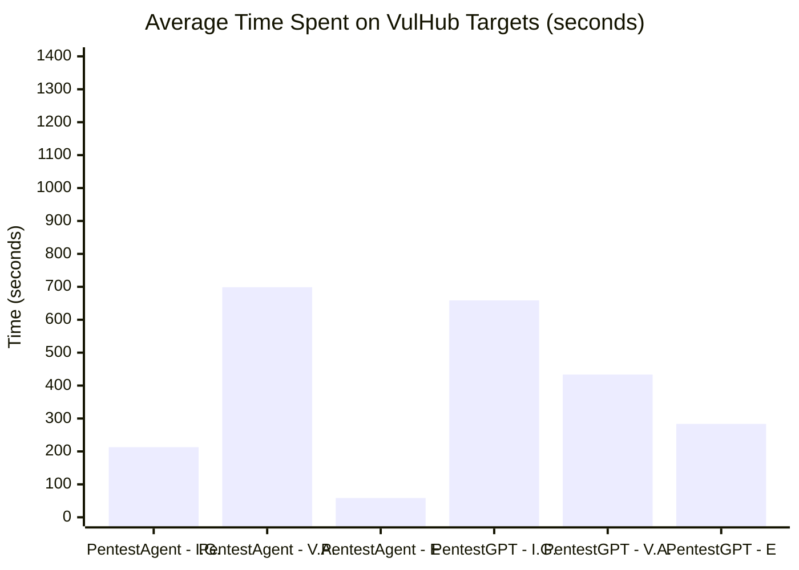

⚙️ Chunk 4 of the paper

## 📌 Dataset Rationale (EPSS Scores)

- Vulnerable/outdated components rank **6th** on the OWASP Top 10 Web Application Security Risks.
- Target environments were selected based on **Exploit Prediction Scoring System (EPSS)** scores, which reflect the real-world likelihood of a vulnerability being exploited.
- Dataset EPSS statistics:
  - **Mean:** 79.58
  - **Median:** 97.19
- This indicates the chosen vulnerabilities are highly likely to exist and be exploitable in practice.
- Open datasets with zero-day or one-day vulnerable environments are hard to find, so the evaluation focuses on **known, high-EPSS vulnerabilities** — keeping the benchmark realistic while still assessing genuine cybersecurity risk.

---

## C. Additional Evaluation Results

Detailed pentesting performance on HackTheBox challenges appears in Tables 3 and 4.

### 📊 Table 3: PentestAgent Performance on HackTheBox

| Machine | Difficulty | Completed Stage |
|---|---|---|
| Sau | Easy | 2/3 (I.G, V.A) |
| Pilgrimage | Easy | 1/3 (V.A) |
| Lame | Easy | 3/3 |
| Topology | Easy | 3/3 |
| PC | Easy | 3/3 |
| Blue | Easy | 3/3 |
| Shocker | Easy | 2/3 (V.A., E) |
| Optimum | Easy | 3/3 |
| Legacy | Easy | 3/3 |
| Stratosphere | Medium | 2/3 (V.A., E) |
| Reel | Hard | 2/3 (V.A, E.) |

### 📊 Table 4: PentestGPT Performance on HackTheBox

| Machine | Difficulty | Completed Stage |
|---|---|---|
| Sau | Easy | 2/3 (I.G, V.A) |
| Pilgrimage | Easy | 1/3 (V.A) |
| Lame | Easy | 2/3 (V.A., E) |
| Topology | Easy | 2/3 (V.A., E) |
| PC | Easy | 0/3 |
| Blue | Easy | 2/3 (V.A., E) |
| Shocker | Easy | 0/3 |
| Optimum | Easy | 3/3 |
| Legacy | Easy | 3/3 |
| Stratosphere | Medium | 0/3 |
| Reel | Hard | 1/3 (I.G.) |

> **Legend:** I.G. = Intelligence Gathering · V.A. = Vulnerability Analysis · E = Exploitation

---

## 🔬 VulHub Comparison: Completion & Overhead

In addition to HackTheBox, PentestAgent and PentestGPT were compared on VulHub targets across completion level and time overhead.

### 📊 Results Summary

| Stage | PentestAgent Completion | PentestGPT Completion | PentestAgent Time (s) | PentestGPT Time (s) |
|---|---|---|---|---|
| Intelligence Gathering | 80% | 10% | 212.9 | 658.7 |
| Vulnerability Analysis | 100% | 10% | 698.8 | 433.5 |
| Exploitation | 70% | 30% | 58.6 | 283.5 |

### 🔑 Key Findings

- **PentestAgent significantly outperformed PentestGPT** across all pentesting stages.
- **Intelligence Gathering:** 80% vs. 10% completion — PentestAgent extracts target info far more effectively, and does so **3x faster** (212.9s vs. 658.7s).
- **Vulnerability Analysis:** 100% vs. 10% completion — PentestGPT shows limited capability identifying/assessing vulnerabilities.
- **Exploitation:** 70% vs. 30% completion — PentestAgent completes exploitation **~5x faster** (58.6s vs. 283.5s).
- ⚠️ **Trade-off:** PentestAgent takes *longer* in vulnerability analysis (698.8s vs. 433.5s), but this extra time contributes to its much higher success rate — a more accurate, actionable assessment.

### 🏁 Conclusion

PentestAgent is both **more effective and more efficient** than PentestGPT:
- Higher completion rates across all stages, especially intelligence gathering and vulnerability analysis (both critical precursors to successful exploitation).
- Lower overhead in intelligence gathering and exploitation → more scalable for real-world use.
- The slightly slower vulnerability analysis is an acceptable trade-off for more reliable, successful attack execution — reinforcing PentestAgent as a robust, efficient automated pentesting framework.
