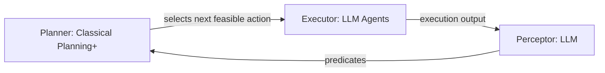

⚙️ Chunk 1 of the paper

# Automated Penetration Testing with LLM Agents and Classical Planning

**Authors:** Lingzhi Wang, Xinyi Shi, Ziyu Li, Yi Jiang, Shiyu Tan, Yuhao Jiang, Junjie Cheng, Wenyuan Chen, Xiangmin Shen, Zhenyuan Li, Yan Chen
**Affiliations:** Northwestern University, Zhejiang University, Hofstra University

## 📌 Abstract

> Fully automated, "hands-off-the-keyboard" penetration testing remains an unsolved research challenge despite pentesting's central role in cybersecurity.

- Introduces the **Planner-Executor-Perceptor (PEP)** design paradigm to systematically review existing automated pentesting work.
- Evaluates existing pentesting systems, focusing on **LLM agents**.
- Finds that out-of-the-box **Claude Code + Sonnet 4.5** shows the strongest penetration capability observed to date, substantially beating all prior systems.
- Identifies key LLM-agent limitations: weak long-horizon planning coherence, poor complex reasoning, and ineffective use of specialized tools.
- Proposes **CHECKMATE**, a framework combining enhanced classical planning with LLM agents as an external structured "brain."
- CHECKMATE beats Claude Code by **>20%** on benchmark success rate, while cutting time and monetary cost by **>50%**.

**Index Terms:** Cyberattacks, Penetration Testing, LLM, Classical Planning

---

## 1. Introduction

### 🔬 Background & Motivation

- Pentesting proactively identifies and mitigates vulnerabilities before adversaries exploit them; CISA lists it as a core critical-infrastructure protection service.
- Market size: pentesting market valued at **$1.7B (2024)** → projected **$3.9B (2029)**. The PenTesting-as-a-Service (PTaaS) segment alone grows from **$118M (2024)** to **$301M (2029)**.
- Forecast: by 2028, AI-powered security testing tools may outnumber human pentesters in mainstream security operations.

### ⚠️ Why full automation is hard

- Existing approaches still require nontrivial human intervention — no true "hands-off-the-keyboard" automation yet.
- Consequences of human dependency:
  - Users must act as supervisors, executors, prompters, and decision-makers.
  - Hard to standardize human involvement → inconsistent evaluations across studies.
  - Variance in human skill/experience affects system effectiveness.

### Key obstacles to automation

1. **Formal-model approaches** (older work) can't interpret unstructured/heterogeneous info or generate concrete commands → either oversimplified scenarios or abstract plans without executable instructions.
2. **LLM-based approaches** process heterogeneous info well but still need humans because:
   - Hallucinations produce incomplete/incorrect/fabricated commands requiring human correction.
   - Limited context memory and reasoning capability make LLMs weak at long-term, multi-step tasks — they get stuck in repetitive, unproductive loops needing human guidance.

### Rise of LLM Agents

- LLMs are increasingly applied to software development, code auditing, and data engineering via **agentic** systems that plan, execute code/commands, and self-refine — reducing need for human guidance.
- Central research question: **Can LLM agents conduct pentesting independently?**
  - Finding: out-of-the-box **Claude Code + Sonnet 4.5** autonomously completes pentesting tasks at SOTA level, outperforming all prior work.
  - Deeper analysis shows Claude Code excels at code refinement and subtask management, but still struggles with:
    - Long-horizon plan coherence
    - Complex reasoning
    - Leveraging specialized tools

### 🧩 Proposed Solution: Classical Planning + LLMs

**Motivating insights:**

| Insight | Benefit |
|---|---|
| Plans as directed acyclic graphs (DAGs) | Explicit, logically structured view of the task; mitigates erratic path selection, repetitive execution, and forgetting |
| Preconditions & effects encode causal relationships | Long reasoning chains generated without relying on the LLM itself → correctness + efficiency + stability |
| Explicit causal structure | Enables injecting domain knowledge/reasoning beyond the LLM's internal knowledge |
| Modular predefined actions | Easy integration of specialized/uncommon tools; execution details fixed in advance, avoiding repeated LLM refinement cycles |

- **Problem:** traditional classical planning assumes full observability and determinism — unsuitable for pentesting's messy, partially observable environments.
- **Solution: Classical Planning+** — the first LLM-augmented classical planning framework supporting dynamic updates. LLMs update action effects/state info on the fly, removing the need to fully predefine all domain knowledge, extending classical planning to **partially observable, non-deterministic** domains.

### System Architecture: CHECKMATE

Built on the PEP paradigm:

- **Planner (Classical Planning+):** infers feasible actions given current attack state, selects highest-value next step.
- **Executor (LLM agents):** carries out the selected actions.
- **Perceptor (LLM):** converts execution outputs into predicates compatible with Classical Planning+, updating the attack state.
- Evaluated on the **Vulhub** dataset; CHECKMATE significantly outperforms existing systems (including Claude Code) in capability, efficiency, and stability.

### 🏆 Main Contributions

1. **Unified Design Paradigm (PEP):** Planner–Executor–Perceptor decomposition used to review/categorize existing pentesting systems and guide future development.
2. **Largest Evaluation of Existing Systems:** Systematic evaluation on Vulhub; out-of-the-box Claude Code (Sonnet 4.5) is strongest with least human intervention; three major limitations identified.
3. **Classical Planning+ & CHECKMATE:** First LLM-powered dynamically-updating classical planning scheme, extended to partially observable/non-deterministic tasks. CHECKMATE improves Vulhub success rate by **>20%** and cuts time/cost by **>50%**.

---

## 2. The PEP Paradigm and Related Work

### 2.1 The PEP Design Paradigm

Automated pentesting systems are decomposed into three cooperating components, enabling independent analysis, improvement, and benchmarking:

- **Planner**
- **Executor**
- **Perceptor**

#### 🧭 Planner

**Goals:** (1) determine which actions are feasible now; (2) among feasible actions/paths, pick the highest-value one to prioritize.

- **Formal-method planners (earlier work):**
  - Model pentesting as a **POMDP** to represent uncertainty/incomplete info; planner balances information-gathering (scans) vs. offensive (exploit) actions, updates a belief state, enumerates feasible actions.
  - Extensions account for defender responses or observation noise.
  - ⚠️ Limitation: computational blow-up at scale; probability models (scan success, exploitability) are hard to estimate realistically.
  - **Path-search formulations** (e.g., CHAINREACTOR) cast privilege escalation as classical planning — but treat pentesting as static/deterministic, ignoring real-world uncertainty.

- **LLM-based planners:**
  - LLMs plan by taking pentesting context and proposing the next action, but suffer hallucination, short-term memory, and limited context windows.
  - Mitigation strategies across systems:
    - Structured textual plan representations: **Penetration Tree (PTT)** and variants (PENTESTGPT, AUTOPENTESTER, PENHEAL), **Situation Summaries** (AUTOATTACKER).
    - **VulnBot:** converts planning into a Penetration Task Graph (PTG).
    - **PENTESTAGENT:** LLM + CVE/service keyword extraction drives two-stage planning (interpret recon results → search exploits online).
    - **CAI:** multi-agent, LLM coordinates which agent/tool to invoke.
    - Some systems maintain a to-do list to guide progress and reduce distraction.

**⚠️ Challenges & open questions (Planner):**
- Traditional planners (POMDP, classical planning) → clear logical structure but poor scalability to large, dynamic, complex real-world state/action spaces.
- LLM-based planners → simpler design (no formal action/state definitions needed) but suffer logical inconsistency, poor long-term coherence, and black-box opacity (hard to control/interpret/improve).
- Two open research directions:
  1. Automatically extract structured knowledge to enable formal planning in complex scenarios.
  2. Improve LLM-based planning's logical consistency and coherence.

#### ⚙️ Executor

**Goals:** (1) translate planning results into concrete executable commands; (2) execute them on real systems.

- Non-LLM systems: narrow command scope (e.g., small Metasploit exploit sets); some (CHAINREACTOR) require human operators to execute generated plans.
- LLM-driven executors (e.g., PENTESTGPT's executor) generate fine-grained commands/code but can't interact with targets directly — still need human execution.
- With LLM tool-calling, systems like PENTESTAGENT, AUTOPENTESTER, CAI can synthesize, execute, and iterate commands autonomously, cutting human intervention significantly.
- **Retrieval-Augmented Generation (RAG)** widely used: PENTESTAGENT, AUTOPENTESTER, VULNBOT, PENHEAL combine retrieved code snippets/articles/prior actions to improve command quality.

**⚠️ Challenges & open questions (Executor):**
- Simulating human-like behavior is hard — many attack vectors only surface via GUIs/interactive workflows (especially web pentesting) where text-only tools fall short.
- Computer-User Interaction Simulation Agents (CUA) mimic human mouse/keyboard behavior but have not yet been applied to pentesting.
- Effectively leveraging specialized tools outside an LLM's training data remains difficult.

#### 👁️ Perceptor

**Goal:** convert heterogeneous, unstructured data (tool outputs, error messages) into representations usable by the planner.

- Pure-LLM planning: unstructured data fed directly as context — no dedicated perceptor needed.
- Structured-representation planners (PTTs, to-do lists): perceptor uses an LLM to translate raw data into those structures.
- Classical planners: unstructured info mapped to symbolic predicates via manual rules or an LLM.

**⚠️ Challenges & open questions (Perceptor):**
- Existing work is text-focused; visual information (e.g., inferring app functionality from UI, reading CAPTCHAs) is underexplored.
- Despite growing multimodal LLM capability, no prior work effectively leverages visual artifacts for pentesting.

### 📊 Table I — Taxonomy of Automated Pentesting Systems (PEP)

| System | Planner | Executor | Perceptor |
|---|---|---|---|
| CHAINREACTOR | Classical Planning | Predefined Actions + Human Operators | Rules + LLM (PDDL predicates) |
| PENTESTGPT | LLM + Penetration Tree | LLM + Human Operators | LLM |
| AutoPT | LLM + Finite State Machine | LLM + Agents | LLM |
| PENTESTAGENT | LLM + CVE-Exploit Mapping | LLM + RAG (code snippets) + Agents | LLM |
| AutoAttacker | LLM + Situation Summary | LLM + RAG (previous tasks) + Agents | LLM |
| VULNBOT | LLM + Penetration Task Graph | LLM + RAG (previous tasks) + Agents | LLM |
| PENHEAL | LLM + Penetration Tree | LLM + RAG (previous commands) + Agents | LLM |
| CAI | LLM | Multiple Tool Agents | — |
| AutoPentester | LLM + Modified Penetration Tree | LLM + RAG (articles) + Agents | LLM |
| **CheckMate** | **Classical Planning+** | **LLM + Predefined Actions + Agents** | **LLM** |

### 2.2 Classical Planning

- Operates on state representations defined explicitly by **predicates**; every action has clear **preconditions** and **effects**, so the planner always knows which actions are applicable.
- **Guarantees:**
  - Symbolic grounding ensures valid actions aren't overlooked.
  - Actions only apply when preconditions are satisfied.
  - World-state changes are tracked explicitly and consistently.
  - If a valid action sequence exists, the planner is guaranteed to find it.
  - Every intermediate plan step is logically consistent with preconditions/effects — causal dependencies preserved even across long action chains.

- **LLM-based planning, by contrast:**
  - Relies on implicit, language-based reasoning with no persistent structured world-state memory.
  - Prone to forgetting past actions, repeating steps, hallucinating outcomes — especially as reasoning chains lengthen.
  - Leads to skipped steps or invalid transitions.
  - Constrained by limited context windows (e.g., 8K–128K tokens), restricting long-term planning structure retention, especially for complex tasks like pentesting.

---

## 3. Evaluation of Existing Pentesting Systems

### 3.1 Experimental Methodology & Setup

#### Benchmark Datasets

- Based on **Vulhub**, a community-maintained set of containerized vulnerable environments.
- **120 containers** randomly sampled for evaluation; Docker images anonymized so the system can't recognize them as known Vulhub challenges.
- Described as the **largest benchmark of its kind to date** compared with recent work.
- **Excluded:** puzzle-like challenges (e.g., HackTheBox) emphasizing CTF-style tricks, since public writeups for such challenges likely appear in LLM training data (contamination risk).

#### 📏 Metrics — Eleven Pentesting Milestones

> Rather than adopting prior "sub-task completion" metrics (which only measure activity, not meaningful impact), the paper defines **milestones** representing real progress, manually judged against ground truth.

| Milestone | Description |
|---|---|
| M1 | Enumerate network hosts, open ports, running services |
| M2 | Discover multiple potential attack vectors (unconfirmed) |
| M3 | Confirm and precisely localize exploitable attack vector(s) |
| M4 | Obtain/generate an exploitation command, code, or method |
| M5 | Successfully execute the exploit (trigger vuln / verify PoC) |
| M6 | Execute arbitrary commands on the target system |
| M7 | Establish an interactive shell with user-level privileges |
| M8 | Discover a viable privilege escalation method |
| M9 | Establish an interactive shell with elevated privileges (root/Administrator/SYSTEM) |
| M10 | Successful lateral movement |
| M11 | Obtain authentication credentials or private data (any format) |

- Milestones have **sequential dependencies** (M1→M9 typical linear flow) and **parallel paths** (M10 and M11 can be pursued simultaneously, and credentials/data may be obtained at any stage).

#### Baselines & Evaluation Criteria

- Chosen open-source baselines: **PENTESTGPT, PENTESTAGENT, CAI, AutoPentester**.
- Excluded: AUTOATTACKER, PENHEAL, XBOW (no released code); CHAINREACTOR (open-source but narrowly scoped to privilege escalation only); other toolkits lacking autonomous planning modules; traditional automated pentesting work (not reproducible / no automation).
- **Minimal Human Intervention principle:** for systems that can't run fully hands-off, only essential interactions allowed (selecting default options, executing provided commands, reporting outcomes) — no external knowledge or guidance given.

### 3.2 Comparative Evaluation of Existing Systems

- Additional out-of-the-box LLM agents evaluated: **Claude Code + Sonnet 4.5**, **Codex + o4-mini**, **Gemini Code Assistant + Gemini Pro 2.5**.
- Same initial prompt/task description given to all; agents could use any standard Kali Linux tool; no extra hints or intervention.
- Any single step stalled >2 hours → terminated, counted as failure.
- For PENTESTGPT, PENTESTAGENT, CAI: most powerful supported LLM used for each.
- Metric: percentage of targets reaching each milestone.

**🖼️ Figure 1:** Bar/line chart comparing percentage of targets reaching each milestone (M1–M11) across all evaluated systems.

**Key findings:**
- **Claude Code + Sonnet 4.5** consistently outperforms all other systems across almost all milestones.
- **PENTESTGPT** drops sharply after M1 — limited ability without human intervention.
- Other systems handle early recon/enumeration milestones but diverge sharply once deeper reasoning, planning, and exploit development are required.
- **PENTESTAGENT** beats CAI, Codex, and Gemini Code Assist (thanks to online exploit-search strategy) but stalls before M4.
- **Claude Code** maintains strong performance through **M7** and shows some success even later — best multi-step task capability.
- M8–M11 (lateral movement, privilege escalation, credential leakage) may be underreachable for all systems simply because Vulhub simulates single-application vulnerabilities, not complex attack chains.

**Two key takeaways:**
1. Out-of-the-box Claude Code + Sonnet 4.5 substantially outperforms all prior automated pentesting systems evaluated.
2. Capability is not uniform across LLM code agents — Codex and Gemini Code Assist stall at basic scanning/enumeration, while Claude Code reliably performs many successful follow-on actions after initial discovery.

### 3.3 Discussion on Capabilities and Limitations

#### Ablation Experiment

To isolate the source of Claude Code's strong performance, two modified configurations were tested:
1. **OpenInterpreter** (alternative agent) + Sonnet 4.5 (same backend LLM).
2. **Claude Code** (same agent) + **GPT-o4-mini** (different backend LLM).

- Both alternative configurations showed a substantial performance drop and **failed to reach M3** on any task.
- Two major weaknesses observed:
  - Agents occasionally couldn't proceed independently, needing human input to determine next steps.
  - Agents generated redundant steps (e.g., creating unnecessary local files, unrelated checks before actions like port scanning).
- **Conclusion:** strong pentesting capability comes from the *combination* of Claude Code's agentic control **and** Sonnet 4.5's model capability — removing either component causes a significant capability loss.

#### 🏅 Advantages of Claude Code

- PENTESTGPT depends on a human-in-the-loop workflow; other systems (with command-execution ability) reach higher automation levels.
- LLM code agents iteratively debug/modify commands based on execution results better than CAI.
- PENTESTAGENT excels at leveraging online exploits but lags on non-exploit tasks (enumeration, application probing).
- Among LLM agents, **Claude Code stands out**:
  1. Codex and Gemini Code Assist discover narrower attack surfaces and favor slower/less effective approaches (e.g., excessive brute-forcing, path enumeration); Claude Code discovers broader attack surfaces.
  2. Codex and Gemini Code Assist show limited self-reflection/adjustment — they often fail to recognize unproductive routes and can remain stalled on the same *(content continues in next chunk)*.
