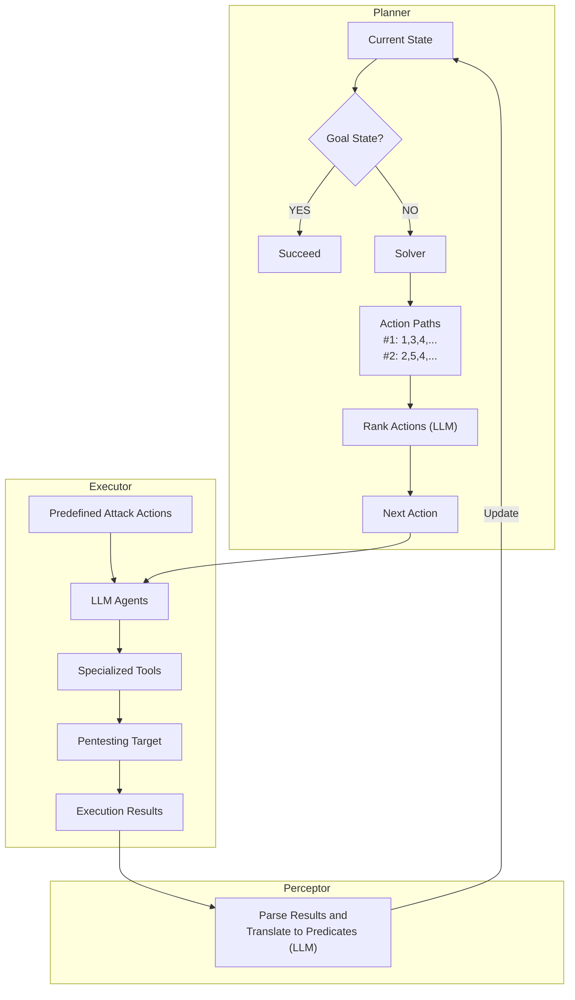
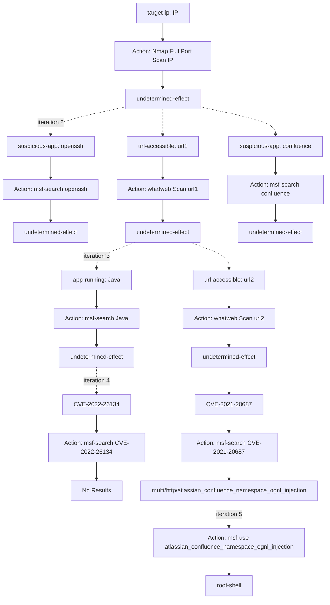
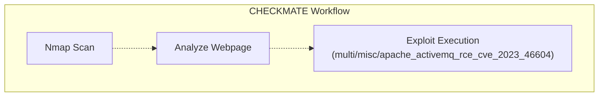

⚙️ Chunk 2 of the paper

## 📊 Penetration Capability of Existing Systems (Vulhub Benchmark)

🖼️ Figure: Bar chart comparing six automated pentesting systems (PentestGPT+o4-mini, PentestAgent+o4-mini, CAI+o4-mini, Codex+o4-mini, Gemini Code Assist+Gemini Pro 2.5, Claude Code+Sonnet 4.5) across milestones M1–M11. Approximate percentages:

| System | M1 | M2 | M3 | M4 | M5 | M6 | M7 | M8 | M9 | M10 | M11 |
|---|---|---|---|---|---|---|---|---|---|---|---|
| PentestGPT+o4-mini | ~100 | ~30 | ~10 | ~0 | 0 | 0 | 0 | 0 | 0 | 0 | 0 |
| PentestAgent+o4-mini | ~100 | ~90 | ~55 | ~15 | ~5 | 0 | 0 | 0 | 0 | 0 | 0 |
| CAI+o4-mini | ~95 | ~75 | ~35 | ~10 | 0 | 0 | 0 | 0 | 0 | 0 | 0 |
| Codex+o4-mini | ~100 | ~30 | ~40 | ~5 | 0 | 0 | 0 | 0 | 0 | 0 | 0 |
| Gemini Code Assist+Gemini Pro 2.5 | ~100 | ~95 | ~65 | ~65 | ~15 | ~10 | 0 | 0 | 0 | 0 | 0 |
| **Claude Code+Sonnet 4.5** | ~100 | ~100 | ~95 | ~90 | ~85 | ~75 | ~65 | ~35 | ~35 | ~5 | ~5 |

> 📌 **Key Point:** Claude Code + Sonnet 4.5 substantially outperforms all other baseline systems, being the only one to make meaningful progress past milestone M7.

---

## ⚠️ Limitations of Claude Code

Despite leading performance, three limitations were identified (which also exist in other LLM agents):

### 1. Fails to Maintain a Coherent Attack Plan
- Does not follow a consistent, strategic sequence of actions
- Leads to repeated work, abandoned partial attempts, and unstable performance
- Decision-making executes whatever action comes to "mind" first
- **Example:** After identifying vulnerable applications, may search Metasploit, then abruptly switch to GitHub; may abandon a downloaded exploit script mid-way to write a new exploit for a different target
- Even basic tasks like port scanning are inconsistent — full port scan in one session, top-1000 in another, a custom "common ports" list in another
- **Consequence:** Diverges from optimal methodology, overlooks viable attack vectors, wastes time

### 2. Struggles with Long-Term and Experience-Driven Reasoning
- Multi-step reasoning (enumerate → identify exploits → select best) is difficult for LLMs
- May skip enumeration/investigation and jump directly to exploit generation from internal knowledge
  - Occasionally faster, but increases risk of hallucinated steps, inconsistent performance, wasted tokens
- Struggles with **experience-driven reasoning** — leveraging subtle cues
  - **Example:** A URL pattern like `/node/{number}` hints at a Drupal backend; a human pentester would immediately pivot to Drupal-specific attacks, but LLMs often miss this implicit link

### 3. Difficulty Using Specialized Pentesting Tools
- Favors crafting custom scripts over established, specialized tools
- **Example:** Generates custom `curl` commands instead of using the thousands of existing Nuclei scanning templates (broader, faster, more reliable)
- Likely cause: specialized tools appear less frequently in LLM training data

---

## IV. System Design

### A. Overview

**CHECKMATE** is proposed to overcome the limitations of existing LLM-based pentesting frameworks. Following the PEP (Planner–Executor–Perceptor) diagram, it consists of three major components:

| Component | Role |
|---|---|
| **Classical planning+** | Planner |
| **LLM agent** | Executor |
| **LLM** | Perceptor |

- Predefined attack actions expand the LLM's knowledge of specialized tools
- Classical planning+ plans the next action, executed by the LLM agent
- An LLM interprets execution results and updates the planner
- The LLM's role is restricted to **pure perception** and **simple-task execution** — long-horizon planning/reasoning is handled by the classical planner



> 📌 The orange update arrow in the original figure represents the iterative loop of classical planning+, which is initialized before planning starts.

### B. Predefined Attack Actions

- Explicitly predefine niche/fine-grained tools (Metasploit modules, NSE scripts, Nuclei templates) as **"actions"** for the planner
- Helps avoid inconsistency/errors in LLM-generated commands
- **Rationale:** Most pentesting commands follow a consistent structure
  - e.g. `nmap -Pn -sC -sV -p- -oN - #{target}` — only `#{target}` changes
  - LLM next-token prediction becomes unstable and error-prone for long commands
  - Predefined actions supply the fixed structure, leaving only parameters (like `#{target}`) to fill in

**Comparison to alternatives for expanding LLM knowledge:**

| Approach | Drawback |
|---|---|
| Fine-tuning | Costly, time-consuming, hard to scale |
| RAG | Depends on retrieval quality + model's ability to interpret/synthesize snippets |
| **Predefined attack actions** | Explicit, well-structured, executable commands; retrievable via preconditions more accurately/efficiently/interpretably than embedding-based RAG similarity search |

### C. Planner — "Classical Planning+"

Encodes causal relationships explicitly and maintains a **persistent, coherent plan** throughout the engagement.

#### 1) Causal Relationships
- Encoded via **preconditions** and **effects** of each action
- Example: a web enumeration action → discovers a web application (an *effect*) → that application becomes a *precondition* for relevant Metasploit modules, NSE scripts, Nuclei templates
- Factors used as preconditions/effects: identified application, CVEs, URLs, usernames, passwords, etc. (flexible/extensible)
- 📌 Reduces the need for the LLM to perform complex long-horizon reasoning itself

#### 2) Classical Planning+ Mechanism

Addresses limitations of traditional classical planning in **dynamic, non-deterministic, partially-observable** tasks.

**Non-Deterministic Action Effects:**
- Traditional classical planning assumes a static, deterministic, fully-observable environment — unrealistic for pentesting (e.g., port scan/exploit outcomes unknown until execution)
- Classical planning+ defines a **non-deterministic effect**: unknown until the action executes
- Once such an action executes, an LLM analyzes the outcome and generates concrete effect predicates
- Complete knowledge of the target is no longer required before planning begins

**Iterative Process:**
1. Start from initial state (prior knowledge about target)
2. Check if goal is reachable under current state → if yes, execute the action sequence to the goal
3. If not, produce list of applicable actions (via precondition checks)
4. LLM executes the optimal action from the list, updates the state
5. If the action has a non-deterministic effect → LLM parses output into concrete predicates
6. Repeat until goal is met or all actions explored

**Advantages over pure LLM-agent planning:**
- Exhaustively explores the action space (no missed actions, even with large/long action spaces)
- Avoids repeating executed actions or jumping between directions (a common LLM-agent failure)
- Planning process is visible and interpretable (presented as a directed acyclic graph)

#### Algorithm 1: Iterative Planning for Penetration Testing under Partial Knowledge

```text
Input: Domain D with predefined actions, initial knowledge I0
Initialize: S ← I0                     # Initial state from known info (e.g., IP)

while termination condition not met and actions remain:
    applicableActions ← {}
    for all action a in domain D:
        if a is reachable from state S:
            seq ← plan(S, a)
            applicableActions.add(seq.first())

    nextAction ← LLM_Select(applicableActions)
    result ← Execute(nextAction)

    if nextAction has deterministic effects:
        S ← S ∪ effects(nextAction)
    else:
        preds ← Parse_NonDeterministic_Effects(result)
        S ← S ∪ preds

if goal is not achieved:
    Report failure: challenge unsolvable.
```

### D. Executor

- Once the next action is selected, the system executes it autonomously — no human intervention
- Requires: selecting the appropriate tool, generating precise executable instructions, configuring all parameters
- CHECKMATE uses an **LLM agent** as executor (leveraging LLMs' strong execution abilities)
- Each predefined action has a concise, action-specific prompt specifying required tool + command structure + parameter placeholders
- Placeholders are **auto-populated by the classical planner** (not the LLM) — e.g., exploit module names are set deterministically, reducing hallucination risk
- Executor runs the command and returns output for downstream processing

### E. Perceptor

Bridges executor and planner — analyzes heterogeneous execution results and translates them into planner-usable predicates.

| Perceptor Type | Description |
|---|---|
| **Rule-based** | Parses structured outputs, maps directly to predicates (avoids LLM randomness). E.g., JSON from a Metasploit search → `(msf-module-available ?exploit-name)` |
| **LLM-based** | Interprets unstructured outputs and produces classical-planning+ predicates |

---

## V. Evaluation

### A. Penetration Capability

Using the same benchmark, metrics, and setup as prior evaluation (Section 3):

- CHECKMATE demonstrates substantially stronger penetration capability than all baselines across all milestones
- **88%** of CHECKMATE's attempts reach milestone **M7**, whereas prior work (except Claude Code) rarely progresses beyond M4
- CHECKMATE outperforms Claude Code at higher milestones, especially **M6** and **M7** (executing exploits, obtaining a shell)
- Attributed to fine-grained predefined actions + structured planning that avoids unproductive branches

🖼️ Figure 4: Bar chart comparing Claude Code vs. CheckMate across M1–M11 on the Vulhub benchmark — CheckMate maintains high success rates (~85%+) through M7 and remains non-trivial through M9, while Claude Code drops off sharply after M4–M5.

### B. Efficiency

Evaluated on 20 penetration tasks both systems successfully completed, under identical LLM settings.

| Metric | CheckMate | Claude Code | Improvement |
|---|---|---|---|
| Average total cost | $0.68 | higher | **53% lower** cost |
| Average time consumed | 7.75 minutes | higher | **54% lower** time |

- Reduction attributed to classical planning handling strategy formulation symbolically
- Claude Code relies entirely on text-based reasoning — every intermediate thought/plan expressed in natural language → substantial token overhead
- CheckMate's symbolic/formalized planning concentrates LLM generation capacity on **executing actions and interpreting outputs**, not "thinking out loud"

🖼️ Figure 5: Paired bar charts showing (a) monetary cost (USD) and (b) execution time (minutes) per task for ClaudeCode vs. CheckMate — CheckMate consistently lower on both metrics across nearly all sampled tasks.

### Example Workflow (Classical Planning+ in Action)



> 📌 Blue predicates link actions across iterations; yellow ovals denote non-deterministic effects (not shown as distinct nodes above but represented as "undetermined-effect"); light-green actions are those chosen by the planner for execution in that iteration.

### C. Stability

Each task executed **3 times**; measured success rate (all 3 attempts succeed) and Coefficient of Variation (CV) of cost/time.

**Table II: Stability Comparison**

| Metric | CHECKMATE | Claude Code |
|---|---|---|
| Success Rate for all Attempts (↑) | **100%** | 75% |
| Coefficient of Variation – Cost (↓) | **0.129** | 0.451 |
| Coefficient of Variation – Time (↓) | **0.093** | 0.325 |

- ~25% of tasks cannot be solved consistently by Claude Code across all 3 attempts
- CheckMate shows higher consistency in both token usage and execution time
- Attributed to the structured planning engine reducing LLM-introduced fluctuations

### D. Case Study: Apache ActiveMQ (Vulhub)

Target: an old version of Apache ActiveMQ (open-source Java messaging middleware, supports Spring).

| | CHECKMATE | Claude Code |
|---|---|---|
| Steps to complete | **3** | 26 |
| Approach | Highly planned, systematic | Ad-hoc, exploratory, trial-and-error |

**CHECKMATE's process:**
1. Full-port Nmap scan + fingerprinting/script probes → found ports 22 & 8191, identified ActiveMQ + likely CVEs/Metasploit modules
2. Rather than exploiting immediately, analyzed the web interface to confirm exact version → confirmed ActiveMQ Console running, revealed precise version **5.11.1**
3. Selected Metasploit's `multi/misc/apache_activemq_rce_cve_2023_46604` module → obtained **root shell**

**Claude Code's process (ad-hoc, 26 steps):**
- Tried ping + nmap scans → failed due to missing socket privileges (would have worked with `sudo`), but instead of fixing permissions, pivoted to Netcat + custom Python scripts (more complex)
- Port scanning lacked a coherent plan: first 100 ports → 1,000 ports → "common ports" → only later broadened range, eventually finding port 8191
- Wasted significant time pursuing wrong paths after hitting rabbit holes on "common ports"

```mermaid
flowchart TB
    subgraph CC["Claude Code Workflow"]
        R1["Ping Target IP"] -.-> R2["nc scan port 1-100"] -.-> R3["nc scan port 1-1000"]
        R4["Python scan port 1-100"] -.-> R5["Python scan port 1-10000<br/>(Found ActiveMQ on 8981)"]
        R3 -.-> R6["nc scan common port"]
        R6 -.-> R5
        R5 --> Y1["Access webpage on 8981<br/>(Found ActiveMQ on 8981)"]
        Y1 --> Y2["Search ActiveMQ exploit<br/>on searchsploit"]
        Y1 --> Y3["Access webpage to<br/>identify ActiveMQ version"]
        Y1 --> Y4["Try default credentials"]
        Y3 --> Y5["Search ActiveMQ exploit<br/>on Metasploit"]
        Y5 --> G1["Use exploit/windows/http/<br/>apache_activemq_traversal_upload"]
        G1 --> G2["Configure the exploit module"]
        G2 --> G3["Use multi/http/apache_<br/>activemq_upload_jsp"]
        Y2 --> G4["Try 40857 found<br/>by searchsploit"]
        G3 --> G5["Upload JSP webshell<br/>using Metasploit exploit"]
        G4 --> G6["Find other endpoints to<br/>upload JSP webshell"]
        G6 --> G7["Use exploit/multi/http/<br/>apache_activemq_upload_jsp"]
        G5 --> G8["Access uploaded webshell: Failed"]
        G7 --> G8
        G8 --> B1["Review Metasploit exploit code;<br/>implement streamlined Python exploit<br/>(Failed)"]
        B1 --> B2["Analyze Metasploit exploit;<br/>develop minimal Python exploit<br/>replicating logic (Failed)"]
        B2 --> B3["Read 42283 in searchsploit: Finished"]
        B2 --> B4["Write exploit script based on that: Finished"]
        B3 --> B5["Create reliable interactive<br/>shell wrapper in Python: Finished"]
        B4 --> B5
        B5 --> B6["Connect with the webshell: Success"]
    end
```





> 📌 Color key from original figure: pink = reconnaissance, yellow = search/analysis, green = Metasploit/SearchSploit exploitation (failed), blue = autonomous exploitation (eventually succeeded).
