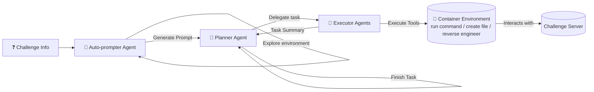
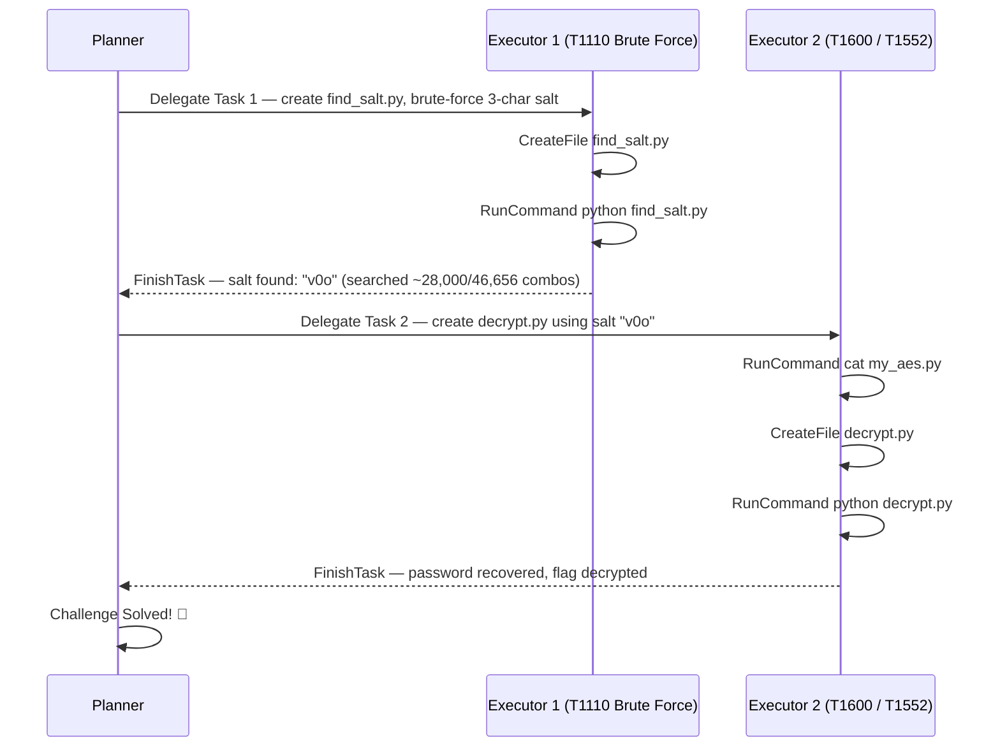

⚙️ Chunk 1 of the paper

# D-CIPHER: Dynamic Collaborative Intelligent Multi-Agent System with Planner and Heterogeneous Executors for Offensive Security

**Authors:** Meet Udeshi*, Minghao Shao*, Haoran Xi*, Nanda Rani, Kimberly Milner, Venkata Sai Charan Putrevu, Brendan Dolan-Gavitt, Sandeep Kumar Shukla, Prashanth Krishnamurthy, Farshad Khorrami, Ramesh Karri, Muhammad Shafique

*\*Authors contributed equally to this research.*

> Affiliations: NYU Tandon School of Engineering; NYU Abu Dhabi; Indian Institute of Technology Kanpur.
> Funded in part by the NYUAD Center for Artificial Intelligence and Robotics (CAIR) and NYUAD Center for Cyber Security (CCS), under Tamkeen's NYUAD Research Institute Awards CG010 and G1104.

---

## 📌 Abstract

- LLMs are increasingly used in cybersecurity (autonomous security analysis, penetration testing).
- **Capture the Flag (CTF)** challenges benchmark automated task-planning for LLM cybersecurity agents.
- Early **single-agent** approaches were limited to a single reasoning-action loop — inadequate for complex CTFs.
- **D-CIPHER** introduces a collaborative multi-agent framework inspired by real CTF teams:
  - A **Planner-Executor** agent system — one Planner for overall problem-solving, multiple heterogeneous Executors for individual tasks.
  - An **Auto-prompter** agent that generates a highly relevant initial prompt automatically.
- CTFs in **NYU CTF Bench** are manually mapped to **MITRE ATT&CK** techniques for a comprehensive offensive-security evaluation.

### 📊 Headline Results

| Benchmark | D-CIPHER Score | Improvement over prior work |
|---|---|---|
| NYU CTF Bench | 22.0% | +2.5 to +8.5 pts |
| Cybench | 22.5% | +2.5 to +8.5 pts |
| HackTheBox | 44.0% | +2.5 to +8.5 pts |

- D-CIPHER solves **65% more MITRE ATT&CK techniques** than previous work.
- Code: `https://github.com/NYU-LLM-CTF/nyuctf_agents` (package: `nyuctf_multiagent`)
- ATT&CK mapping: `https://github.com/NYU-LLM-CTF/NYU_CTF_Bench` (folder: `mitre_attack_mapping`)

**Index Terms:** Capture The Flag, Large Language Models, Multi-Agent Systems

---

## 1. Introduction

- LLMs show strong potential in cybersecurity: vulnerability detection, bug localization, automated program repair.
- Growing use of LLMs for **autonomous offensive security** tasks to counter expanding cyber threats.
- **CTFs** simulate real-world offensive scenarios spanning cryptography, digital forensics, binary exploitation, reverse engineering — success is marked by finding a unique **flag** string.
- CTF performance can also be benchmarked against the **MITRE ATT&CK** framework, which offers real-world threat classification.

### ⚠️ Limitation of Current Approaches
- Most LLM CTF agents are **single-agent**, handling challenges end-to-end.
- Single-agent setups rely only on self-reflection feedback → retries, loss of focus, hallucinations.
- Real CTF competitions are **team-based** with diverse expertise — current frameworks don't reflect this.
- Multi-agent systems are gaining traction elsewhere but remain nascent in cybersecurity (used so far for pentesting, exploit generation, bug discovery/repair).

### 🔬 Proposed Solution: D-CIPHER

Two core mechanisms for enhanced interaction and dynamic feedback:

1. **Planner-Executor agent system** — a Planner solves the CTF end-to-end, delegating specific tasks to multiple heterogeneous **Executor** agents.
2. **Auto-prompter agent** — explores the CTF environment first and generates a dynamic initial prompt (vs. static hard-coded templates).

> Dividing responsibilities between Planner and Executors keeps each agent focused on long, complex tasks and reduces hallucination. Auto-prompting improves on hard-coded templates by tailoring the initial prompt to the specific challenge.

D-CIPHER is also the **first work to evaluate LLM agents using the MITRE ATT&CK framework**, augmenting NYU CTF Bench with a technique mapping.

### High-Level Workflow

*(Fig. 1 — Overview of D-CIPHER: the Auto-prompter, Planner, and heterogeneous Executors collaborate to solve the CTF.)*

### 🧾 Contributions

1. **D-CIPHER** — a novel LLM multi-agent framework with specialized agent roles for collaborative autonomous problem-solving.
2. A novel **Planner-Executor system** dividing responsibilities and improving long-term focus on complex problems.
3. A novel **Auto-prompter agent** that improves auto-prompting via a dedicated agent.
4. Augmenting **NYU CTF Bench** with a **MITRE ATT&CK** technique mapping and evaluation.
5. A comprehensive study of how multi-agent collaboration enhances CTF problem-solving.

### Paper Structure

| Section | Content |
|---|---|
| II | Background & related work |
| III | D-CIPHER implementation |
| IV | Experimental setup |
| V | Results |
| VI | Common failures & ethics |
| VII | Conclusion & future work |

---

## 2. Related Work

- Autonomous frameworks give LLMs a feedback loop to act via tool/function calling (command line, web search, file editing, code execution).
- **Plan-and-solve prompting** adds a planning phase before iterative execution for long-horizon tasks.
- **ReAct** (reasoning + action) combines step-by-step reasoning with action, but relies on static, hard-coded prompt templates that don't adapt well across problems.
- **Auto-prompting** lets the LLM generate a highly relevant prompt itself, reducing hallucination — D-CIPHER implements this as a dedicated agent.
- **Multi-agent systems** enable specialized agents to collaborate on different aspects of complex tasks; effective in cybersecurity applications like insider threat detection, incident response, and code-safety improvement.

### 📊 Table I — Feature Comparison of CTF-Solving Agents

| Study | # CTFs | Open bench | Tool use | Autonomous | Multi-agent | Auto-prompt |
|---|---|---|---|---|---|---|
| Tann et al. | 7 | ✗ | ✗ | ✗ | ✗ | ✗ |
| Shao et al. | 26 | ✗ | ✓ | ✓ | ✗ | ✗ |
| InterCode-CTF | 100 | ✓ | ✓ | ✓ | ✗ | ✗ |
| NYU CTF Bench | 200 | ✓ | ✓ | ✓ | ✗ | ✗ |
| Turtayev et al. | 100 | ✓ | ✓ | ✓ | ✗ | ✗ |
| Cybench | 40 | ✓ | ✓ | ✓ | ✗ | ✗ |
| EnIGMA | 350 | ✓ | ✓ | ✓ | ✗ | ✗ |
| HackSynth | 200 | ✓ | ✓ | ✓ | ✓ | ✗ |
| **D-CIPHER (ours)** | **290** | ✓ | ✓ | ✓ | ✓ | ✓ |

### Prior Work Highlights

- **InterCode-CTF agent**: shows LLMs have basic cybersecurity skills but struggle with complex tasks.
- **NYU CTF baseline agent**: integrates external tools but exhausts context length as command output grows.
- **InterCode-CTF (mitigation)**: truncates history to last few iterations — still struggles on longer tasks.
- 🔑 Agents perform better with a **focused, well-defined toolset**.
- **EnIGMA**: interactive tools, in-context learning, LLM summarizer for context management → SOTA results (at the time).
- **HackSynth**: iterative planning + feedback summarization to finish multiple tasks.
- **Cybench**: benchmark of 40 CTFs augmented with step-by-step subtasks.
- **Turtayev et al.**: plan-and-solve prompting extension of InterCode-CTF, notable improvement.

> 🆕 **Gap D-CIPHER fills:** prior multi-LLM approaches use auxiliary roles (planning, summarizing) alongside one main agent. D-CIPHER is the first true **multi-agent** system for CTFs with divided responsibilities and well-defined inter-agent interaction for dynamic feedback.

---

## 3. D-CIPHER Implementation

- Each agent is based on the **NYU CTF baseline agent**, with upgraded prompts and additional interaction tools for multi-agent collaboration.
- Uses LLM **function calling** to produce actions (no custom structured action format — relies on the provider's API for parsing).

### Three Agent Roles

| Agent | Role |
|---|---|
| **Planner** | Generates overall plan to solve the CTF, delegates tasks to Executors, revises plan based on feedback |
| **Executor** | Performs a delegated task, returns a summary |
| **Auto-prompter** | Generates a dynamic initial prompt based on its own exploration of the CTF |

### 3.A Context Management

- Each agent keeps a conversation history of LLM inputs/outputs. Context = **(1)** system prompt (role + actions), **(2)** initial prompt (environment/task description), **(3)** conversation history of actions & observations.
- Follows the **ReAct** strategy: LLM reasons then produces an action each iteration; observations are appended to history.
- One **round** = reason + action + observation.
- Rounds continue until the task completes or context fills up.
- 🔧 **Truncation to manage context:**
  - Observations truncated to **25,000 characters**.
  - Actions/observations in all but the last few rounds are optionally truncated while preserving reasoning (similar to Abramovich et al.).

### 3.B Environment and Tools

- All agents share one **Linux container environment** with the CTF files, network access to the CTF server, and internet access to install packages.

**Shared tools:**

| Tool | Purpose |
|---|---|
| `RunCommand` | Execute shell commands |
| `CreateFile` | Create a file |
| `Disassemble` / `Decompile` | Trigger Ghidra to reverse-engineer a binary |
| `SubmitFlag` | Submit a CTF flag |
| `GiveUp` | Give up solving |

> Unlike EnIGMA, D-CIPHER does **not** implement advanced/interactive interfaces. Reverse-engineering tools use Ghidra, which has no direct CLI, so it's exposed via `Disassemble`/`Decompile`.

**Inter-agent action tools:**

| Action | Used by |
|---|---|
| `GeneratePrompt` | Auto-prompter → produces the initial prompt |
| `Delegate` | Planner → assigns a task to a new Executor |
| `FinishTask` | Executor → terminates and returns a task summary |

### 3.C Workflow

#### 1) Auto-prompter

- Given the raw CTF info as its initial prompt.
- Unlike typical auto-prompting, it doesn't just rewrite the prompt — it first **interacts with the environment** for a few rounds (reads files, runs the binary, probes the CTF server).
- Then calls `GeneratePrompt` to produce a **tailored** prompt (description + viable attack approach), replacing generic hard-coded templates.

> 🖼️ **Fig. 3** (example: *collision_course* crypto CTF) contrasts the Auto-prompter's dynamically generated prompt — which includes file analysis, observations (MD5 hashing with a 3-character salt, password built from concatenated original IDs), and a concrete attack strategy (brute-force the salt, recover the mapping, decrypt with `my_aes.py`) — against the generic hard-coded template, which only gives a static challenge description and generic instructions with no tailored strategy.

#### 2) Planner-Executor System

- **Planner** initialized with the Auto-prompter's generated prompt; also explores the CTF briefly itself.
  - Has `RunCommand` but **not** `CreateFile`, `Disassemble`, or `Decompile` — encourages exploration while discouraging it from solving the CTF alone.
  - Produces a step-by-step plan and calls `Delegate` to assign a task to an Executor.
- **Executor** is spun up fresh (new conversation history) per `Delegate` call — runs commands/creates scripts, then calls `FinishTask` with a summary.
- The summary returns to the Planner as an observation → Planner revises its plan and delegates further tasks.
- Each Executor focuses only on its task; the Planner sees only summaries → efficient context management across multiple heterogeneous Executors working one challenge.

##### Example: Solving `collision_course` (Fig. 4)

- Executor 1 implements a brute-force attack over the hash salt → correctly employs **T1110 (Brute Force)**.
- Executor 2 implements decryption using the salt → employs **T1600 (Weaken Encryption)** and **T1552 (Unsecured Credentials)**.
- Demonstrates the Planner focusing on the whole CTF while each Executor focuses on a single task — improving both problem-solving and ATT&CK technique coverage.

#### Termination Conditions

- Each agent has a **max conversation-round limit**; there's also a **max total cost limit** across all agents.
- Only the **Planner** can call `SubmitFlag` or `GiveUp` — it is the central agent.
- D-CIPHER terminates when:
  - `SubmitFlag` is called with the correct flag, **or**
  - `GiveUp` is called, **or**
  - The Planner exhausts its rounds, **or**
  - The cost limit is reached.
- A wrong flag submission returns a negative response; solving may continue.

#### ⚠️ Failure Handling

- If the Auto-prompter or Executor exhausts its rounds without producing an output (`GeneratePrompt`/`FinishTask`), it's prompted once more and told to insist on an output.
  - If Auto-prompter still fails → fall back to a **hard-coded prompt**.
  - If Executor still fails → return a **hard-coded warning**.
- Executor conversation history is truncated to recent actions/observations to preserve focus and stay within context limits.

---

## 4. Experiment Setup

- Each D-CIPHER run attempts **one** CTF challenge.

**Configuration:**

| Parameter | Value |
|---|---|
| Total cost limit | $3 |
| Temperature (all LLMs) | 1.0 |
| Max rounds — Auto-prompter | 5 |
| Max rounds — Planner | 30 |
| Max rounds — each Executor | 100 |
| Executor history truncation | last 5 actions/observations |

### 4.A Benchmarks

Evaluated on **NYU CTF Bench**, **Cybench**, and **HackTheBox** — 290 CTFs total across six categories: cryptography (crypto), forensics, binary exploitation (pwn), reverse engineering (rev), web, and miscellaneous (misc).

- Development used the 55-CTF dev set introduced by Abramovich et al.
- Cybench evaluated in **unguided mode** (no subtask info) with the "hard prompt" (no extra hints).

#### 📊 Table II — Benchmarks for Evaluating D-CIPHER

| Benchmark | crypto | foren | pwn | rev | web | misc | Total |
|---|---|---|---|---|---|---|---|
| NYU CTF | 53 | 15 | 38 | 51 | 19 | 24 | **200** |
| Cybench | 16 | 4 | 2 | 6 | 8 | 4 | **40** |
| HackTheBox | 30 | 0 | 0 | 20 | 0 | 0 | **50** |
| **Total** | **99** | **19** | **40** | **77** | **27** | **28** | **290** |

### 4.B LLM Selection

- Same LLM used for all three agents per run; accessed via provider APIs (open-source LLaMA via Together AI).

**Primary LLMs evaluated:**
- Claude 3.5 Sonnet (`claude-3-5-sonnet-20241022`)
- GPT-4 Turbo (`gpt-4-turbo-2024-04-09`)
- GPT-4o (`gpt-4o-2024-11-20`)
- LLaMa 3.1 405B (`meta-llama/Meta-Llama-3.1-405B-Instruct-Turbo`)
- Gemini 1.5 Flash (`gemini-1.5-flash`)

- D-CIPHER supports **different LLMs per agent** — e.g., pairing a strong Planner model with a weaker Executor model.

**Weaker LLMs used for Executors:**
- Claude 3.5 Haiku (`claude-3-5-haiku-20241022`)
- GPT-4o Mini (`gpt-4o-mini-2024-07-18`)
- LLaMa 3.3 70B (`meta-llama/Llama-3.3-70B-Instruct-Turbo`)
- Gemini 1.5 Flash 8B (`gemini-1.5-flash-8b`)

### 4.C Evaluation Metrics

- **% solved** — primary metric; % of CTFs where the correct flag is submitted by the Planner, or observed anywhere in agent conversation (covers cases where Auto-prompter/Executor find the flag but don't relay it to the Planner).
  - False positives considered highly unlikely since flags are unique, specifically formatted strings (`flag{...}`).
- **$ cost** — average total USD cost of all LLM API calls (across agents) for solved CTFs; indicates computational resources required.

### 4.D MITRE ATT&CK Classification

- The **MITRE ATT&CK framework** is a widely used taxonomy of offensive tactics, techniques, and procedures for classifying cyberattacks.
- CTFs can be attributed a set of ATT&CK techniques required to solve them; for all CTFs an agent solves, its successfully employed techniques are aggregated to benchmark offensive capability.

**Labeling process:**
- All 200 NYU CTF Bench challenges manually labeled with ATT&CK enterprise techniques, based on challenge descriptions, solution writeups/scripts, and manual interaction.
- 📌 **83 of 200 CTFs** have **no applicable techniques** (common in crypto, rev, misc categories that test specific skills without an "attack").
- On the remaining **117 CTFs**: **211 instances** of **45 unique techniques** were mapped.
- Frequent techniques:
  - **T1600 (Weaken Encryption)** and **T1552 (Unsecured Credentials)** — common in cryptography CTFs.
  - **T1203 (Exploitation for Client Execution)** and **T1574 (Hijack Execution Flow)** — common in binary exploitation CTFs.

*(Continues in next chunk — full technique breakdown is in Table VII, Section V-G.)*
