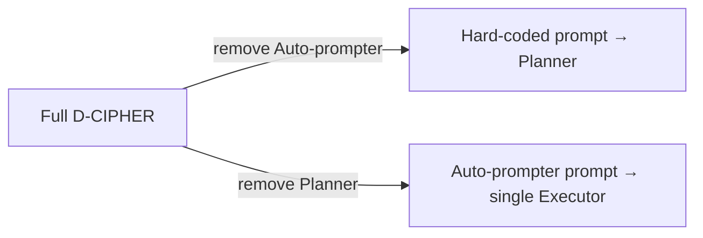

⚙️ Chunk 2 of the paper

## V. Results

### A. Comparison of % solved

> 📊 **Table III** compares D-CIPHER against other LLM agents across NYU CTF Bench, Cybench, and HackTheBox, run with five different LLMs (same LLM used for Planner, Executor, and Auto-prompter in each run). The NYU CTF baseline agent was also rerun with three LLMs to capture the effect of recent model updates. EnIGMA's numbers are taken directly from Abramovich et al.

| Agent / Model | NYU CTF % solved | NYU CTF $ cost | Cybench % solved | Cybench $ cost | HackTheBox % solved | HackTheBox $ cost |
|---|---|---|---|---|---|---|
| **NYU CTF baseline** – Claude 3.5 Sonnet | 13.0 | – | – | – | 38.0 | – |
| NYU CTF baseline – GPT 4o | 6.0 | – | – | – | 16.0 | – |
| NYU CTF baseline – GPT 4 Turbo | 6.0 | – | – | – | 10.0 | – |
| **EnIGMA** – Claude 3.5 Sonnet | 13.5 | 0.35 | 20.0 | 0.91 | 26.0 | 0.53 |
| EnIGMA – GPT 4o | 9.5 | 0.62 | 12.5 | 0.61 | 16.3 | 1.71 |
| EnIGMA – GPT 4 Turbo | 7.0 | 0.79 | 17.5 | 1.60 | 18.4 | 1.35 |
| **D-CIPHER** – Claude 3.5 Sonnet | 19.0 | 0.52 | 22.5 | 0.30 | 44.0 | 0.49 |
| D-CIPHER – GPT 4o | 10.5 | 0.22 | 12.5 | 0.08 | 16.0 | 0.16 |
| D-CIPHER – GPT 4 Turbo | 6.5 | 0.46 | – | – | – | – |
| D-CIPHER – LLaMA 3.1 405B | 3.0 | 0.01 | – | – | – | – |
| D-CIPHER – Gemini 1.5 Flash | 2.5 | 0.001 | – | – | – | – |
| D-CIPHER w/o auto-prompter – Claude 3.5 Sonnet | 22.0 | 0.74 | 20.0 | 0.33 | 44.0 | 0.62 |
| D-CIPHER w/o auto-prompter – GPT 4o | 9.5 | 0.23 | – | – | – | – |
| D-CIPHER w/o planner – Claude 3.5 Sonnet | 14.0 | 0.36 | – | – | – | – |
| D-CIPHER w/o planner – GPT 4o | 9.0 | 0.11 | – | – | – | – |

📌 **Key findings**

- D-CIPHER + Claude 3.5 Sonnet beats EnIGMA (state-of-the-art) across all three benchmarks: **19.0% vs 13.5%** (NYU CTF), **22.5% vs 20%** (Cybench), **44% vs 26%** (HackTheBox).
- D-CIPHER + GPT 4o beats EnIGMA + GPT 4o on NYU CTF Bench, and is close on Cybench/HackTheBox.
- Rerun baselines show newer LLMs have improved on cybersecurity tasks, closing in on EnIGMA — but D-CIPHER still consistently wins on NYU CTF Bench.
- EnIGMA was evaluated on older LLMs, so D-CIPHER was also tested with the older Claude 3.5 Sonnet for a fair comparison (see §V-D4).
- Gains come from both recent LLM improvements **and** the multi-agent architecture itself.
- Interestingly, **D-CIPHER without Auto-prompter + Claude 3.5 Sonnet** hits the highest NYU CTF score (22%), but this configuration underperforms with GPT 4o and on other benchmarks — average cost also rises — so the Auto-prompter is judged to help overall.

### B. Comparison of $ cost

- Except for Claude 3.5 Sonnet on NYU CTF Bench, D-CIPHER has **lower average cost** than EnIGMA across all LLMs and benchmarks.
- With GPT 4o and GPT 4 Turbo, D-CIPHER cuts cost **2×–10×** while solving more challenges.
- Despite running multiple agents, the division of labor between agents makes the system *more* cost-efficient, not less.

### C. Category-wise comparison

> 📊 D-CIPHER outperforms EnIGMA in every NYU CTF category **except pwn**. Crypto performance roughly doubles (7.7% → 15.4%); rev and misc improve by 9–12 points. This is attributed to better task decomposition — crypto/rev challenges often involve long disassembly or encrypted-file outputs that benefit from being broken into sub-tasks by the Planner.

🖼️ **Figure 5** — Two radar/spider charts comparing Claude 3.5 Sonnet, GPT 4 Turbo, and GPT 4o on NYU CTF Bench, across categories (crypto, foren, pwn, rev, web, misc):
- **(a) % solved per category** — Claude 3.5 Sonnet leads broadly, especially strong in pwn and rev.
- **(b) $ cost per category** — GPT 4o is cheapest overall; Claude 3.5 Sonnet moderately higher on forensics/pwn/rev; GPT 4 Turbo costliest on forensics/pwn/web (but solves less elsewhere); crypto is costly across all LLMs due to long encrypted-text analysis and iterative decryption attempts.

⚠️ **Limitation:** Web CTF performance still lags behind other categories despite improvement over prior work.

### D. Impact of different configurations

#### 1) Ablation Study

Two stripped-down configurations were tested:

1. **Without Auto-prompter** — Planner starts from a hard-coded prompt template instead.
2. **Without Planner** — a single Executor runs directly on the Auto-prompter's generated prompt.

📌 **Findings:**

- **Without Auto-prompter**, Claude 3.5 Sonnet gains +3% on NYU CTF Bench, but *drops* with GPT 4o on NYU CTF Bench and with Claude 3.5 Sonnet on Cybench — so the Auto-prompter helps in most cases.
- Removing the Auto-prompter increases average cost across LLMs/benchmarks — i.e., the Auto-prompter improves efficiency without hurting performance in most cases.
- The Claude 3.5 Sonnet NYU CTF exception is driven by the **pwn** category specifically, where performance **more than doubles** without the Auto-prompter, while other categories stay flat or drop (see §V-C, §VI-A).
- **Without Planner**, NYU CTF performance drops 1–5% across both LLMs tested — confirming the Planner-Executor split helps. Yet total cost of Planner + multiple Executors is only ~2× a single Executor, meaning each individual agent runs more efficiently.

#### 2) Combining stronger and weaker LLMs

> Table IV — pairing a strong Planner LLM with a weaker Executor LLM.

| Planner | Executor | % solved | $ cost |
|---|---|---|---|
| Claude 3.5 Sonnet | Claude 3.5 Haiku | 13.0 | 0.33 |
| GPT 4o | GPT 4o mini | 6.5 | 0.03 |
| GPT 4 Turbo | GPT 4o mini | 5.5 | 0.07 |
| Gemini 1.5 Flash | Gemini 1.5 Flash 8B | 3.0 | 0.001 |
| LLaMa 3.1 405B | LLaMa 3.3 70B | 0.0 | 0.00 |

📌 **Findings:**

- Weaker Executors consistently *hurt* performance.
- Claude 3.5 Sonnet + Haiku: **−6.0%** vs Sonnet + Sonnet.
- GPT-4o + GPT-4o-mini: **−4%**; GPT-4 Turbo + GPT-4o-mini: **−1%**.
- LLaMA 3.1 405B + LLaMA 3.3 70B: **0% solved**.
- Gemini 1.5 Flash held up similarly with its weaker variant.
- Conclusion: both Planner and Executor roles require strong models — task complexity doesn't tolerate a weak link.

#### 3) Impact of temperature

> Table V — GPT-4o % solved at T = 1.0 vs T = 0.95.

| Temp | crypto | foren. | pwn | rev | web | misc | **total** |
|---|---|---|---|---|---|---|---|
| T = 1.0 | 5.8 | 13.3 | 7.7 | 13.7 | 10.5 | 16.7 | **10.5** |
| T = 0.95 | 3.8 | 13.3 | 5.1 | 11.8 | 10.5 | 16.7 | **9.0** |

📌 Lowering temperature consistently *hurts* crypto, pwn, and rev, with no gain elsewhere (forensics/web/misc unchanged) — higher temperature's creativity aids problem-solving.

#### 4) Older LLM versions

> Table VI — NYU CTF Bench results using the older `claude-3-5-sonnet-20240620` (matching EnIGMA's evaluation version).

| Agent | % solved | $ cost |
|---|---|---|
| EnIGMA | 13.5 | 0.35 |
| D-CIPHER | 15.0 | 0.62 |

📌 D-CIPHER still outperforms EnIGMA on the same older model, but at **almost 2× the cost** — evidence both for the multi-agent architecture's advantage and for how much the underlying LLM's capability matters.

### E. Exit Reason Analysis

🖼️ **Figure 6** — Stacked bar chart of exit-reason percentages (Solved / Giveup / Max cost / Max rounds / Error) per category, for Claude 3.5 Sonnet, GPT 4o, and GPT 4 Turbo on NYU CTF Bench.

Five exit types:

| Exit reason | Meaning |
|---|---|
| **Solved** | Challenge successfully completed |
| **Giveup** | Planner voluntarily gives up |
| **Max cost** | Cost budget exceeded |
| **Max rounds** | Conversation rounds exhausted |
| **Error** | Run terminates with an error |

📌 **Findings:**

- For **Claude 3.5 Sonnet**, *Max cost* is the dominant exit reason — it tends to keep working until the budget runs out rather than giving up.
- For **other LLMs**, *Giveup* is the dominant reason.
- *Max rounds* is rare across the board.
- GPT-4o and GPT-4 Turbo show similar exit-reason distribution across categories — pointing to holistic (uniform) capability.
- Claude 3.5 Sonnet shows a high giveup rate and low success on **web** challenges — a specific capability gap (failure examples in §VI-B).

### F. Total Conversation Rounds Analysis

🖼️ **Figure 7** — Histograms of total conversation rounds for successful vs. failed challenges, across five configurations: D-CIPHER+Claude 3.5 Sonnet, D-CIPHER+GPT 4o, D-CIPHER+GPT 4 Turbo, w/o auto-prompter+Claude 3.5 Sonnet, w/o auto-prompter+GPT 4o.

📌 **Observations:**

- Successful challenges generally take fewer rounds than failures. Two possible readings:
  1. D-CIPHER only solves *easier* challenges (which need fewer rounds), failing on longer ones; **or**
  2. challenges are solved only when the correct path is found early — otherwise agents wander for many rounds before giving up.
- Claude 3.5 Sonnet runs for **more rounds** than GPT-4o/GPT-4 Turbo in both success and failure cases — consistent with its lower tendency to give up, which likely helps it solve challenges that need many rounds.
- The Auto-prompter appears to help solve challenges **faster**, improving overall efficiency.

### G. MITRE ATT&CK Capabilities

All 200 CTFs in NYU CTF Bench were labeled with MITRE ATT&CK techniques (per §IV-D) to analyze offensive capability at a finer grain.

> 📊 **Table VII** — Number of CTFs (#CTFs) labeled per technique, and how many each agent/LLM combination solved. Selected notable rows:

| ID | Technique | #CTFs | D-CIPHER Sonnet | D-CIPHER GPT4o | D-CIPHER GPT4 Turbo | D-CIPHER w/o autoprompt (Sonnet) | NYUCTF Baseline Sonnet | NYUCTF Baseline GPT4o | NYUCTF Baseline GPT4 Turbo | EnIGMA Sonnet | EnIGMA GPT4o |
|---|---|---|---|---|---|---|---|---|---|---|---|
| T1203 | Exploitation for Client Execution | 36 | 4 | 2 | 1 | 10 | 2 | 1 | 1 | 6 | 2 |
| T1574 | Hijack Execution Flow | 24 | 2 | 1 | 0 | 5 | 0 | 0 | 0 | 3 | 1 |
| T1190 | Exploit Public-Facing Application | 17 | 1 | 2 | 1 | 2 | 1 | 0 | 0 | 0 | 1 |
| T1552 | Unsecured Credentials | 16 | 5 | 3 | 2 | 6 | 5 | 1 | 3 | 5 | 2 |
| T1059 | Command and Scripting Interpreter | 15 | 1 | 1 | 1 | 3 | 1 | 1 | 1 | 1 | 1 |
| T1110 | Brute Force | 11 | 3 | 0 | 0 | 3 | 3 | 1 | 2 | 1 | 2 |
| T1600 | Weaken Encryption | 9 | 2 | 0 | 0 | 2 | 2 | 0 | 0 | 1 | 1 |
| T1140 | Deobfuscate/Decode Files or Information | 9 | 1 | 0 | 0 | 2 | 1 | 0 | 0 | 1 | 1 |
| T1055 | Process Injection | 7 | 1 | 0 | 0 | 1 | 0 | 0 | 0 | 1 | 0 |
| **Total** | | **211** | **27** | **14** | **8** | **43** | **21** | **4** | **8** | **26** | **16** |

*(Remaining low-count techniques, mostly 1–6 CTFs each with 0–2 solves across agents, omitted here for brevity — see original table for full 45-technique breakdown.)*

📌 **Key findings:**

- **D-CIPHER without Auto-prompter + Claude 3.5 Sonnet** shows the strongest offensive capability, solving **65% more techniques** than other agents/configurations.
- D-CIPHER **with** Auto-prompter is comparatively weaker on **pwn**-related techniques spanning multiple categories — directly reflecting the Auto-prompter's known impact (§V-D1).
- Comparing D-CIPHER, NYU CTF Baseline, and EnIGMA (all on Claude 3.5 Sonnet):
  - D-CIPHER is better at **T1110 (Brute Force)** and **T1600 (Weaken Encryption)** — multi-agent collaboration helps in cryptographic CTFs.
  - EnIGMA outperforms on **T1203 (Exploitation for Client Execution)** and **T1574 (Hijack Execution Flow)** — its interactive tools help with binary exploitation.
- D-CIPHER and EnIGMA solve a *similar number* of techniques overall, even though D-CIPHER has 5.5% higher overall NYU CTF accuracy — suggesting D-CIPHER's edge partly comes from skills **outside** ATT&CK-tagged techniques (e.g., some reverse-engineering/misc CTFs among the 83 untagged challenges).
- NYU CTF Baseline and EnIGMA have similar overall accuracy, but Baseline solves fewer techniques — indicating weaker offensive capability despite comparable raw scores.
- With GPT-4o, EnIGMA shows more **uniform** performance across techniques than D-CIPHER/Baseline — suggesting single agents with interactive tools may suit this model better.
- D-CIPHER and NYU CTF Baseline both perform worse with GPT-4 Turbo, consistent with its lower overall accuracy.

> Overall, comparing autoprompter on/off against NYU CTF Baseline and EnIGMA shows multi-agent collaboration improves offensive security capability, and the ATT&CK-based benchmarking offers a nuanced, technique-level comparison that highlights gaps for future improvement.

---

## VI. Discussion

### A. Auto-prompter Failures

> As noted in §V-D1, D-CIPHER **with** Auto-prompter underperforms **without** it on NYU CTF Bench pwn challenges (Claude 3.5 Sonnet). Five specific pwn cases where D-CIPHER succeeds *without* the Auto-prompter but fails *with* it were examined:

- **`slithery`** (Python jail escape) — Solution: bypass a command reject-list to invoke `os.system` for shell access. ⚠️ A misleading base64 encoding threw the Auto-prompter off, generating a prompt that focused on the wrong variables and distracted the Planner.
- **`unlimited_subway`** (buffer overflow) — Solution: leak the stack canary byte-by-byte via arbitrary memory reads, overwrite it, redirect execution to `print_flag`. ⚠️ The Auto-prompter tried commands like `strings` but kept hitting errors, never producing a useful prompt.
- **`got_milk`** (global offset table attack) — Solution: exploit a format-string bug to overwrite the low byte of the GOT address of `lose` with the corresponding byte of `win`. ⚠️ The Auto-prompter couldn't extract any contextual info and stalled the Planner entirely.
- **`bigboy`** (buffer overflow) — Solution: overwrite a memory value with `0xCAF3BAEE` repeatedly to pass a check and spawn `/bin/bash`. The Auto-prompter *correctly* analyzed the binary and produced a solid exploitation strategy — yet the Planner still failed to execute it.
- **`baby_boi`** (buffer overflow / ROP) — Solution: use a buffer overflow to build a ROP chain that leaks the libc base, locates a `one_gadget`, and spawns a shell. The Auto-prompter's step-by-step prompt covered all necessary steps but lacked enough detail, and the Planner failed.

📌 **Takeaway:** The Auto-prompter helps overall, but it can make D-CIPHER *more* susceptible to early errors that a robust hard-coded template would avoid — occasionally missing full exploitation opportunities or failing to generate actionable prompts.

> 🖼️ **Figure 8** illustrates a case where the Auto-prompter's `GeneratePrompt` call returns `"prompt": null` after being told to explore the challenge via `run_command` — D-CIPHER falls back to the hard-coded Planner prompt template in this situation.

> 🔮 **Future work:** combine Auto-prompter–generated prompts with hard-coded guidelines for robustness.

### B. Common Failure Examples

Failure patterns observed by inspecting D-CIPHER's conversation logs:

1. **Auto-prompter fails to generate a prompt** — it keeps running commands and exhausts the round limit without ever calling `GeneratePrompt`, even after being explicitly re-prompted. D-CIPHER falls back to starting the Planner with the hard-coded template.

2. **Agent produces no action** — the agent's response contains only reasoning, no actionable function call, typically when stuck and mistakenly expecting user input despite operating autonomously. Frequent with **LLaMa 3.1 405B** and **Gemini 1.5 Flash**, which sometimes emit malformed function-call syntax that fails to parse (see Figure 9) — in these cases the agent is simply prompted to retry.

   🖼️ **Figure 9** — Example: a Planner emits a malformed `run_command` function call (mismatched quoting), receives a parsing-error observation, and successfully retries with a corrected `strings` command on the second attempt.

3. **Hallucinates CTF information** — agents sometimes try to connect to non-existent servers or read non-existent files (Figure 10). Gemini 1.5 Flash occasionally hallucinates entire functions not defined in the framework. Executing these produces errors (e.g. "File not found") that the agent must recognize and recover from.

4. **Confusion with interactive tools** — agents attempt to run commands *inside* interactive tools like `gdb` via the plain `RunCommand` shell-execution interface, which only runs one-shot shell commands rather than an interactive session. A human user would type these directly into an interactive shell; the agent lacks that interface. 🔮 Suggested fix: build advanced interactive-tool support and better interface-awareness demonstrations for the agent.
