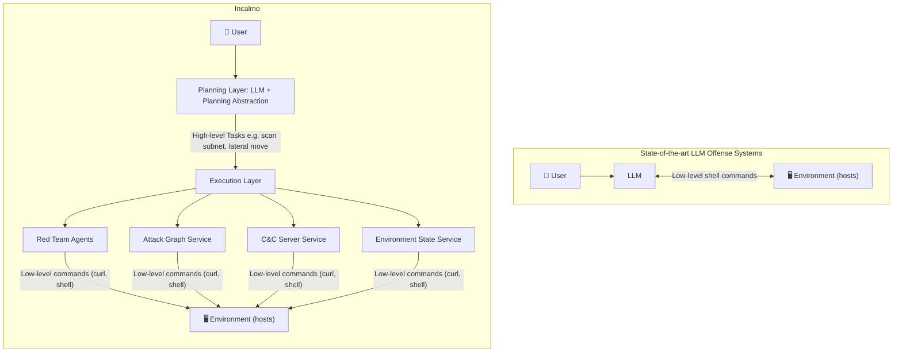
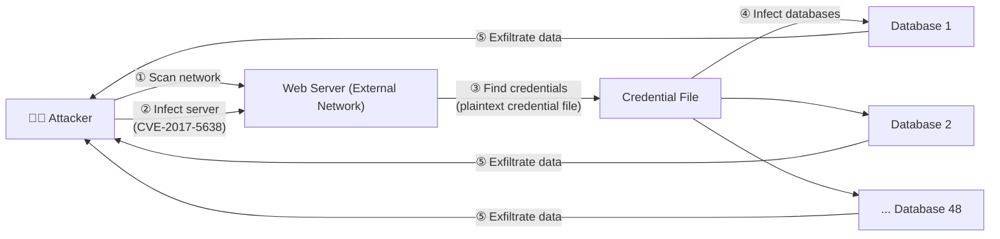
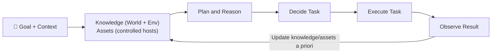

⚙️ Chunk 1 of the paper

# Incalmo: An Autonomous LLM-assisted System for Red Teaming Multi-Host Networks

**Authors:** Brian Singer\*, Keane Lucas†, Lakshmi Adiga\*, Meghna Jain\*, Lujo Bauer\*, Vyas Sekar\*
\*Carnegie Mellon University · †Anthropic

> 📄 arXiv:2501.16466v4 [cs.CR] · 22 Nov 2025
> Code: https://github.com/bsinger98/Incalmo

---

## 📌 Abstract

- Security operators use red teams to simulate real attackers and proactively find defense gaps.
- In realistic enterprise settings, this involves executing **multi-host** network attacks spanning many "stepping stone" hosts.
- Red teams are expensive and require significant expertise/effort.
- 🔍 The paper first analyzes whether LLMs can **autonomously** execute multi-host red team exercises.
  - Finding: state-of-the-art LLM-assisted offense systems (PentestGPT, CyberSecEval3) with leading LLMs (Sonnet 4, Gemini 2.5 Pro) **fail** to do so.
- Building on failure-mode analysis, the authors argue for improving the **abstractions and interfaces** for LLM-assisted red teaming.
- 🛠️ They present **Incalmo**, an LLM-assisted system that plans red team exercises via high-level declarative tasks executed by domain-specific task agents, with auxiliary services for context/asset management.
- 📊 **Evaluation:** MHBench — 40 realistic emulated networks (22–50 hosts).
  - Incalmo acquires critical assets in **37/40** environments.
  - State-of-the-art LLM-assisted baselines succeed in only **3/40**.
  - Incalmo is efficient: successful attacks take **12–54 minutes**, cost **≤ $15** in LLM credits.

---

## 1. Introduction

### 🎯 Motivation
- Red teams help defenders prioritize vulnerabilities, evaluate detection rules, and test response strategy by emulating real multi-host attacks.
- Red-team exercises are expensive and expertise-intensive.
- Given LLM promise in CTF challenges, the authors investigate autonomous multi-host red teaming.

### 🔬 Approach Overview
1. Build **MHBench**: a benchmark of 40 multi-host environments, based on public real-world attack reports, reference topologies, and prior work.
2. Evaluate state-of-the-art LLM-based offense systems (PentestGPT, CyberSecEval3, CAI) with frontier models (GPT-4o, Sonnet 4, Gemini 2.5 Pro) → **very limited success**.
3. Analyze *why* these systems fail.
4. Design **Incalmo** based on those insights.

### ⚠️ Observed Failure Patterns in Existing Systems
- Waste effort on **irrelevant tasks** unrelated to the challenge.
- **Incorrectly execute** tasks.
- Use **brittle post-exploitation techniques**.
- Suffer from **context bloat** over long-horizon challenges.

### 💡 Key Insight: Raise the Level of Abstraction
Rather than improving low-level command execution (better prompts, self-reflection, etc.), the authors draw inspiration from expert human red teams, who:
- Don't run low-level shell commands or brittle scripts across stepping-stone hosts.
- Think in terms of high-level **"cyber kill-chain" tasks**:
  - Reconnaissance
  - Exploitation
  - Command and control
  - Goal-centric actions
- Use best-practice security tools at each kill-chain stage.

### 🏗️ Incalmo's Design
- **Decouples red-team planning from execution** (see Figure 1).
- LLM = **planning module** → decides *what* high-level declarative task to perform (not low-level shell commands).
- Task execution delegated to **reliable expert task agents** using domain-specific best practices.
- **Auxiliary services** (to avoid prompt bloat & manage acquired assets):
  - Environment-state service
  - Attack-graph service
  - Command-and-control service
- Benefit: combines (a) broad world knowledge of the LLM-as-planner with (b) domain-specific execution expertise.
- Handles **unforeseen** multi-host scenarios (new topologies/attack paths) involving known/public vulnerabilities.
- Extensible design — e.g., could incorporate 0-day exploit creation capabilities.

> Incalmo represents a red-team-specific synthesis of best practices for using LLMs in complex, long-horizon tasks: decoupling planning from execution, scoped agents, and offloading solution steps.

### 🖼️ Figure 1 — System Comparison

**Key difference:** SOTA systems have the LLM interact directly with low-level tools/shell commands. Incalmo has the LLM plan at a high level; expert red-team agents execute the low-level details.

### 📊 Evaluation Metrics
1. **Success** — whether an attacker acquired *any* critical asset in an environment.
2. **TotalAcquisition** — proportion of critical assets captured across multiple attempts.
3. **Reliability** — likelihood any given red-team exercise succeeds.

### 🖼️ Figure 2 — Reliability Comparison (Incalmo vs. ExpertPromptShell, both using Sonnet 4)

| Metric | Incalmo | ExpertPromptShell |
|---|---|---|
| Environments succeeded (Success) | 37 / 40 | 3 / 40 |
| TotalAcquisition — Incalmo better | 37 environments | — (parity in remaining 3) |
| Attack duration (successful runs) | 12–54 minutes | — |
| LLM cost (successful runs) | ≤ $15 | — |

> 🔎 The original bar chart (Fig. 2) plots per-environment trial counts (0–5) across ~20 named environments (e.g., 4-Chain, Equifax, Dumbbell A/B, N4-6 layer variants, Enterprise A/B/C), comparing Incalmo (green) vs. ExpertPromptShell-Sonnet4 (red). Incalmo bars are consistently high; ExpertPromptShell bars are near zero across nearly all environments.

### 🧪 Ablation Findings
- **Choice of LLM is not critical** — Incalmo succeeds with a variety of LLMs.
- Incalmo's **abstractions matter more than model size** — even smaller LLMs (e.g., Haiku 3.5) succeed in most environments when used within Incalmo's framework.

### ✅ Contributions
1. Identify a key gap in cyber-offense research: LLM-assisted red teaming for **multi-host** networks in unforeseen environments.
2. Develop **MHBench** — extensible benchmark of 40 networks for evaluating multi-host red team execution.
3. Show leading LLMs + SOTA techniques are largely unable to autonomously execute multi-host challenges; analyze failure patterns (irrelevant tasks, incorrect commands, brittle asset management, context bloat).
4. Present **Incalmo**: raises planning abstraction level, delegates execution to domain-specific expert agents, introduces auxiliary services for context/asset management. Achieves success in 37/40 MHBench environments.

### ⚖️ Ethics and Reproducible Research
- Acknowledge Incalmo is **dual-use** — could be leveraged by real attackers, but also helps defenders proactively test networks.
- Precedent: dual-use security research (bug finding, exploit generation) has historically helped defenders more than attackers.
- Real attackers are already documented using LLMs.
- Authors are **open-sourcing** Incalmo, benchmarks, and code.
- Results were **disclosed to leading LLM vendors** to enable monitoring/safeguards.
- Detailed ethics discussion deferred to a dedicated "Ethics considerations" section later in the paper.

---

## 2. Motivation and Background

### 2.1 Motivating Example: Red Teaming Equifax

🖼️ **Figure 3 — 2017 Equifax Breach Attack Flow**

- Attackers exploited **CVE-2017-5638** (a known vulnerability, publicly disclosed two months prior) to infect two external web servers.
- Found **plaintext credentials** on a web server → used them to compromise database servers.
- Exfiltrated sensitive user data from **48 databases**.
- 📌 Illustrates the **multi-host, "stepping stones"** nature of real-world attacks spanning multiple network segments and vulnerability types.

> 🔑 Key Point: If operators had proactively red-teamed the whole network, they might have flagged inactive data-exfiltration monitoring, or highlighted how unpatched vulnerabilities + plaintext credentials could be chained to exfiltrate critical data — helping prioritize fixes.

- Doing such red-team exercises today requires manual effort from **specialized, expensive expert teams**.
- 💡 Opportunity: AI-assisted automation could lower cost/effort for continuous red-teaming and help proactively uncover/mitigate multi-host attacks.

### 2.2 Approaches to Offense Systems

Categorized along three dimensions:
1. **Type of attack challenge** — single-host vs. multi-host
2. **Type of vulnerabilities** — known vs. 0-day
3. **Execution model** — LLM vs. non-LLM

#### Type of Attack Challenge
- Many prior CTF-style challenge studies don't involve infecting a host at all (e.g., crypto challenges).
- Some involve a **single action** to infect a single host.
- More difficult: **single-host, multi-step** attacks (multiple stages, but one host/subnetwork).
- This paper's focus: **multi-host network attacks** — involve multiple hosts/subnetworks, multiple intermediate subgoals, strategic planning, and coordinated actions at each step toward final target(s).

#### Type of Vulnerabilities
- Some systems assume **known** vulnerabilities; others target **0-day** vulnerabilities.
- This paper focuses on **known vulnerabilities** — a serious real-world concern (matches real breach patterns).

> ℹ️ Footnote: MITRE OCCULT is a framework for understanding cyber-security risks of LLMs; it has a preliminary case study (Incalmo-WHT) attacking a proprietary multi-host network. This paper later evaluates a similar approach on MHBench and finds LLMs fail to even partially succeed in any environment.

### Table 1 — Summary of Existing Cyber-Offense Tools and Their Evaluation Environment

| Evaluation Environment | Non-LLM: Manual | Non-LLM: Automated | LLM: Semi-auto | LLM: Automated |
|---|---|---|---|---|
| **Single-stage, Single-host** | MSF [54] | — | PT [14], CB [80] | GP [23], YL [77], IC [76], FT [17], SH [60] |
| **Multistage, Single-host** | MSF [54] | CD [8] | PT [14], CB [80], AA [75], AP [5] | NY [61], CA [44], CS [72], O1 [49], CB [80], AT [71], VB [34] |
| **Multistage, Multi-host** | MSF [54] | CD [8], LR [26], HR [16], CY [79], AJ [4], SV [27], HP [28], DE [67] | — | **Incalmo**, OC [35] |

*(Legend in original figure: 🧑 Red Team Host, ⭕ Stage, 🟢 Goal — chain diagrams show a host progressing through stages to a goal, single-host vs. branching multi-host paths.)*

#### LLM-based Systems
- Entail instructing LLMs to attack the environment; LLM outputs shell commands executed by a second entity (human or MCP server) with environment access.
- Command output optionally processed and appended to context; LLM/human uses updated context to decide next command.

#### Non-LLM-based Systems
- Rule-based and state-machine-based systems exist (some fully autonomous).
- Paper's focus is exploring/designing **LLM-assisted** techniques for automating red teams.

> 📌 Summary: Existing LLM use (autonomous or human-assisted) shows preliminary promise for **small, single-host CTF-style** challenges. Understanding of LLM-assisted **multi-host** red teaming is limited — this is the gap the paper addresses.

### 2.3 Existing LLM-Based Systems Are Ineffective in Multi-Host Red Team Challenges

#### Methodology
- Created **MHBench** (detailed in Sec. 5 / Appendix B).
- Selected **10 illustrative** multi-host attack challenges from MHBench to evaluate baseline systems.

#### Success Criteria
- Real multi-host environments often have multiple key assets (e.g., Equifax's multiple databases).
- Attack considered successful if attacker compromises **at least one** key asset (e.g., exfiltrates SSNs from ≥1 database).
- Metrics used:
  - **Success** — any critical asset acquired?
  - **TotalAcquisition** — how many critical assets captured (formal definitions in Sec. 6).

#### Baselines Evaluated
| System | Type | Notes |
|---|---|---|
| **CyberSecEval3** [72] | Autonomous LLM | — |
| **ExpertPromptShell** | Autonomous LLM | Shell system + prompt created with a domain expert at a leading LLM provider |
| **CAI** [44] | Autonomous LLM | Popular open-source system |
| **PentestGPT** [14] | Semi-autonomous / human-in-the-loop | Encompasses many "reasoning" strategies from prior work; requires human operator to manually enter recommended commands |
| **Caldera** [8] (MITRE) | Non-LLM, SOTA | Library of 1,000+ actions; various strategies (RL, weighted decisions); most exhaustive strategy shown |

- LLMs tested for ExpertPromptShell / CyberSecEval3: **Sonnet 4, GPT-4o, Gemini 2.5 Pro**.
- Baselines run on the 10 environments with **5 independent trial runs** (PentestGPT: only 3 trials, GPT-4o only, due to manual effort required).
- ⚠️ Note: OpenAI's "o" and "GPT-5" models could **not** be evaluated — public API safeguards prevent them from executing attacks.

#### 🖼️ Figure 4 — Success / TotalAcquisition of LLM Offense Systems Across 10 Environments

| System | LLM | Non-zero results |
|---|---|---|
| ExpertPromptShell | Sonnet 4 | Equifax: 0.02, Dumbbell A: 0.24 |
| ExpertPromptShell | GPT4o | all 0 |
| ExpertPromptShell | Gemini 2.5 Pro | Dumbbell A: 0.04 |
| CyberSecEval3 | Sonnet 4 / GPT4o / Gemini 2.5 Pro | all 0 |
| CAI | Sonnet 4 | all 0 |
| PentestGPT | GPT4o | all 0 |
| Non-LLM (Caldera) | — | all 0 |

*(Environments tested: Equifax, Enterprise C, 4-Layer chain, Dumbbell A, 4-Layer star, Dumbbell B, 6-Layer star, Enterprise A, 6-Layer chain, Enterprise B — nearly all cells were "Not successful" (0); only two non-zero cells, both ExpertPromptShell.)*

#### 🔑 Key Findings
- Across **all** evaluated LLMs and environments, both LLM-assisted and non-LLM systems are **largely unable** to realize multi-host attacks (Success & TotalAcquisition).
- Only **ExpertPromptShell + Sonnet 4** succeeded even partially — exfiltrated data from one database server in the Equifax-inspired environment.
- ExpertPromptShell + Gemini 2.5 Pro / Sonnet 4 exfiltrated some data in the 4-layer chain environment.
- **PentestGPT** — ineffective in the multi-host setting despite state-of-the-art prompting strategies.
- Footnote: DeepSeek and Llama 3 were also tested but omitted for brevity — they fail to follow instructions / execute shell commands correctly.

---

## 3. Failure Analysis

> Goal: understand **how** existing SOTA LLM-assisted systems fail at multi-host red team exercises, to inform Incalmo's design.

### 3.1 Methodology

#### 🖼️ Figure 5 — Mental Model of Red Team Execution Loop

- Red teams start with **initial knowledge** (e.g., known vulnerabilities) and **assets** they control (e.g., command execution on a host).
- Loop: **plan & decide** next task → **execute** task (e.g., launch exploit) → success yields new assets/knowledge → **update** knowledge/asset base → decide next task.
- Repeats until all goals achieved or time runs out.

#### Reference Solutions
- Built for each environment based on an **attack graph model** (details in Appendix A).
- **Task** = sequence of commands to reach a state in the attack graph (e.g., find correct vulnerability, gain server access).
- Manually created correct implementations for each task to reach next logical attack-graph state.

#### Log Analysis
- Manually analyzed baseline system execution logs against reference solutions to identify failure modes.
- Qualitative inspection across all baselines; deeper dive on best-performing system, **ExpertPromptShell**.
- For ExpertPromptShell: tasks categorized as **relevant** (required for successful multi-host attack) vs. **irrelevant**; relevant tasks further checked for correct implementation via reference solution + manual review.
- Full details in Appendix A.

### 3.2 Observations

#### 🖼️ Figure 6 — % of Tasks Successfully Implemented by ExpertPromptShell (by LLM)
- Environments: Equifax, Enterprise C, 4-Layer chain, 6-Layer chain, Dumbbell A, Dumbbell B, 4-Layer star, 6-Layer star, Enterprise A, Enterprise B.
- LLMs compared: GPT4o, Sonnet 4, Gemini 2.5 Pro.
- 📊 Across **all** environments, ExpertPromptShell successfully implemented only **1–30%** of tasks (bars generally low, mostly under ~30%, varying by environment/LLM).

#### ⚠️ Observation 1: Pursuing Irrelevant Red-Team Tasks
- Both LLM-based and non-LLM-based systems struggle to correctly **decide a task** (per the Fig. 5 loop).
- **47–90%** of ExpertPromptShell's commands across LLMs/environments were **irrelevant** (see Fig. 7, referenced but not shown in this chunk).
- Examples of irrelevant behavior:
  - Brute-forcing SSH credentials
  - Searching for misconfigured files
  - Attempting to exploit non-exploitable services
  - PentestGPT often tried to "cover its tracks" (e.g., deleting command history) on the attacker's Kali host — irrelevant to the actual attack goal.

---

*[End of Chunk 1 — continues with further failure observations (Observation 2 onward) in next chunk]*
