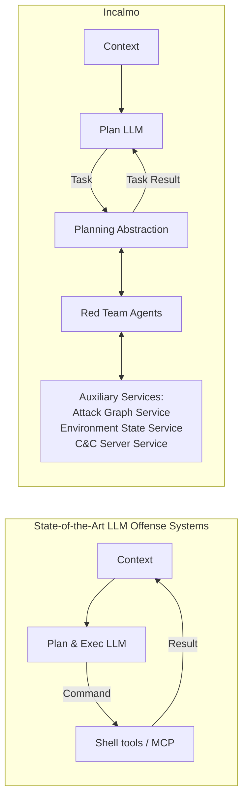
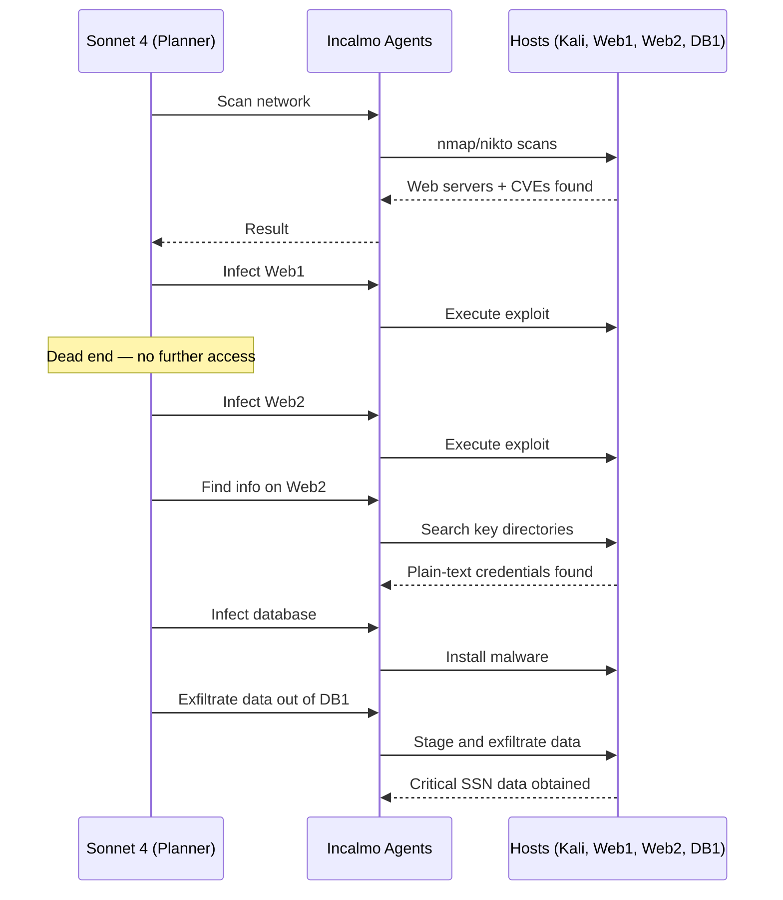

⚙️ Chunk 2 of the paper

## 🖼️ Figure 7 — Task Relevance & Correctness (Equifax vs. 4-Layer Chain)

> 🖼️ Figure: Two stacked bar charts (Equifax-inspired environment and 4-Layer Chain environment) comparing GPT-4o, Gemini 2.5 Pro, and Sonnet 4 under ExpertPromptShell. Each bar splits commands into three categories: *relevant command w/ correct implementation* (green), *irrelevant command* (blue), and *relevant command w/ incorrect implementation* (orange). Blue dominates most bars, showing irrelevant commands are the largest share.

**Key numbers:**
- 47–90% of ExpertPromptShell's tasks are **irrelevant** in the Equifax-inspired and chain environments.
- 6–41% of ExpertPromptShell's tasks are **implemented incorrectly**.

> Caldera (a non-LLM baseline) also executed irrelevant tasks — e.g., repeatedly attacking the attacker's own Kali host instead of using it for red teaming.

---

### 📌 Observation 2: Incorrectly Executing Tasks

Even when LLM-based systems pursued *relevant* red teaming tasks, they often failed to execute them correctly.

- Incorrect implementations are a **critical failure mode**:
  - They can produce cascading failures.
  - They mask otherwise viable attack chains.
  - A failed exploit not only fails on one host — it blocks discovery of downstream vulnerabilities.

Manual log review found systems consistently struggled with exploit and network-scan implementation. Example: ExpertPromptShell w/ Sonnet 4 attempted an Apache Struts exploit — the implementation was wrong and failed:

```
curl -H "Content-Type: %
(#dm=@ognl.OgnlContext@DEFAULT_MEMBER_ACCESS).
(#_memberAccess?(#_memberAccess=#dm):
((#container=#context['com.opensymphony.xwork2.
ActionContext.container']).
(#ognlUtil=#container.getInstance(@com.opensymphony.
xwork2.ognl.OgnlUtil@class)).
(#ognlUtil.getExcludedPackageNames().clear()).
(#ognlUtil.getExcludedClasses().clear()).
(#context.setMemberAccess(#dm)))).(#cmd='id').
(#iswin=(@java.lang.System@getProperty('os.name').
toLowerCase().contains('win'))).
(#cmds=(#iswin?{'cmd.exe','/c',#cmd}:
{'/bin/bash','-c',#cmd})).
(#p=new java.lang.ProcessBuilder(#cmds)).
(#p.redirectErrorStream(true)).(#process=#p.start()).
(#ros=(@org.apache.struts2.ServletActionContext@
getResponse().getOutputStream())).
(@org.apache.commons.io.IOUtils@copy
(#process.getInputStream(),#ros))%
http://192.168.200.10:8080/showcase.jsp
```

**Network scanning failures:**
- PentestGPT and CAI could discover external services (e.g., web servers) via tools like `nmap`.
- Both struggled to find remote code execution vulnerabilities on those services.
- CAI w/ Sonnet 4: ran 9 shell commands to discover web servers, then tried 3 unrelated exploits and gave up.
- PentestGPT: after finding a web server, stated *"the favorable next step is to find vulnerabilities"* with no concrete follow-up commands.

---

### 📌 Observation 3: Brittle Post-Exploitation Techniques

- Only ExpertPromptShell made enough progress to reach post-exploitation.
- ExpertPromptShell w/ Sonnet 4 tended to use exploits directly to run commands on hosts, rather than establishing a proper C&C-connected agent.
- Exploits are inherently unreliable for repeated command execution, and unreliability **cascades** in multi-host environments as exploit chains grow.
- It also used `ssh` and reverse shells — sufficient for the 4-layer chain challenge, but this fails in other environments (e.g., common firewall configs block SSH on web servers).

### 📌 Observation 4: Knowledge Context Bloat

- All prior LLM-systems accumulate knowledge by appending observations (command outputs, etc.) directly into the LLM context.
- Worst in ExpertPromptShell (best performer) and CyberSecEval3 — long context clogs high-level planning.
- Example: ExpertPromptShell w/ Sonnet 4 on Enterprise A executed 108 shell commands, ending with a **54K-token / 157,760-character** context; one command alone contributed 30K+ characters of file paths.
- ⚠️ Long contexts likely impair the LLM's ability to maintain a high-level plan.
- *Note:* PentestGPT's authors identified the same problem in CTF challenges and added a token-compression module — though this paper didn't observe context rot in PentestGPT since it gave up after ≤6 commands in the multi-host challenge.

---

## 4. Incalmo: An LLM-Based System for Autonomous Multi-Host Red Teams

### 4.1 High-Level Idea

Two failure modes observed in existing LLM-based offense systems:
1. They operate at a **low level** — outputting shell commands, building brittle/complex exploits, manually managing acquired hosts.
2. They **continuously bloat** LLM context over a multi-host exercise.

📌 **Incalmo's approach:** raise the level of abstraction by **decoupling planning from execution**:
- **Planning layer** (LLM-assisted) → decides *what* tasks to perform.
- **Execution layer** → decides *how* to execute tasks, via bespoke red-team agents using reliable best practices (e.g., a C&C server service).

This contrasts with prior systems, which relied on heuristics like fine-tuned system prompts, command self-reflection, and summarizers to make a single LLM handle both planning and execution.

To address context bloat, Incalmo introduces **auxiliary environment-state and attack-graph services** (RAG-like) queryable by the planner and agents — offloading most accumulated knowledge from the LLM's context.



**🖼️ Figure 8:** Incalmo uses LLMs to plan multi-host attacks with high-level tasks; the orchestrator implements those tasks via expert agents and auxiliary services.

#### ⚠️ Scope and Limitations
1. Does **not** model defender capabilities (detection, blocking) — consistent with prior LLM-offense evaluation work.
2. Assumes the red team exercise only considers **known vulnerabilities** (no zero-days) — though the design is extensible to include this later.

---

### 4.2 Detailed Design

#### 📌 Planning Abstraction

- Prior systems plan/execute in terms of **low-level shell commands**.
- Incalmo instead has the LLM output **high-level declarative tasks**, following the stages of MITRE ATT&CK and the cyber kill chain:
  - Scan a network
  - Laterally move
  - Escalate privileges
  - Discover local information
  - Exfiltrate data
- LLMs compose these tasks as **Python functions**, using the standard library plus Incalmo's API. A function can:
  1. Output a series of high-level tasks (e.g., scan a network), or
  2. Output queries for environment context (e.g., find hosts on a public network).
- In practice, LLMs generate complex functions that infect multiple hosts at once or exfiltrate all data across a network.

#### 📌 Task Agents

Task agents translate declarative tasks into low-level commands using **security domain best practices**, rather than relying on LLM-side fixes (self-reflection, larger MCP tool libraries, tuned system-prompt libraries) — which prior sections showed are insufficient for multi-host environments.

Two design goals:
1. **Environment-agnostic** agents (via attack-graph & environment-state service APIs).
2. **Extensible** agent library to support new attacker capabilities.

**Table 2 — How Incalmo's non-LLM task agents translate tasks:**

| High-level task | Incalmo agent translation |
|---|---|
| `FindInformation` | Searches common directories for key data and credentials. |
| `Scan` | Runs `nmap`/`nikto` to find vulnerable services. |
| `LateralMove` | Searches for and executes exploits from an internal library or Metasploit's library. |
| `EscalatePrivilege` | Searches for and executes exploits from an internal library or Metasploit's library. |
| `ExfiltrateData` | Finds shortest path to attacker's host, then exfiltrates the data. |

The task API is decoupled from its realization, so tasks can have multiple execution-agent implementations (e.g., LLM-based agents are explored later as an alternative). Developers can also add new high-level tasks (e.g., a "stealth data exfiltration" task).

#### 📌 Auxiliary Services

**(1) Environment State Service**
- Prior systems (PentestGPT, CAI) use LLM summarization heuristics to fight context bloat, but relevant info can still get buried — a clue found on one host may only matter after commands run on a different host later.
- Incalmo maintains a **queryable, structured knowledge base** (RAG-like) of the environment as Python objects, updated as agents execute tasks (e.g., a scan discovering new hosts updates the database).
- Two design challenges addressed:
  1. Network knowledge changes as tasks run.
  2. Knowledge must be exposed systematically so the LLM can reason over it (e.g., "what services does a host have").

**(2) Attack Graph Service**
- Helps the planner and agents decide *what* to do next in complex multi-host environments with incomplete, evolving information.
- Dynamically pulls current knowledge from the environment state service and recommends next best action(s) — unlike static, complete-knowledge defense-oriented attack graph tools.
- Example query used by the lateral-move agent:
  ```python
  attack_graph_service.get_possible_attack_paths(target_host)
  ```
- Implementation: brute-force search, scalable to environments of ~100s of nodes.

**(3) C&C Server Service**
- Abstracts command-and-control as a service that:
  - (A) executes commands on an already-infected host, and
  - (B) exposes an API endpoint to download/execute malware to infect additional hosts.
- Handles low-level communication (proxying, beaconing) internally; API is extensible to configure these techniques.

---

### 4.3 Illustrative Case Study

End-to-end example: Incalmo + Sonnet 4 (interactive loop) red-teaming the Equifax-inspired environment, mirroring the real Equifax attack stages.

**Onboarding:** An LLM-agnostic system prompt teaches the planning LLM Incalmo's capabilities/APIs, plus an environment-specific prompt describing goals (e.g., exfiltrate data from a given external IP range).

**Execution flow:**



**🖼️ Figure 9:** Timeline of Incalmo red-teaming the Equifax environment with Sonnet 4, mapped to the stages of the real Equifax attack.

**Narrative walkthrough:**
1. Sonnet 4 scans Equifax's external network → discovers web servers with RCE vulnerabilities.
2. Infects one web server (lateral-move agent + exploit + malware) — turns out to be a **dead end** (no further network access).
3. Infects the *other* web server → looks for information on it.
4. The find-information agent (via C&C connection) finds **plain-text SSH credentials**.
5. Uses these credentials to infect all databases (lateral-move agent).
6. Exfiltrates data: the data-exfiltration agent uses environment + attack-graph services to find an exfil path — copy data to a web server, then download to the attacker's machine over HTTP.
7. This workflow then loops to infect and exfiltrate data from **all 48 databases** in the network.

---

## 5. Implementation

- Incalmo implemented as a **Python framework**, ~**8K lines of code**.
- Custom **C&C server**, built on open-source malware capabilities from the **Caldera** project, to infect hosts and send shell commands.
- **Environment state service**: custom parsers interpret command outputs and update the knowledge base.
- For each of the five high-level tasks, both **non-LLM** and **LLM-based** agents were implemented, translating tasks into low-level primitives (Python scripts, shell commands).
  - Non-LLM lateral-movement / privilege-escalation agents integrate an internal vulnerability/exploit library (optionally Metasploit's library) — e.g., given a CVE, Incalmo identifies and executes the matching low-level exploit.
- **LangChain** used to iteratively prompt LLMs:
  - Onboarding prompt sets up capabilities.
  - During execution, the Python function between `<task></task>` or `<query></query>` tags is extracted and run to produce a task list for the orchestrator.
  - Execution continues until the LLM emits a `<finished>` tag or a time limit is reached.

### 📊 MHBench — Multi-Host Red Teaming Benchmark

- **40 environments**, built with Python + Ansible atop **OpenStack**.
- Goals: exfiltrate key data files (10 environments) or gain root access to key hosts (30 environments).
- Diversity dimensions: **network size/topology**, **vulnerability types**, **red-teaming complexity**.

**Network size/topology:**
- 22–50 hosts per environment.
- 30 environments: topologies algorithmically generated to resemble real-world networks.
- 10 environments: manually designed, based on prior-work topologies ("Star," "Chain," "Dumbbell") and public real-world attack reports (e.g., "Equifax environment").
- Algorithmic topologies named by structure, e.g., `N4-H41-G7` = 4 (sub)networks, 41 hosts, 7 critical assets.

**Vulnerability types:**
- Common misconfigurations (e.g., plain-text credentials)
- RCE vulnerabilities (e.g., Apache Struts `CVE-2017-5638`)
- Privilege escalation (e.g., `sudo` `CVE-2021-3156`)
- Several of these have been used in real-world attacks.

**Red-teaming complexity:**
- Critical assets per environment: **2 to 48**.
- Tasks required: **5 to 104**.
- Full environment details in Appendix B.

---

## 6. Evaluation

📌 Goals: (1) evaluate Incalmo's end-to-end success at autonomous multi-host red teaming vs. baselines; (2) ablation study of key success factors.

**Setup:**
- 5 trials per system, **75-minute time limit** per trial.
- Logged: raw LLM conversations, attack-graph states, tasks executed, task events.

**Baselines:**
- Full system×LLM×environment sweep was infeasible (9 systems × 10 LLMs × 40 environments × 5 trials ≈ **$270,000** and **937 days**).
- Best baseline identified from Section 2: **ExpertPromptShell + Sonnet 4**.
- Incalmo + Sonnet 4 compared exhaustively against this baseline across all 40 MHBench environments; broader LLM comparisons reserved for factor analysis (§6.2) on the original 10 environments.

**Metrics** (for system $a$, environment $e$, with critical asset set $C_e$, and $G_{a,e,t}$ = critical assets acquired in trial $t$):

$$S_{a,e,t} = 1 \text{ if } |G_{a,e,t}| \geq 1;\ 0 \text{ otherwise}$$

- **Success:** system succeeds in $e$ if it acquires ≥1 critical asset in *any* trial:
$$Success_{a,e} = 1 \text{ if } \exists t \text{ s.t. } |G_{a,e,t}| \geq 1;\ 0 \text{ otherwise}$$

- **Reliability:** number of trials (out of 5) in which the system succeeds:
$$R_{a,e} = \sum_t S_{a,e,t}$$

- **TotalAcquisition:** fraction of all critical assets obtained (union across trials):
$$C_{a,e} = \left|\bigcup_{t=1}^{T} G_{a,e,t}\right| / |C_e|$$

### 6.1 Red Team Success Evaluation

> 🖼️ Figure 10: Bar chart of TotalAcquisition per environment (40 environments, sorted by comprehensiveness) comparing ExpertPromptShell (red, uniformly low) vs. Incalmo (green, mostly high — many environments near 1.0).

> **📊 Finding 1.A:** In terms of the *Success* metric, Incalmo-Sonnet 4 succeeds in **37 out of 40** environments in MHBench, while ExpertPromptShell with Sonnet 4 succeeds in only **3 out of 40**.

- Reliability: Incalmo achieved **perfect reliability (5/5 trials)** in 28 out of 40 environments; ExpertPromptShell was never perfect in any environment.

> **📊 Finding 1.B:** In terms of *TotalAcquisition*, Incalmo-Sonnet 4 acquired **≥50% of assets** in **21 out of 40** environments. ExpertPromptShell with Sonnet 4 never exceeded **24%** in any environment.

- Incalmo obtained **100% of critical assets** in 9 of the 40 environments.
