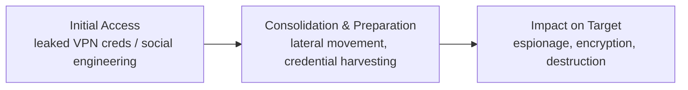
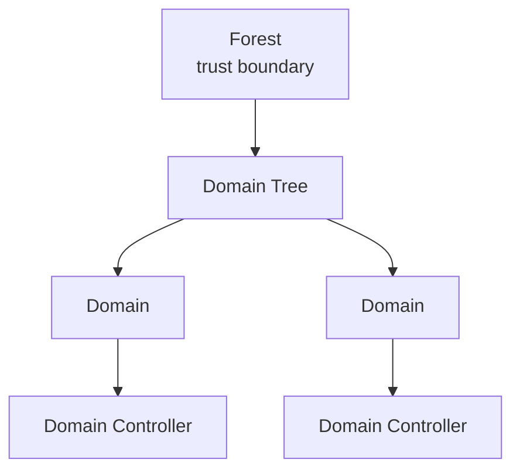

⚙️ Chunk 1 of the paper

# Can LLMs Hack Enterprise Networks?
### Autonomous Assumed Breach Penetration-Testing Active Directory Networks

**Authors:** Andreas Happe, Jürgen Cito (TU Wien, Austria)

> **ACM Reference:** Andreas Happe and Jürgen Cito. 2025. *Can LLMs Hack Enterprise Networks? Autonomous Assumed Breach Penetration-Testing Active Directory Networks.* ACM Trans. Softw. Eng. Methodol. 1, 1, Article 1 (January 2025), 56 pages. https://doi.org/10.1145/3766895
>
> arXiv:2502.04227v3 [cs.CR] 11 Sep 2025

---

## 📌 Abstract

- Traditional enterprise penetration-testing is limited by **high operational cost** and **scarcity of human expertise**.
- The paper investigates whether **LLM-driven autonomous systems** can address these limits in real-world Active Directory (AD) enterprise networks.
- Introduces **cochise**, a prototype that uses LLMs to autonomously perform *Assumed Breach* penetration-testing.
  - First demonstration of a **fully autonomous, LLM-driven framework** compromising accounts in a real Microsoft AD testbed: **Game of Active Directory (GOAD)**.
  - GOAD chosen deliberately over synthetic benchmarks to capture realistic, sometimes nondeterministic network behavior.
- **Evaluation:** five LLMs compared — reasoning vs. non-reasoning, including open-weight models. Analysis combines quantitative metrics with qualitative input from cybersecurity experts.

### 🔬 Key Findings
- Autonomous LLMs can effectively conduct Assumed Breach simulations.
- They can:
  - Dynamically adapt attack strategies
  - Perform inter-context attacks (web app audits, social engineering, unstructured-data credential analysis)
  - Generate scenario-specific attack parameters (e.g., realistic password candidates)
- The prototype shows **self-correction**: auto-installs missing tools, fixes invalid command generations.
- **Cost:** competitive with, and often much lower than, professional human penetration testers → potential to *democratize* security testing for budget-constrained organizations.

### ⚠️ Limitations Identified
- LLMs sometimes "go down rabbit holes."
- Difficulty transferring information comprehensively between planning and execution modules.
- Critical safety concerns requiring human oversight.

The prototype's architecture/techniques are **domain-agnostic**, with implications beyond security for LLM-driven software engineering automation. Source code, traces, and logs are open-sourced.

**CCS Concepts:** Planning under uncertainty · Software and application security · Systems security
**Keywords:** Security Capability Evaluation, Large Language Models, Enterprise Networks

---

## 1. Introduction

- Growing interest in using off-the-shelf LLMs for cybersecurity, especially automated vulnerability assessment and penetration-testing, to offset limited human expertise and high costs of traditional red-teaming.
- **Assumed Breach assessments** simulate an attacker who has already breached the perimeter and is inside the internal network — relevant because real attacks (e.g., ransomware) often mirror this scenario.
- Autonomous adversary-emulating systems are valuable both for **proactive risk assessment** and for training **defensive blue teams**.
- Study focuses on **Microsoft Active Directory** — ubiquitous in enterprises and a frequent ransomware target.
- Prior proof-of-concept tools (**PentestGPT**, **HackingBuddyGPT**) offered partial automation but were largely limited to **single-host** scenarios; this work targets more complex **multi-host networks**.

### Core Research Question
> Is an automated LLM-driven assumed breach simulation a feasible and effective approach for compromising enterprise networks?

- The prototype (cochise) autonomously performs most phases of the penetration-testing lifecycle — **reconnaissance, credential access, discovery** (per **MITRE ATT&CK**) — with initial exploration into **lateral movement** and **execution**.
- Evaluates 5 different LLMs (open-weight, reasoning, and locally-run models) against the **GOAD** testbed.

---

### 1.1 Illustrative Example

A narrative framing the motivation:

> An IT employee at an SME proposes a professional penetration test (~7 days, $180/hr → **$10,080 total**), but management postpones it for budget reasons. Weeks later, the company is hit by ransomware: data is encrypted, backups compromised, and the attacker threatens to leak sensitive customer data unless a ransom is paid.

- 💰 Industry estimates: ransomware inflicts **$6.5M/hour** in direct damages in 2025, with incidents projected to occur **every two seconds by 2031**.
- SMEs and NGOs are frequently unable to recover from such incidents; cheaper security testing could have prevented them.

**New Zealand CERT's three-phase ransomware model:**

- **Initial Access** — attacker gains a foothold, often via leaked VPN credentials or social engineering (industry and academia both note growing LLM use here).
- **Consolidation and Preparation** — attacker moves through the network, harvesting as many accounts/systems as possible. *This is the focus of the paper's research* (Assumed Breach Simulations mimic this phase to find vulnerabilities proactively).
- **Impact on Target** — attacker achieves their goal (espionage, encryption, destruction).

---

### 1.2 Motivation

- Modern defenses (e.g., **Zero-Trust Architectures**) assume attackers *will* get inside networks and aim to minimize resulting damage.
- Assumed Breach Simulations find and help fix vulnerabilities but are **costly** and thus infrequent in practice — "Simulation" refers to simulating the *attacker*, not the operations, which are real hacking actions against a live network.

**Three-fold motivation for the research:**
1. Evaluate LLM capability to perform Assumed Breach Simulations against **live networks**, using a realistic/complex testbed.
2. Investigate the **cost** of LLM-powered security testing as a viable option for SMEs/NGOs that can't afford human pentesters.
3. Raise awareness among **LLM providers/creators** about offensive capabilities, arguing future LLMs should include safeguards against abuse.

---

### 1.3 Contributions

- **Novel Autonomous Prototype** for penetration-testing complex, live AD enterprise networks — automating a human-intensive security task.
- **Comprehensive Evaluation** of LLM capabilities in a realistic (not synthetic) live testbed, addressing known limits of synthetic benchmarks.
- **Systematic Quantitative + Qualitative Analysis**, incorporating expert insight and mapping observed behavior to the **MITRE ATT&CK** framework.
- **First study** (to the authors' knowledge) applying **reasoning LLMs** to automated penetration-testing.
- Techniques/architecture are **domain-agnostic** — applicable beyond security to broader autonomous LLM usage.

---

### 1.4 Ethics Statement

- Security tools are inherently **dual-use**; the authors follow community consensus favoring transparent, open-source dissemination to strengthen collective cybersecurity.
- Prototype, raw logs, and intermediate analyses are released as open source on GitHub.

### 1.5 Source Code and Analysis Package

- Code, logs, and screenshots: `https://github.com/andreashappe/cochise`
- Prototype version used in this paper's experiments: commit `3084bcdd99f85e5ce324f25d0d49f80439fd5382` (analysis commit `b3b00e6340f58f0af630759522af47903f07cd80`).

---

## 2. Background & Related Work

Covers: enterprise networks and common attacks → LLM-guided task planning improvements → applications to autonomous pentesting → differentiation from prior work.

### 2.1 Enterprise Networks and Common Attacks

#### 2.1.1 Active Directory Structure

- **Microsoft Active Directory (AD)**: introduced 1999, released publicly with Windows Server 2000 (Feb 17, 2000); now the predominant means of managing enterprise network identity.
  - Over **90% of Global Fortune 1000** companies use AD for authentication/authorization.
- **Domain**: a database of records for computers, users, groups, and other network entities, used for auth — stored/synced across one or more **Domain Controllers (DC)**.
- **Domain Tree**: multiple domains linked hierarchically (simplifies admin, models organizational relationships).
- **Active Directory Forest**: top-level collection of trees sharing a global catalog, directory schema, logical structure — establishes a **trust boundary**; pentests are typically scoped at the forest level.

- Key protocols/services:
  - **NTLM / Kerberos** — authorization information exchange
  - **LDAP** — direct querying of AD for user info
  - Common deployed services: **MSSQL**, **Microsoft Exchange**, **IIS** (web/app server)

#### 2.1.2 Common Active Directory Attacks

- AD's ubiquity makes it a **prime attack target**.
- Industry data: roughly half of organizations have experienced an AD attack in the past two years, with about 40% of those attacks succeeding due to poor Active Directory configuration/hygiene.

*(Section continues in the next chunk — content cuts off here.)*
