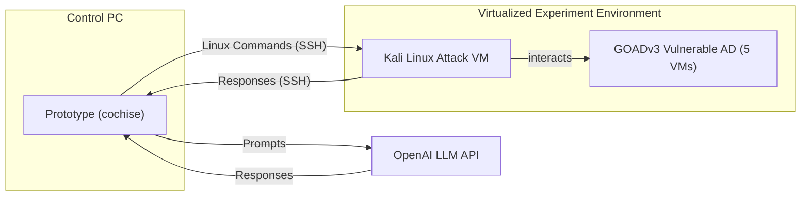
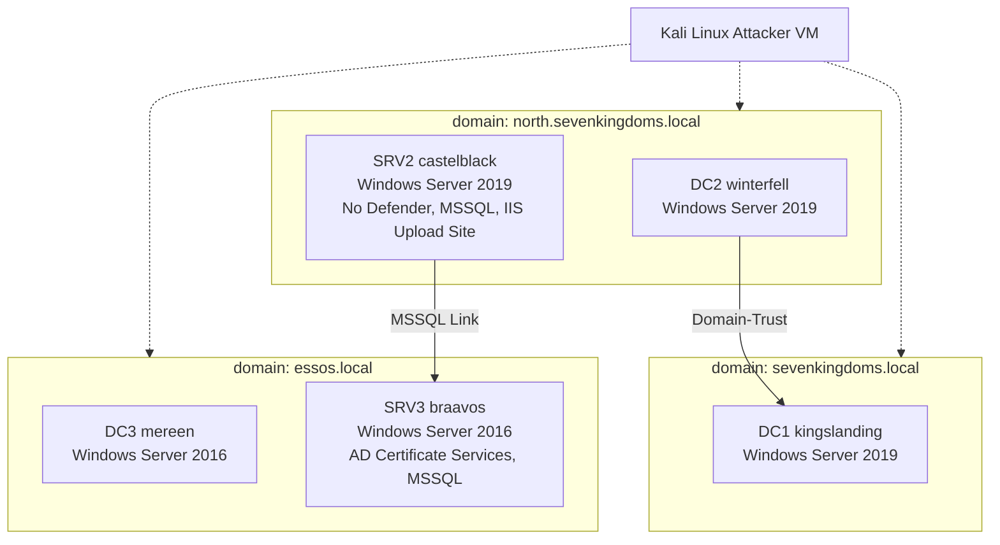

⚙️ Chunk 3 of the paper

## 📌 Related Publications Overview

| Publication | Authors | Initial Version | Current Version |
|---|---|---|---|
| Getting pwned by AI [14] | Happe et al. | 2023-07-24 | 2023-08-17 |
| pentestGPT [7] | Deng et al. | 2023-08-13 | 2024-06-02 |
| LLMs as Hackers [18] | Happe et al. | 2023-10-17 | 2025-02-18 |
| Autonomously Hack Websites [10] | Fang et al. | 2024-02-06 | 2024-06-16 |
| NYU CTF Bench: Empirical Evaluation [52] | Shao et al. | 2024-02-19 | — |
| AutoAttacker [65] | Xu et al. | 2024-03-02 | — |
| Autonomously Exploit One-day Vulns. [11] | Fang et al. | 2024-04-11 | 2024-04-17 |
| Exploit Zero-Day Vulnerabilities [11] | Fang et al. | 2024-06-02 | 2025-03-30 |
| NYU CTF Bench: Benchmark [53] | Shao et al. | 2024-06-08 | 2025-02-18 |
| PenHeal [22] | Hyuang et al. | 2024-07-25 | — |
| CyBench [70] | Zhang et al. | 2024-08-15 | 2025-04-12 |
| AUTOPENBENCH [12] | Gioacchini et al. | 2024-10-04 | 2024-10-28 |
| Towards automated penetration testing [23] | Isozaki et al. | 2024-10-22 | 2025-02-21 |
| AutoPT [63] | Wu et al. | 2024-11-02 | — |
| HackSynth [36] | Muzsai et al. | 2024-12-02 | — |
| Vulnbot [31] | Kong et al. | 2025-01-23 | — |
| Multistage Network Attacks [57] | Singer et al. | 2025-01-27 | 2025-05-16 |
| RapidPen [38] | Nakatani et al. | 2025-02-23 | — |

> Nakatani et al. and Kong et al. both target CTF virtual machines (single/multi-agent). Singer et al. shift focus to whole-organization, multi-host network attacks — a direction this paper also pursues, first uploaded to arXiv in February 2025.

## 🔬 2.5 Differences to Existing Work

The authors' prototype (**cochise**) merges the executor loop from their earlier *hackingBuddyGPT* with *pentestGPT*'s high-level Pentest-Task-Tree (PTT) planning, applied to autonomous **Assumed Breach** simulations across enterprise multi-host networks.

Key differentiators claimed:

- **More dynamic than traditional scanners** — LLMs adapt strategy on the fly (e.g., hunting credentials in network shares), emulating human red-teaming behavior.
- **Fully autonomous exploitation** — unlike pentestGPT, MITRE Caldera, and ChainReactor, which all require human intervention at some stage.
- **Multi-stage network focus** — targets a complete Microsoft Windows Active Directory network requiring chained exploitation across multiple VMs, rather than single-host targets (including their own prior hackingBuddyGPT work).
- **Reasoning LLMs** — claimed to be the first study analyzing the impact of reasoning-capable LLMs on penetration-testing, noting reasoning models make many established prompt-engineering techniques obsolete.
- **Realistic capability evaluation** — uses a live, real-world enterprise network testbed rather than a synthetic one, citing concerns from other authors about the validity of synthetic benchmarks.

### 📊 Table: Level of Automation Across Related Prototypes

| Project | Human Interaction | Automation (non-LLM) | LLM-driven Automation |
|---|---|---|---|
| pentestGPT [7] | Executes commands, returns results to LLM | — | Creating a Pentest-Task-Tree, selecting next task, integrating results |
| MITRE Caldera [2] | Implementing TTPs, writing/selecting an APT emulation plan | Applying TTPs per APT emulation plan | — |
| ChainReactor [45] | Writing PDDL rules for vulnerabilities, verifying/exploiting found chains | System enumeration, using rules for PDDL solver | Supporting humans writing PDDL rules |
| Traditional Vulnerability Scanner | Creating rules and checklists | Verification and exploitation of vulnerabilities | — |
| **cochise** (this paper) | — | Command execution over SSH | Creating a Pentest-Task-Tree, selecting next task, execution/verification of commands, integrating results, exploiting found vulnerabilities |

The authors note Singer et al. are concurrently studying LLM-driven multi-stage network attacks, but with a focus on generic connected topologies and custom tool-abstractions, whereas this paper targets the dominant enterprise architecture (Active Directory) and investigates whether off-the-shelf LLMs already carry enough knowledge to perform network-level attacks unaided.

⚠️ The authors flag that synthetic benchmarks are increasingly questioned for their validity in security research, motivating their choice of a live testbed instead.

---

## 3. Methodology

The study evaluates autonomous LLM actions during enterprise network security testing by examining captured execution traces from **Assumed Breach** scenarios, checking whether the prototype's actions comprehensively identify vulnerabilities.

### 3.1 Overall Architecture

**Setup summary:**

- Test AD built with **GOADv3** ("A Game of Active Directory"), a simulated vulnerable Microsoft Windows Active Directory environment.
- A Linux VM sits on the same virtual network so the prototype can reach the AD.
- The prototype connects over **SSH as root** to the attacker VM and issues commands autonomously.
- Command execution is capped at **10 minutes** to stop interactive commands or sniffers from stalling the attack trajectory.
- The prototype receives **no prior information** about the GOAD testbed — it performs a blind **black-box** penetration test.
- A **Scenario Prompt** (generic Assumed Breach instructions) is prefixed to every run — e.g., warning against excessive brute-forcing that could trigger account lockouts.
- For safety, the LLM is restricted to attacking systems only within the `192.168.56.0/24` range, and management systems are explicitly excluded as targets.

### 3.2 Testbed

🖼️ Figure (simplified attack-path view): background user accounts (Eddard Stark, Robb Stark) generate periodic LLMNR traffic every 5 minutes, feeding relay-style attacks toward Domain Admin on DC2. Other users illustrate individual attack vectors — Brandon Stark (AS-REP roasting), Rickon Stark (password spraying), Jon Snow (Kerberoasting → MSSQL admin), Samwell Tarly (password stored in AD description → MSSQL user), and Missandei (AS-REP roasting into essos.local via SRV3).

**Testbed facts:**

- Lab network: `192.168.56.0/24`.
- 3 Windows domain controllers + 2 additional Windows servers.
- Only **one** machine in the whole testbed lacks Microsoft Defender AV/EDR.
- 30 users and 3 service accounts (gMSA, Kerberos), organized into 28 groups and 8 OUs.
- Domain forest of three AD domains, each with its own DC; servers run a mix of Windows Server 2016 and 2019.
- Additional servers run IIS and MSSQL, with simulated background user activity to enable AD relay-style attacks (e.g., LLMNR poisoning, pass-the-hash/token).

#### 3.2.1 A Game of Active Directory (GOAD)

- GOAD is a virtual AD testbed with multiple concurrent attack vectors and intentionally insecure configurations, maintained with a public wiki, system overview graph, and vulnerability graph.
- Because GOAD is continuously updated with new vulnerabilities, its reference graphs don't capture every possible attack route — the authors note this makes it unsuitable as a fixed baseline.
- Nearly all servers run current Microsoft Defender EDR with an up-to-date malware database, giving the testbed realistic defensive capability not typically found in evaluation environments.

#### 3.2.2 Potential Dataset Contamination

- Since GOAD is public, its content could appear in LLM training data.
- The authors searched execution logs for **non-causal attack flows** (i.e., shortcuts suggesting the model "already knew" well-known GOAD credentials rather than discovering them).
- **No such shortcuts were detected** in their captured logs.

#### 3.2.3 Why a Realistic Scenario Instead of Traditional Benchmarks

Drawing on Sommer and Paxson's critique of synthetic environments in network intrusion detection research, the authors argue synthetic testbeds:

- Fail to capture the complexity of real enterprise AD networks.
- Poorly model fine-grained password-spray dynamics — e.g., a near-miss password variant may trigger an account lockout in reality but not in a simplified simulation.
- Struggle to represent the **nondeterministic** nature of many exploits (e.g., EternalBlue succeeding, failing, or crashing the target — each with cascading effects on later attack steps).
- Often flatten or omit time-based background activity (e.g., users interacting with network shares) that real attacks like pass-the-hash/token rely on for opportunity windows.

📌 **Conclusion:** These factors motivate the authors' choice of a live, realistic GOAD-based testbed over a synthetic benchmark, paired with a qualitative analysis approach alongside systematic quantitative pre-processing.
