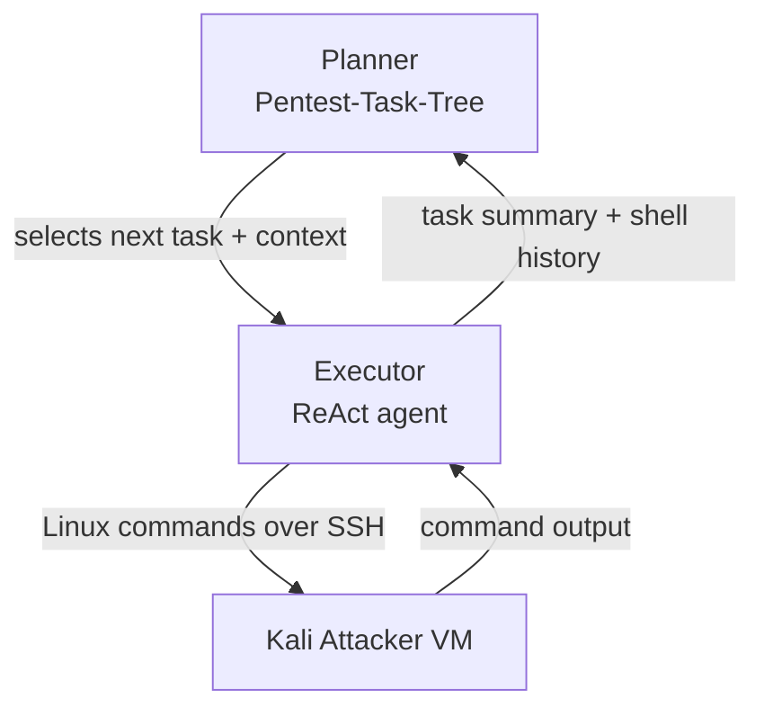

⚙️ Chunk 4 of the paper

### 3.2.4 Attacker's Virtual Machine: Kali Linux

The prototype executes commands on a Kali Linux virtual machine connected to the target network. All penetration-testing commands used are listed in the appendix (Section D) with short descriptions.

**Generic reconfiguration** (not scenario-specific):
- SSH server configured to accept root logins
- Max parallel SSH connections increased to 100 (enables parallel command execution)
- X11/Wayland uninstalled — the SSH integration cannot handle GUI applications

**Scenario-specific changes:**
- AD DNS server configured in `/etc/resolv.conf`
- Backup IP-to-hostname mappings added to `/etc/hosts`
- An initial user list (simulating OSINT results) was provided to the VM — inspired by a Goad walkthrough that generated a similar list by querying IMDB. Usable for AS-REP roasting or password spraying.

### 3.2.5 Scenario Prompt

A constant scenario prompt (see Appendix A.1) prefixes all prompts sent to the LLM.

> 📌 **Key framing:** the LLM is told it's a professional penetration tester attacking a Microsoft AD Enterprise network, and should apply established methodologies like the **Lockheed-Martin Cyber Kill Chain** or the **Mandiant Attacker Lifecycle**.

Constraints and guidance included in the prompt:
- Target IP range and disallowed management IPs, to keep attacks inside the test environment
- No graphical/interactive programs (SSH integration limitation)
- No online brute-force attacks — pushes the exercise toward an assumed-breach/red-team scenario
- OSINT-gathered usernames provided; offline password cracking with `rockyou.txt` is allowed
  - ⚠️ Rationale: real attackers avoid online brute-forcing since it's easily detected and causes lockouts, while offline cracking is undetectable — mirrors guidance used in certification exams
- Tool-specific guidance to avoid common invocation errors, not tied to vulnerabilities themselves:
  - Use `nxc` (netexec) instead of `cme` (crackmapexec) — cme is unstable, nxc is the actively maintained replacement
  - `nmap` and `nxc` accept multiple users/IPs separated by spaces, not commas
  - Impacket suite tools are renamed with an `impacket-` prefix on Kali
  - **OpenVAS explicitly disallowed** — during preliminary testing the LLM installed OpenVAS + PostgreSQL and triggered a vulnerability database update that can take up to six hours

### 3.3 LLM Selection

Selection process aligned with best practices for evaluating LLMs in offensive security settings.

#### 3.3.1 LLM Requirements
- **Planner** uses Structured Output for easy extraction of multiple answers per interaction
- **Executor** uses function-/tool-calling to run Linux commands on the attacker VM
- Built with the **LangChain** library
- Minimum requirements: function-calling + structured-output support, and a **≥64k context window** (to accumulate target-network information over time)

#### 3.3.2 Five LLM Configurations Evaluated

| Role | Model(s) | Notes |
|---|---|---|
| Baseline non-reasoning (closed-weight) | GPT-4o (`gpt-4o-2024-08-06`, temp=0) | |
| Baseline non-reasoning (open-weight) | DeepSeek-V3 (temp=0) | Enables closed vs. open-weight comparison |
| Integrated reasoning | Gemini-2.5-Flash (Preview, temp=0) | |
| Split Planner/Executor | o1-preview (`o1-preview-2024-12-17`) for Planner + GPT-4o (temp=0) for Executor | High-level reasoning paired with a lighter executor |
| Small World Model (edge-deployable, open-weight, reasoning) | Qwen3 | |

> ⚠️ **Limitation:** Llama3.3:70b, Llama4:scout, gemma3, and devstral were also tried but did not perform well with LangChain's tool-calling despite their model cards — excluded from the final selection.

**Qwen3 hosting:** rented via LambdaLabs — single NVIDIA A100 (40GB VRAM), 30 vCPUs, 200GB RAM, Ubuntu 22.03.5 LTS, NVIDIA driver 570.124.06, Ollama v0.9.0.

📌 The selection deliberately mixes closed-weight cloud models, open-weight/open-source models, and a small edge-deployable model, while keeping OpenAI's models as a stable reference point since newer LLMs are commonly benchmarked against them.

### 3.4 Experiment Design

- Experiments run **until saturation**: two consecutive samples of the same configuration yielding no new leads or compromised accounts
- Each run **time-capped at 2 hours**
- The o1 + GPT-4o combination needed the most runs to reach saturation (**n = 6**); all other configurations were run to match this maximum
- 🔬 Low overall sample counts needed suggest that although individual runs differ in action sequence, results tend to converge

### 3.5 Data Collection and Analysis

The Planner autonomously selects high-level tasks and delegates them to the Executor, which runs a cohesive command set per task. All Planner decisions, LLM prompts/answers, and Executor traces (timestamped commands, outputs, side effects) are logged in JSON for both quantitative metrics and qualitative expert analysis, following reproducible-research practices. Every sample undergoes both quantitative and qualitative analysis, using triangulation to strengthen construct validity and reduce bias.

#### 3.5.1 Quantitative Analysis

Metrics captured:
- **Performance:** number of Planner strategy rounds, Executor rounds per task, and SSH commands executed
- **Cost:** input/output/reasoning/cached tokens per LLM call, converted to cost via:

$$cost = input\_tokens \times input\_token\_price - cached\_input\_tokens \times caching\_reduction + output\_tokens \times output\_token\_price + reasoning\_tokens \times reasoning\_token\_price$$

  - Self-hosted models (LambdaLabs VMs) costed by actual run duration × rental rate
- **Human-judged outcomes**, scored by professional penetration testers against strict criteria:
  - **Compromised Accounts** — only counted when plaintext credentials were extracted, or Kerberos tickets/NTLM hashes were successfully exploited (Pass-the-Hash style). Testers were given a reference list of known test accounts/credentials to remove bias.
  - **Almost-there attacks** — near-misses caused by minor errors (e.g., using `Winter2020!` instead of the valid `Winter2020`); full list in Appendix C
  - **Leads** — findings the LLM noted in its strategy but never acted on during the run
- **MITRE ATT&CK classification** of high-level tasks, done by the human testers
- **Command quality issues**, flagged by human testers:
  - Invalid commands (not available on the Kali VM)
  - Invalid/missing parameters (fail with an error)
  - Malformed-but-accepted parameters (e.g., invalid SMB shares or subcommands) that fail only during execution, not at invocation

#### 3.5.2 Qualitative Analysis

- Expert-driven, drawing on **grounded theory** and **heuristic evaluation**
- Three cybersecurity experts (7, 13, and 14 years of pentesting experience) reviewed execution traces to spot anomalies, missed opportunities, and contextual insights
- **Thematic Analysis** applied to expert notes, logs, and command outputs to surface recurring themes (e.g., missed attack opportunities, unexpected behavior)

### 3.6 Threats to Validity

| Threat | Category | Mitigation |
|---|---|---|
| Definition ambiguity around "compromised entities" / "leads" | Construct validity | Clear operational definitions; use of MITRE ATT&CK |
| Expert subjectivity in thematic coding | Internal validity | Consensus discussions among multiple experts |
| Logging/measurement inaccuracies | Internal validity | Rigorous logging practices; periodic validation |
| Opaque LLM behavior limiting generalizability | External validity | Chose "gold standard" models (GPT-4o, o1 series) commonly used as benchmarks by newer models |
| Controlled test environment vs. real dynamic enterprise networks | External validity | Used an industry-standard training environment with real-world systems |
| Replicability of thematic coding | Reliability | Detailed documentation of coding process; adherence to established guidelines |

### 4 Prototype Architecture

Two high-level, LLM-driven components:

#### 4.1 The Planner

- Maintains and updates a **Pentest-Task-Tree (PTT)** — the overall pentest plan
- Each strategy round runs an **update-plan** prompt, taking as input: the existing PTT, the Executor's summary of the last task, and the full shell history (commands + outputs) from that task
- The updated PTT feeds a **select-next-task** prompt, which picks the next task and its required context (e.g., credentials) — tasks are designed to be self-sufficient
- On the first round, the PTT is empty and the Planner creates an initial plan (example in Figure 5; a 10-round-later excerpt in Figure 6, full state in Appendix B.2)

🖼️ Figure 4: Diagram of the prototype's two-component architecture (Planner + Executor) — represented above as a Mermaid flowchart.
🖼️ Figure 5: Example of the Planner's initial (empty) Pentest-Task-Tree state.
🖼️ Figure 6: Excerpt of the Pentest-Task-Tree after 10 update-strategy rounds.

#### 4.2 The Executor

- Implements a **ReAct agent pattern**
- Receives a task + context from the Planner and begins a command execution round
- Generates a Linux command via LLM, executes it on the attacker VM, and feeds the result back into its history
- Loops: generates the next command, or declares the task complete
- **Command timeout: 10 minutes** — chosen because Goad's periodic activities (e.g., network sniffing) typically recur every 5 minutes, so a sniffing task can capture relevant traffic before timing out. On timeout, partial output plus a timeout flag are passed back to continue the round.
- Can issue **multiple commands in parallel** within a single round (e.g., parallel network scans) to speed up common tasks

🖼️ Figure 7: Example Executor task with its accompanying context (task 1).
🖼️ Figure 8: Example Executor task with its accompanying context (task 2).
