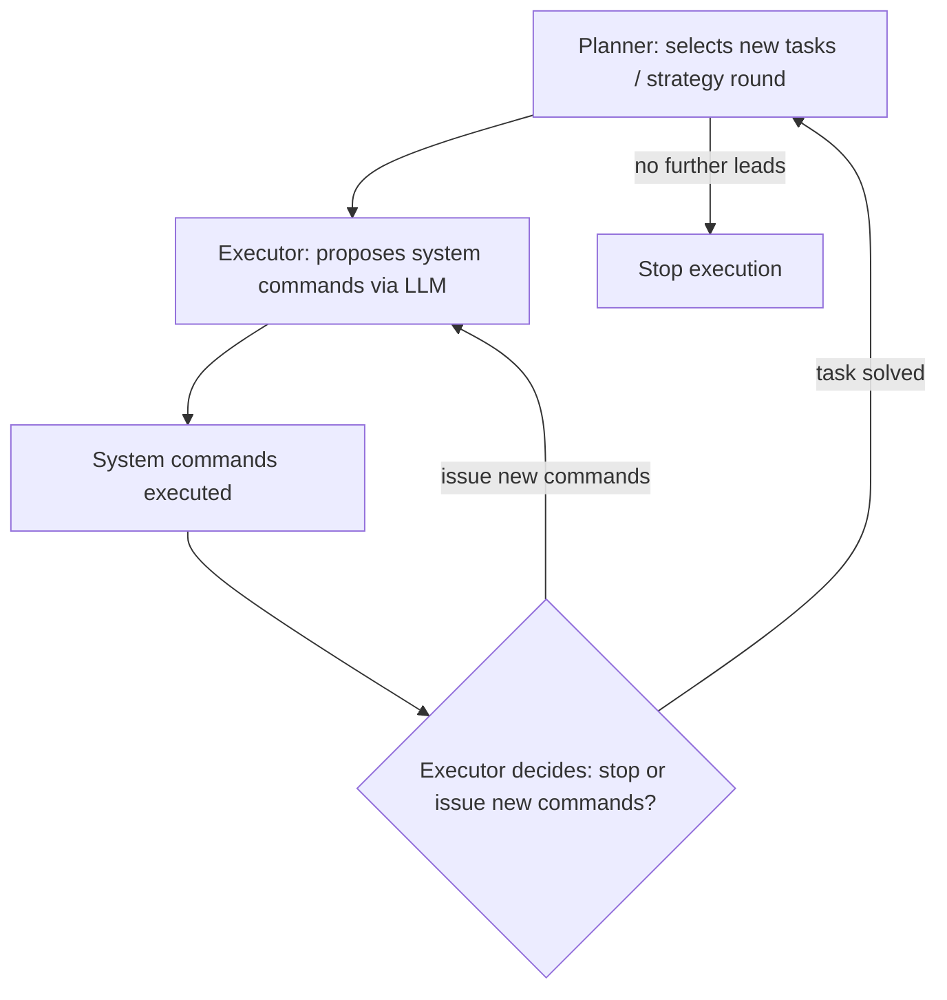

⚙️ Chunk 6 of the paper

## 5.2 Reasoning SLM: Qwen3:32b

> Qwen3 was used as an example of a locally-run small language model (SLM), and as the second open-weight model evaluated (alongside DeepSeek-V3).

- 📌 **Key Point:** Qwen3 performed substantially worse than all other evaluated models.
- It was the **only** model that produced neither a fully compromised account nor an "almost" result.
- Qwen3 demonstrated adequate penetration-testing *knowledge* (visible in execution traces), but **failed to integrate Executor results into the Pentest-Task-Tree (PTT)**, causing the Planner to repeatedly reissue the same tasks.

⚠️ **Other problematic behaviors:**
- Ignored the scenario prompt, going "off the rails"
- Switched the Planner's goals mid-run
- Ignored safety instructions
- Hallucinated successful network compromises

Because of these issues, Qwen3 is excluded from the main comparative discussion of reasoning LLMs and instead discussed separately.

---

## 5.3 Reasoning LLMs: OpenAI o1+GPT-4o and Google Gemini-2.5-Flash (preview)

Reasoning models incorporate techniques like Chain-of-Thought (CoT) and Reflexion, which internalize optimizations that non-reasoning models typically require prompt-engineering to achieve.

**Models evaluated:**
- **o1 + GPT-4o** — o1 used for strategic reasoning (Planner), paired with non-reasoning GPT-4o as Executor
- **Gemini-2.5-Flash (preview)** — a single combined model used for both reasoning and non-reasoning tasks

### 5.3.1 Compared to Non-Reasoning Models

- 📊 Reasoning models compromised **substantially more accounts** and produced **double the leads**.
- They performed **more high-level Planner rounds** than non-reasoning LLMs.
- They consumed/produced **substantially more tokens** — especially Planner output — indicating richer PTTs and more context for the Executor.

### 🔬 Table 6 — Gemini-2.5-Flash Run Results

| Run | Planner Rounds | Executor Rounds | Commands | Done | Almost | Lead | Planner Prompt (k) | Planner Compl. (k) | Executor Prompt (k) | Executor Compl. (k) | Cost per User | Total Cost |
|---|---|---|---|---|---|---|---|---|---|---|---|---|
| run-20250519-091544 | 77 | 4.79 ± 3.25 | 3.79 ± 3.25 | 1 | 1 | 8 | 2552.33 | 1176.44 | 847.66 | 37.09 | $2.96 | $2.96 |
| run-20250519-140037 | 41 | 3.39 ± 2.45 | 2.39 ± 2.45 | 0 | 4 | 4 | 815.34 | 314.54 | 549.70 | 16.59 | $1.41 | — |
| run-20250520-080005 | 77 | 3.45 ± 2.51 | 2.47 ± 2.50 | 1 | 2 | 6 | 2126.15 | 971.17 | 623.73 | 35.10 | $3.21 | $3.21 |
| run-20250520-104815 | 47 | 3.38 ± 2.35 | 2.38 ± 2.35 | 1 | 0 | 4 | 1082.06 | 481.61 | 373.17 | 21.98 | $1.60 | $1.60 |
| run-20250520-131807 | 56 | 3.91 ± 2.88 | 2.91 ± 2.88 | 1 | 2 | 4 | 2230.84 | 1150.72 | 540.05 | 91.21 | $3.56 | $3.56 |
| run-20250520-152006 | 77 | 3.60 ± 2.40 | 2.61 ± 2.39 | 1 | 4 | 7 | 2385.87 | 1046.11 | 886.15 | 50.04 | $3.48 | $3.48 |
| **Average** | 62.5 | 3.81 | 2.82 | 0.83 | 2.16 | 5.50 | 1865.43 ± 729.46 | 856.77 ± 366.68 | 636.74 ± 196.6 | 42.0 ± 26.85 | $2.7 ± $0.95 | $2.96 |

> Done = fully compromised user accounts; Almost = attacks that failed due to a minimal error; Lead = concrete vulnerabilities logged in the PTT for follow-up.

### 🔬 Table 7 — O1/GPT-4o Run Results

| Run | Planner Rounds | Executor Rounds | Commands | Done | Almost | Lead | Planner Prompt (k) | Planner Compl. (k) | Executor Prompt (k) | Executor Compl. (k) | Cost per User | Total Cost |
|---|---|---|---|---|---|---|---|---|---|---|---|---|
| run-20250128-181630 | 36 | 4.50 ± 3.37 | 4.42 ± 4.25 | 3 | 2 | 6 | 373.02 | 207.58 | 417.12 | 57.80 | $18.30 | $6.10 |
| run-20250128-203002 | 25 | 3.96 ± 2.75 | 4.20 ± 3.85 | 2 | 1 | 6 | 179.44 | 110.93 | 191.65 | 12.21 | $9.30 | $4.65 |
| run-20250129-085237 | 61 | 5.62 ± 3.31 | 5.44 ± 3.22 | 1 | 3 | 10 | 808.05 | 426.38 | 774.25 | 39.32 | $35.68 | $35.68 |
| run-20250129-110006 | 66 | 4.02 ± 2.46 | 3.71 ± 2.66 | 1 | 1 | 7 | 653.22 | 408.43 | 687.06 | 33.64 | $33.39 | $33.39 |
| run-20250129-152651 | 48 | 5.46 ± 3.33 | 5.40 ± 3.59 | 3 | 2 | 6 | 584.99 | 303.96 | 692.16 | 57.60 | $26.07 | $8.69 |
| run-20250129-194248 | 38 | 3.87 ± 2.44 | 3.92 ± 2.76 | 1 | 2 | 5 | 338.78 | 200.34 | 315.74 | 33.04 | $16.90 | $16.90 |
| **Average** | 45.67 | 4.66 ± 3.04 | 4.56 ± 3.37 | 1.83 | 1.83 | 6.66 | 489.58 ± 232.3 | 276.27 ± 125.37 | 513.0 ± 237.49 | 38.94 ± 17.22 | $23.28 ± $10.24 | $17.56 |

### 5.3.2 Comparing o1+GPT-4o and Gemini-2.5-Flash

- Both configurations yielded similar overall results, but **o1+GPT-4o compromised double the accounts** compared to Gemini-2.5-Flash.
- **Gemini-2.5-Flash's** Planner offered more *stable* trajectories, hyper-focusing on a single AD domain/controller.
- **o1+GPT-4o** was less stable but attacked more "low-hanging fruit" by jumping between AD controllers/domains.
- Gemini-2.5-Flash performed fewer Executor rounds and commands per round → more targeted task/command selection.
- Gemini executed **50% more high-level strategy rounds** overall, due to fewer rounds per Executor invocation and higher server-side token throughput.
- Gemini-2.5-Flash used **substantially more tokens** than o1+GPT-4o (Planner used ~4x the tokens of o1), yet its **overall cost was an order of magnitude lower**, due to differing provider pricing.

### 5.3.3 Attack Vector Coverage

🖼️ **Figure 9** (referenced, not shown in this chunk): overviews attack vectors used, indicating both LLMs possess sufficient background knowledge of hacking techniques/tooling.

---

## 5.4 Planner Rounds, Executor Rounds, and Command Counts

The prototype uses three control loops across distinct abstraction layers:

- The Planner stops when no further leads remain in the PTT.
- An **upper bound of 10 Executor rounds** is enforced per task.

📊 **Findings:**
- The Executor round is performed **3.93 times on average** per strategy round — i.e., tasks typically finish within four rounds.
- This suggests the 10-round Executor cap could be raised, since extra rounds are mostly used for repairing invalid commands (see Section 6.4.3).
- For o1+GPT-4o, raising the Executor round limit should **reduce overall costs** by decreasing the number of expensive strategy rounds spent handling invalid commands.
- After two hours of execution, the PTT contained on average:
  - **3.25 leads** for non-reasoning LLMs
  - **6.08 leads** for reasoning LLMs

---

## 5.5 LLM Cost and Call Duration

- The most expensive configuration, **o1+GPT-4o**, cost **$11.64/hour** on average.
- All other configurations were **at least an order of magnitude cheaper**.
- Even the most expensive configuration compares favorably to professional penetration-tester costs (see Section 2.2.2).
- Focus of the study was **feasibility**, not cost optimization — though cost/timing were analyzed for completeness.
- Newer LLM iterations generally offer reduced costs and improved speed, potentially reducing the urgency of performance optimization.

### 5.5.1 LLM Costs

Three distinct price tiers emerged across the two-hour sampling runs:

| Tier | Models | Approx. Cost/Hour |
|---|---|---|
| Cheapest | DeepSeek-V3 | ~$0.10 |
| Mid | GPT-4o, Gemini-2.5-Flash, Qwen3 | ~$2.42 |
| Most expensive | o1+GPT-4o | $11.64 |

- Average cost for a fully compromised domain account using o1+GPT-4o: **$17.56**.
- 📌 These figures compare favorably to human penetration testers, suggesting LLM-guided pentesting could **reduce time and cost**, potentially **democratizing access** to security testing (e.g., for NPOs and SMEs).
- Of o1+GPT-4o's total cost, **94.07%** came from use of the premium o1 reasoning model.
  - All o1 prompting occurs within the Planner component.
  - o1 output tokens **cannot be prefix-cached**.

### 5.5.2 Overall Time Consumption

🖼️ **Figure 10(a):** Bar chart showing percentage of time spent in Planner / Executor / Commands (wait time) phases, per model (DeepSeek-V3, GPT-4o, Qwen3, Gemini-2.5-Flash, o1+GPT-4o).

- DeepSeek-V3, Gemini-2.5-Flash, and o1+GPT-4o show similar time distribution:
  - **60%** — high-level strategy making (Planner)
  - **15–20%** — selecting/analyzing commands (Executor)
  - **20–25%** — waiting for command completion
- **Qwen3**: Planner fails to properly incorporate Executor information, so Planner cost is lower and more time is spent on command execution instead.
- **GPT-4o**: a non-reasoning model, so it spends less time updating the PTT and selecting new tasks.

🖼️ **Figure 10(b):** Scatter plot of LLM query round-trip time (seconds) vs. total token count, across Gemini-2.5-Flash, GPT-4o, DeepSeek-V3, and O1.

- **DeepSeek-V3** scales worse (time-wise) as token count increases, compared to other models.
- **GPT-4o** reaches results faster overall, consistent with it spending less time on LLM invocations.
- **o1** is used only for high-level PTT tasks (smaller input sizes) yet performs worse time-wise than GPT-4o and Gemini-2.5-Flash — likely due to more time spent reasoning and updating attack strategies.

> Sampling runs were time-capped at two hours, making time-efficiency of high importance.

### 5.5.3 PTT Growth

🖼️ **Figure 11:** Line/scatter chart of Pentest-Task-Tree (PTT) size (in tokens) vs. Planner round number, across all five models.

- The PTT holds all current environment knowledge; its size affects both LLM runtime and cost.
- **GPT-4o, DeepSeek-V3, and o1** show similar PTT growth trajectories.
- **Qwen3** failed to integrate Executor results into the PTT, so its PTT size **never meaningfully increased** (one outlier run showed a PTT bloated with repeated instructions).
- **Gemini-2.5-Flash** created **longer and more convoluted** PTTs than the other models.

### 5.5.4 Executor Context Size

- The Executor prompt context grows with each round performed (capped at 10 rounds), incorporating executed commands and their output.
- ⚠️ This append-only growth conflicts with modern LLM **prefix-caching**, which reduces cost for repeated prefixes:
  - OpenAI (GPT-4o): up to 50% cost reduction on cached input tokens
  - Google / DeepSeek: up to 75% cost reduction

🖼️ **Figure 12(a):** Average prompt input size across Executor rounds — models behave similarly, except DeepSeek-V3, which uses more tokens in later rounds.

🖼️ **Figure 12(b):** Percentage of input tokens cached, by model:

| Model | Prefix-Caching Rate |
|---|---|
| Qwen3 (via Ollama) | Not reported |
| DeepSeek-V3 | ~80% |
| GPT-4o | ~80% |
| Gemini-2.5-Flash | 10–15% |

---

## 5.6 Detailed Tool-Analysis for OpenAI o1+GPT-4o

Using professional penetration-testers, the authors performed a detailed analysis of command-line tools employed by the evaluated LLMs. Due to the time-intensive nature of this analysis and limited availability of expert reviewers, it was restricted to the **best-performing configuration: o1+GPT-4o**.

### 5.6.1 Tool Usage

- **72 different command-line tools** were used by the Executor across all tasks.
- 🖼️ *Table 8* (referenced, not included in this chunk) lists the 15 most frequently executed commands.
- 🖼️ *Figure 13* (referenced, not included in this chunk): shows relative tool inclusion across experiment runs — **42% of tools** were used in two or more runs.
