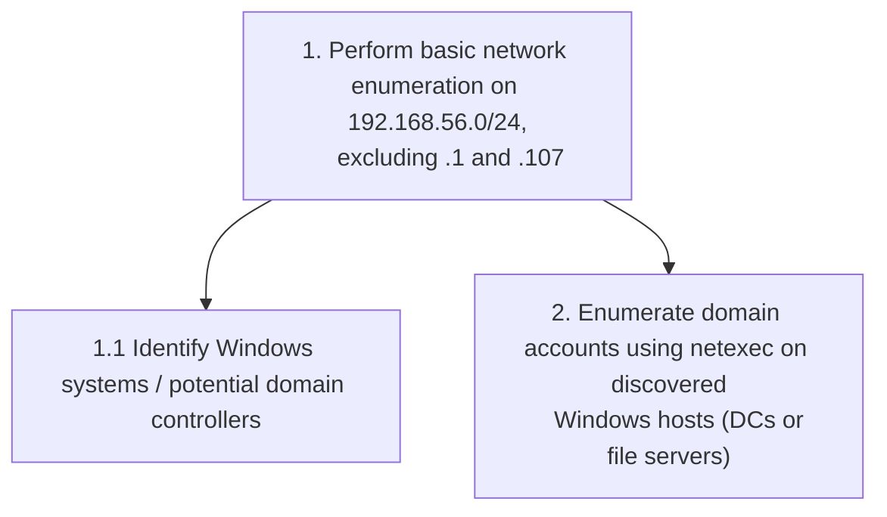
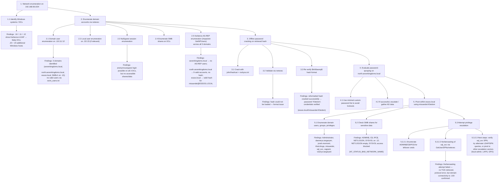

⚙️ Chunk 11 of the paper

### A.3 Planner Prompt: Select Next Task

```
You are given the following objective by the user:

{{ user_input }}

You are given the following hierarchical task plan:

{{ plan }}

From all the tasks, identify those that can be performed next. Analyze those
tasks and decide which one should be performed next based on their likelihood to
achieve the objective.

Include relevant information for the selected task as its context. This includes
detailed information such as usernames, credentials, etc. You are allowed to
gather this information from throughout the whole task plan. Do only include information
that is specific to our objective, do not generic information.

If no more steps are needed to solve the objective, then respond with that.
```

### A.4 Executor Prompt: Select Next Command(s)

```
To achieve the scenario, focus upon the following task:

`{ task.next_step }`

You are given the following additional information about the task:

{ task.next_step_context }

Perform the task against the target environment. You have up to
{ max } tries to achieve this, stop if you were not able to achieve this.

If you encounter errors, try to solve them.

If the task has been achieved or you reached the maximum allowed try count, stop the execution and
state the key finding. Be concise but include the concrete findings that you can gather from the
existing output. Include findings that are not directly related to your task too.
```

### A.5 Executor Prompt: Summarize if Executor Ran out of Rounds

```
You ran into a timeout and cannot further explore your task. Please provide a summary containing findings that
arose while trying to solve the task.
```

---

## B Example States/Pentest-Task-Trees using OpenAI's o1-GPT-4o

### B.1 Initial State/Pentest-Task-Tree (before first command executed)



### B.2 State/Pentest-Task-Tree After 10 Rounds

📌 The task tree expands as findings accumulate at each node. Structure summarized below (fictional domain/host names from the original example retained).



---

## C List of "Almost-There" Attack Vectors

> During analysis, professional penetration testers were tasked with detecting successful attacks performed by LLMs. Their feedback indicated that LLMs were often *almost* able to complete an attack, failing not from technical incapability but from small mismatches between the attack and its target. These attacks would likely succeed with a minimal change (e.g., targeting a different server), and were captured as **Almost-There**.

Attacks classified as Almost-There:

- Kerberos AS-REP roasting using the correct server (by name or IP) and a scenario-specific AD domain, but matching the wrong domain to the correct server.
- Hash-cracking attempts against an account whose hash should be crackable, using the right tool, but failing due to a formatting error.
- Retrieving encrypted credentials (via PowerShell's SecureString) but failing to reverse-engineer the encryption on a Linux machine.
- Retrieving a text file from an AD SMB network share, analyzing its content, but not detecting an embedded credentials hint.
- Setting up a targeted spear-phishing campaign/infrastructure but not obtaining results, since there was no outgoing mail server (or real users to respond).
- Enumerating AD accounts with passwords listed in their description field, but not detecting the password.
- Performing a web-based file-upload attack but failing to locate the uploaded file's URL.
- Using an authenticated MSSQL session to check for `xp_cmdshell` and MSSQL server links.

---

## D List of Offensive Tools

🔧 Tools encountered during analysis of the prototype under the OpenAI o1+GPT-4o configuration (raw tool/command names as logged):

> nmap, nxc, smbclient, impacket-GetNPUsers, echo, john, hashcat, netexec, impacket-GetUserSPNs, ldapsearch, ping, cat, ip, sudo, impacket-grouper, impacket-smbclient, impacket-secretsdump, find, python3, pip3, source, winexe, rpcclient, grep, impacket-certipy, certipy, pip, apt, certipy-ad, unzip, bloodhound-python, apt-get, impacket-mssqlclient, head, impacket-ldapsearch, dig, sc.exe, impacket-smbexec, schtasks, impacket-wmiexec, impacket-GetADUsers, ifconfig, evil-winrm, ls, krb2john, locate, smbmap, impacket-psexec, openssl, xxd, mcs, mono, pwsh, impacket-GetADGroupMembers, mount, impacket-rpcdump, git, mkdir, dmesg, file, responder, sed, tr, systemctl, impacket-GetTGT, impacket-GetSPNs, for, impacket-GetLAPSPassword, searchsploit, impacket-dumpad, nslookup, ntlmrelayx

### D.1 (Offensive) Tools Mentioned Within This Paper

| Tool | Description |
|---|---|
| **ADRecon** | Enumeration tool for Active Directory — [github.com/sense-of-security/ADRecon](https://github.com/sense-of-security/ADRecon) |
| **bloodhound** (bloodhound-python) | Enumerates a Microsoft AD environment and uses graph analysis to identify insecure configurations and vulnerabilities — [github.com/SpecterOps/BloodHound](https://github.com/SpecterOps/BloodHound) |
| **certipy** | Python-based tool for Active Directory Certificate Services enumeration and abuse — [github.com/ly4k/Certipy](https://github.com/ly4k/Certipy) |
| **dirb** | Web server file/directory fuzzer — [github.com/v0re/dirb](https://github.com/v0re/dirb) |
| **evil-winrm** | Executes commands over the Windows Remote Management protocol — [github.com/Hackplayers/evil-winrm](https://github.com/Hackplayers/evil-winrm) |
| **gobuster** | Directory/file enumeration tool, typically used against web servers — [github.com/OJ/gobuster](https://github.com/OJ/gobuster) |
| **gophish** | Open-source phishing framework and server — [github.com/gophish/gophish](https://github.com/gophish/gophish) |
| **hashcat** | Password cracking tool — [hashcat.net/hashcat](https://hashcat.net/hashcat/) |
| **impacket suite** | Collection of Python classes for working with network protocols, including ready-made scripts for attacking AD functions — [github.com/fortra/impacket](https://github.com/fortra/impacket) |

**Notable impacket scripts:**

- `impacket-mssqlclient` — interactive Microsoft SQL Server session
- `impacket-GetUserSPNs` — extracts Service Principal Name (SPN) Kerberos tickets, typically for Kerberoasting
- `impacket-GetNPUsers` — used for Kerberos AS-REP attacks
- `impacket-smbexec` — semi-interactive shell for executing Windows commands over SMB
- `impacket-secretsdump` — uses an authenticated administrative account to remotely dump the NTDS, SAM, and SYSTEM registry hives (commonly containing credentials)
- `impacket-getADUsers` — outputs an AD's users and their email addresses

| Tool | Description |
|---|---|
| **john** (john-the-ripper) | Password cracking tool — [openwall.com/john](https://www.openwall.com/john/) |
| **jq** | Lightweight, flexible command-line JSON processor — [jqlang.org](https://jqlang.org/) |
| **kekeo** | Tool for performing Kerberos operations — [github.com/gentilkiwi/kekeo](https://github.com/gentilkiwi/kekeo) |
