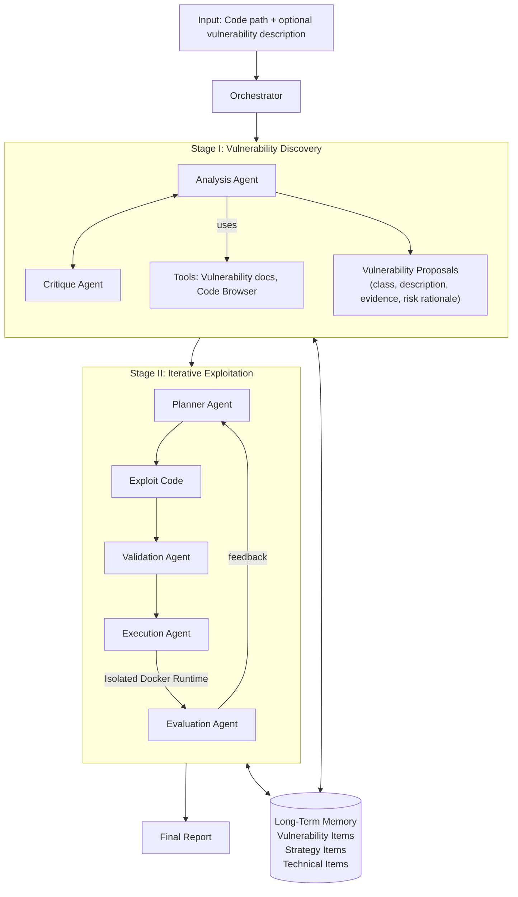

⚙️ Chunk 1 of the paper

# Co-RedTeam: Orchestrated Security Discovery and Exploitation with LLM Agents

**Authors:** Pengfei He¹ ³*, Ash Fox², Lesly Miculicich¹, Stefan Friedli², Daniel Fabian², Burak Gokturk¹, Jiliang Tang³, Chen-Yu Lee¹, Tomas Pfister¹, Long T. Le¹

**Affiliations:**
1. Google Cloud AI Research
2. Google
3. Michigan State University

> Corresponding authors: Pengfei He (hepengf1@msu.edu), Long T. Le (longtle@google.com)
> *Work done while Pengfei was a Student Researcher at Google Cloud AI Research.

---

## 📌 Abstract

- Large language models (LLMs) show promise for cybersecurity tasks, but existing approaches struggle with automatic **vulnerability discovery and exploitation** due to:
  - Limited interaction
  - Weak execution grounding
  - Lack of experience reuse
- **Co-RedTeam** is proposed: a security-aware multi-agent framework that mirrors real-world red-teaming workflows by integrating:
  - Security-domain knowledge
  - Code-aware analysis
  - Execution-grounded iterative reasoning
  - Long-term memory
- The framework decomposes vulnerability analysis into coordinated **discovery** and **exploitation** stages, letting agents plan, execute, validate, and refine actions using real execution feedback while learning from prior trajectories.
- 📊 **Results:** Co-RedTeam consistently outperforms strong baselines across diverse backbone models:
  - **>60%** success rate in vulnerability exploitation
  - **>10%** absolute improvement in vulnerability detection
- Ablation and iteration studies confirm the critical role of execution feedback, structured interaction, and memory.

---

## 1. Introduction

- Red teaming proactively identifies, exploits, and mitigates vulnerabilities before real-world abuse occurs, helping organizations validate defenses and reduce financial/operational risk.
- Standardized frameworks like **CWE** (Common Weakness Enumeration) and the **OWASP Top 10** systematize recurring software flaws.
- ⚠️ **Limitation:** Manual red-teaming is complex, labor-intensive, costly, and hard to scale — requiring deep domain expertise and iterative hypothesis testing across large codebases.
- Recent LLM advances have spurred interest in automating vulnerability discovery and exploitation, since LLMs can reason over code, generate exploits, and interact with complex environments.
- ⚠️ However, individual LLMs, single-agent setups, and generic coding agents fall short on realistic security tasks. Benchmarks such as **CyBench**, **BountyBench**, and **CyberGym** show these systems struggle with:
  - Multi-step reasoning
  - Adaptive attack planning
  - Robust exploration of the vulnerability space

### 🔬 Contribution

Co-RedTeam is a security-aware multi-agent framework designed to overcome:
1. Brittle single-shot reasoning
2. Lack of execution-grounded validation
3. Inability to learn from prior attacks

It integrates four capabilities inspired by human security experts:

| Capability | Description |
|---|---|
| Security grounding | Agents grounded in CWE/OWASP standards and vulnerability documentation |
| Code-aware analysis | Code-browsing tools for precise analysis of large, complex codebases |
| Execution-driven reasoning | Closed-loop plan–execute–evaluate process using real execution feedback in isolated environments |
| Experience accumulation | Layered long-term memory capturing reusable vulnerability patterns, strategies, and technical actions |

- Evaluated on **CyBench**, **BountyBench**, and **CyberGym**.
- 📊 Results: **>60%** exploitation success, **20%** detection accuracy — substantially outperforming prior approaches.
- Ablation studies confirm the importance of key design components and show continual improvement over time via long-term memory.

---

## 2. Related Works

### LLMs for Cybersecurity Tasks

- Software vulnerabilities (injection flaws, improper access control, insecure deserialization) are formalized by standards/benchmarks: **CWE**, **OWASP Top 10**, **OSS-Fuzz**.
- Code-capable LLMs have spurred interest in vulnerability detection, exploitation, and repair.
- Early results: LLMs can identify vulnerability patterns and, in controlled settings, autonomously exploit websites; chain-of-thought prompting improves discovery and repair performance.
- ⚠️ **Limitations found in later evaluations:**
  - LLMs struggle with complex reasoning in vulnerability detection
  - Both detection and exploitation remain challenging across diverse, realistic benchmarks

### Agentic Systems for Security

- Beyond single-LLM approaches, recent work structures LLMs as autonomous agents interacting with tools, environments, and feedback.
- Agentic (vs. training-based) approaches are favored for flexibility, modularity, and the ability to directly leverage state-of-the-art LLMs without retraining.
- Prior efforts:
  - **Single-agent** security workflows that iteratively analyze codebases and refine hypotheses — limited effectiveness on complex, multi-step tasks.
  - **Multi-agent** designs with structured interaction/task decomposition, e.g.:
    - Mock-court–style vulnerability detection
    - Coordinated exploitation of real-world one-day vulnerabilities
- ⚠️ On challenging benchmarks (CyberGym, CyBench, BountyBench), existing single-agent and generic coding-agent systems achieve **low success rates (often below 10%)** on large, realistic codebases — motivating the need for security-aware multi-agent LLM systems.

---

## 3. Co-RedTeam

- Multi-agent framework for automatic software vulnerability discovery and exploitation, designed for real-world codebases and execution environments.
- Coordinated by an **orchestrator** taking as input a target codebase (code path) and, optionally, a vulnerability description.

### Two Sequential Stages

1. **Vulnerability Discovery** — multiple agents collaboratively analyze code, retrieve vulnerability documents, and learn from past experience to generate structured vulnerability hypotheses.
2. **Iterative Exploitation** — candidate vulnerabilities are validated through execution-driven planning, feedback, and refinement.

- Output: a vulnerability report of validated vulnerabilities.
- A shared **long-term memory** persists across both stages, accumulating experience across tasks for continual improvement.

### 🖼️ Figure 1 — Framework Overview

> Given a target codebase (and optional vulnerability hints), the orchestrator coordinates two stages. **Stage I (Vulnerability Discovery):** Analysis and Critique agents discuss together, leveraging code-browsing tools and security documentation to identify and validate candidate vulnerabilities with concrete evidence. **Stage II (Iterative Exploitation):** Planning, Validation, Execution, and Evaluation agents interact with an isolated execution environment to iteratively reproduce vulnerabilities through execution-grounded feedback. Throughout the process, a layered long-term memory stores vulnerability patterns, high-level strategies, and concrete technical actions, enabling experience reuse and continual improvement across tasks.

### 📌 Problem Setup

Given access to a target codebase and its execution environment, the system must:
1. Identify potential security vulnerabilities grounded in concrete, code-level evidence (when no explicit vulnerability description is given).
2. Validate identified vulnerabilities by reproducing their impact through execution.

This setting emphasizes integrated capabilities: code analysis, security-domain reasoning, exploit planning, and execution-driven validation.

### 3.1 Orchestrator and System Initialization

- The **orchestrator** is the central controller that transforms high-level security objectives into a coordinated, execution-ready attack workflow.
- It enforces structure, discipline, and control rather than treating agents as independent workers.

**Responsibilities:**
- Initializes all agent instances and configures capabilities via **role-aware tool assignment**:
  - Discovery agents → code-browsing + vulnerability-documentation tools + critique utilities
  - Execution agents → sandboxed interfaces (`run-bash`, `run-python`) within an isolated Docker environment
- Caches agent instances and tool handles for consistent coordination/reuse across stages.
- Validates user-provided inputs before analysis begins (codebase existence, optional vulnerability hints).
- Dynamically determines the execution path:
  - No reliable hypothesis → start Vulnerability Discovery stage
  - Sufficient guidance available → proceed directly to Iterative Exploitation
- Continuously monitors system state and schedules agent interactions.
  - e.g., once a vulnerability is successfully reproduced via execution, the orchestrator halts exploration and transitions to final report generation.
- Design is similar in spirit to the supervisor agent used in **Co-Scientist**, enabling role separation, tool-access control, and overall control-flow management.

### 3.2 Stage I: Vulnerability Discovery

- Systematically explores code files to identify potential vulnerabilities.
- Driven by an **Analysis agent**, supported by a **Critique agent** and code analysis/security knowledge tools.
- Activated when no explicit vulnerability description is available.

#### Analysis Agent — evidence-grounded vulnerability hypothesis generation

- 🔬 **Key insight:** effective vulnerability discovery requires grounding reasoning in both **program structure** and **security-domain knowledge**.
- Equipped with code-browsing tools for systematic exploration:
  - File hierarchies, documentation, entry points, configuration files, fine-grained code snippets
  - Builds a global understanding of program structure and data flow (not just localized pattern matching)
- Connected to structured security knowledge distilled from **CWE** and **OWASP** standards.
  - Enables interpreting suspicious code fragments through known vulnerability classes and exploitation mechanisms
- Performs deep analysis of candidate code regions: reasoning about how untrusted inputs propagate to sensitive sinks and why existing validation/sanitization may be insufficient.
- For each candidate vulnerability, constructs a rigorous **evidence chain**: input source → vulnerable sink → execution context enabling exploitation.
- **Output:** a structured list of vulnerability drafts, each annotated with:
  - Standardized vulnerability class
  - Concise description
  - File- and line-level evidence
  - Rationale describing potential impact

#### Critique Agent — internal validation and refinement

- Acts as an independent verifier of vulnerability drafts to reduce false positives and improve robustness.
- Evaluates each proposal's description, evidence, and risk rationale (optionally consulting code-browsing tools or vulnerability documentation).
- Assigns to each candidate:
  - A **risk level**: Critical → Informational
  - A **review status**: approved, rejected, or needs refinement
  - Concrete feedback explaining the decision
- Rejects candidates lacking convincing evidence or with only low impact; flags plausible-but-under-supported hypotheses for refinement.
- The Analysis agent responds to critique by revisiting the codebase to strengthen evidence or discarding unsupported candidates.
- This **analysis–critique loop** continues until a stable set of well-supported vulnerabilities is reached.

> **Output of Stage I:** a curated set of validated vulnerability candidates, each with explicit evidence and an assessed risk level — forming a reliable foundation for execution-driven exploitation.

### 3.3 Stage II: Iterative Exploitation

- Static code reasoning can discover vulnerabilities, but precise validation fundamentally requires **execution**.
- ⚠️ Exploitation attempts often fail due to incomplete assumptions, missing context, or environment-specific constraints — making single-shot exploit generation unreliable.
- Stage II is an **execution-grounded, iterative process** that refines exploitation strategies based on real execution feedback, converting candidate vulnerabilities into concrete, reproducible evidence.
- Operates as a tightly coupled, closed-loop process coordinated by the orchestrator, driven by three specialized agents:
  - **Planner agent**
  - **Execution agent**
  - **Evaluation agent**
- Rather than single-shot exploit generation, the system treats exploitation as a structured search process guided by real execution feedback, continuing until a vulnerability is successfully reproduced *(content continues in next chunk)*.
