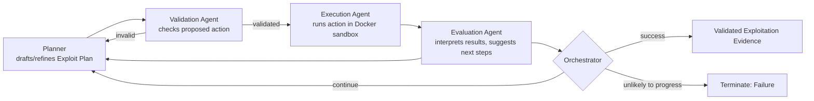

⚙️ Chunk 2 of the paper

## 🔬 Planner: Making Exploitation Explicit and Revisable

A key challenge in automated exploitation is that naïvely generated commands often fail silently or repeatedly, causing agents to loop without progress. To avoid this, the **Planner** maintains an explicit **Exploit Plan** that decomposes exploitation into a sequence of concrete, inspectable steps.

- Each step specifies a **goal**, an **action**, and a **status** (`planned`, `done`, or `blocked`)
- Enables transparent tracking of progress and failures
- Lets the system reason about the exploitation process itself, rather than reacting myopically to the latest output

### 📌 Grounding Phase

At the start of exploitation, the Planner mirrors how human security experts approach an unfamiliar target:

1. Interprets the vulnerability description and evidence chain
2. Retrieves relevant security knowledge from vulnerability documentation
3. Scans the codebase to understand the technology stack and attack surface
4. Consults long-term memory for previously successful strategies or technical patterns

This ensures exploitation actions are informed by both program context and security-domain knowledge, rather than blind trial-and-error. From this context, the Planner drafts an initial multi-step Exploit Plan when none exists, or incrementally refines the existing one.

### 🔁 Feedback-Driven Refinement

Plan refinement is explicit and feedback-driven. After each execution, the Planner:

- Updates the status of the attempted step
- Marks failures as `blocked`, and inserts corrective actions when necessary (e.g., adjusting file paths, switching payloads, trying alternative commands)
- Revisits *future* planned steps in light of newly observed evidence, modifying or discarding steps whose assumptions are invalidated by execution feedback

> This proactive revision prevents the system from blindly following outdated plans or repeatedly executing ineffective actions, enabling adaptive, long-horizon exploitation reasoning.

From the updated plan, the Planner generates a concrete executable action for the next step (a command or script). Before execution, each proposed action passes through a **Validation agent**, exposed to the Planner as a tool.

⚠️ **Why validation matters:** malformed commands, incorrect assumptions, or unsafe actions can derail execution or invalidate results. The Validation agent checks that actions are well-formed, syntactically sound, aligned with the intended goal, and compatible with observed system state. Only validated actions are forwarded for execution; invalid ones are returned for refinement (details in Appendix A.1).

## 🔬 Execution and Evaluation: Grounding Reasoning in Reality

Validated actions are executed by the **Execution agent** within an isolated Docker-based environment — ensuring realistic interaction with the target while preventing unintended modification of the original codebase. Execution results include structured status signals, raw outputs, and error messages.

These results are analyzed by the **Evaluation agent**, which converts low-level execution traces into high-level reasoning signals:

- Determines whether execution achieved its intended goal
- Highlights deviations or unexpected behaviors
- Identifies environment or configuration errors
- Produces concrete suggestions for next steps (e.g., retrying with modified inputs, adjusting strategy)

This feedback closes the loop, directly informing the Planner's next revision.

### 🖼️ Plan–Execute–Evaluate Loop

### Finalization and Outcomes

The **Orchestrator** monitors the plan–execute–evaluate loop and decides whether to continue iterating, declare success upon successful vulnerability reproduction, or terminate with failure when further progress is unlikely. The output of Stage II is validated exploitation evidence (e.g., a proof-of-concept payload or exploit trace) demonstrating vulnerability impact.

By explicitly modeling exploitation as an iterative, execution-grounded reasoning process, Stage II enables robust and adaptive vulnerability validation beyond what static or single-shot approaches can achieve.

---

## 🔬 3.4 Evolution via Long-Term Memory

Human experts do not analyze vulnerabilities in a vacuum — they leverage experience to recognize patterns and avoid pitfalls. Co-RedTeam emulates this adaptive growth via long-term memory, distilling lessons from past discovery and exploitation trajectories.

**Challenge:** vulnerability discovery requires abstract pattern recognition over code structure and data flow, while exploitation demands both high-level strategic planning and low-level technical execution. These reasoning modes operate at different levels of abstraction and generate experience at different granularities — a single, homogeneous memory representation is insufficient.

Co-RedTeam therefore adopts a **layered memory design** separating vulnerability patterns, strategic insights, and concrete technical actions:

### 1️⃣ Vulnerability Pattern Memory
Captures confirmed vulnerability schemas distilled from validated vulnerability proposals and exploitation outcomes.
- Records the progression: observable symptom → vulnerability hypothesis → confirming test
- Also records common false leads that impeded confirmation
- *Example:* a seemingly benign URL fetch function becomes exploitable only when combined with a specific configuration flag; misleading indicators that initially suggested a different vulnerability class are also recorded
- Supports rapid recognition of recurring vulnerability structures across codebases

### 2️⃣ Strategy Memory
Captures high-level exploitation strategies abstracted from completed Exploit Plans.
- Synthesizes generalizable lessons that transfer across targets (e.g., XSS exploitation strategies across different web frameworks)
- Retains both successful strategies (*"prioritize configuration analysis before payload crafting"*) and failure cases (*"blind fuzzing without understanding the execution context leads to dead ends"*)
- Guides future planning toward more effective directions

### 3️⃣ Technical Action Memory
Records concrete, low-level actions — commands, scripts, or tool invocations — extracted from execution logs and Exploit Plans.
- Successes are distilled into reusable "how-to" snippets or technical tricks (e.g., a working command for testing SSRF reachability)
- Failures store the associated pitfall and corrective adjustment (e.g., an incorrect file path assumption and its fix)
- Reduces repeated trial-and-error and accelerates execution-level reasoning

> Together, these memory layers let the system retain experience at conceptual, strategic, and technical levels, supporting both generalization and precision. Memory items are automatically synthesized using LLM-based extraction over research plans, execution traces, and evaluation feedback, following principles from prior structured reasoning memory work (Ouyang et al., 2025). Signals from the Evaluation agent and the Orchestrator determine whether a trajectory yields a successful practice to preserve or a failure lesson to avoid. Retrieval is performed via embedding-based similarity search and exposed as a tool to all major agents.

---

## 📊 4. Experiments

Co-RedTeam is evaluated on multiple challenging cybersecurity benchmarks. Results show it significantly outperforms baselines across various LLM backbones (§4.1), with ablation studies demonstrating the importance of key components (§3), and additional case studies in Appendix B.

### Data

Three challenging security benchmarks:

| Benchmark | Focus |
|---|---|
| **Cybench** (Zhang et al., 2024) | CTF-based benchmark evaluating LLM agents' ability to find and mitigate security threats |
| **BountyBench** (Zhang et al., 2025a) | Real-world offensive/defensive cyber capabilities; focus on **Detect** and **Exploit** tasks |
| **CyberGym** (Wang et al., 2025) | Large-scale, realistic benchmark emphasizing reproduction of vulnerabilities via executable proof-of-concept (PoC) exploits |

More details in Appendix A.5.

### Baselines

- **Vanilla models** — receive the target codebase directly, prompted to generate a solution without explicit tool use, execution feedback, or structured planning (minimal baseline for raw model capability)
- **OpenHands** (Team, 2024) — generic coding agent for software engineering tasks; iterative code generation and tool use, not specialized for cybersecurity
- **C-Agent** — CyBench baseline agent that explicitly incorporates execution feedback into its reasoning loop
- **VulTrail** (Widyasari et al., 2025) — multi-agent framework using a mock-court paradigm for vulnerability detection via structured debate among LLM agents
- **RepoAudit** (Guo et al., 2025) — autonomous LLM-based agent for repository-level code auditing

### Experiment Setups

- All agents instantiated with the same backbone LLM to isolate the impact of system design
- Code-browsing tools and the Execution agent operate within isolated Docker containers for safety and reproducibility
- Vulnerability documentation tool and long-term memory both use **gemini-embedding-001**, retrieving the top 3 relevant items per query
- To avoid cold-start issues, memory is initialized with curated items distilled from established security databases and human expert experience
- Memory synthesis uses **gemini-2.5-pro** to balance generation quality and cost
- **Stage I:** 3 iterations for refining vulnerability proposals
- **Stage II:** exploitation loop capped at 20 iterations by default (budget impact analyzed in ablation)
- All agents/tools enabled in main experiments; component-wise contributions examined via ablations
- Baselines follow configurations reported in their original papers
- Gemini models are used across all methods for fair comparison; results with additional model families are in Appendix C

### Evaluation

Official evaluation pipelines from each benchmark are followed, reporting success rates for vulnerability detection and exploitation as primary metrics.

- CyBench and CyberGym: exploitation tasks only
- BountyBench: both detection and exploitation tasks

---

## 📊 4.1 Main Results

Co-RedTeam consistently achieves the strongest performance across all benchmarks and backbone models, in both vulnerability detection and exploitation.

**Table 1 — Main results on CyBench, BountyBench, and CyberGym**
*(RepoAudit and VulTrail are static-analysis methods lacking execution capability; since CyBench evaluation relies on execution to capture flags, these two baselines are omitted for CyBench.)*

| Method | Backbone LLM | CyBench | BountyBench (Exploit) | BountyBench (Detect) | CyberGym |
|---|---|---|---|---|---|
| Vanilla | Gemini-2.5-flash | 10.3% | 7.5% | 0.0% | 1.2% |
| Vanilla | Gemini-2.5-pro | 13.6% | 12.5% | 0.0% | 8.3% |
| Vanilla | Gemini-3-pro | 18.5% | 17.5% | 0.0% | 12.1% |
| OpenHands | Gemini-2.5-flash | 16.3% | 17.5% | 0.0% | 4.8% |
| OpenHands | Gemini-2.5-pro | 31.5% | 42.5% | 0.0% | 16.9% |
| OpenHands | Gemini-3-pro | 45.2% | 45.0% | 5.0% | 20.2% |
| C-Agent | Gemini-2.5-flash | 18.2% | 20.0% | 0.0% | 5.1% |
| C-Agent | Gemini-2.5-pro | 31.8% | 40.0% | 2.5% | 15.8% |
| C-Agent | Gemini-3-pro | 47.8% | 47.5% | 5.0% | 21.5% |
| VulTrail | Gemini-2.5-flash | N/A | 0.0% | 0.0% | 1.4% |
| VulTrail | Gemini-2.5-pro | N/A | 7.5% | 0.0% | 3.1% |
| VulTrail | Gemini-3-pro | N/A | 10.0% | 0.0% | 5.6% |
| RepoAudit | Gemini-2.5-flash | N/A | 5.0% | 0.0% | 3.7% |
| RepoAudit | Gemini-2.5-pro | N/A | 15.0% | 0.0% | 12.4% |
| RepoAudit | Gemini-3-pro | N/A | 25.0% | 2.5% | 18.3% |
| **Co-RedTeam** | Gemini-2.5-flash | **31.8%** | **32.5%** | **7.5%** | **12.1%** |
| **Co-RedTeam** | Gemini-2.5-pro | **59.1%** | **60.0%** | **12.5%** | **31.5%** |
| **Co-RedTeam** | Gemini-3-pro | **63.7%** | **65.0%** | **20.0%** | **37.3%** |

**Key observations:**

- Among baselines, agent-based methods incorporating execution feedback (OpenHands, C-Agent) show clear improvements over static approaches
- VulTrail and RepoAudit are notably weaker, especially on exploitation tasks, since they lack execution feedback in their reasoning loop — highlighting the critical role of execution-environment interaction and iterative refinement
- With Gemini-3-Pro, Co-RedTeam achieves **63.7%** ASR on CyBench, **65.0%** exploit success and **20.0%** detection accuracy on BountyBench, and **37.3%** ASR on CyberGym — large absolute gains over the strongest baselines
- Results underscore the effectiveness of the security-aware multi-agent design combining domain knowledge, code analysis, execution-grounded iteration, and long-term memory across the full vulnerability lifecycle

---

## 📊 4.2 Ablation Studies

**Table 2 — Ablation study.** Impact of removing individual components from Co-RedTeam (values shown with the drop relative to full system).

| | Cybench | BountyBench (Exploit) | BountyBench (Detect) | Cybergym |
|---|---|---|---|---|
| **Co-RedTeam** | 59.1% | 60.0% | 12.5% | 31.5% |
| No Critique | N/A | N/A | 10.0% (↓2.5%) | N/A |
| No Validation | 52.3% (↓6.8%) | 42.5% (↓17.5%) | 7.5% (↓5.0%) | 28.3% (↓3.2%) |
| No Vul-doc | 55.2% (↓3.9%) | 52.5% (↓7.5%) | 10.0% (↓2.5%) | 30.2% (↓1.3%) |
| No Code Browser | 47.5% (↓11.6%) | 42.5% (↓17.5%) | 7.5% (↓5.0%) | 27.9% (↓3.6%) |
| No Memory | 50.0% (↓9.1%) | 40.0% (↓20.0%) | 7.5% (↓5.0%) | 22.6% (↓8.9%) |
| No Execution | 17.5% (↓41.6%) | 12.5% (↓47.5%) | 0.0% (↓12.5%) | 14.3% (↓17.2%) |

**Impact of critical components:**

- 🔎 **Removing execution feedback** causes the most severe degradation across all benchmarks (e.g., ASR drops from 59.1% to 17.5% on CyBench) — confirming execution-grounded interaction is indispensable for validating and reproducing vulnerabilities
- 🔎 **Disabling long-term memory** results in substantial declines, particularly on CyberGym, highlighting the importance of experience reuse for long-horizon exploitation
- 🔎 **Absence of code browsing tools or security documentation (vul-doc)** consistently degrades performance — effective vulnerability analysis requires both precise code understanding and domain-specific security knowledge
- 🔎 **Removing the validation agent** significantly harms performance — sanity checks on planned actions are critical to prevent ineffective or erroneous executions
- 🔎 **Disabling the critic agent** mainly affects detection performance, suggesting its role in refining and filtering vulnerability hypotheses before exploitation

> Overall, ablation results show Co-RedTeam's strong performance arises from the synergistic integration of planning, execution, validation, critique, and memory — rather than any single component in isolation.

### 🖼️ Figure 2: Effect of Maximum Exploitation Iterations

Success rate on CyBench versus maximum exploitation iteration budget, comparing Gemini-2.5-Pro and Gemini-3-Pro. Both curves rise steeply through early iterations and plateau around iteration 13–18, then flatten out to iteration 20 — Gemini-3-Pro plateaus near ~0.64 success rate, Gemini-2.5-Pro near ~0.59.

**Influence of max exploitation iteration.** While the default maximum iteration of the exploitation loop is set to 20, Co-RedTeam typically does not need the full budget — it usually terminates at around 13 to 18 iterations. Experiments were conducted to investigate the effect...

*(chunk continues in next file)*
