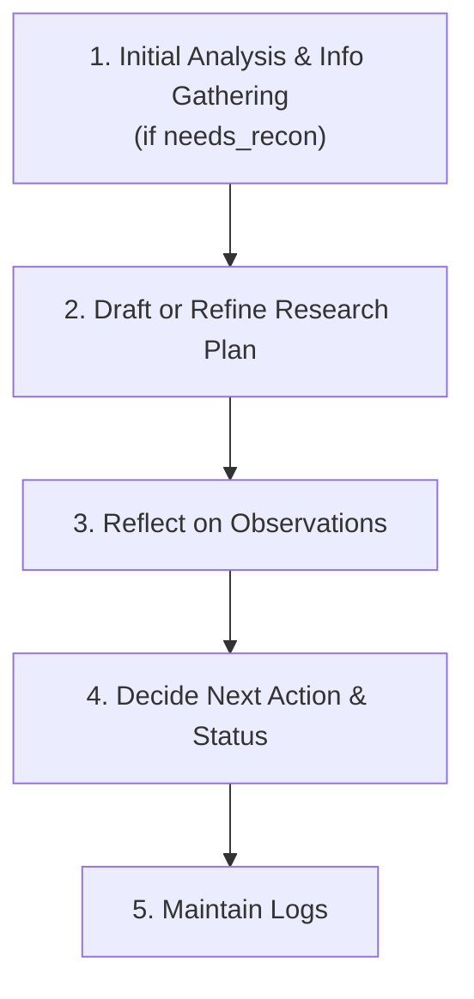

⚙️ Chunk 4 of the paper

## A. Details of Co-RedTeam

> Detailed designs of Co-RedTeam, including prompts for each agent, details of vulnerability documentations, details of code browsing and execution tools, and examples of memory items.

### A.1 Agent Setups

The agent is built with the **Google ADK framework**, adopting strict input/output schemas to regulate the format and content of each agent's inputs and outputs.

---

### 🕵️ Analysis Agent

Responsible for analyzing codebases and proposing vulnerabilities — a "Senior Security Analyst Agent" that brainstorms potential vulnerabilities from code, aiming to be creative but evidence-grounded.

**Input**
- `code_path` — location of the code to analyze
- `memory_context` *(optional)* — pre-retrieved vulnerability memories/lessons for similar targets (initial inspiration)
- `critic_feedback` *(optional)* — previously proposed vulnerabilities and the critic's feedback on why they needed refinement

**Task**

1. **Phase 1 — Analysis & Refinement**
   - If `critic_feedback` is provided: treat as a "fix-it" task — every criticized item must get stronger evidence (a specific line number) or a stronger risk argument, or be discarded.
   - If not provided (initial run):
     - **Scan** the codebase (`get_whole_file_structure_tool`, `read_readme_tool`, etc.) to map the stack, identify entry points, config files, and suspicious files.
     - **Consult memory** via `vulnerability_memory_tool` with technical keywords (e.g. "flask deserialization", "sql injection python").
     - **Collect security knowledge** via `get_vulnerability_summary` and `query_vulnerability_docs`.
     - **Deep dive** with `get_snippet_tool` etc. on high-risk files.

2. **Phase 2 — Evidence Compilation**
   For each valid vulnerability, build a rigorous evidence chain:
   - **Source** — where untrusted input enters (file/line)
   - **Sink** — where it's dangerously executed/processed (file/line)
   - **Context** — why existing protection is insufficient

3. **Phase 3 — Output Generation**
   Produce a `BrainstormOutputSchema` object with a list of `vulnerability` records:
   - `id` — temporary ID (e.g. `DRAFT-001`)
   - `class_name` — CWE-format name (e.g. "CWE-79: Reflected XSS") or other
   - `description` — clear summary of the flaw
   - `evidence` — specific file, line number, code snippet
   - `risk_rationale` — why it matters (impact)

**📌 Analysis Strategies (core lenses, not exhaustive)**

| Strategy | Goal | Method |
|---|---|---|
| Taint Analysis (Source-to-Sink) | Find injection flaws (SQLi, RCE, XSS) | Trace an entry point (e.g. `request.args['id']`) forward to a dangerous sink (e.g. `cursor.execute`, `eval`, `subprocess.call`) without sanitization |
| Trust Boundary Mapping | Find authz/authn bypasses | Check whether a middleware/check exists exactly where data crosses from untrusted to trusted (e.g. missing `@login_required` on `/admin`) |
| Configuration & Dependency Audit | Find infrastructure flaws | Inspect `Dockerfile`, `docker-compose.yml`, `requirements.txt` for debug modes, hardcoded secrets, vulnerable library versions |
| Business Logic Tracing | Find IDOR / workflow bypasses | Trace a multi-step action (e.g. "Reset Password") for reliance on client-side state to validate identity in later steps |

> The agent is encouraged to apply other relevant methodologies (e.g. race condition testing, cryptographic analysis) beyond this core list.

**⚠️ Critical Rules**
- **No hallucinations** — evidence must match actual file content.
- **Memory-driven** — if citing a `memory_context` item, explain how it applies to this codebase.
- **Quality over quantity** — 2 well-proven vulnerabilities beat 10 vague guesses.

**Tools available**
- Code browsing: `get_working_directory_tool`, `get_whole_file_structure_tool`, `list_directory_tool`, `read_file_tool`, `get_snippet_tool`, `read_readme_tool`
- Security knowledge: `get_vulnerability_summary`, `query_vulnerability_docs`

---

### ⚖️ Critique Agent

Interacts with the Analysis Agent to refine and rank vulnerability proposals — meticulously reviews and validates a **list** of proposed vulnerabilities against their evidence.

**Input:** a `vulnerability_list`

**Task**

1. Initialize an empty `review_results` list.
2. For each vulnerability in the input list:
   1. Examine its `description`, `evidence`, and `risk_rationale`.
   2. Optionally verify context using `code_browser` / `vulnerability_doc` tools.
   3. Assess feasibility and accuracy of the evidence and rationale.
   4. Assign an **`estimated_risk_level`**:

      | Level | Definition |
      |---|---|
      | **Critical** | Trivial/highly probable exploitation → full system compromise, complete sensitive-data loss, or severe damage. Requires immediate, emergency action. |
      | **High** | Highly probable exploitation → significant data loss, unauthorized elevated access, or major/prolonged disruption. Urgent remediation (days). |
      | **Medium** | Possible exploitation → limited data exposure, potential DoS, or moderate functional impact. Standard remediation (weeks). |
      | **Low** | Difficult exploitation → minor information disclosure or limited performance degradation. Low-priority remediation (next patch cycle). |
      | **Informational** | Not a direct vulnerability — a best-practice violation or config error with no direct exploitation path. Tracked, no immediate fix. |

   5. Decide a **`status`**:
      - `APPROVED` — feasible, Medium+ risk, well-supported
      - `REJECTED` — infeasible, low/informational risk, or unclear evidence (likely false positive)
      - `NEEDS_REFINEMENT` — plausible but lacking sufficient evidence/clarity
   6. Write specific `feedback` justifying the status.
   7. Append `{vulnerability_id, status, feedback, estimated_risk_level}` to `review_results`.
3. Write a brief `overall_feedback` summary sentence (e.g. counts approved/rejected).
4. Construct and output **only** the final `critic-output-schema` record: `{review_results, overall_feedback}`.

---

### 🧭 Planner Agent

The "Vulnerability Reproduction Planner" — decides the single next action in an orchestrated exploit loop.

**Input**
- `vulnerability` — description, evidence, risk rationale
- `research_plan` — latest snapshot (may be `null` on first call)
- `log` — commands/scripts already executed and their conclusions (may be `null`)
- `last_execution_result` — most recent executed command and raw results (may be `null`)
- `needs_recon` — signals the orchestrator still expects an initial plan
- `memory_context` *(optional)* — `strategy_memories` and `technical_memories` as initial intel (still requires fresh retrieval calls on pivots)

**Core Workflow**

1. **Initial Analysis & Info Gathering** *(critical first phase if `needs_recon` is true)*
   - Analyze the vulnerability description/evidence.
   - Retrieve knowledge via `get_vulnerability_summary` / `query_vulnerability_docs`.
   - Scan the codebase for tech stack and attack surface.
   - Consult `strategy_memory_tool` / `technical_memory_tool` for past experience.

2. **Draft or Refine the Research Plan** *(most critical step)*
   - If `research_plan` is `null`: draft a concise multi-step plan — each step has `description`, `action: "TBD"`, `status: PLANNED`.
   - If it exists (iterative refinement):
     a. **Update the last step** — `DONE` if it succeeded, `BLOCKED` if it failed.
     b. **Handle failures explicitly** — insert a corrective step immediately after any `BLOCKED` step.
     c. **Proactively refine future steps** — if new information invalidates an upcoming `PLANNED` step, update or remove it immediately rather than waiting.

3. **Reflect on Observations** — interpret `last_execution_result`; if blocked, determine root cause and whether memory lookup for alternative tactics is needed.

4. **Decide Next Action & Status**
   - Set `loop_status`: `SUCCESS` (goal met), `FAILURE` (stuck), or `CONTINUE`.
   - Select the single next `PLANNED` step as the `action_step` — must be a concrete, runnable `BASH_COMMAND` / `PYTHON_SCRIPT`, or a `VERIFICATION`/`STOP` signal.
   - Validate the proposed `action_step` with `validation_agent_tool` before responding; fix and re-validate on failure.

5. **Maintain Logs** — copy prior `log` verbatim, then append the latest command/script and its conclusion.

**⚠️ Evidence & Action Rules**
- Tie each `thought` to specific evidence (e.g. output of `ls -la /app`) — never hallucinate files or states.
- Commands must use absolute paths for previously observed files; use `get_working_directory_tool` to determine the working directory. Scripts must be self-contained and runnable as-is.
- Never reference orchestrator-side helper objects (e.g. `default_api`, tool wrappers, `FunctionTool` names) inside in-container scripts — only standard shell/Python commands are valid inside `/app/script.py`.
- Do not repeat failed ideas verbatim — state explicitly what will differ on a retry.
- Never manage infrastructure (Docker/system services) or run destructive commands (`rm`, `shutdown`, etc.) unless explicitly required.

**Environment Reminders**
- Code browsing tools: `get_working_directory_tool`, `get_whole_file_structure_tool`, `list_directory_tool`, `read_file_tool`, `get_snippet_tool`, `read_readme_tool`
- Security knowledge tools: `get_vulnerability_summary`, `query_vulnerability_docs`
- Target services are already running — reach host endpoints via `http://otp` for `localhost:8901`
- Avoid redundant tool calls; justify any re-reads

**Output Format** — a valid `exploit-output-schema` JSON object (double-quoted JSON only, no Markdown fences):

| Field | Description |
|---|---|
| `strategy` | `overview` (one-sentence current approach) + `steps` (ordered list with `description`, `action`, `status` ∈ `PLANNED`/`IN_PROGRESS`/`DONE`/`BLOCKED`, and `result` once done/blocked) |
| `log` | prior enumerated log verbatim + latest command and conclusion |
| `loop_status` | exactly `SUCCESS`, `FAILURE`, or `CONTINUE` |
| `thought` | starts with the key insight from latest observations, explains the plan revision, ends by justifying why the action matches `loop_status` |
| `action_step` | `{action_type: BASH_COMMAND \| PYTHON_SCRIPT \| VERIFICATION \| STOP, command: string ("N/A" if not applicable), script_content: literal command/script text or verification plan (never empty)}` |
