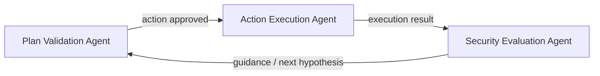

⚙️ Chunk 5 of the paper

## 🧩 Agent Prompt Specifications

The framework defines three specialized agent roles, each with a strict input/output contract, chained together in the exploitation loop:



### 📌 Validation Agent

Sanity-checks a single proposed action **before** it reaches the execution engine.

**Input fields**
- `action_type`: one of `BASH_COMMAND`, `PYTHON_SCRIPT`, `VERIFICATION`, `STOP`
- `command`: populated for shell actions
- `script_content`: populated for Python actions
- `description` / `expected_outcome`: human-readable intent and success criteria

**What it verifies**

1. **Action type consistency**
   - `BASH`: `command` required, `script_content` must be null.
   - `PYTHON_SCRIPT`: `script_content` required, `command` must be null; code must be syntactically plausible.
   - `VERIFICATION`/`STOP`: normally both fields are null unless clearly justified.
2. **Safety & syntax** — commands avoid obvious injection, unmatched quotes, or missing context (e.g. unspecified paths); scripts include necessary imports/indentation and reference available files/paths.
3. **Intent alignment** — `description` must match the actual command/script behavior; `expected_outcome` must be realistic and testable.
4. **Readiness checks** — referenced files/paths/flags must exist, or assumptions needing clarification are flagged.

**Output rule:** return only a `validation-output-schema` JSON object — `{"action_is_valid": bool, "feedback": "..."}`. `action_is_valid` is `True` only when every check passes; `feedback` explains approvals briefly or enumerates concrete rejection issues.

### 📌 Execution Agent

Executes a sequence of actions in a specified environment (Bash or Python) and reports the result of the *last* action.

**Input:** `actions_to_execute` — an ordered list of action steps.

**Task**
1. Iterate through the list in order.
2. For each step: determine `action_type`; run `BASH_COMMAND` via `bash_tool`, or `PYTHON_SCRIPT` via `python_executor_tool`.
3. ⚠️ If any action fails, stop execution immediately and report the failure.
4. After all actions succeed, capture `status`, `raw_output`, and any `error` from the **final** action.
5. Output *only* a valid `execution-output-schema` record reflecting the result of the last step (or the first failure).

### 📌 Evaluation Agent

Interprets what just happened in the exploitation loop and steers the orchestrator with evidence-backed analysis. No prior history is supplied — judgments are based strictly on `action_taken` and `execution_result` (both always populated).

**Task (in order, 3–4 sentence structured paragraph)**
1. **Describe what happened** (1–2 sentences) — reference the exact command/script and summarize key stdout/stderr.
2. **Compare with expectations** (1–2 sentences) — contrast the outcome with `expected_outcome`, calling out deviations or environment errors.
3. **Guidance** (1 sentence) — a concrete, actionable next step (retry with different input, inspect an artifact, pivot hypothesis).

**Output rule:** return only `{"analysis": "..."}`. Must include concrete evidence (filenames, error strings, exit indications); never claim inputs are missing. If execution failed, diagnose root cause and recommend precise remediation.

---

## 📚 Vulnerability Knowledge Base

To incorporate security-specific domain knowledge, the authors curated a vulnerability knowledge base and integrated a retrieval tool (`query_vulnerability_docs`) for context-aware access. It was built by collecting vulnerabilities from the CWE website, focused on the **top 25 most dangerous software weaknesses**, with both a brief summary file and detailed docs (comprehensive descriptions, real cases) per vulnerability category.

> 💡 The authors note this knowledge base could be replaced by a search engine — left as future work.

### 🔬 Vulnerability Category Summary

| Category | Description | Key CWEs | Key Risk |
|---|---|---|---|
| **Injection Flaws** | Untrusted input incorporated into commands/queries, causing unintended execution (OWASP A03:2021) | CWE-89 (SQLi), CWE-78 (OS Command Injection), CWE-94 (Code Injection), CWE-917 (EL Injection), CWE-74 (base) | Data theft/loss, DoS, full system compromise, RCE |
| **Out-of-bounds Write** | Writing data past/before the intended buffer, corrupting adjacent memory or control data (CWE Top 25 #1) | CWE-787, CWE-121 (stack overflow), CWE-122 (heap overflow) | Crashes, arbitrary/remote code execution, data corruption |
| **Cross-Site Scripting (XSS)** | Malicious client-side scripts injected via mishandled user input in output (CWE Top 25 #2) | CWE-79, CWE-80, CWE-83 | Session hijacking, data theft, defacement, redirects |
| **Broken Access Control** | Failure to properly enforce permissions/restrictions on authenticated users (OWASP A01:2021, CWE Top 25 #3/#5) | CWE-22 (Path Traversal), CWE-284, CWE-285, CWE-639 (IDOR), CWE-276, CWE-862, CWE-863 | Unauthorized data access/modification, privilege escalation |

### 📄 Example Documentation Entry — Broken Access Control

**Overall description:** Occurs when restrictions on authenticated users' allowed actions aren't properly enforced, letting attackers access unauthorized functionality or data (view others' accounts/files, modify data, change access rights). Often stems from insecure configuration, missing checks, or flawed permission/ownership logic — considered the most serious web application security risk.

**Common contexts:** web applications with role-based permissions; APIs exposing data/functionality by identity or role; multi-tenant systems; mobile apps calling backend APIs.

**Relevant CWEs**
- **CWE-284** (Improper Access Control) — the general category
- **CWE-22** (Path Traversal) — file system access not properly restricted by user rights
- **CWE-639** (Authorization Bypass Through User-Controlled Key, i.e. IDOR) — accessing data by manipulating identifiers without authorization checks

**🖼️ Vulnerable code pattern 1 — IDOR via URL parameter**
```python
# URL: /user/view_profile?user_id=123 (logged in as user 456)
@app.route('/user/view_profile')
def view_profile():
    user_id_to_view = request.args.get('user_id')
    # VULNERABLE: fetches profile based only on the URL ID,
    # never checks logged_in_user_id == user_id_to_view
    profile_data = db.get_user_profile(user_id_to_view)
    return render_template('profile.html', data=profile_data)
```

**🖼️ Vulnerable code pattern 2 — IDOR via API path parameter**
```java
// Request: GET /api/orders/987 (logged-in user only placed order 123)
@GetMapping("/api/orders/{orderId}")
public Order getOrder(@PathVariable String orderId, Authentication auth) {
    UserDetails userDetails = (UserDetails) auth.getPrincipal();
    // VULNERABLE: retrieves order by ID without checking ownership
    Order order = orderRepository.findById(orderId);
    return order;
}
```

**Potential impact**
- Viewing, modifying, or deleting unauthorized data (other users' records, sensitive files)
- Performing unauthorized administrative actions
- Complete account takeover of other users
- Gaining administrative privileges over the application

**Mitigation / prevention**
1. **Deny by default** — access denied unless the resource is explicitly public.
2. **Enforce access controls server-side** — never rely on client-side controls (hidden fields, disabled buttons).
3. **Verify permissions at every layer** — data access, function/feature access, API endpoint access.
4. **Use indirect references** — prefer session-mapped references (e.g. `/profile/me`) over raw IDs; if direct IDs are necessary, always verify the logged-in user is authorized for that specific object.

**References**
- [CWE-284: Improper Access Control](https://cwe.mitre.org/data/definitions/284.html)
- [CWE-639: Authorization Bypass Through User-Controlled Key (IDOR)](https://cwe.mitre.org/data/definitions/639.html)

---

## 🛠️ Code Browsing and Execution Tools (intro)

Code browsing tools were developed to facilitate efficient codebase navigation, along with execution tools that provide dynamic runtime feedback. To avoid unwanted modification of the original codebase, all tools run inside an isolated Docker container.

*(Section continues into the next chunk with the specific code-browsing tool functions.)*
