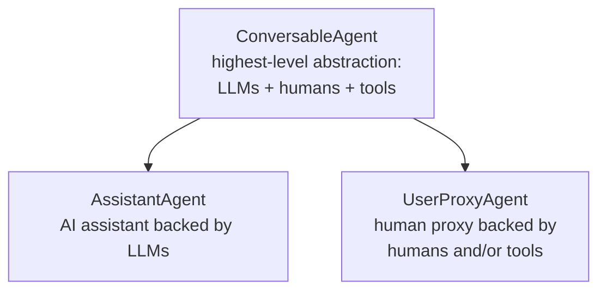
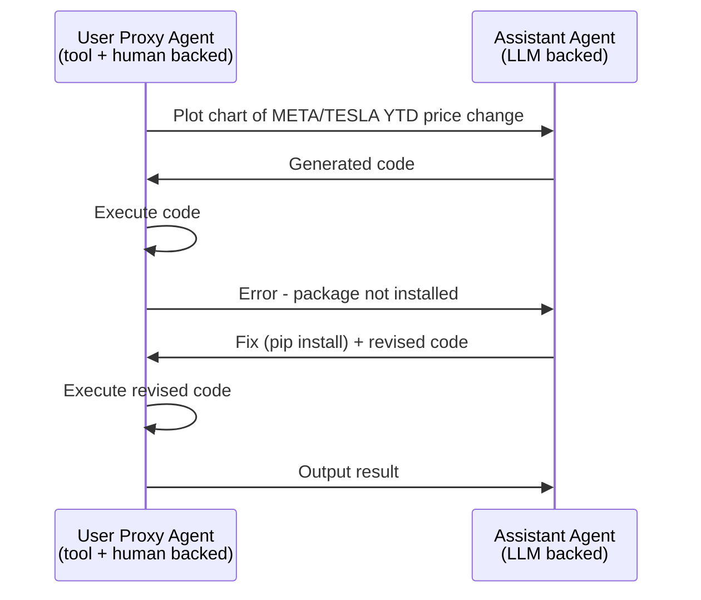

⚙️ Chunk 1 of the paper

# `AutoGen`: Enabling Next-Gen LLM Applications via Multi-Agent Conversation

**Authors:** Qingyun Wu, Gagan Bansal, Jieyu Zhang, Yiran Wu, Beibin Li, Erkang Zhu, Li Jiang, Xiaoyun Zhang, Shaokun Zhang, Jiale Liu, Ahmed Awadallah, Ryen W. White, Doug Burger, Chi Wang

**Affiliations:** Microsoft Research · Pennsylvania State University · University of Washington · Xidian University

> arXiv:2308.08155v2 [cs.AI] 3 Oct 2023
> Corresponding author: auto-gen@outlook.com
> Repo: https://github.com/microsoft/autogen

---

## 📌 Abstract

`AutoGen` is an open-source framework for building LLM applications via multiple **agents** that converse with each other to accomplish tasks.

- Agents are **customizable**, **conversable**, and can operate in modes combining LLMs, human input, and tools.
- Developers can flexibly define agent interaction behaviors using natural language and/or code.
- Serves as a generic framework across varying complexities and LLM capacities.
- Validated empirically across domains: mathematics, coding, question answering, operations research, online decision-making, entertainment, etc.

---

## 🖼️ Figure 1 Overview

🖼️ Figure: A four-panel overview graphic showing (1) a "Conversable agent" icon built from LLM/human/tool components, (2) example flexible conversation topologies (joint chat, hierarchical chat) between multiple agents, (3) a sample agent chat where a user asks to plot META/TESLA stock, the assistant writes code, execution fails on a missing package, the assistant fixes it, and re-executes, and (4) the resulting output charts (price and % change over time).

---

## 1. Introduction

### 🌐 Motivation

- LLMs are becoming core building blocks for agents that reason, use tools, and adapt to new observations.
- As tasks grow in number and complexity, using **multiple cooperating agents** is a natural way to scale agent power.
- Prior work suggests multi-agent setups can:
  - Encourage divergent thinking
  - Improve factuality and reasoning
  - Provide validation

> **Core question:** How can we facilitate development of LLM applications spanning many domains/complexities using a multi-agent approach?

### 🔬 Why Multi-Agent Conversation Works

Three reasons grounded in recent LLM advances:

1. **Feedback incorporation** — Chat-optimized LLMs (e.g., GPT-4) can take feedback, so agents can cooperate through dialogue (reasoning, observations, critiques, validation).
2. **Modular capability combination** — A single LLM exhibits a broad range of capabilities depending on prompt/inference settings; conversations between differently configured agents combine these capabilities in a modular, complementary way.
3. **Task decomposition** — LLMs solve complex tasks better when broken into subtasks; multi-agent conversation naturally supports this partitioning and integration.

### ❓ Two Critical Design Questions

1. How to design individual agents that are **capable, reusable, customizable**, and effective in multi-agent collaboration?
2. How to develop a **straightforward, unified interface** accommodating a wide range of agent conversation patterns (single/multi-turn, human-involvement modes, static vs. dynamic)?

### 🧩 AutoGen's Two New Concepts

#### 1️⃣ Customizable and Conversable Agents

- Generic agent design leveraging LLMs, human input, tools, or combinations thereof.
- Developers can quickly create agents with different roles (write code, execute code, incorporate human feedback, validate outputs, etc.).
- Every agent is **conversable**: can receive, react to, and respond to messages.
- Agents can autonomously hold multi-turn conversations or solicit human input at certain rounds — enabling both automation and human agency.

#### 2️⃣ Conversation Programming

- Simplifies complex LLM application workflows as **multi-agent conversations**.
- Two-step paradigm:
  1. Define a set of conversable agents with specific capabilities/roles.
  2. Program the interaction behavior between agents via conversation-centric **computation** and **control**.
- Achieved via a fusion of natural language and programming language.

Additionally, AutoGen ships with a collection of ready-made multi-agent applications, and the paper reports both benchmark evaluations and a pilot study, showing strong performance while reducing developer effort (Section 3, Appendix D).

---

## 2. The AutoGen Framework

**Core design principle:** streamline and consolidate multi-agent workflows via multi-agent conversations, maximizing reusability of implemented agents.

Two key concepts covered below: **conversable agents** and **conversation programming**.

### 2.1 Conversable Agents

A **conversable agent**:

- Has a specific role
- Passes messages to send/receive information to/from other agents (to start or continue a conversation)
- Maintains internal context based on sent/received messages
- Can be configured with capabilities enabled by LLMs, tools, and/or human input

#### 🛠️ Agent Capabilities

| Capability | Description |
|---|---|
| **LLMs** | Role playing, implicit state inference, progress-making conditioned on history, giving/adapting to feedback, coding. Combinable via novel prompting techniques. Enhanced inference layer adds result caching, error handling, message templating. |
| **Humans** | Human-backed agents solicit human input at configurable rounds. Default `UserProxyAgent` supports configurable involvement levels/patterns (frequency, conditions), including letting humans skip input. |
| **Tools** | Tool-backed agents execute tools via code execution or function calls. Default `UserProxyAgent` can execute LLM-suggested code or make LLM-suggested function calls. |

#### 🏗️ Built-in Agent Hierarchy



- `ConversableAgent`: the highest-level agent abstraction; by default can use LLMs, humans, and tools.
- `AssistantAgent` and `UserProxyAgent`: pre-configured subclasses for two common usage modes.

#### 🔄 Example Cooperation Flow (Figure 1, right panel)



The assistant agent generates a solution (LLM-aided), passes it to the user proxy agent, which solicits human input or executes the code, then returns results as feedback to the assistant.

---

### 🖼️ Figure 2 Overview

🖼️ Figure: A four-layer diagram showing (top) the built-in `ConversableAgent` → `AssistantAgent`/`UserProxyAgent`/`GroupChatManager` hierarchy with example config parameters (`human_input_mode`, `code_execution_config`, `DEFAULT_SYSTEM_MESSAGE`, `group_chat`); (middle) developer code defining agents and registering a custom reply function, then initiating a chat; (bottom) the resulting automated agent chat dialogue during program execution, annotated with "Conversation-Driven Control Flow" and "Conversation-Centric Computation."

Represented as a sequence of registered actions:

```mermaid
flowchart LR
    subgraph Developer Code
    D1["1.1 Define Agents:<br/>User Proxy A, Assistant B"]
    D2["1.2 Register custom reply_func_A2B<br/>(input_from_human → else execute code)"]
    D3["2. Initiate: A.initiate_chat(msg, B)"]
    end
    subgraph Program Execution
    P1[receive] --> P2[generate_reply] --> P3[send] --> P1
    end
    Developer Code --> Program Execution
```

By allowing custom agents to converse, AutoGen's conversable agents form a useful building block — but developers also need to **specify and mold** these multi-agent conversations.

---

### 2.2 Conversation Programming

A paradigm built on two concepts:

1. **Computation** — the actions agents take to compute a response within a multi-agent conversation.
2. **Control flow** — the sequence/conditions under which those computations happen.

> Both are **conversation-centric**: an agent's actions result in message passing for subsequent conversation turns (unless a termination condition is met); control-flow decisions (who to message, what computation to run) are functions of the inter-agent conversation itself.

This lets developers reason about a complex workflow simply as *agent action-taking* + *conversation message-passing*.

**Illustrated in Figure 2:**
- Bottom sub-figure: individual agents perform role-specific, conversation-centric computation (e.g., LLM inference calls, code execution).
- Middle sub-figure: conversation-based control flow — when the assistant receives a message, the user proxy agent sends human input as a reply if available; otherwise it executes any code in the assistant's message.

#### 🎛️ Design Patterns for Conversation Programming

**① Unified interfaces + auto-reply mechanism**

- Every agent exposes unified conversation interfaces:
  - `send` / `receive` — for sending/receiving messages
  - `generate_reply` — for taking actions and generating a response
- **Auto-reply mechanism** (default): once an agent receives a message, it automatically invokes `generate_reply` and sends the reply back, unless a termination condition is satisfied.
- Built-in reply functions are based on: LLM inference, code/function execution, or human input.
- Developers can register **custom reply functions** (e.g., to have an agent chat with a third agent before replying to the original sender).
- Once reply functions are registered and the conversation initialized, the flow proceeds automatically — no separate control-plane module required. This gives a decentralized, modular, unified way to define workflow.

**② Control via fusion of programming and natural language**

| Control type | Description |
|---|---|
| **Natural-language control (via LLMs)** | Prompt LLM-backed agents in natural language, e.g., default `AssistantAgent` system message instructs it to fix errors and regenerate code, or to reply `"TERMINATE"` when tasks are complete. Can also constrain output structure for downstream tool-backed agents. |
| **Programming-language control** | Python code specifies termination conditions, human-input mode, tool execution logic (e.g., max auto-replies), or registers custom auto-reply functions. |
| **Control transition (code ↔ NL)** | Code → NL: invoke an LLM inference with control logic inside a custom reply function. NL → code: via LLM-proposed function calls. |

**③ Flexible conversation flow patterns**

Beyond static, predefined flows, AutoGen supports **dynamic** multi-agent conversation via:

1. **Customized `generate_reply` function** — an agent can hold the current conversation while invoking conversations with other agents, depending on message content/context.
2. **Function calls** — the LLM decides whether to call a function depending on conversation status; messaging additional agents inside called functions drives dynamic multi-agent conversation.
3. **`GroupChatManager`** (built-in) — supports complex dynamic group chat: dynamically selects the next speaker and broadcasts its response to other agents (elaborated in Section 3).

---

## 3. Applications of AutoGen

- Six applications demonstrated (see Figure 3) to illustrate AutoGen's potential for simplifying development of high-performance multi-agent applications.
- Selection criteria:
  - **Real-world relevance** — A1, A2, A4, A5, A6
  - **Problem difficulty / solving capability enabled by AutoGen** — A1, A2, A3, A4
  - **Innovative potential** — A5, A6
- Together these criteria showcase AutoGen's role in advancing the LLM-application landscape.

*(Section 3 continues in the next chunk with detailed application descriptions.)*
