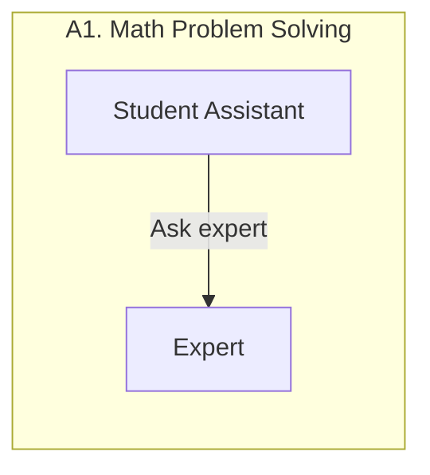
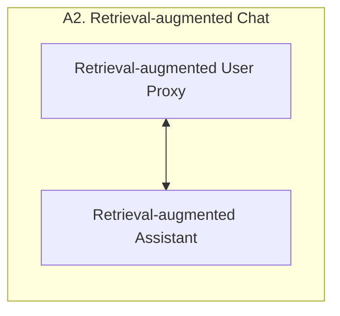
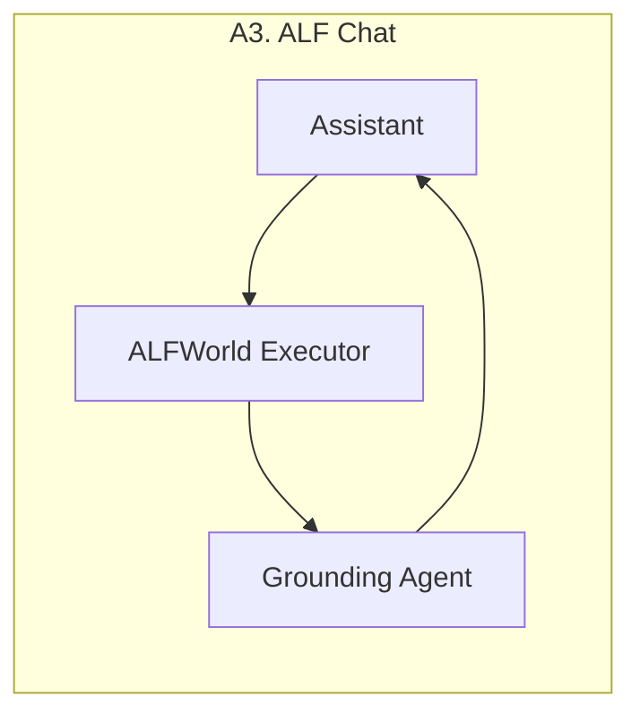
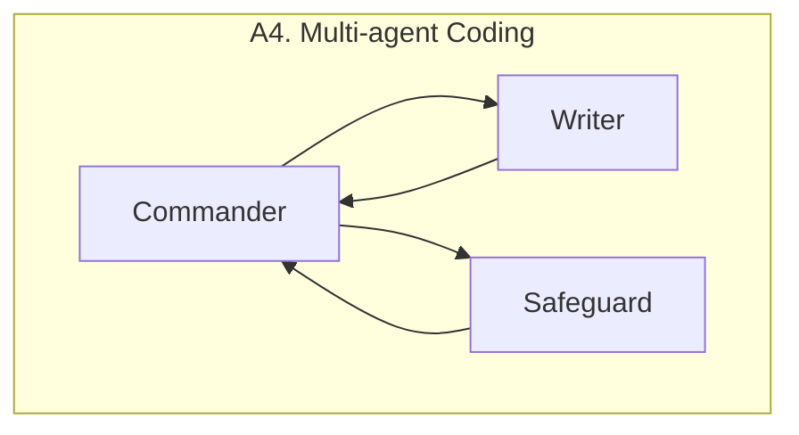
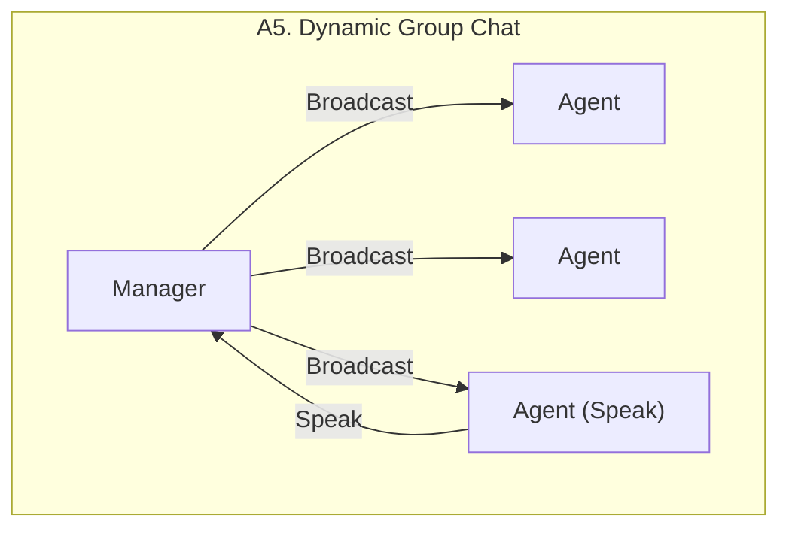
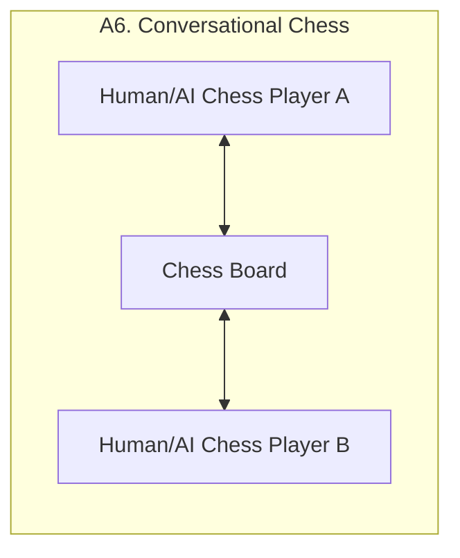
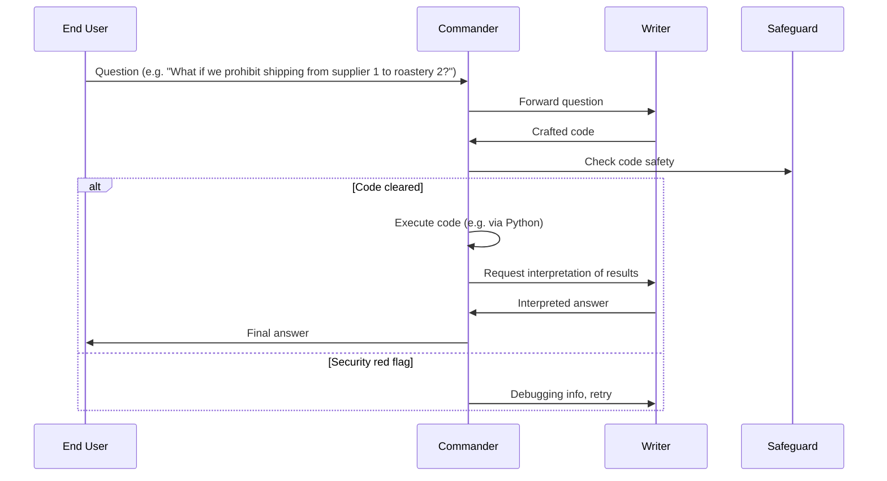

⚙️ Chunk 2 of the paper

## 📌 Six Example Applications Built with AutoGen

> Figure 3: Six examples of diverse applications built using `AutoGen`. Their conversation patterns show AutoGen's flexibility and power.

---

### A1: Math Problem Solving

Mathematics is a foundational discipline, and using LLMs to assist with math problem solving opens applications like personalized AI tutoring and AI research assistance. This section shows how AutoGen supports various math problem-solving paradigms.

- **Scenario 1 — Autonomous solving:** Built by directly reusing two built-in AutoGen agents. Evaluated against Multi-Agent Debate, LangChain ReAct, vanilla GPT-4, ChatGPT + Code Interpreter, and ChatGPT + Plugin (Wolfram Alpha) on the MATH dataset (120 randomly selected level-5 problems, plus the full test set). AutoGen's built-in agents outperform all alternatives out of the box, including commercial products.
- **Scenario 2 — Human-in-the-loop:** Setting `human_input_mode='ALWAYS'` in the `UserProxyAgent` lets human feedback help solve problems unsolvable by the system alone.
- **Scenario 3 — Multi-human:** Multiple human users can jointly participate in the problem-solving conversation.

> Full evaluation details and case studies for all three scenarios are in Appendix D.

#### 📊 Figure 4a — Performance on MATH (w/ GPT-4)

| Method | 120 Level-5 problems | Whole Dataset |
|---|---|---|
| AutoGen | 52.5% | 69.48% |
| ChatGPT + Code | 48.33% | — |
| ChatGPT + Plugin | 45.0% | — |
| GPT-4 | 30.0% | 55.18% |
| Multi-Agent Debate | 26.67% | — |
| LangChain ReAct | 23.33% | — |

*(ChatGPT was not evaluated on the whole dataset due to manual effort and hourly message limits; Multi-Agent Debate and LangChain ReAct were dropped from the whole-dataset run since they underperformed vanilla GPT-4 on the smaller set.)*

---

### A2: Retrieval-Augmented Code Generation and Question Answering

Retrieval augmentation mitigates LLMs' intrinsic knowledge limitations by incorporating external documents. AutoGen is used to build **Retrieval-augmented Chat**, a Retrieval-Augmented Generation (RAG) system with two agents extended from AutoGen's built-ins:

- **Retrieval-augmented User Proxy** — includes a vector database (Chroma) with SentenceTransformers as the context retriever.
- **Retrieval-augmented Assistant** — consumes the retrieved context to answer.

Evaluated in both QA and code-generation settings:

- **Scenario 1 — Natural Question Answering (Natural Questions dataset):** Compared against DPR (Dense Passage Retrieval), following an existing evaluation practice. AutoGen introduces a novel **interactive retrieval** feature: when retrieved context lacks the answer, instead of terminating, the assistant replies *"Sorry, I cannot find any information about... UPDATE CONTEXT,"* triggering further retrieval attempts. An ablation replacing this with a plain *"I don't know"* response shows interactive retrieval plays a non-trivial role.
- **Scenario 2 — Code generation:** Retrieval-augmented Chat generates code from a codebase containing code not in GPT-4's training data.

#### 📊 Figure 4b — Q&A tasks (w/ GPT-3.5)

| Method | F1 | Recall |
|---|---|---|
| AutoGen | 25.88% | 66.65% |
| AutoGen w/o interactive retrieval | 22.79% | 62.59% |
| DPR | 15.12% | 58.56% |

---

### A3: Decision Making in Text World Environments

Studied via the **ALFWorld** benchmark — synthetic language-based interactive decision-making tasks in household environments.

- A two-agent system (LLM-backed **assistant** for planning + **executor** for acting in ALFWorld) integrates ReAct-style prompting and achieves similar performance to ReAct.
- ⚠️ **Limitation:** Both ReAct and this two-agent system occasionally fail to apply basic commonsense knowledge, causing repetitive-error loops.
- **Fix:** A third **grounding agent** supplies commonsense knowledge (e.g., *"You must find and take the object before you can examine it"*) whenever early signs of recurring errors appear — significantly reducing error loops.
- Compared: two-agent vs. three-agent AutoGen systems, GPT-3.5-turbo, and ReAct, on 134 unseen ALFWorld tasks.

#### 📊 Figure 4c — Performance on ALFWorld

| Method | Average | Best of 3 |
|---|---|---|
| AutoGen (3 agent) | 69% | 77% |
| AutoGen (2 agent) | 54% | 63% |
| ReAct | 54% | 66% |

📌 Adding the grounding agent yields a ~15% average performance gain, mainly by preventing the system from persisting with flawed plans.

---

### A4: Multi-Agent Coding

Built on **OptiGuide**, a system that writes code to interpret optimization solutions and answer user questions (e.g., effects of changing a supply-chain decision).

**Workflow:**

- Using AutoGen, OptiGuide's core workflow code shrank from **430+ lines to ~100 lines**.
- Compared to ChatGPT + Code Interpreter, AutoGen-based OptiGuide saves **~3x user time** and reduces user interactions **3–5x**.
- Ablation: single-agent (one agent does both writing and safeguarding) vs. multi-agent, on 100 coding tasks (50 safe / 50 unsafe). Multi-agent design improves F1 for identifying unsafe code by **8% (GPT-4)** and **35% (GPT-3.5-turbo)**.

#### 📊 Figure 4d — Performance on OptiGuide

| Setup | F1 | Recall |
|---|---|---|
| Multi-GPT4 | 96.00% | 98.00% |
| Single-GPT4 | 88.00% | 78.00% |
| Multi-GPT3.5 | 83.00% | 72.00% |
| Single-GPT3.5 | 48.00% | 32.00% |

---

### A5: Dynamic Group Chat

AutoGen natively supports **dynamic group chat**: participating agents share context and converse without a pre-defined order, driven by the ongoing conversation itself.

- The `GroupChatManager` class conducts the conversation by repeating three steps:
  1. Dynamically select a speaker
  2. Collect the response from that speaker
  3. Broadcast the message to all agents
- Speaker selection uses a **role-play style prompt**.
- Pilot study on 12 manually crafted complex tasks: role-play prompting (vs. a purely task-based prompt) leads to better use of conversation context and role alignment, giving a higher success rate and fewer LLM calls.

> Detailed results are in Appendix D.

---

### A6: Conversational Chess

**Conversational Chess** — a natural-language interface chess game with:
- Built-in **player agents** (human or LLM)
- A third-party **board agent** that provides information and validates moves per standard rules

**Two key features enabled by AutoGen:**

1. **Flexible game dynamics** — supports AI-AI, AI-human, and human-human play, with seamless mode switching mid-game.
2. **Grounding** — the board agent checks every proposed move for legality; illegal moves are rejected and the player agent must re-propose a legal move, preserving game integrity.

⚠️ **Ablation:** Removing the board agent and relying only on a prompt ("make sure both you and the opponent are making legal moves") led to illegitimate moves and game disruptions — confirming the board agent's necessity.

---

## 4 Discussion

AutoGen is an open-source library built on **conversable agents** and **conversation programming**, offering:

- A unified conversation interface among agents
- An auto-reply mechanism
- A general framework for multi-agent systems supporting reuse, customization, extension, and programmable conversations

**Key benefits observed (Section 3):**

- Improved performance over state-of-the-art approaches
- Reduced development code
- Decreased manual burden
- Flexibility for **dynamic** (not just fixed back-and-forth) multi-agent patterns — demonstrated in A1 (Scenario 3), A5, and A6
- Modularity — agents can be developed, tested, and maintained separately, simplifying overall development

### 🔮 Future Directions

- Integrating existing agent implementations into the multi-agent framework
- Investigating the optimal balance between automation and human control
- Studying agent topology and conversation patterns for maximal effectiveness and efficiency
- ⚠️ More agents/degrees of freedom → more capability, but also new **safety challenges** requiring further study

> Further discussion, usage guidelines, and future work directions are in Appendix B.

---

## ⚖️ Ethics Statement

- **Privacy & Data Protection** — Human participation in agent conversations requires safeguarding user data and conversation privacy.
- **Bias & Fairness** — LLMs can reflect training-data biases; developers must address and mitigate bias in agent conversations to ensure fairness and inclusivity.
- **Accountability & Transparency** — Multi-agent cooperation needs clear accountability/transparency mechanisms so users can trace agents' decision-making.
- **Trust & Reliance** — Clear communication and user education about system capabilities/limitations is essential given automation via agent conversations.
- **Unintended Consequences** — Letting LLM agents act on external environments (code execution, function calls, package installation) carries risk; developers must build in appropriate safeguards.

---

## 🙏 Acknowledgements

The report benefited from discussions and feedback from a large group of contributors at Microsoft Research and collaborating institutions. Qingyun Wu acknowledges funding and research support from the College of Information Science and Technology at Penn State University.
