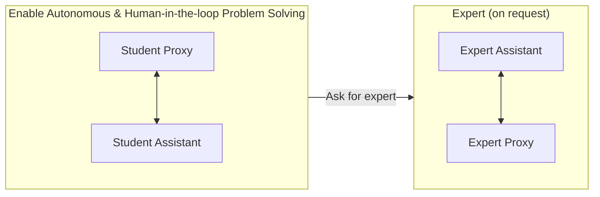

⚙️ Chunk 4 of the paper

## B. Expanded Discussion

📌 **Key Point:** AutoGen not only enables new applications but also helps renovate existing ones.

- In **A1 (scenario 3)**, **A5**, and **A6**, AutoGen enabled multi-agent conversations that follow a *dynamic pattern* instead of a fixed back-and-forth.
- In **A5** and **A6**, humans can participate alongside multiple AI agents conversationally.
- **A1–A4** show how popular applications can be renovated quickly with AutoGen, remaining simple despite involving more than two agents or dynamic multi-turn cooperation.

### Why These Benefits Are Achieved

- **Ease of use** — Built-in agents work out-of-the-box with strong performance, no customization needed. *(A1, A3)*
- **Modularity** — Splitting tasks into separate agents simplifies development, testing, and maintenance. *(A3, A4, A5, A6)*
- **Programmability** — Users can extend/customize agents easily. *(A1–A6)*
  > Example: core workflow code in **A4** reduced from 430+ lines to 100 lines — a **4x** saving.
- **Allowing human involvement** — Native mechanism for human participation/oversight; supports interactive instructions to keep the process on track. *(A1, A2, A5, A6)*
- **Collaborative/adversarial agent interactions** — Agents share information to complement each other's abilities *(A1, A2, A3, A4)*; in some scenarios agents work adversarially, with information shared in a controlled way to prevent distraction or hallucination *(A4, A6)*. AutoGen supports both patterns.

---

### B.1 General Guidelines for Using AutoGen

1. **Consider built-in agents first.**
   - `AssistantAgent` — pre-configured with GPT-4 and a system message for generic code-based problem-solving.
   - `UserProxyAgent` — configured to solicit human input and perform tool execution.
   - Many problems solved by simply combining these two. Customization options:
     1. Specify human input mode, termination condition, code execution config, and LLM config at construction.
     2. Add instructions in the initial user message (boosts performance without editing the system message).
     3. Extend `UserProxyAgent` to handle different execution environments/exceptions.
     4. For deeper changes, leverage the LLM's capability to program conversation flow via natural language.

2. **Start with a simple conversation topology.**
   - Prefer two-agent chat or group chat setups — easiest to extend.
   - Two-agent chat can be extended to more agents using LLM-consumable functions dynamically.

3. **Reuse built-in reply methods** (LLM-, tool-, or human-based) before writing custom reply methods.
   > Example: `GroupChatManager`'s reply method reuses the built-in LLM-based reply function when selecting the next speaker (see A5, Section 3).

4. **Start with humans always in the loop** (`human_input_mode='ALWAYS'`) when developing new `UserProxyAgent` applications, even if the target is fully autonomous.
   - Helps evaluate `AssistantAgent` effectiveness, tune prompts, find corner cases, and debug.
   - Once confident, switch to `human_input_mode='NEVER'` to run LLM as backend autonomously.

5. **Other libraries may still help** in certain cases:
   - For subtasks without back-and-forth/multi-agent needs → unidirectional pipelines via LangChain, LlamaIndex, Guidance, Semantic Kernel, Gorilla, or `autogen.oai` (low-level inference layer).
   - Existing LangChain tools (e.g., Wolfram Alpha) can be used as tool backends for AutoGen agents.
   - Agents from other libraries can be wrapped as conversable agents in AutoGen.
   - Blackbox optimization packages like `flaml.tune` can automate tuning of configurations (e.g., LLM inference config).

---

### B.2 Future Work

> ⚠️ This work raises several open research questions.

**🔬 Designing optimal multi-agent workflows**
- How many agents to include, how to assign roles/capabilities, how agents interact, what to automate.
- Key questions:
  - For what tasks/applications are multi-agent workflows most useful?
  - How do multiple agents help across different applications?
  - What is the optimal (e.g., cost-effective) multi-agent workflow for a given task?

**🔬 Creating highly capable agents**
- Essential for effective troubleshooting/progress within a multi-agent workflow.
- Observation: **CAMEL** (another multi-agent LLM system) largely fails to solve problems because it lacks tool/code execution capability — showing that simple role-playing conversations are insufficient.
- Future work needed: guidelines for application-specific agents, a large OSS knowledge base of agents, and agents that can discover/upgrade their own skills.

**🔬 Enabling scale, safety, and human agency**
- Open question: does scaling multi-agent workflows further help solve extremely complex tasks?
- ⚠️ As workflows scale and grow more complex, logging/adjusting them becomes harder — risk of *"incomprehensible, unintelligible chatter among agents"*.
- Fully autonomous AutoGen workflows are useful but must be used carefully:
  - High autonomy can pose risks, especially in high-risk applications.
  - Need fail-safes against cascading failures and exploitation.
  - Need mitigation of reward hacking and out-of-control/undesired behaviors.
  - Need effective human oversight — determining the appropriate level/pattern of human involvement remains a developer/stakeholder responsibility for safe, ethical use.

---

## C. Default System Message for Assistant Agent

🖼️ **Figure 5:** Default system message for the built-in assistant agent in AutoGen (v0.1.1), annotated with prompting-technique color codes: *Role Play*, *Control Flow*, *Output Confine*, *Facilitate Automation*, *Grounding*.

> **System Message:**
>
> You are a helpful AI assistant. Solve tasks using your coding and language skills.
>
> In the following cases, suggest python code (in a python coding block) or shell script (in a sh coding block) for the user to execute.
> 1. When you need to collect info, use the code to output the info you need — e.g., browse or search the web, download/read a file, print the content of a webpage or a file, get the current date/time. After sufficient info is printed and the task is ready to be solved based on your language skill, you can solve the task by yourself.
> 2. When you need to perform some task with code, use the code to perform the task and output the result. Finish the task smartly.
>
> Solve the task step by step if you need to. If a plan is not provided, explain your plan first. Be clear which step uses code, and which step uses your language skill.
>
> When using code, you must indicate the script type in the code block. The user cannot provide any other feedback or perform any other action beyond executing the code you suggest. The user can't modify your code. So do not suggest incomplete code which requires users to modify. Don't use a code block if it's not intended to be executed by the user.
>
> If you want the user to save the code in a file before executing it, put `# filename: <filename>` inside the code block as the first line. Don't include multiple code blocks in one response. Do not ask users to copy and paste the result. Instead, use `print` function for the output when relevant. Check the execution result returned by the user.
>
> If the result indicates there is an error, fix the error and output the code again. Suggest the full code instead of partial code or code changes. If the error can't be fixed or if the task is not solved even after the code is executed successfully, analyze the problem, revisit your assumption, collect additional info you need, and think of a different approach to try.
>
> When you find an answer, verify the answer carefully. Include verifiable evidence in your response if possible.
>
> Reply "TERMINATE" in the end when everything is done.

**Prompting technique legend:** Role Play · Control Flow · Output Confine · Facilitate Automation · Grounding

📌 **Discussion:**
- Combining these prompting techniques allows programming a fairly complex conversation even with the simplest two-agent topology — exploiting LLMs' implicit state-inference capability.
- ⚠️ LLMs do not follow all instructions perfectly, so the system needs other mechanisms to handle exceptions/faults.
- Some instructions have ambiguities; designers should either reduce ambiguity for precision or intentionally keep it for flexibility (addressed elsewhere in the agent design).
- **Observation:** GPT-4 follows instructions better than GPT-3.5-turbo.

---

## D. Application Details

### A1: Math Problem Solving

#### Scenario 1: Autonomous Problem Solving

- Both qualitative and quantitative evaluations performed.
- Base model: **GPT-4**; `sympy` package pre-installed in the execution environment.

**Compared systems:**
- **AutoGPT** — out-of-box, initialized with purpose "solve math problems" → "MathSolverGPT" with auto-generated goals.
- **ChatGPT+Plugin** — Wolfram Alpha plugin enabled in OpenAI web client.
- **ChatGPT+Code Interpreter** — recent OpenAI web client feature.
- **LangChain ReAct+Python** — Python agent from LangChain, `handle_parsing_errors=True`, default zero-shot ReAct prompt.
- **Multi-Agent Debate** — modified for evaluation; by default 3 agents (affirmative, negative, moderator).

> Preliminary evaluations on **BabyAGI**, **CAMEL**, and **MetaGPT** found them unsuitable out-of-the-box for solving math problems. E.g., when tasked with a math problem, MetaGPT begins developing software instead of actually solving the problem.

**📊 Table 2 — Qualitative evaluation on two MATH dataset problems (level-5), 3 trials each**

*(a) Problem 1 — simplify a square root fraction*

| System | Correctness | Failure Reason |
|---|---|---|
| AutoGen | 3/3 | N/A |
| AutoGPT | 0/3 | LLM gives code without `print`, so result isn't printed |
| ChatGPT+Plugin | 1/3 | Wolfram Alpha returns 2 simplified results incl. the correct one; GPT-4 always picks the wrong one |
| ChatGPT+Code Interpreter | 2/3 | Returns a wrong decimal result |
| LangChain ReAct | 0/3 | Gives 3 different wrong answers |
| Multi-Agent Debate | 0/3 | Gives 3 different wrong answers due to calculation errors |

*(b) Problem 2 — number theory problem*

| System | Correctness | Failure Reason |
|---|---|---|
| AutoGen | 2/3 | Final answer from code execution is wrong |
| AutoGPT | 0/3 | LLM gives code without `print`, so result isn't printed |
| ChatGPT+Plugin | 1/3 | One trial got stuck in wrong queries (had to stop); another gave a wrong answer |
| ChatGPT+Code Interpreter | 0/3 | Gives 3 different wrong answers |
| LangChain ReAct | 0/3 | Gives 3 different wrong answers |
| Multi-Agent Debate | 0/3 | Gives 3 different wrong answers |

**Quantitative evaluation (MATH dataset):**
- Experiment 1: 120 level-5 problems (20 problems × 6 categories, excluding geometry).
- Experiment 2: entire test set (5000 problems).
- AutoGPT excluded (can't access code execution results; solved none in qualitative eval).
- **Result:** AutoGen achieves **69.48%** overall accuracy vs. GPT-4's **55.18%** on the full test set.

**Observations:**
- 📊 **Problem-solving success rate:** AutoGen achieves the highest success rate among all compared methods.
  - ChatGPT+Code Interpreter fails to solve problem 2.
  - ChatGPT+Plugin struggles on both problems.
  - AutoGPT fails on both due to code execution issues.
  - LangChain fails on both, producing incorrect answers in all trials.
- 📊 **Verbosity / user experience:**
  - ChatGPT+Plugin is least verbose (Wolfram queries shorter than Python code).
  - AutoGen, ChatGPT+Code Interpreter, and LangChain show similar verbosity (LangChain slightly more due to execution errors).
  - AutoGPT is most verbose (predefined THOUGHTS/REASONING/PLAN steps every reply).
  - AutoGen and ChatGPT+Code Interpreter run smoothly without exceptions.
  - ⚠️ Undesired behaviors noted:
    - AutoGPT consistently omits `print`, requiring manual execution by the user.
    - ChatGPT+Wolfram Alpha plugin can get stuck in a loop requiring manual stop.
    - LangChain ReAct can exit with a parse error, requiring a `handle_parse_error` parameter.

🖼️ Figure: Diagram of three AutoGen setups for math problem solving:

> Gray box: student collaborates with an assistant agent, autonomously or human-in-the-loop.
> Gray + Orange: assistant can, on the fly, engage an "expert" (with their own assistant agent) if its own solutions are unsatisfactory — enabling multi-user problem solving.

#### Scenario 2: Human-in-the-loop Problem Solving

- For challenging problems unsolvable autonomously, human feedback during problem-solving can be... *(continues in next chunk)*
