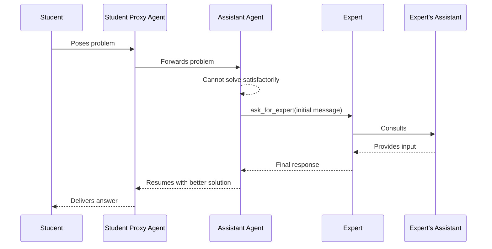
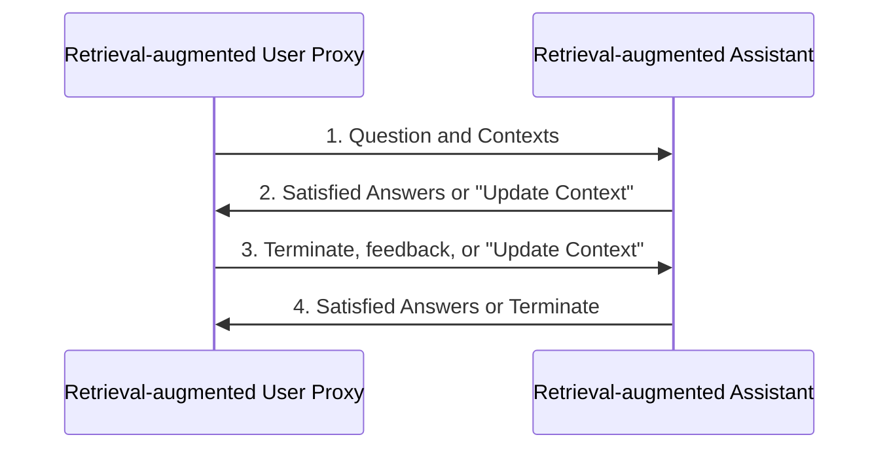
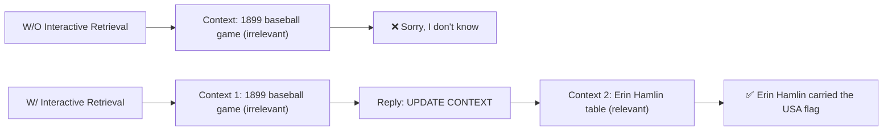
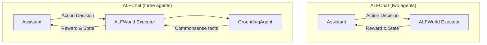

⚙️ Chunk 5 of the paper

## Human-in-the-Loop Example: Plane Bisector Problem

To incorporate human feedback with AutoGen, one can set `human_input_mode='ALWAYS'` in the user proxy agent. A challenging problem — one that none of the compared systems solved autonomously across three trials — was used to test human-guided problem solving.

> 📌 **Problem:** Find the equation of the plane which bisects the angle between the planes $3x - 6y + 2z + 5 = 0$ and $4x - 12y + 3z - 3 = 0$, and which contains the point $(-5, -1, -5)$. Enter your answer in the form $Ax + By + Cz + D = 0$, where $A, B, C, D$ are integers such that $A > 0$ and $\gcd(|A|,|B|,|C|,|D|) = 1$.

**Human-guided process:**

1. Input the problem statement.
2. Since the response is incorrect, give a hint: *"Suppose $P = (x, y, z)$ is a point that lies on a plane that bisects the angle, the distance from $P$ to the two planes is the same. Please set up this equation first."*
3. Once the distance equation is produced (which contains an absolute value), prompt: *"Consider the two cases to remove the abs sign and get two possible solutions."*
4. If two solutions are returned without a final decision, prompt: *"Use point (-5,-1,-5) to determine which is correct and give the final answer."*
5. ✅ **Final answer:** $11x + 6y + 5z + 86 = 0$

### 📊 Results Across Systems (3 trials each)

| System | Outcome |
|---|---|
| AutoGen | Solved consistently in all 3 trials |
| ChatGPT + Code Interpreter | Solved in 2/3 trials (failed to follow human hints in the unsuccessful trial) |
| ChatGPT + Plugin | Solved in 2/3 trials (sign discrepancy in the final answer in the failed trial) |
| AutoGPT | Failed all 3 trials (one incorrect distance equation; two failures due to code execution errors) |

---

## Scenario 3: Multi-User Problem Solving

Next-generation LLM applications may require **multiple real users** collaborating with LLM assistance to solve a problem. Building on Scenario 2, a system was designed involving two human users — a **student** and an **expert**.

### 🔬 Workflow

- The student converses with an LLM assistant agent (via a student proxy agent) to solve problems.
- When the assistant cannot solve the problem satisfactorily, or the solution doesn't meet the student's expectations, it automatically pauses the conversation and calls a predefined `ask_for_expert` function (via GPT's function-calling feature) to consult the expert.
- The assistant auto-generates the initial message to the expert — either the problem statement or a request to verify a solution.
- The expert responds with help from an **expert assistant** agent.
- The final expert response is relayed back to the student assistant, which resumes the conversation with the student using the expert's input.

> 📌 Constructing student/expert proxy agents and assistant agents is straightforward by reusing the built-in `UserProxyAgent` and `AssistantAgent` classes. The only custom development needed is writing the `ask_for_expert` function. The system easily extends to **multiple experts** (each with its own `ask_for_expert` function) or **multiple students sharing one expert**.

---

## A2: Retrieval-Augmented Code Generation and Question Answering

🖼️ **Figure:** Overview of Retrieval-augmented Chat, involving a Retrieval-augmented User Proxy and a Retrieval-augmented Assistant. Given a set of documents, the User Proxy splits, chunks, and stores them in a vector database. For a given user input, it retrieves relevant chunks as context and sends them to the Assistant, which uses an LLM to generate code or text answers. The agents converse until a satisfactory answer is found.

### 🔬 Detailed Workflow

Initialization requires specifying a path to the document collection. The Retrieval-Augmented User Proxy downloads the documents, segments them into chunks of a specific size, computes embeddings, and stores them in a vector database. Once a chat begins, the agents follow this loop:

1. The **User Proxy** retrieves document chunks based on embedding similarity and sends them, with the question, to the **Assistant**.
2. The **Assistant** uses an LLM to generate code or text as an answer. If it can't produce a satisfactory response, it replies **"Update Context"** to the User Proxy.
3. If the response includes code blocks, the User Proxy executes the code and returns the output as feedback. If there are no code blocks or update instructions, it terminates the conversation. Otherwise, it updates the context and forwards the question with new context to the Assistant. (If human input solicitation is enabled, users can proactively send feedback, including "Update Context".)
4. If the Assistant receives "Update Context," it requests the next most similar chunks as new context. Otherwise, it generates a new answer based on feedback and chat history. If it still fails, it replies "Update Context" again. This can repeat several times; the conversation terminates when no more documents are available.

Retrieval-Augmented Chat is evaluated in two scenarios:
- **Code generation** based on a given codebase — valuable because LLMs struggle with packages/APIs not in their training data (e.g., private codebases or frequently updated ones).
- **Question-answering** on the Natural Questions dataset, for comparative evaluation metrics.

### Scenario 1: Evaluation on Natural Questions QA Dataset

The Natural Questions dataset (Kwiatkowski et al., 2019) was used to evaluate end-to-end QA performance. **5,332** non-redundant context documents and **6,775** queries were collected from HuggingFace, forming a document collection stored in the vector database.

> 📌 **Example — interactive retrieval in action:** *"who carried the usa flag in opening ceremony"*

The context chunk with the highest embedding similarity did **not** contain the needed information, so the assistant (GPT-3.5-turbo) initially replied that it couldn't find the answer and returned "UPDATE CONTEXT." The user proxy then automatically fetched the next most similar chunk, allowing the assistant to generate the correct answer.

Using the same prompt setup as Adlakha et al. (2023), an experiment on *AutoGen W/O interactive retrieval* was conducted:

- **F1 score:** 23.40%
- **Recall:** 62.60% (first 500 questions)

These results align closely with those in Figure 4b. *AutoGen W/O interactive retrieval* outperforms **DPR**, attributed to differences in retrievers — a straightforward vector search retriever using the **all-MiniLM-L6-v2** embedding model was used.

Analysis of LLM call counts showed that approximately **19.4%** of questions in the Natural Questions dataset trigger an "Update Context" operation, resulting in additional LLM calls.

### Scenario 2: Code Generation Leveraging Latest APIs from the Codebase

> 📌 **Question:** *"How can I use FLAML to perform a classification task and use Spark for parallel training? Train for 30 seconds and force cancel jobs if the time limit is reached."*

- **FLAML (v1)** (Wang et al., 2021) is an open-source AutoML/tuning library, open-sourced in December 2020, and included in GPT-4's training data.
- The question requires **Spark-related APIs**, added to FLAML in **December 2022** — after GPT-4's training cutoff.
- ⚠️ Without retrieval, GPT-4 fails: it invents a non-existent parameter, `spark`, and sets it to `True`.
- ✅ With Retrieval-Augmented Chat providing the latest reference documents as context, GPT-4 generates correct code by setting `use_spark` and `force_cancel` to `True`.

---

## A3: Decision Making in Text World Environments

🖼️ **Figure:** Two AutoGen designs for the ALFWorld benchmark — a two-agent design (assistant + executor) and a three-agent design that adds a grounding agent supplying commonsense facts to the executor when needed.

**ALFWorld** (Shridhar et al., 2021) is a synthetic language-based interactive decision-making task simulating real-world household scenes. Given a high-level goal (e.g., putting a hot apple in the fridge) and an environment description, the agent explores and interacts through a textual interface. Tasks may require **more than 40 steps**, demanding goal decomposition into subtasks.

### 🔬 Detailed Workflow

**Two-agent system:**
- **Assistant agent** — generates plans and makes action decisions.
- **Executor agent** — tailored for ALFWorld; performs proposed actions and reports results as feedback.
- Due to strict output format requirements, the **BLEU metric** is used to match the assistant's output to the most similar valid action option.

**Challenge — commonsense reasoning:** The agent must combine few-shot patterns with general household knowledge to understand task rules, but often neglects basic environment knowledge.

**Three-agent solution:** A **grounding agent** is added to supply commonsense facts:
- Failed attempts were analyzed to identify commonsense knowledge gaps.
- The grounding agent provides general knowledge at task start, and whenever the assistant repeats the same action **three times in a row** — preventing the assistant from looping or endlessly apologizing.

### Comparison with ReAct

**ReAct** (Yao et al., 2022) is a few-shot prompting technique interleaving reasoning and acting, improving performance on language and decision-making tasks. It was integrated into AutoGen by adapting prompts conversationally, using a two-shot setting with few-shot prompts from the original repository.

### 📊 Results — Success Rate (%) on ALFWorld (out of 3 attempts)

| Method | Pick | Clean | Heat | Cool | Look | Pick 2 | All |
|---|---|---|---|---|---|---|---|
| ReAct (avg) | 63 | 52 | 48 | 71 | 61 | 24 | 54 |
| ALFChat (2 agents) (avg) | 61 | 58 | 57 | 67 | 50 | 19 | 54 |
| ALFChat (3 agents) (avg) | 79 | 64 | 70 | 76 | 78 | 41 | 69 |
| ReAct (best of 3) | 75 | 62 | 61 | 81 | 78 | 35 | 66 |
| ALFChat (2 agents) (best of 3) | 71 | 61 | 65 | 76 | 67 | 35 | 63 |
| ALFChat (3 agents) (best of 3) | 92 | 74 | 78 | 86 | 83 | 41 | 77 |

> 📌 The two-agent design roughly matches ReAct's performance, while the **three-agent design significantly outperforms ReAct** — likely due to the inherent difference between dialogue-completion and text-completion tasks, and the added value of the grounding agent as a knowledge source.

### Case Study

🖼️ **Figure:** Comparison of a "look at bowl under the desklamp" task between the two-agent and three-agent designs.

- **Two agents (❌ failure):** The assistant finds the desklamp, then locates the bowl, but tries to "look at" the bowl without first taking it — turning the desklamp on repeatedly and falling into an infinite loop, leading to task failure.
- **Three agents (✅ success):** The grounding agent intervenes: *"You must find and take the object before you can examine it. You must go to where the target object is before you can use it."* The assistant then goes back, takes the bowl, returns to the desklamp, uses it, and succeeds.

Most task failures involve conflating **finding** an object with **taking** it — especially in 'pick' and 'look' type tasks. The grounding agent breaks this loop.

### ⚠️ Takeaways

A grounding agent serving as an external commonsense knowledge source significantly enhances the assistant's decision-making ability. Supplying necessary commonsense facts to the decision-making agent boosts task success rate, and **AutoGen provides both simplicity and modularity** when adding such an agent.
