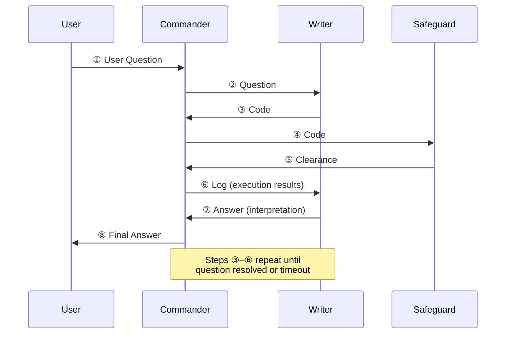
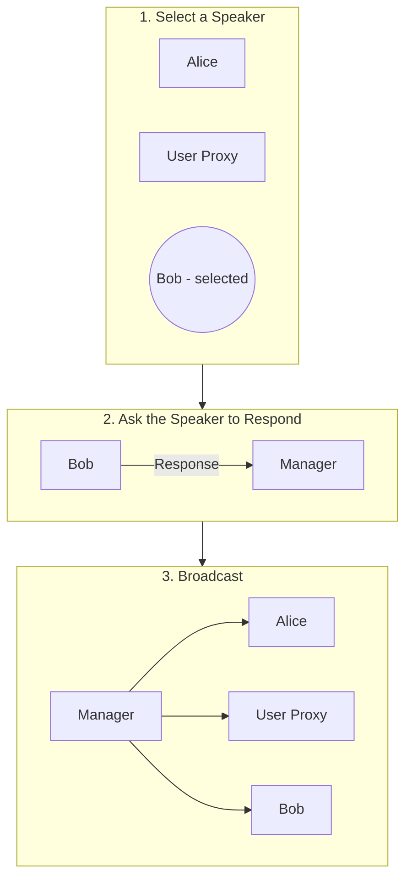
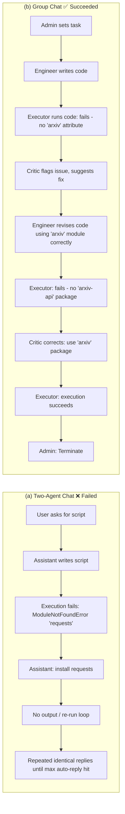
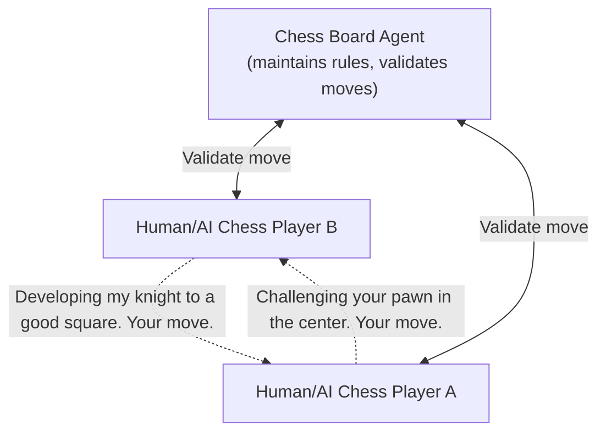

⚙️ Chunk 6 of the paper

## A4: Multi-Agent Coding



> 🖼️ Figure 11: Re-implementation of *OptiGuide* with `AutoGen` streamlining agents' interactions. The Commander receives user questions (e.g., *"What if we prohibit shipping from supplier 1 to roastery 2?"*) and coordinates with the Writer and Safeguard. The Writer crafts code and interpretation, the Safeguard ensures safety (no data leakage, no malicious code), and the Commander executes the code, repeating the process if issues arise.

### 📌 Detailed Workflow

- **① User Question** — The end user poses a question (e.g., *"What if we prohibit shipping from supplier 1 to roastery 2?"*) to the **Commander** agent.
- **Commander's role** — Coordinates two LLM-based assistant agents (**Writer** and **Safeguard**), and manages memory tied to user interactions, sharing context across the system for more informed responses.
- **② / ③ Code writing** — The **Writer** (combining "Coder" + "Interpreter" roles per Li et al., 2023a) crafts code, e.g.:
  ```python
  model.addConstr(x['supplier1', 'roastery2'] == 0, 'prohibit')
  ```
- **④ / ⑤ Safety check** — The Commander sends the code to the **Safeguard** for screening; once cleared, the Commander executes it via external tools (e.g., Python).
- **⑥ / ⑦ Interpretation** — The Commander requests the Writer interpret the execution results, e.g.: *"if we prohibit shipping from supplier 1 to roastery 2, the total cost would increase by 10.5%."*
- **⑧ Final Answer** — The Commander delivers the concluding answer to the user.

> ⚠️ **Exception handling:** If the Safeguard raises a security flag (at ⑤) or code execution fails (within Commander), the Commander redirects the issue back to the Writer with log information (⑥). Steps ③→⑥ may repeat multiple times until the query is resolved or a timeout occurs.

### 🔬 Engineering Impact

- Core OptiGuide workflow code reduced from **>430 lines → ~100 lines** using AutoGen.
- Agents are customizable, conversable, and autonomously manage their own chat memories.
- Coder and Interpreter roles merged into a single **"Writer"** agent for a cleaner, more maintainable implementation.

---

### 📊 Manual Evaluation: ChatGPT + Code Interpreter vs. AutoGen-based OptiGuide

- ChatGPT + Code Interpreter **cannot execute code with private/customized dependencies** (e.g., Gurobi), forcing users to manually handle steps — requiring engineering expertise and increasing error risk and support-engineer workload.
- **Study setup:** An expert Python/Gurobi programmer evaluated both systems on 10 randomly selected coffee supply-chain questions, measuring time and accuracy.

**Key findings:**

| Metric | ChatGPT + Code Interpreter | AutoGen-based OptiGuide |
|---|---|---|
| Correct answers (out of 10) | 8 | 8 |
| Avg. time per problem | 4 min 35 sec (σ ≈ 2.5 min) | ~1.5 min |
| Speed advantage | — | **~3x faster** |

- With Code Interpreter, users must read code/instructions, know where to paste snippets, download and run code in a terminal — slow and error-prone.
- Code Interpreter also generates more tokens (reading variables line-by-line, chain-of-thought) before producing a final answer, adding latency.
- AutoGen reduces user interactions **3–5x on average**, based on evaluation across **2000 questions** spanning five OptiGuide applications.

#### Table 4: Manual Effort Saved with OptiGuide (GPT-4), Same Coding Performance

| Dataset | Saving Ratio (mean, σ) |
|---|---|
| netflow | 3.14x (0.65) |
| facility | 3.14x (0.64) |
| tsp | 4.88x (1.71) |
| coffee | 3.38x (0.86) |
| diet | 3.03x (0.31) |

- Overall, AutoGen's automated, streamlined chat achieves a **5x reduction in interaction**, fundamentally improving usability. A stable workflow may be reused across other applications or composed into larger systems.

### 💡 Takeaways

- Multi-agent design (AutoGen) simplifies the Python implementation of OptiGuide.
- Fosters a **collaborative + adversarial** problem-solving environment: Commander and Writer collaborate, while Safeguard acts as a virtual adversarial checker.
- Enables proper memory management — Commander retains context-aware memory of user interactions.
- Role-playing keeps each agent's memory isolated, preventing shortcuts and hallucinations.

---

## A5: Dynamic Group Chat



> 🖼️ Figure 12: The **Manager** agent (an instance of `GroupChatManager`) performs three steps: select a single speaker (here, Bob), ask the speaker to respond, and broadcast the selected speaker's message to all other agents.

### 🔬 Method: Pilot Study

To validate the necessity of multi-agent dynamic group chat and the role-play speaker selection policy, a pilot study compared a **four-agent dynamic group chat** system against two alternatives, across **12 manually crafted complex tasks**.

> Example task: *"How much money would I earn if I bought 200 \$AAPL stocks at the lowest price in the last 30 days and sold them at the highest price? Save the results into a file."*

**Systems compared:**
1. **Four-agent group chat** — user proxy (human input), engineer (writes/fixes code), critic (reviews code, gives feedback), code executor.
2. **Two-agent system** — LLM-based assistant + user proxy.
3. **Group chat with task-based speaker selection** — same group members, but speaker selection uses a prompt combining role info, chat history, and the next speaker's task (rather than role-play).

📌 **Finding:** A role-play prompt for dynamic speaker selection led to better consideration of conversation context and role alignment than a task-style prompt — resulting in higher success rate, fewer LLM calls, and fewer termination failures.

#### Table 5: Number of Successes on the 12 Tasks (higher = better)

| Model | Two Agent | Group Chat | Group Chat (task-based speaker selection) |
|---|---|---|---|
| GPT-3.5-turbo | 8 | **9** | 7 |
| GPT-4 | 9 | **11** | 8 |

#### Table 6: Avg. # LLM Calls, Termination Failures (lower = better)

| Model | Two Agent | Group Chat | Group Chat (task-based speaker selection) |
|---|---|---|---|
| GPT-3.5-turbo | 9.9, 9 | 5.3, 0 | 4, 0 |
| GPT-4 | 6.8, 3 | 4.5, 0 | 4, 0 |

---

### 🖼️ Figure 13: Two-Agent Chat vs. Group Chat — Task Comparison

**Task:** *"Write a script to download all the pdfs from arxiv in last three days and save them under /arxiv folder."*



> 📊 **Result:** The group chat resolves the task successfully with a smoother conversation, while the two-agent chat fails on the same task and ends in a repeated, unproductive conversation loop.

---

## A6: Conversational Chess



> 🖼️ Figure 14: Conversational Chess supports various scenarios — each player can be an LLM-powered AI, a human, or a hybrid. The board agent maintains game rules and supports players with board information. All communication (players ↔ board agent) uses natural language.

### 📌 Design

- Each player is an **AutoGen agent**, powered by either a human or an AI.
- A third-party **board agent** provides board information and ensures moves are legal.
- Scenarios supported: **AI vs. AI**, **AI vs. human**, **human vs. human** (and hybrids).
- Enables social interaction — players can express moves creatively via jokes, meme references, and character-playing, making games more entertaining for players and observers (see Figure 15, referenced but not shown in this chunk).

### 🔬 Implementation

- **Player agent** — constructed with both LLM and human back-end options.
  - If human input enabled: prompts the player to type a move plus optional commentary before sending to the board agent.
  - If human input disabled: LLM generates the move/message.
- **Board agent** — implemented via a custom reply function:
  - Uses an LLM to parse natural-language input into a legal move in structured format (e.g., **UCI**).
  - Pushes the move to the board; if illegitimate, replies with an error.
  - The player agent must resend until a legal move is made, then forwards the message to the opponent.
- When generating a message, the LLM player agent uses **board state + error messages** from the board agent — reducing hallucinated invalid moves.
- The chat between a player agent and the board agent is **invisible** to the opposing player agent, keeping messages well-managed for chat completion calls.

### 💡 Benefits of Using AutoGen

1. **Natural object/interaction design** — AutoGen simplifies development by making agent creation and interaction intuitive; isolating chat messages simplifies proper LLM chat completion calls.
2. **Composition-based behavior** — Used the `register_reply` method to instantiate player agents and a board agent with custom reply functions, concentrating extension work at a single point (the reply function), simplifying reasoning, development, and maintenance.
