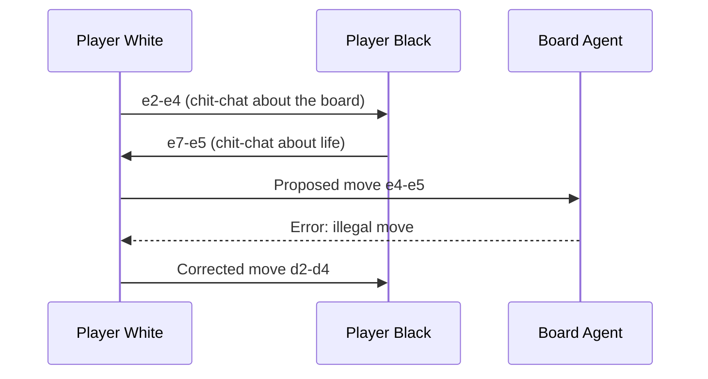
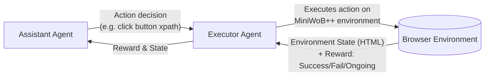

⚙️ Chunk 7 of the paper

## 🎮 Conversational Chess Example

> Example dialogue between two AI player agents, mediated by a board agent that validates moves.

**Conversation between two AI players:**
- White: opens with e2–e4, remarking on the center of the board.
- Black: replies e7–e5 (King's Pawn Opening), chit-chatting about chess reflecting life.
- White: continues developing, knight g1–f3.

**Conversation between an AI player and the board agent:**
- White attempts e4–e5 (attacking the knight) → **Error: illegal uci move**.
- White self-corrects, instead plays d2–d4.

### 📌 Board Agent vs. Prompting-Only Grounding

Two designs are compared for keeping the chess game state consistent:

1. **(a) Without a Board Agent** — grounding is attempted purely through a system-message instruction: *"You should make sure both you and the opponent are making legal moves."*
2. **(b) With a Board Agent** — a dedicated agent checks and enforces move legality.

**Result:**
- **(a) Without Board Agent:** Player White silently makes an illegal move (changes a rook at a8 into a knight and moves it to c6) — the error goes uncaught. ❌
- **(b) With Board Agent:** The same illegal move is attempted, but the Board Agent detects it, flags it ("Your move is illegal... please re-make your move"), and the player corrects it. ✅

> 🔑 **Takeaway:** Prompting alone is not reliable for enforcing structured/grounded rules; an explicit verifying agent (Board Agent) is more robust at catching illegal state transitions.

---

## 🌐 A7: Online Decision Making for Browser Interactions

### 🔬 Method: MiniWobChat

Built using **AutoGen**, `MiniWobChat` is a two-agent system solving tasks in the **MiniWoB++** benchmark (browser interaction tasks via mouse/keyboard actions).

- **Assistant agent** — an instance of the built-in `AssistantAgent`; decides the next action given the task and current environment state.
- **Executor agent** — a customized `UserProxyAgent`; executes the suggested action against the benchmark and returns the reward/state feedback.

**Example turn:**
- *Action decision:* `Click the button with xpath '//button[id="subbtn"]'`
- *Environment state:* HTML snippet showing a `div` with instructions "Click button ONE, then click button TWO" and two buttons (`subbtn`, `subbtn2`).
- *Reward:* `0` (Ongoing)

Many real-world applications need agents that interact with environments and make sequential decisions — game playing, web interaction, robot manipulation. AutoGen's multi-agent framework makes it easy to **decouple**:
- the **executor** (handles agent–environment interaction), from
- the **decision-maker** (chooses actions).

This decomposition lets the decision-making agent be reused across new tasks with minimal extra engineering, rather than building a bespoke decision agent per environment.

### 📊 Results vs. RCI

`MiniWobChat` is compared against **RCI** (Kim et al., 2023), a prior state-of-the-art method for MiniWoB++ using self-critiquing prompts, across all 49 available tasks (10 instances per task).

| Metric | Value |
|---|---|
| MiniWobChat success rate | 52.8% |
| Gap vs. RCI | −3.6% (RCI slightly higher) |
| Tasks where methods tie (within 0.1 tolerance) | Equal number of tasks won by each method |

🖼️ Figure: Bar chart comparing per-task success rates (RCI vs. MiniWobChat) across all 49 MiniWoB++ tasks (e.g. click-button, click-checkboxes, email-inbox, enter-date, navigate-tree, social-media, use-spinner, etc.) — the two methods track each other closely across most tasks.

**Case analysis on four representative tasks:**

| Task | Correctness | Main failure reason |
|---|---|---|
| click-dialog | AutoGen: 10/10, RCI: 10/10 | N/A |
| click-checkboxes-large | AutoGen: 5/10, RCI: 0/10 | AssistantAgent: infeasible characters in actions. RCI: performs actions outside its plan. |
| count-shape | AutoGen: 2/10, RCI: 0/10 | AssistantAgent: redundant content that can't be converted to benchmark actions. RCI: wrong plan in most cases. |
| use-spinner | AutoGen: 0/10, RCI: 1/10 | AssistantAgent: returns actions out of its plan. RCI: wrong plan in most cases. |

### ⚠️ Comparison with Auto-GPT

- Auto-GPT struggles with tasks involving complex rules due to **limited extensibility**.
- It supports setting goals via natural language, but reliably instructing it to follow MiniWoB++'s conventions proved difficult.
- There is no clear mechanism to extend Auto-GPT into a two-agent chat structure the way AutoGen supports.

### ✅ Takeaways

- **AutoGen** was the more user-friendly option for this application: modular, programmable, and streamlined via autonomous assistant↔executor conversations.
- The built-in `AssistantAgent` was **directly reusable** and performed well with no customization.
- Decoupling execution from decision-making means changes to one component don't affect the other — simplifying maintenance and future updates.

---

## 📎 E. Example Outputs from Applications

This section provides worked examples across systems:

- **A1 – Autonomous math problem-solving:**
  - ChatGPT + Plugin (Wolfram Alpha)
  - AutoGen
  - LangChain ReAct
  - AutoGPT
  - Multi-Agent Debate
  - ChatGPT + Code Interpreter
- **A4 – OptiGuide problem:**
  - AutoGen
  - ChatGPT + Code Interpreter
- **A1 – Preliminary evaluation of alternative multi-agent systems:**
  - BabyAGI
  - CAMEL
  - MetaGPT

### 🧮 Worked Example: Simplify $\dfrac{\sqrt{160}}{\sqrt{252}} \times \dfrac{\sqrt{245}}{\sqrt{108}}$

**ChatGPT + Plugin (Wolfram Alpha):**
- Sends the query to Wolfram Alpha, which correctly returns $\dfrac{5\sqrt{42}}{27}$ (equivalently $\dfrac{5\sqrt{14/3}}{9}$, ≈ 1.2001371663...).
- However, ChatGPT ultimately **selects the wrong form** of the answer from the response, reporting $\dfrac{5\sqrt{14/3}}{9}$ ≈ 1.200137166371825968697401377053332714... as the final "simplified and rationalized" answer — despite an unrationalized denominator.

**AutoGen:**
- Writes Python code using `sympy` to construct the fraction with `sqrt()` and call `.simplify()`.
- Code executes successfully, returning `5*sqrt(42)/27`.
- ✅ Correct answer, and the agent terminates cleanly.

**LangChain ReAct:**
- Plans to simplify each square root individually then multiply.
- Uses Python's `math` module (floating-point, not symbolic).
- Returns a **decimal approximation** (≈1.200137166371826) rather than the required simplified radical form — the generated code doesn't match the intended symbolic-simplification plan.

> ⚠️ **Note:** Across these three approaches, only AutoGen (via symbolic computation with `sympy`) produces the exact, correctly rationalized answer; the plugin-based and ReAct approaches both end up with decimal/incorrect final forms despite different underlying causes.
