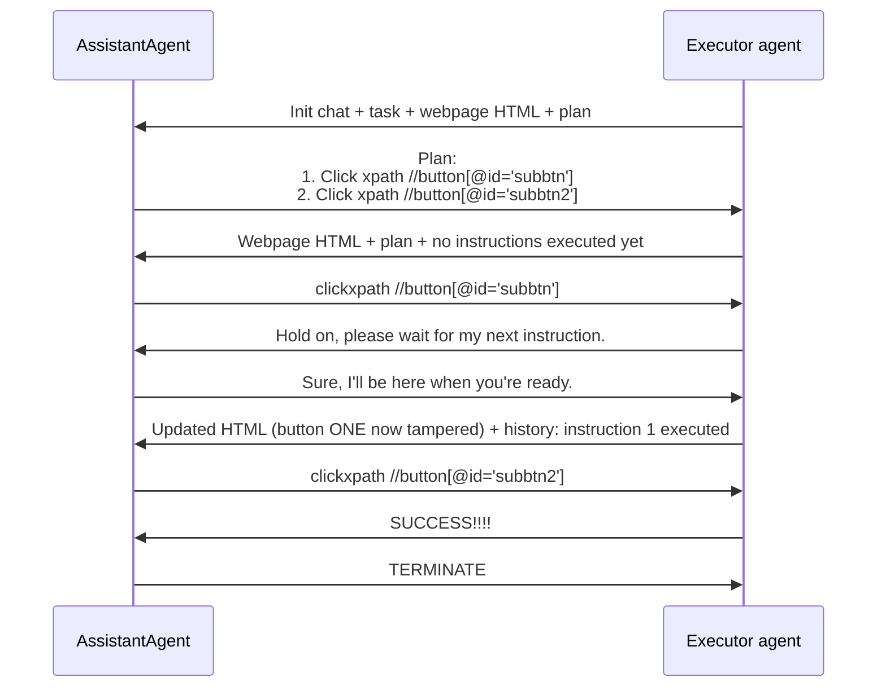

⚙️ Chunk 9 of the paper

## 📌 Application A1, Scenario 1: Autonomous Math Problem-Solving

> **Task prompt:** Completely simplify and rationalize the denominator:
> $$\frac{\sqrt{160}}{\sqrt{252}} \times \frac{\sqrt{245}}{\sqrt{108}}$$

### 🔬 Preliminary Test with CAMEL (Table 17)

CAMEL was set up with two roles — **Math Solver** (AI User) and **Python Programmer** (AI Assistant) — to collaboratively translate the math problem into a Python program.

**System setup**

- **Assistant role:** Python Programmer — tasked to write a program that accepts four integers, applies the square root to each, and simplifies/rationalizes the resulting fraction.
- **User role:** Math Solver — instructs the Python Programmer, never flips roles.
- **Original task:** simplify the given expression.
- **Specified task:** write a Python program that takes four integers, applies `sqrt`, and returns the simplified expression.

**Conversation excerpt**

| Turn | Speaker | Content |
|---|---|---|
| 1 | AI User | Instruction: Import the necessary libraries for the task. |
| 1 | AI Assistant | Imports `math` (for `sqrt`) and `fractions.Fraction` (for simplification): |

```python
import math
from fractions import Fraction
```

| Turn | Speaker | Content |
|---|---|---|
| 2 | AI User | Instruction: Define a function that accepts four integers as input. |
| 2 | AI Assistant | Defines a placeholder function: |

```python
def simplify_fraction(a, b, c, d):
    pass
```

| Turn | Speaker | Content |
|---|---|---|
| 3 | AI User | Instruction: Inside the function, apply the square root function to each of the input integers. |
| 3 | AI Assistant | Adds square-root computation: |

```python
def simplify_fraction(a, b, c, d):
    sqrt_a = math.sqrt(a)
    sqrt_b = math.sqrt(b)
    sqrt_c = math.sqrt(c)
    sqrt_d = math.sqrt(d)
```

| Turn | Speaker | Content |
|---|---|---|
| 4 | Human | **Abort** |

> ⚠️ **Limitation:** The resulting code cannot be executed, and the conversation continues without the roles converging on solving the problem or producing a final answer.

---

### 🔬 Preliminary Evaluation on MetaGPT (Table 18)

Given the same math prompt, MetaGPT instead interpreted the request as a **product-development task**, producing:

- **Product Goals**
  - Create a product that meets the needs of the target market
  - Ensure the product is efficient and easy to use
  - Achieve a high level of customer satisfaction

- **User Stories**
  - As a user, I want a product that is easy to navigate so that I can find what I need quickly
  - As a user, I want a product that is reliable and efficient so that I can depend on it
  - As a user, I want a product that meets my needs so that I can get value for my money
  - As a user, I want a product that is constantly updated and improved so that I can enjoy the best features
  - As a user, I want a product that offers good customer support so that I can get help when I need it

- **Competitive Analysis**
  - Product A: similar features but lacks efficiency
  - Product B: highly efficient but doesn't meet all target-market needs
  - Product C: high customer satisfaction but not easy to navigate
  - Product D: constantly updated but lacks reliability
  - Product E: good customer support but not efficient
  - Product F: reliable and efficient but lacks good customer support
  - Our Target Product: aims to combine all competitors' strengths while improving on their weaknesses

- A **Competitive Quadrant Chart** was also being generated when the run was aborted.

| Turn | Speaker | Content |
|---|---|---|
| — | Human | **Abort** |

> ⚠️ **Limitation:** MetaGPT does not solve the math problem at all — it defaults to producing a generic product-requirements document instead.

---

## 📌 Application A7: MiniWobChat on Web Manipulation

### 🔬 Example: "click-button-sequence" task (Table 19, AutoGen)

**Setup:** An autonomous computer-control agent executes atomic natural-language instructions of two types:

1. `type <text>` — types characters via keyboard (cursor must first be located with a `click` instruction).
2. `clickxpath <xpath>` — clicks an HTML element identified by a valid XPath.

**Target webpage HTML:**

```html
<div id="wrap" data-wob_ref="2" data-wob_eps="e0">
  <div id="query">Click button ONE, then click button TWO.</div>
  <div id="area" data-wob_ref="3" data-wob_eps="e0">
    <button id="subbtn" style="position:absolute;left:103px;top:87px" data-wob_ref="4" data-wob_eps="e0">ONE</button>
    <button id="subbtn2" style="position:absolute;left:44px;top:97px" data-wob_ref="5" data-wob_eps="e0">TWO</button>
  </div>
</div>
```

**Task:** Click button ONE, then click button TWO.

#### Agent interaction flow



**Outcome:** The AutoGen-based agent successfully completed both steps of the plan, ending with a `TERMINATE` signal after the executor confirmed success.
