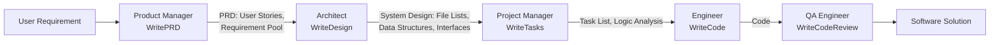

⚙️ Chunk 1 of the paper

# MetaGPT: Meta Programming for a Multi-Agent Collaborative Framework

**Authors:** Sirui Hong, Mingchen Zhuge, Jiaqi Chen, Xiawu Zheng, Yuheng Cheng, Ceyao Zhang, Jinlin Wang, Zili Wang, Steven Ka Shing Yau, Zijuan Lin, Liyang Zhou, Chenyu Ran, Lingfeng Xiao, Chenglin Wu, Jürgen Schmidhuber

**Venue:** Published as a conference paper at ICLR 2024
**Project:** https://github.com/geekan/MetaGPT

## 📌 Abstract

- LLM-based multi-agent systems can handle simple dialogue tasks, but complex tasks suffer from **logic inconsistencies** caused by cascading hallucinations from naive LLM chaining.
- **MetaGPT** is introduced as a meta-programming framework that embeds efficient human workflows into LLM-based multi-agent collaboration.
- Core mechanism: encodes **Standardized Operating Procedures (SOPs)** into prompt sequences, letting agents with human-like domain expertise verify intermediate results and cut down on errors.
- Uses an **assembly-line paradigm**: distinct roles are assigned to different agents, breaking complex tasks into subtasks handled collaboratively.
- On collaborative software engineering benchmarks, MetaGPT produces more coherent solutions than prior chat-based multi-agent systems.

---

## 1. Introduction

Autonomous LLM-based agents aim to enhance and replicate human workflows, but existing systems tend to oversimplify complexity and struggle with coherent, accurate, collaborative problem-solving.

> 🔬 **Key idea:** Humans rely on **Standardized Operating Procedures (SOPs)** to decompose tasks and coordinate teams. SOPs define role responsibilities and set standards for intermediate outputs — MetaGPT borrows this idea for multi-agent LLM systems.

Example given in the paper: in a software company, Product Managers analyze competition/user needs to write Product Requirement Documents (PRDs) in a standardized structure to guide development.

### Why SOPs matter for MetaGPT
- Requires agents to generate **structured outputs** (requirement docs, design artifacts, flowcharts, interface specs) rather than free-form chat.
- Structured intermediate outputs improve **consistency in communication**, reducing ambiguity/errors during collaboration.
- Reduces the risk of unproductive "idle chatter" hallucinations between role-playing agents — the paper humorously contrasts this with agents having pointless small talk like *"Hi, hello and how are you?"* vs *"Great! Have you had lunch?"*

### Meta-programming framing
- The paper defines **meta-programming** as "programming to program," distinct from meta-learning ("learning to learn").
- Related meta-programming lineage: CodeBERT, CodeLlama, WizardCoder.
- MetaGPT's distinction: a well-organized group of **specialized agents**, each with a specific role/expertise following established standards, enabling automatic requirement analysis, system design, code generation, modification, execution, and runtime debugging.

### 📊 Headline Results
- Evaluated on **HumanEval** and **MBPP** code generation benchmarks.
- Achieves new **state-of-the-art (SoTA)**: **85.9%** (HumanEval) and **87.7%** (MBPP) Pass@1.
- Compared against AutoGPT, LangChain, AgentVerse, and ChatDev for complex software project generation — MetaGPT handles higher software complexity with more extensive functionality.
- Achieves a **100% task completion rate** in experimental evaluations, showing robustness and efficiency (time & token cost).

### Contributions Summary
1. Introduces MetaGPT — a meta-programming framework for LLM-based multi-agent collaboration, with well-defined role definition and message-sharing mechanisms.
2. Integrates human-like SOPs to reduce unproductive agent collaboration; introduces a novel **executive feedback mechanism** that debugs/executes code at runtime (+5.4% absolute improvement on MBPP).
3. Achieves SoTA on HumanEval and MBPP, validating MetaGPT as a promising framework for LLM-based multi-agent systems.

---

## 2. Related Work

### 🔬 Automatic Programming
- Roots trace back to 1969's "PROW" system (predicate calculus → algorithms → LISP).
- Later contributions from Balzer (1985) and Soloway (1986).
- Modern NLP-driven approaches have grown automatic programming into an industry (e.g., Microsoft Copilot).
- LLM-agent approaches advancing the field:
  - **ReAct** and **Reflexion** — use chain-of-thought prompting to generate reasoning trajectories and action plans, demonstrating effectiveness of ReAct-style reasoning loops.
  - **ToolFormer** and **ToolLLM** — agents learning to use external tools via simple APIs.
  - Closely related prior work (Li et al., 2023) proposes a role-play framework for programming via inter-agent communication; Qian et al. (2023) uses multiple agents for software development.
- ⚠️ **Gap identified:** prior works improved productivity but did not fully exploit structured-output workflows, limiting their ability to handle complex software engineering issues.

### 🔬 LLM-Based Multi-Agent Frameworks
- Growing interest across industry/academia in LLM-based autonomous agents.
- **Stable-Alignment** — builds instruction datasets via consensus on value judgments through sandboxed multi-agent interactions.
- **Generative Agents** (Park et al., 2023) — simulates a "town" of 25 agents to study language interaction, social understanding, and collective memory.
- **Natural Language-Based Society of Mind (NL-SoM)** — agents with different functions interact through multiple rounds of "mindstorms" to solve complex tasks.
- Other work (Cai et al., 2023) reduces cost by pairing large models as tool-makers with small models as tool-users.
- Some works address cooperation/competition in planning and strategy, or propose LLM-based economies.
- ⚠️ **Distinction from MetaGPT:** most of this line of work focuses on open-world human behavior simulation, whereas MetaGPT focuses on injecting human software-development practice into multi-agent frameworks.
- Known challenges in LLM-agent collaboration: **repeated instructions** and **infinite message loops**, which are especially problematic in task-oriented collaboration requiring consistent, mutually beneficial interaction — this motivates MetaGPT's SOP-based design.

---

## 3. MetaGPT: A Meta-Programming Framework

Three main components:
- **§3.1** Role specialization, workflow, and structured communication within SOPs.
- **§3.2** Communication protocol for efficient role communication (structured interfaces + publish-subscribe mechanism).
- **§3.3** Executable feedback — a self-correction mechanism improving runtime code generation quality.

### 3.1 Agents in Standard Operating Procedures

**Specialization of Roles**
- Complex work is broken into smaller tasks via unambiguous role specialization.
- MetaGPT defines **five roles** in its simulated software company:

| Role | Responsibility |
|---|---|
| Product Manager | Business-oriented analysis, writes PRD (Action: WritePRD) |
| Architect | Translates requirements into system design (file lists, data structures, interfaces) |
| Project Manager | Task distribution (Action: WriteTasks) |
| Engineer | Executes designated classes/functions; writes & debugs code |
| QA Engineer | Writes test cases, enforces code quality (Action: WriteCodeReview) |

- Each agent has a defined **profile**: name, profile/role, goal, and constraints, plus initialized context and skills.
  - Example: Product Manager can use web search tools; Engineer can execute code.
- All agents follow **ReAct-style behavior** (Yao et al., 2022): every agent monitors the environment (the shared message pool) for observations that trigger actions or assist task completion.

**Workflow across Agents**
- Roles + operational skills → basic workflows.
- MetaGPT follows the software-development SOP, enabling agents to work **sequentially**:
  1. Product Manager analyzes user requirements → writes detailed **PRD** (User Stories + Requirement Pool).
  2. PRD passed to **Architect** → produces system design (File Lists, Data Structures, Interface Definitions).
  3. System design passed to **Project Manager** → distributes tasks.
  4. **Engineers** execute designated classes/functions.
  5. **QA Engineer** writes test cases to enforce code quality.
  6. Final output: a complete software solution.

🖼️ **Figure 1:** Side-by-side comparison of the MetaGPT agent collaboration pipeline (Define → Design → Plan & Code → Test → Acceptance Check) against a human boss giving a one-line requirement ("Write a classic and simple Flappy Bird game") and later approving the finished product.

🖼️ **Figure 2 (left):** Diagram of the communication protocol — agents publish structured messages (with content, instruction, cause_by, sent_from, send_to fields) to a **shared message pool**; other agents subscribe to relevant messages based on their profile. Tools shown: web search tool, debugging tool, diagram tool.

🖼️ **Figure 2 (right):** Diagram of iterative programming with **executable feedback** — the Engineer agent (profile "Alex," goal: write elegant/readable/extensible/efficient PEP8-conformant code) writes code, executes it, and if errors occur, retrieves relevant past messages (PRD, System Design, Code) from memory to debug.

🖼️ **Figure 3:** Detailed schematic of the full software development process (2048 game example) showing Architect's program call flow diagrams and file list, Engineer's code output, Product Manager's product goals/user stories/competitive analysis (with a competitive quadrant chart), Project Manager's task list and logic analysis, and QA Engineer's code review — culminating in direct human interaction with the finished game.

### 3.2 Communication Protocol

**Structured Communication Interfaces**
- Most current LLM-based multi-agent frameworks rely on **unconstrained natural language** for communication.
- ⚠️ Open question the paper raises: is pure natural language communication sufficient for solving complex tasks? The paper draws an analogy to the "telephone game" (message distortion through repeated relay) to motivate structured alternatives.

*(Section continues in the next chunk.)*
