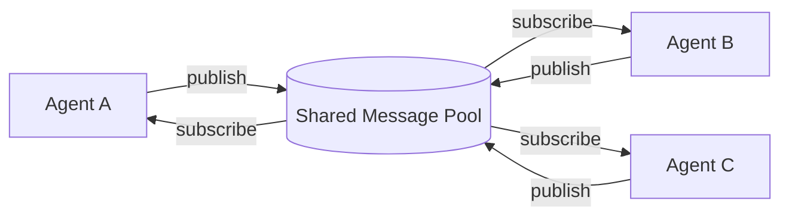
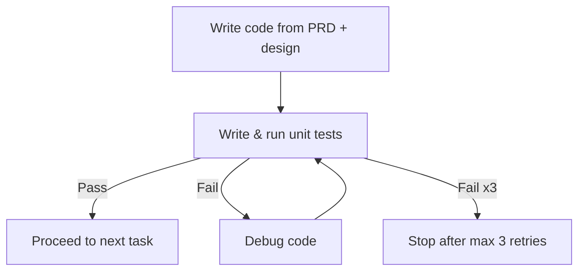

⚙️ Chunk 2 of the paper

## 3.2 Structured Communication (continued)

> 📌 **Key Point:** Free-form dialogue between agents degrades information over multiple rounds — similar to the "Chinese whispers" effect — so MetaGPT instead uses structured, role-specific outputs.

Drawing on human organizational structures, MetaGPT formalizes agent-to-agent communication with a defined **schema and format per role**, so each agent produces outputs tailored to its responsibilities.

- The **Architect** agent produces two structured deliverables:
  - A system interface design
  - A sequence flow diagram
- These artifacts capture module design and interaction order, and serve as key inputs for the **Engineer** role.
- Unlike ChatDev, which relies on dialogue, MetaGPT agents exchange **documents and diagrams** — structured outputs that reduce ambiguity and omission.

### 🔬 Publish-Subscribe Mechanism

Efficient information sharing is central to multi-agent collaboration. Architects and Engineers, for example, frequently need to consult Product Requirement Documents (PRDs).

- Prior approaches exchanged this information one-to-one, which made the communication topology unwieldy and inefficient.
- MetaGPT's solution: a **shared global message pool** where every agent can publish and retrieve messages directly, without needing to query other agents and wait for replies.

⚠️ **Limitation:** Broadcasting all information to all agents risks information overload, since agents generally only need task-relevant content.

**Subscription mechanism:** to solve the overload problem, each agent subscribes to information relevant to its role profile rather than receiving everything.

- An agent's action only fires once all of its prerequisite dependencies have arrived.
- Example: the Architect primarily follows PRDs from the Product Manager, while output from the QA Engineer is comparatively low priority for that role.

---

## 3.3 Iterative Programming with Executable Feedback

Debugging and optimization are core to real-world programming, yet many prior multi-agent methods lack a genuine self-correction loop, resulting in code that ultimately fails to run.

- Earlier non-executable review/self-reflection approaches still struggled with **runtime correctness**, since LLM hallucination could cause errors to slip past a purely textual review.
- MetaGPT's fix: an **executable feedback mechanism** that lets the Engineer iteratively refine code using actual execution results.

**Workflow:**
1. Engineer writes code based on the PRD and design documents.
2. Engineer writes and runs unit tests against the code.
3. If tests pass → move on to the next development task.
4. If tests fail → debug the code and retry.
5. Loop continues until tests pass or a **maximum of 3 retries** is reached.

---

## 4. Experiments

### 4.1 Experimental Setting

**📊 Datasets**

| Dataset | Size | Description |
|---|---|---|
| HumanEval | 164 tasks | Handwritten programming problems with specs, descriptions, reference code, and tests |
| MBPP | 427 tasks | Python tasks covering core concepts/standard library, with descriptions, reference code, and automated tests |
| SoftwareDev (self-generated) | 70 tasks | Diverse, realistic software development tasks (mini-games, image processing, data visualization, etc.), focused on engineering rather than isolated functions |

For the comparison experiments, seven representative SoftwareDev tasks were sampled for evaluation.

**Evaluation Metrics**

- HumanEval / MBPP: the unbiased **Pass@k** metric is used to measure functional correctness of the top-k generated solutions:

$$\text{Pass@}k = \mathbb{E}_{\text{Problems}}\left[1 - \frac{\binom{n-c}{k}}{\binom{n}{k}}\right]$$

- SoftwareDev: evaluated through a mix of human judgment and statistical analysis across five dimensions:

| Metric | What it captures |
|---|---|
| (A) Executability | Human-rated code quality, 1 (non-functional) → 4 (flawless) |
| (B) Cost | Running time, token usage, and expense |
| (C) Code Statistics | Number of code files, lines per file, total lines |
| (D) Productivity | Tokens consumed per line of code (token usage ÷ lines of code) |
| (E) Human Revision Cost | Number of manual fixes needed (e.g. import errors, wrong class names, broken reference paths); each fix typically touches up to 3 lines |

**Baselines**

- Domain-specific code-generation LLMs: AlphaCode, Incoder, CodeGeeX, CodeGen, Codex, CodeT.
- General-purpose LLMs: PaLM, GPT-4.
- Some baseline numbers (e.g. Incoder, CodeGeeX) were taken from prior published work rather than re-run.
- Prompts for HumanEval/MBPP were slightly adjusted to fit Python-specific response formatting.
- On SoftwareDev, MetaGPT is compared against AutoGPT, LangChain (with a Python REPL tool), AgentVerse, and ChatDev.

---

### 4.2 Main Result

🖼️ **Figure 4:** Bar chart comparing Pass@1 on MBPP and HumanEval across methods. Scores rise from AlphaCode (17.1% HumanEval) through Incoder, CodeGeeX variants, PaLM Coder, Codex, Codex+CodeT, and GPT-4 (67.0% HumanEval), up to **MetaGPT without feedback** (81.7% HumanEval / 82.3% MBPP) and **full MetaGPT** (85.9% HumanEval / 87.7% MBPP) — the highest scores shown.

> 📌 MetaGPT outperforms every prior method on both benchmarks, and its combination with GPT-4 produces a large jump over plain GPT-4's Pass@1.

On the harder **SoftwareDev** benchmark, MetaGPT also beats ChatDev on nearly every metric:

**Table 1 — Statistical analysis on SoftwareDev**

| Statistical Index | ChatDev | MetaGPT (w/o Feedback) | MetaGPT |
|---|---|---|---|
| (A) Executability | 2.25 | 3.67 | **3.75** |
| (B) Cost#1: Running Time (s) | 762 | **503** | 541 |
| (B) Cost#2: Token Usage | 19,292 | 24,613 | 31,255 |
| (C) Code Files | 1.9 | 4.6 | **5.1** |
| (C) Lines of Code per File | 40.8 | 42.3 | **49.3** |
| (C) Total Code Lines | 77.5 | 194.6 | **251.4** |
| (D) Productivity (tokens/line) | 248.9 | 126.5 | **124.3** |
| (E) Human Revision Cost | 2.5 | 2.25 | **0.83** |

Notable takeaways:

- Executability of **3.75** is very close to the maximum "flawless" score of 4.
- MetaGPT finishes faster than ChatDev (503–541s vs 762s).
- Despite using more total tokens than ChatDev, MetaGPT is far more token-efficient **per line of code** (124–127 tokens/line vs ChatDev's 249).
- Human revision effort drops sharply with MetaGPT, especially with the feedback mechanism enabled (0.83 vs 2.25–2.5).

🖼️ **Figure 5:** A grid of screenshots showing example software artifacts autonomously generated by MetaGPT — including a sentiment analysis tool, data analysis/visualization tools, small games, a music website, an Excel data processor, a CSV processor, and other utility apps.

---

### 4.3 Capabilities Analysis

Compared to AutoGPT, LangChain, AgentVerse, and ChatDev, MetaGPT supports a broader set of software-engineering-specific capabilities, driven by its **Standard Operating Procedures (SOPs)** — role specialization, structured communication, and a defined workflow.

**Table 2 — Capability comparison**

| Capability | AutoGPT | LangChain | AgentVerse | ChatDev | MetaGPT |
|---|:---:|:---:|:---:|:---:|:---:|
| PRD generation | ✗ | ✗ | ✗ | ✗ | ✅ |
| Technical design generation | ✗ | ✗ | ✗ | ✗ | ✅ |
| API interface generation | ✗ | ✗ | ✗ | ✗ | ✅ |
| Code generation | ✅ | ✅ | ✅ | ✅ | ✅ |
| Precompilation execution | ✗ | ✗ | ✗ | ✗ | ✅ |
| Role-based task management | ✗ | ✗ | ✗ | ✅ | ✅ |
| Code review | ✗ | ✗ | ✅ | ✅ | ✅ |

> Other frameworks could plausibly adopt SOP-style designs too — the authors compare this to how chain-of-thought prompting has been layered onto general LLMs.

---

### 4.4 Ablation Study

**🔬 Effectiveness of Roles**

Two tasks (code generation + statistics calculation) were used to test how adding roles beyond a lone Engineer affects output quality.

**Table 3 — Role ablation** (✅ = role included)

| Engineer | Product Manager | Architect | Project Manager | # Agents | Avg. Lines | Expense | Revisions | Executability |
|:---:|:---:|:---:|:---:|:---:|---:|---:|---:|---:|
| ✅ | ✗ | ✗ | ✗ | 1 | 83.0 | $0.915 | 10 | 1.0 |
| ✅ | ✅ | ✗ | ✗ | 2 | 112.0 | $1.059 | 6.5 | 2.0 |
| ✅ | ✅ | ✅ | ✗ | 3 | 143.0 | $1.204 | 4.0 | 2.5 |
| ✅ | ✅ | ✗ | ✅ | 3 | 205.0 | $1.251 | 3.5 | 2.0 |
| ✅ | ✅ | ✅ | ✅ | 4 | 191.0 | $1.385 | 2.5 | **4.0** |

- Removing all roles except Engineer produces non-functional code.
- Adding each additional role steadily improves both revision cost and executability.
- Costs rise only modestly as roles are added, while output quality improves substantially — supporting the value of role specialization.

**🔬 Effectiveness of the Executable Feedback Mechanism**

- Adding executable feedback raises Pass@1 by **+4.2%** (HumanEval) and **+5.4%** (MBPP).
- It also improves SoftwareDev executability (3.67 → 3.75) and cuts human revision cost (2.25 → 0.83).
- Additional quantitative detail is provided in Table 4 and Table 9 (not included in this chunk).

---

## 5. Conclusion

MetaGPT is a meta-programming framework that applies **Standard Operating Procedures (SOPs)** to multi-agent LLM systems, modeling a team of agents as a simulated software company — in the same spirit as prior simulated-society and simulated-agent work (e.g. generative agent towns, Voyager's Minecraft sandbox).

- Combines role specialization, workflow management, and efficient information sharing (message pools + subscriptions) into a flexible, portable multi-agent platform.
- Uses an executable feedback loop to improve code quality at runtime.
- Achieves state-of-the-art results across the benchmarks tested.
- The authors frame human-inspired SOPs as a promising direction for future multi-agent research, and position this work as an early step toward **regulating** LLM-based multi-agent frameworks (see Appendix A, not included in this chunk).

---

## Acknowledgements

The authors thank several individuals (from KAUST AI Initiative and DeepWisdom) for help polishing the text, drafting the outlook appendix, providing feedback, and supplying illustrative material.

## Author Contributions

Contributions are broken out across the author list, covering: experiment execution and the executable feedback module design; the self-improvement module; MBPP and HumanEval experiments; evaluation metric design; comparisons to open-source baselines; figure creation; and overall project leadership/advising (including the CEO of DeepWisdom, who initiated the project and made the largest code contributions, and an academic advisor from KAUST/IDSIA).

## References (partial — as included in this chunk)

- Akata et al. — *Playing repeated games with large language models*, arXiv preprint, 2023.
- Austin et al. — *Program synthesis with large language models*, 2021.
- Bakhtin et al. — *Human-level play in the game of diplomacy by combining language models with strategic reasoning*, Science, 2022.
- Balzer — *A 15 year perspective on automatic programming*, TSE, 1985.
- Belbin — *Team Roles at Work*, Routledge, 2012.
- Cai et al. — *Large language models as tool makers*, arXiv preprint, 2023.
- Chase — *LangChain*, GitHub, 2022.
- Chen, B. et al. — *CodeT: Code generation with generated tests*, 2022.
- Chen, J. et al. — *S-agents: self-organizing agents in open-ended environment*, arXiv preprint, 2024.
- Chen, M. et al. — *Evaluating large language models trained on code*, 2021.

*(Reference list continues beyond this chunk.)*
