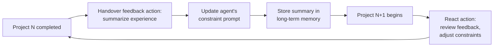

⚙️ Chunk 3 of the paper

## 📚 References (continued)

- Weize Chen, Yusheng Su, Jingwei Zuo, Cheng Yang, Chenfei Yuan, Chen Qian, Chi-Min Chan, Yujia Qin, Yaxi Lu, Ruobing Xie, Zhiyuan Liu, Maosong Sun, and Jie Zhou. *Agentverse: Facilitating multi-agent collaboration and exploring emergent behaviors in agents*, 2023.
- Xinyun Chen, Chang Liu, and Dawn Song. *Execution-guided neural program synthesis*. ICLR, 2018.
- Xinyun Chen, Dawn Song, and Yuandong Tian. *Latent execution for neural program synthesis beyond domain-specific languages*. NeurIPS, 2021b.
- Aakanksha Chowdhery et al. *PaLM: Scaling language modeling with pathways*, 2022.
- T. DeMarco and T.R. Lister. *Peopleware: Productive Projects and Teams*. Addison-Wesley, 2013.
- Yihong Dong, Xue Jiang, Zhi Jin, and Ge Li. *Self-collaboration code generation via ChatGPT*. arXiv preprint, 2023.
- Yilun Du, Shuang Li, Antonio Torralba, Joshua B. Tenenbaum, and Igor Mordatch. *Improving factuality and reasoning in language models through multiagent debate*, 2023.
- Yanai Elazar, Nora Kassner, Shauli Ravfogel, Abhilasha Ravichander, Eduard Hovy, Hinrich Schütze, and Yoav Goldberg. *Measuring and improving consistency in pretrained language models*. TACL, 2021.
- Zhangyin Feng et al. *CodeBERT: A pre-trained model for programming and natural languages*. arXiv preprint, 2020.
- Chrisantha Fernando, Dylan Banarse, Henryk Michalewski, Simon Osindero, and Tim Rocktäschel. *Promptbreeder: Self-referential self-improvement via prompt evolution*. arXiv preprint, 2023.
- Chelsea Finn, Pieter Abbeel, and Sergey Levine. *Model-agnostic meta-learning for fast adaptation of deep networks*. ICML, 2017.
- Daniel Fried et al. *InCoder: A generative model for code infilling and synthesis*. arXiv preprint, 2022.
- Irving John Good. *Speculations concerning the first ultraintelligent machine*. Adv. Comput., 1965.
- Rui Hao, Linmei Hu, Weijian Qi, Qingliu Wu, Yirui Zhang, and Liqiang Nie. *ChatLLM network: More brains, more intelligence*. arXiv preprint, 2023.
- S. Hochreiter, A. S. Younger, and P. R. Conwell. *Learning to learn using gradient descent*. ICANN, Springer, 2001, pp. 87–94.
- Sirui Hong et al. *Data interpreter: An LLM agent for data science*. arXiv:2402.18679, 2024.
- Xue Jiang, Yihong Dong, Lecheng Wang, Qiwei Shang, and Ge Li. *Self-planning code generation with large language model*. arXiv preprint, 2023.
- Guohao Li, Hasan Abed Al Kader Hammoud, Hani Itani, Dmitrii Khizbullin, and Bernard Ghanem. *CAMEL: Communicative agents for "mind" exploration of large scale language model society*. arXiv preprint, 2023.
- Yujia Li et al. *Competition-level code generation with AlphaCode*. Science, 2022.
- Tian Liang, Zhiwei He, Wenxiang Jiao, Xing Wang, Yan Wang, Rui Wang, Yujiu Yang, Zhaopeng Tu, and Shuming Shi. *Encouraging divergent thinking in large language models through multiagent debate*. arXiv preprint, 2023.
- Bill Yuchen Lin et al. *SwiftSage: A generative agent with fast and slow thinking for complex interactive tasks*. arXiv preprint, 2023.
- Ruibo Liu, Ruixin Yang, Chenyan Jia, Ge Zhang, Denny Zhou, Andrew M Dai, Diyi Yang, and Soroush Vosoughi. *Training socially aligned language models in simulated human society*. arXiv preprint, 2023a.
- Yuliang Liu et al. *ML-Bench: Large language models leverage open-source libraries for machine learning tasks*. arXiv:2311.09835, 2023b.
- Ziyang Luo et al. *WizardCoder: Empowering code large language models with Evol-Instruct*. arXiv preprint, 2023.
- Potsawee Manakul, Adian Liusie, and Mark JF Gales. *SelfCheckGPT: Zero-resource black-box hallucination detection for generative large language models*. arXiv preprint, 2023.
- Agile Manifesto. *Manifesto for agile software development*. Snowbird, UT, 2001.
- John McCarthy. *History of Lisp*. In *History of Programming Languages*, 1978.
- Niklas Muennighoff et al. *OctoPack: Instruction tuning code large language models*. arXiv:2308.07124, 2023.
- Ansong Ni, Srini Iyer, Dragomir Radev, Veselin Stoyanov, Wen-tau Yih, Sida Wang, and Xi Victoria Lin. *Lever: Learning to verify language-to-code generation with execution*. ICML, 2023.
- Erik Nijkamp et al. *CodeGen: An open large language model for code with multi-turn program synthesis*, 2023.
- OpenAI. *GPT-4 technical report*, 2023.
- Joon Sung Park, Joseph C O'Brien, Carrie J Cai, Meredith Ringel Morris, Percy Liang, and Michael S Bernstein. *Generative agents: Interactive simulacra of human behavior*. arXiv preprint, 2023.
- Chen Qian, Xin Cong, Cheng Yang, Weize Chen, Yusheng Su, Juyuan Xu, Zhiyuan Liu, and Maosong Sun. *Communicative agents for software development*, 2023.
- Yujia Qin et al. *ToolLLM: Facilitating large language models to master 16000+ real-world APIs*. arXiv:2307.16789, 2023.
- Baptiste Rozière et al. *Code Llama: Open foundation models for code*. arXiv preprint, 2023.
- Timo Schick, Jane Dwivedi-Yu, Roberto Dessì, Roberta Raileanu, Maria Lomeli, Luke Zettlemoyer, Nicola Cancedda, and Thomas Scialom. *Toolformer: Language models can teach themselves to use tools*. arXiv preprint, 2023.
- J. Schmidhuber. *A self-referential weight matrix*. ICANN, Springer, 1993a, pp. 446–451.
- J. Schmidhuber. *Gödel machines: self-referential universal problem solvers making provably optimal self-improvements*. Technical Report IDSIA-19-03, arXiv:cs.LO/0309048 v3, IDSIA, 2003.
- J. Schmidhuber. *Gödel machines: Fully self-referential optimal universal self-improvers*. In *Artificial General Intelligence*, Springer, 2006, pp. 199–226.
- J. Schmidhuber. *Ultimate cognition à la Gödel*. Cognitive Computation, 1(2):177–193, 2009.
- Jürgen Schmidhuber. *Evolutionary principles in self-referential learning, or on learning how to learn: the meta-meta-... hook*. PhD thesis, 1987.
- Jürgen Schmidhuber. *A 'self-referential' weight matrix*. ICANN, 1993b.
- Jürgen Schmidhuber. *On learning to think: Algorithmic information theory for novel combinations of reinforcement learning controllers and recurrent neural world models*. arXiv preprint, 2015.
- Jürgen Schmidhuber, Jieyu Zhao, and Nicol N Schraudolph. *Reinforcement learning with self-modifying policies*. In *Learning to Learn*, 1998.
- Noah Shinn, Beck Labash, and Ashwin Gopinath. *Reflexion: an autonomous agent with dynamic memory and self-reflection*. arXiv preprint, 2023.
- Marta Skreta, Naruki Yoshikawa, Sebastian Arellano-Rubach, Zhi Ji, Lasse Bjørn Kristensen, Kourosh Darvish, Alan Aspuru-Guzik, Florian Shkurti, and Animesh Garg. *Errors are useful prompts: Instruction guided task programming with verifier-assisted iterative prompting*. arXiv preprint, 2023.
- Elliot Soloway. *Learning to program = learning to construct mechanisms and explanations*. Communications of the ACM, 1986.
- Yashar Talebirad and Amirhossein Nadiri. *Multi-agent collaboration: Harnessing the power of intelligent LLM agents*, 2023.
- Xiangru Tang, Bill Qian, Rick Gao, Jiakang Chen, Xinyun Chen, and Mark Gerstein. *BioCoder: A benchmark for bioinformatics code generation with contextual pragmatic knowledge*. arXiv:2308.16458, 2023a.
- Xiangru Tang, Anni Zou, Zhuosheng Zhang, Yilun Zhao, Xingyao Zhang, Arman Cohan, and Mark Gerstein. *MedAgents: Large language models as collaborators for zero-shot medical reasoning*. arXiv:2311.10537, 2023b.
- Torantulino et al. *Auto-GPT*. https://github.com/Significant-Gravitas/Auto-GPT, 2023.
- R. J. Waldinger and R. C. T. Lee. *PROW: a step toward automatic program writing*. IJCAI, 1969.
- Guanzhi Wang, Yuqi Xie, Yunfan Jiang, Ajay Mandlekar, Chaowei Xiao, Yuke Zhu, Linxi Fan, and Anima Anandkumar. *Voyager: An open-ended embodied agent with large language models*. arXiv preprint, 2023a.
- Lei Wang et al. *A survey on large language model based autonomous agents*. arXiv preprint, 2023b.
- Xuezhi Wang, Jason Wei, Dale Schuurmans, Quoc Le, Ed Chi, Sharan Narang, Aakanksha Chowdhery, and Denny Zhou. *Self-consistency improves chain of thought reasoning in language models*. arXiv preprint, 2022.
- Zhenhailong Wang, Shaoguang Mao, Wenshan Wu, Tao Ge, Furu Wei, and Heng Ji. *Unleashing cognitive synergy in large language models: A task-solving agent through multi-persona self-collaboration*. arXiv preprint, 2023c.
- Jason Wei, Xuezhi Wang, Dale Schuurmans, Maarten Bosma, Fei Xia, Ed Chi, Quoc V Le, Denny Zhou, et al. *Chain-of-thought prompting elicits reasoning in large language models*. NeurIPS, 2022.
- Michael Wooldridge and Nicholas R. Jennings. *Pitfalls of agent-oriented development*. 2nd Intl. Conf. on Autonomous Agents, 1998.
- Shunyu Yao, Jeffrey Zhao, Dian Yu, Nan Du, Izhak Shafran, Karthik Narasimhan, and Yuan Cao. *ReAct: Synergizing reasoning and acting in language models*. arXiv preprint, 2022.
- Eric Zelikman, Eliana Lorch, Lester Mackey, and Adam Tauman Kalai. *Self-taught optimizer (STOP): Recursively self-improving code generation*. arXiv preprint, 2023.
- Hongxin Zhang, Weihua Du, Jiaming Shan, Qinhong Zhou, Yilun Du, Joshua B Tenenbaum, Tianmin Shu, and Chuang Gan. *Building cooperative embodied agents modularly with large language models*. arXiv preprint, 2023a.
- Zhuosheng Zhang et al. *Igniting language intelligence: The hitchhiker's guide from chain-of-thought reasoning to language agents*. arXiv:2311.11797, 2023b.
- Xufeng Zhao, Mengdi Li, Cornelius Weber, Muhammad Burhan Hafez, and Stefan Wermter. *Chat with the environment: Interactive multimodal perception using large language models*. arXiv preprint, 2023.
- Qinkai Zheng et al. *CodeGeeX: A pre-trained model for code generation with multilingual evaluations on HumanEval-X*, 2023.
- Shuyan Zhou, Frank F Xu, Hao Zhu, Xuhui Zhou, Robert Lo, Abishek Sridhar, Xianyi Cheng, Yonatan Bisk, Daniel Fried, Uri Alon, et al. *WebArena: A realistic web environment for building autonomous agents*. arXiv preprint, 2023a.
- Wangchunshu Zhou et al. *Agents: An open-source framework for autonomous language agents*. arXiv:2309.07870, 2023b.
- Mingchen Zhuge, Haozhe Liu, Francesco Faccio, Dylan R Ashley, Robert Csordás, Anand Gopalakrishnan, Abdullah Hamdi, Hasan Abed Al Kader Hammoud, Vincent Herrmann, Kazuki Irie, et al. *Mindstorms in natural language-based societies of mind*. arXiv preprint, 2023.

---

## A. Outlook

### A.1 Self-Improvement Mechanisms

> 📌 **Key Point:** The current MetaGPT implementation treats each software project independently — teams don't yet accumulate experience across projects.

Ideally, a software development team would learn from each completed project, becoming progressively more compatible and effective over time. This connects to the long-standing idea of **recursive self-improvement**:

- First proposed informally in 1965 (Good, 1965)
- First concrete implementations from 1987 onward (Schmidhuber, 1987; 1993b; Schmidhuber et al., 1998)
- Culminating in formal notions of mathematically optimal self-referential self-improvers (Schmidhuber, 2003; 2009)

The general principle: a system learns from real-world experience, meta-learns better learning algorithms from its learning experiences, and meta-meta-learns better meta-learning algorithms — recursively, bounded only by computability and physics.

More recent LLM-focused work applies this idea by recursively refining prompts to improve downstream task performance (Fernando et al., 2023; Zelikman et al., 2023), echoing the 2015 concept of an adaptive prompt engineer — one network learning to generate queries/prompts to help another network learn faster (Schmidhuber, 2015).

#### 🔬 Method: Self-Referential Constraint Updates in MetaGPT

The authors' initial implementation of a self-referential mechanism works as follows:

1. **Handover feedback action** — each agent critically summarizes information gathered during a completed project.
2. This summary is folded into an **updated constraint prompt** for that agent.
3. Summaries are stored in **long-term memory**, inheritable by future constraint updates.
4. At the start of a new project, each agent runs a **react action**, reviewing prior feedback and adjusting its constraint prompt accordingly.

> ⚠️ **Limitation:** These summary-based optimizations currently only adjust **role specialization constraints** (Sec. 3.1), not the **structured communication interfaces** defined in the communication protocols (Sec. 3.2). Extending self-improvement to protocol structure remains future work.

### A.2 Multi-Agent Economies

> 📌 **Key Point:** Real-world team collaboration procedures (SOPs) aren't fixed — they evolve dynamically. MetaGPT's current SOP is hardcoded.

One proposed mechanism for such self-organization is the **"Economy of Minds" (EOM)** framework, introduced in the *Natural Language-Based Society of Mind* (NLSOM) paper (Zhuge et al., 2023):

- Rather than optimizing total system reward via neural network parameter updates (as in standard RL), EOM applies **free-market supply-and-demand principles** to assign credit (money) to agents that contribute to economic success (reward).

#### 📊 Related Platform: AgentStore (DeepWisdom)

- Compatible with the EOM credit-assignment concept.
- Each agent lists its **services with associated costs**.
- A public API lets human users or other agents **purchase services** from agents to accomplish tasks.
- Individual developers can build and contribute new agents, enabling **community-driven collaborative development**.
- Users can **subscribe to agents** based on their needs.

🖼️ Figure 6: Screenshot of the AgentStore user interface, showcasing various agents with different skills available for use/subscription.

*(Platform reference: http://beta.deepwisdom.ai)*
