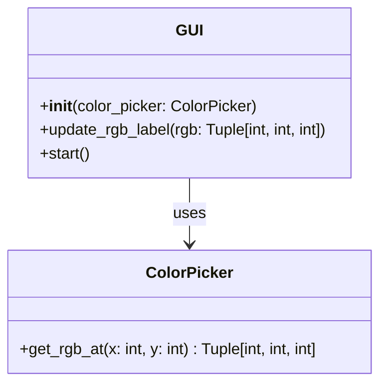
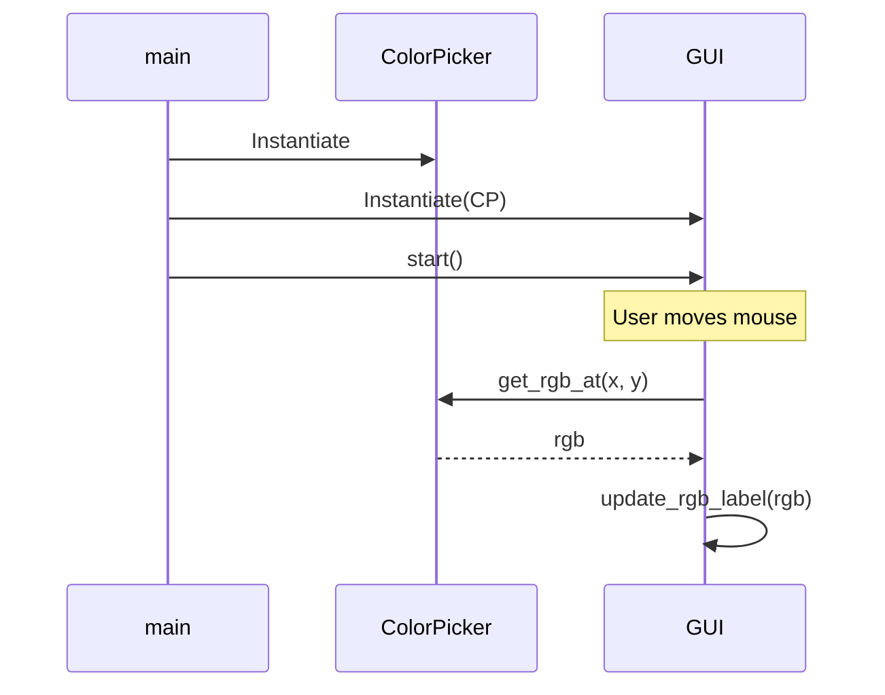

⚙️ Chunk 4 of the paper

## AgentStore

Users can pay according to their usage, and can purchase additional capabilities to expand the plug-and-play functions of their existing agents, allowing them to gradually upgrade their agents. Within the MetaGPT framework, AgentStore supports collaboration between various agents — users can collect several agents together to carry out more complex tasks or projects, with all agents sharing and complying with the development and communication protocols defined in MetaGPT.

🖼️ **Figure 6:** Screenshot of the AgentStore platform interface, showing a "Conversations" panel with various agent avatars (e.g., Marvin Minsky, ML Engineer, Comic Artist, Tutorial Assistant, Equity Analyst), an "Agents" marketplace panel with filter tabs (Official Selection, Western Celebrity, Historical Figure, Movie & TV) and agent cards showing usage stats, and a "Celebrities' Planet" panel with chat-style character cards.

> 📌 **Key Point:** AgentStore is positioned as an operational marketplace layer on top of MetaGPT, letting users manage agents with different emotions, personalities, and capabilities for specific tasks.

---

## Appendix B: A Demo of the Execution

This section walks through the complete MetaGPT software development process, starting from a user's input command and ending with software built to specification.

### B.1 User Input

Once MetaGPT receives an instruction, it collaborates with a simulated professional development team to complete the task.

**Example user input:**
```
write a python3 GUI app such that you can draw an image with it
```

### B.2 MetaGPT Development Process

A step-by-step account of the standardized output produced by each agent role follows.

#### 🧑‍💼 Product Manager

The Product Manager produces a **Product Requirement Document (PRD)** covering goals, user stories, competitive analysis, requirement analysis, and the requirement pool, plus a competitive quadrant chart (Figure 7). This is then passed to the architect for system design.

**Example PRD (for a color-meter app variant):**

- **Original Requirements:** A Python3 GUI color meter that outputs RGB values as it moves.
- **Product Goals:**
  1. Create a user-friendly GUI color meter
  2. Ensure the color meter accurately outputs RGB values
  3. Ensure the color meter updates RGB values in real-time as it moves
- **User Stories:**
  - As a user, I want to select any color on the screen, so I can get its RGB values
  - As a user, I want RGB values to update in real-time as I move the color meter
  - As a user, I want a simple, intuitive interface
- **Competitive Analysis:**

| Product | Strengths | Weaknesses |
|---|---|---|
| Color Cop | Simple, easy to use | No real-time RGB updates |
| Just Color Picker | Real-time picking, multiple formats | Cluttered interface |
| Instant Eyedropper | Convenient system-tray tool | Lacks advanced features |
| ColorZilla | Convenient for web design | Not suitable for desktop apps |
| ColorPic | Feature-rich (palettes, mixer) | Overwhelming for simple tasks |

🖼️ **Figure 7:** Quadrant chart titled "Reach and engagement of campaigns," plotting competitor tools (Corel Painter, Adobe Photoshop, Krita, SketchBook, GIMP, Paint.NET, MS Paint) and "Our Target Product" across axes of Reach (low→high) and Engagement (low→high), divided into quadrants: *Need to promote*, *We should expand*, *Re-evaluate*, *May be improved*.

**Full PRD text block:**

- **Requirement Analysis:** The product should be a Python3 GUI application serving as a color meter, allowing users to select any color on screen and view corresponding RGB values, updating in real time, with a simple and user-friendly interface.
- **Requirement Pool:**

| Requirement | Priority |
|---|---|
| Design a user-friendly GUI for the color meter | P0 |
| Implement color selection functionality | P0 |
| Display RGB values of the selected color | P0 |
| Update RGB values in real-time as the color meter moves | P0 |
| Test the application for accuracy and performance | P1 |

- **UI Design draft:** Minimalistic and intuitive — primarily a color meter (a magnified screen area the user can move), with prominently displayed, real-time-updating RGB values. Clean, uncluttered layout focused on functionality and ease of use.
- **Anything UNCLEAR:** None.

#### 🏗️ Architect

Based on the PRD, the Architect devises technical specifications — system architecture diagrams and interface definitions. It first sets the overarching technical trajectory, then designs the project's architecture (files, classes — Figure 8) and the sequence flow chart (Figure 9/12). This documentation then passes to the project manager for task allocation.

**System design output:**

- **Implementation approach:** Use Python's **Tkinter** for the GUI (standard, simple, powerful enough). Use **PIL/Pillow** to capture screen pixel data for color selection — moving the mouse retrieves RGB values under the cursor in real time. RGB values display via Tkinter's `Label` widget, updated in real time using Python's **threading** library. Testing performed with Python's **unittest** library.
- **Python package name:** `color_meter`
- **File list:**
  - `main.py`
  - `color_picker.py`
  - `gui.py`
  - `tests.py`
- **Anything UNCLEAR:** None — requirement is clear.

🖼️ **Figure 8 (converted to class diagram):**



**Figure 9 — program call flow (sequence diagram):**



#### 📋 Project Manager

The Project Manager breaks the project into a task list. Each code file is analyzed for its intended functionality and assigned as a separate task to Engineers.

**Tasks output:**

- **Required Python third-party packages:**
  - `tkinter==8.6`
  - `Pillow==8.3.1`
- **Required Other language third-party packages:** None.
- **Full API spec:** None — no APIs used in this project.
- **Logic Analysis:**

| File | Responsibility |
|---|---|
| `main.py` | Contains the main application loop and initializes all other components |
| `canvas.py` | Implements the drawing canvas, responds to mouse events, uses selected tool and color |
| `tools.py` | Implements the tool selection interface |
| `color_picker.py` | Implements the color selection interface |
| `file_manager.py` | Implements the file saving and opening functionality |
