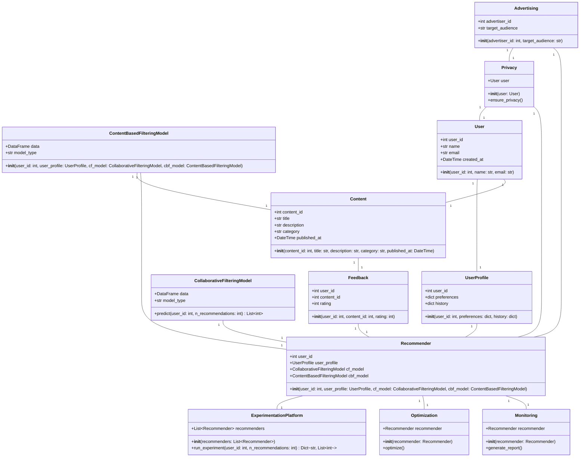
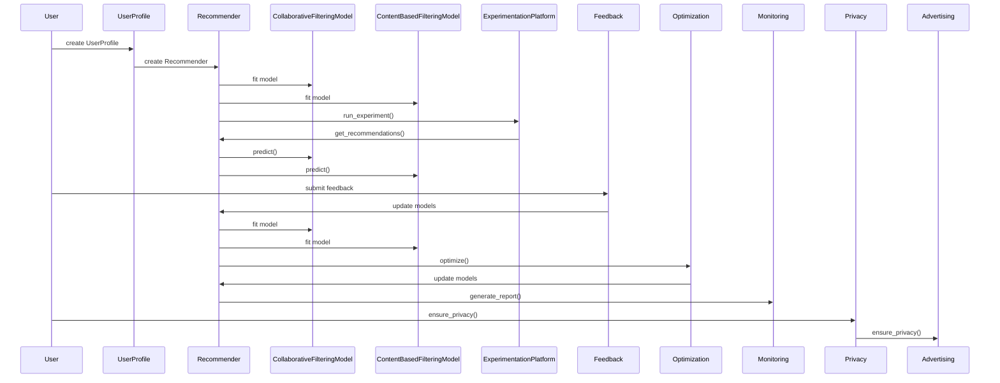

⚙️ Chunk 6 of the paper

🖼️ Figure 11: Class diagram for the "recommendation engine development" system, generated by the *architect* agent.

🖼️ Figure 12: Program call flow / sequence diagram for "recommendation engine development", generated by the *architect* agent.

## 📌 Deep-Seated Challenges

MetaGPT alleviates or solves several deep-seated challenges through its unique design choices.

### Use Context Efficiently

Two sub-challenges arise:

1. **Unfolding short natural language descriptions accurately** — eliminating ambiguity from terse task specs.
2. **Maintaining information validity in lengthy contexts** — enabling LLMs to concentrate on relevant data without distraction.

### Reduce Hallucinations

> Using LLMs to generate entire software programs faces **code hallucination** problems — including incomplete implementation of functions, missing dependencies, and potential undiscovered bugs, which may be more serious.

LLMs often struggle with software generation due to vague task definitions. Focusing on granular tasks — like requirement analysis and package selection — offers guided thinking that LLMs otherwise lack when solving broad, unstructured tasks.

## 📌 Information Overload

MetaGPT addresses "information overload" (the problem of receiving excessive or irrelevant information) via two mechanisms:

- **Global message pool** — streamlines communication and ensures efficiency.
- **Subscription mechanism** — filters out irrelevant contexts, enhancing the relevance and utility of information received by each agent.

⚠️ This design is particularly important in software design scenarios and standard operating procedures (SOPs), where effective communication between agents is essential.

## 📊 SoftwareDev Dataset — Example Tasks

Table 8 lists example tasks from the SoftwareDev dataset used for evaluation.

| Task ID | Task Name | Task Prompt |
|---|---|---|
| 0 | Snake game | Create a snake game. |
| 1 | Brick breaker game | Create a brick breaker game. |
| 2 | 2048 game | Create a 2048 game for the web. |
| 3 | Flappy bird game | Write p5.js code for Flappy Bird where you control a yellow bird continuously flying between a series of green pipes. The bird flaps every time you left click the mouse. If it falls to the ground or hits a pipe, you lose. This game goes on indefinitely until you lose; you get points the further you go. |
| 4 | Tank battle game | Create a tank battle game. |
| 5 | Excel data process | Write an excel data processing program based on streamlit and pandas. The screen first shows an excel file upload button. After the excel file is uploaded, use pandas to display its data content. The program is required to be concise, easy to maintain, and not over-designed. It uses streamlit for the web display, and pandas alone is sufficient for reading/displaying the excel file — no additional packages should be needed. |
| 6 | CRUD manage | Write a management program based on CRUD (add/delete/modify/query) processing of a customer business entity. Store name, birthday, age, sex, and phone. Data is stored in `client.db`, checking whether the customer table exists first. Querying and deleting are done by name. The program should be concise, easy to maintain, and not over-designed, realized through streamlit and sqlite only. |
| 7 | Music transcriber | Develop a program to transcribe sheet music into a digital format — providing error-free transcribed symbolized sheet music from audio through signal processing (pitch and time slicing), then training a neural net to run Onset Detected CWT transforming scalograms into chromagrams, decoded with a Recursive-Neural-Network-focused architecture. |
| 8 | Custom press releases | Create custom press releases: a Python script that extracts relevant company-news information from external sources (e.g. social media), tracks an update interval for recent changes, and generates press releases with customizable options, exporting to PDFs, NYTimes API JSONs, and media-format styling with interlinked fixed-length metadata. |
| 9 | Gomoku game | Implement a Gomoku game in Python, incorporating an AI opponent with varying difficulty levels. |
| 10 | Weather dashboard | Create a Python program to develop an interactive weather dashboard. |

## 📊 Additional Results — Pure MetaGPT (w/o Feedback) on SoftwareDev

Table 9 reports statistics for 10 randomly selected tasks plus the average (Avg.) across 70 tasks, covering code, documentation, and cost metrics, along with revision costs and code executability notes.

| ID | #Code Files | #Lines of Code | Lines/Code File | #Doc Files | #Lines of Doc | Lines/Doc File | Prompt Tokens | Completion Tokens | Time Cost (s) | Money Cost | Revision Issues | # Revisions |
|---|---|---|---|---|---|---|---|---|---|---|---|---|
| 0 | 5.00 | 196.00 | 39.20 | 3.00 | 210.00 | 70.00 | 24,087 | 6,157 | 582.04 | $1.09 | TypeError | 4 |
| 1 | 6.00 | 191.00 | 31.83 | 3.00 | 230.00 | 76.67 | 32,517 | 6,238 | 566.30 | $1.35 | TypeError | 4 |
| 2 | 3.00 | 198.00 | 66.00 | 3.00 | 235.00 | 78.33 | 21,934 | 6,316 | 553.11 | $1.04 | Missing `@app.route('/')` | 3 |
| 3 | 5.00 | 164.00 | 32.80 | 3.00 | 202.00 | 67.33 | 22,951 | 5,312 | 481.34 | $1.01 | PNG file missing; compile bug fixes | 2 |
| 4 | 6.00 | 203.00 | 33.83 | 3.00 | 210.00 | 70.00 | 30,087 | 6,567 | 599.58 | $1.30 | PNG file missing; compile bug fixes; `pygame.surface` not initialized | 3 |
| 5 | 6.00 | 219.00 | 36.50 | 3.00 | 294.00 | 96.00 | 35,590 | 7,336 | 585.10 | $1.51 | Dependency error; `ModuleNotFoundError` | 4 |
| 6 | 4.00 | 73.00 | 18.25 | 3.00 | 261.00 | 87.00 | 25,673 | 5,832 | 398.83 | $0.90 | — | 0 |
| 7 | 4.00 | 316.00 | 79.00 | 3.00 | 332.00 | 110.67 | 29,139 | 7,104 | 435.83 | $0.92 | — | 0 |
| 8 | 5.00 | 215.00 | 43.00 | 3.00 | 301.00 | 100.33 | 29,372 | 6,499 | 621.73 | $1.27 | TensorFlow version error; model training method not implemented | 2 |
| 9 | 5.00 | 215.00 | 43.00 | 3.00 | 270.00 | 90.00 | 24,799 | 5,734 | 550.88 | $1.27 | Dependency error; URL 403 error | 3 |
| 10 | 3.00 | 93.00 | 31.00 | 3.00 | 254.00 | 84.67 | 24,109 | 5,363 | 438.50 | $0.92 | Dependency error; missing main function | 4 |
| **Avg.** | 4.71 | 191.57 | 42.98 | 3.00 | 240.00 | 80.00 | 26,626.86 | 6,218.00 | 516.71 | $1.12 | Executability score avg. (only items scored 2, 3, or 4): **0.51** | 3.36 |
