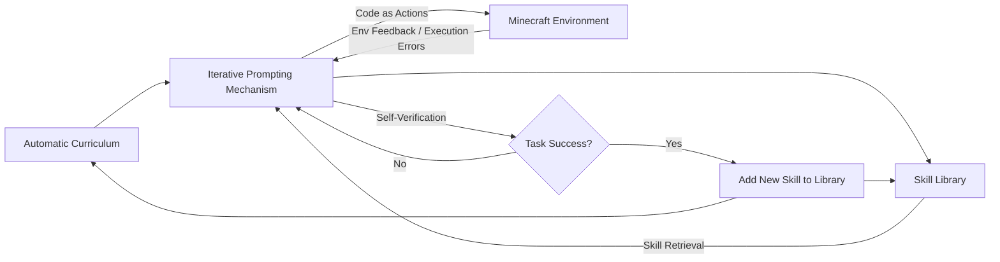
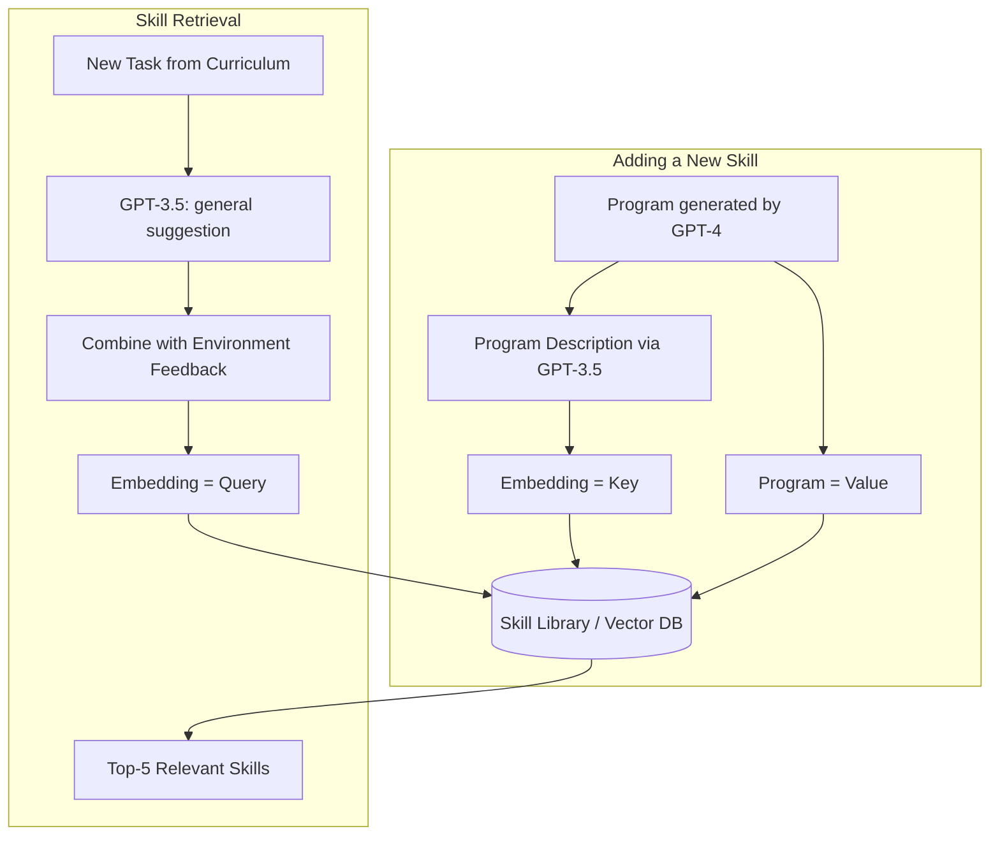

⚙️ Chunk 1 of the paper

# VOYAGER: An Open-Ended Embodied Agent with Large Language Models

**Authors:** Guanzhi Wang, Yuqi Xie, Yunfan Jiang, Ajay Mandlekar, Chaowei Xiao, Yuke Zhu, Linxi "Jim" Fan, Anima Anandkumar

**Affiliations:** NVIDIA, Caltech, UT Austin, Stanford, UW Madison

**Project page:** https://voyager.minedojo.org

## 📌 Abstract

> We introduce **VOYAGER**, the first LLM-powered embodied lifelong learning agent in Minecraft that continuously explores the world, acquires diverse skills, and makes novel discoveries without human intervention.

VOYAGER consists of three key components:

1. An **automatic curriculum** that maximizes exploration
2. An **ever-growing skill library** of executable code for storing and retrieving complex behaviors
3. A new **iterative prompting mechanism** that incorporates environment feedback, execution errors, and self-verification for program improvement

- Interacts with **GPT-4** via blackbox queries — no model fine-tuning required
- Skills are temporally extended, interpretable, and compositional, compounding the agent's abilities and alleviating catastrophic forgetting

**📊 Results highlights:**
- 3.3× more unique items discovered
- 2.3× longer distances traveled
- Up to 15.3× faster unlocking of tech tree milestones vs. prior SOTA
- Learned skill library transfers to solve novel tasks in a new world from scratch, where other techniques struggle to generalize

🖼️ **Figure 1:** Line chart showing "Number of Distinct Items" (y-axis, 0–65) vs. "Number of Prompting Iterations" (x-axis, 0–150+) for Voyager (Ours), Voyager w/o Skill Library, ReAct, Reflexion, and AutoGPT. Voyager's curve rises well above all baselines, passing tech-tree milestones (Wooden → Stone → Iron → Diamond Tool) far earlier than the others, which plateau at much lower item counts.

---

## 1. Introduction

Building generally capable embodied agents that continuously explore, plan, and develop new skills in open-ended worlds is a grand challenge for AI.

- Classical **reinforcement learning** and **imitation learning** approaches operate on primitive actions, making systematic exploration, interpretability, and generalization difficult.
- Recent **LLM-based agents** leverage pretrained world knowledge to generate action plans/policies, applied to embodied tasks (games, robotics) and non-embodied NLP tasks.
- ⚠️ **Limitation:** these agents are not *lifelong learners* — they can't progressively acquire, update, accumulate, and transfer knowledge over extended time spans.

### Why Minecraft?

Minecraft has no fixed storyline or predefined end goal — it offers a vast, procedurally generated 3D world with a tech tree to unlock through gathered resources.

An effective lifelong learning agent, like a human player, should be able to:

1. **Propose suitable tasks** based on current skill level and world state (e.g., harvest sand/cactus before iron if in a desert)
2. **Refine skills** from environmental feedback and **commit mastered skills to memory** for reuse in similar situations (e.g., fighting zombies ≈ fighting spiders)
3. **Continually explore** the world and seek new tasks in a self-driven manner

### 🔬 The VOYAGER Approach

VOYAGER is introduced as the first LLM-powered embodied lifelong learning agent that drives exploration, masters skills, and makes discoveries without human intervention in Minecraft — via three modules:

- Uses **code as the action space** instead of low-level motor commands, since programs naturally represent temporally extended and compositional actions.
- Interacts with a blackbox LLM (GPT-4) purely through prompting and in-context learning — no gradient-based training/finetuning needed.
- The **automatic curriculum** proposes progressively harder tasks based on exploration progress and agent state, functioning as an in-context form of *novelty search* toward the goal "discover as many diverse things as possible."
- The **skill library** incrementally stores action programs that successfully solved tasks.

### ⚠️ Challenge: LLMs struggle to produce correct code in one shot

To address this, the **iterative prompting mechanism**:

1. Executes the generated program to obtain observations (inventory, nearby creatures) and error traces from the interpreter
2. Incorporates that feedback into GPT-4's prompt for another round of refinement
3. Repeats until a **self-verification module** confirms task completion — then the program is committed to the skill library (e.g., `craftStoneShovel()`, `combatZombieWithSword()`) and the curriculum is queried for the next milestone

### 📊 Empirical Results

VOYAGER was evaluated against ReAct, Reflexion, and AutoGPT in **MineDojo** (an open-source Minecraft AI framework):

| Metric | Improvement over prior SOTA |
|---|---|
| Unique items obtained | 3.3× more |
| Tech tree milestones unlocked | up to 15.3× faster |
| Distance traveled | 2.3× longer |

VOYAGER also transfers its learned skill library to solve novel tasks from scratch in a new Minecraft world, while other methods struggle to generalize.

---

## 2. Method

VOYAGER consists of three novel components:

1. **Automatic Curriculum** (§2.1) — suggests objectives for open-ended exploration
2. **Skill Library** (§2.2) — develops increasingly complex behaviors
3. **Iterative Prompting Mechanism** (§2.3) — generates executable code for embodied control

### 2.1 Automatic Curriculum

An automatic curriculum offers benefits for open-ended exploration: a challenging-but-manageable learning process, curiosity-driven intrinsic motivation, and development of general, flexible problem-solving strategies.

- GPT-4 is prompted to provide a steady stream of new tasks/challenges.
- The curriculum unfolds **bottom-up**, adapting to exploration progress and agent state.
- As VOYAGER tackles harder self-driven goals, it naturally learns varied skills (e.g., "mining a diamond").

🖼️ **Figure 3:** Five example curriculum steps, each showing agent state (inventory, biome, nearby entities, health/hunger, time, equipment) fed to GPT-4, which produces a **Reasoning** string and a resulting **Task**. Examples: craft a stone pickaxe (given wooden pickaxe + stone), catch a fish (near river with a fishing rod), kill a pig (hunger at 0, pigs nearby), smelt raw iron (have furnace + raw iron + coal), kill a zombie (nighttime, zombie nearby, sword + shield equipped).

**Input prompt to GPT-4 consists of:**

1. **Directives encouraging diverse behaviors and constraints** — e.g., *"My ultimate goal is to discover as many diverse things as possible … The next task should not be too hard since I may not have the necessary resources or have learned enough skills to complete it yet."*
2. **The agent's current state** — inventory, equipment, nearby blocks/entities, biome, time, health/hunger bars, position
3. **Previously completed and failed tasks** — reflects exploration progress and capability frontier
4. **Additional context** — GPT-3.5 self-asks and self-answers questions based on current state/progress (GPT-3.5 used instead of GPT-4 for standard NLP sub-tasks for budget reasons)

### 2.2 Skill Library

Since the curriculum proposes increasingly complex tasks, a skill library is needed as a basis for learning and evolution. Each skill is represented as **executable code** scaffolding temporally extended actions for a specific task, inspired by the generality, interpretability, and universality of programs.

**Input prompt to GPT-4 for code generation includes:**

1. **Guidelines for code generation** — e.g., *"Your function will be reused for building more complex functions. Therefore, you should make it generic and reusable."*
2. **Control primitive APIs** and **relevant skills retrieved** from the skill library (crucial for in-context learning)
3. **Generated code from the last round, environment feedback, execution errors, and critique** — enabling self-improvement
4. **The agent's current state** — inventory, equipment, nearby blocks/entities, biome, time, health/hunger bars, position
5. **Chain-of-thought prompting** — reasoning before code generation

- New skills are refined iteratively (§2.3), added to the library, and indexed by the embedding of their description.
- Retrieval queries the library using embeddings of self-generated task plans + environment feedback, returning the top-5 relevant skills.
- Continuous expansion/refinement of the library lets VOYAGER learn, adapt, and excel across a wide task spectrum.

### 2.3 Iterative Prompting Mechanism

Three types of feedback drive self-improvement:

1. **🌍 Environment feedback** — illustrates intermediate execution progress, e.g., *"I cannot make an iron chestplate because I need: 7 more iron ingots."* Generated via `bot.chat()` inside control primitive APIs; GPT-4 is prompted to use this function too during code generation.
2. **⚠️ Execution errors** — from the program interpreter, revealing invalid operations or syntax errors, useful for bug fixing.
3. **✅ Self-verification for task success** — rather than hand-coding success checkers per task, a separate GPT-4 agent acts as a **critic**: given VOYAGER's current state and the task, it judges success/failure and, on failure, provides a critique suggesting how to complete the task. This is more comprehensive than prior self-reflection methods since it both checks success *and* reflects on mistakes.

🖼️ **Figure 5:** Two code-diff examples.
- **Left (Environment feedback):** GPT-4 revises `craftStoneShovelWithTable()` after learning it needs 2 more planks before crafting sticks — adds a check for stick count and mines/crafts extra planks first.
- **Right (Execution error):** GPT-4 corrects a failed `craftAcaciaAxe()` (no such item as "acacia_axe" in Minecraft) by rewriting it as `craftWoodenAxe()` using wooden planks instead.

Each round of code generation executes the program, gathers environment feedback + execution errors, and feeds them back into GPT-4's prompt for refinement — repeating until self-verification validates task completion.
