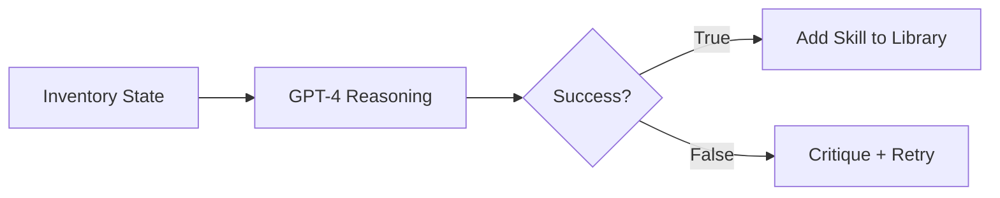
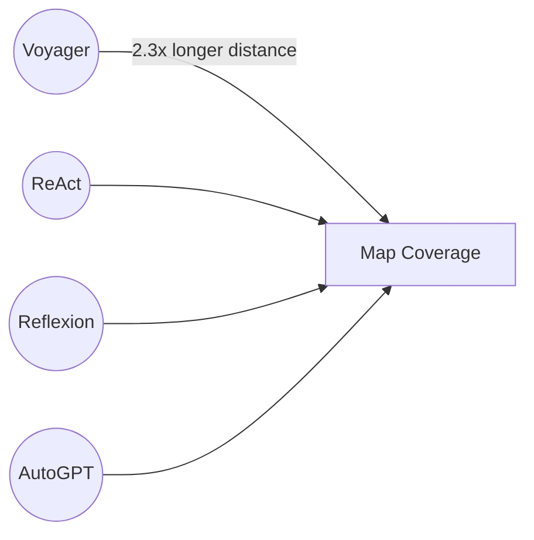

⚙️ Chunk 2 of the paper

## 🔬 Self-Verification Examples

VOYAGER uses GPT-4 to verify whether a task was completed, based on inventory state changes and reasoning about what those changes imply.

**Example verifications:**

| Task | Inventory Evidence | Result | Critique |
|---|---|---|---|
| Mine 5 coal ores | `coal: 5` | ✅ True | — |
| Craft a spyglass | `copper_ingot: 3`, no amethyst shard | ❌ False | Find and mine an amethyst shard underground |
| Kill 3 sheep | `white_wool: 2`, `mutton: 6` (implies 2 sheep killed) | ❌ False | Find and kill one more sheep |
| Kill 1 zombie | `rotten_flesh: 1` | ✅ True | — |

> 📌 If the agent gets stuck after **4 rounds** of code generation, the automatic curriculum is queried for a different task instead. This iterative prompting loop drives continuous skill acquisition without human intervention.

---

## 🔬 3. Experiments

### 3.1 Experimental Setup

- **Text completion:** `gpt-4-0314` and `gpt-3.5-turbo-0301`
- **Text embedding:** `text-embedding-ada-002`
- **Temperature:** 0 for all components, except the automatic curriculum (temperature = 0.1, to encourage task diversity)
- **Simulation environment:** built on **MineDojo**, using **Mineflayer** JavaScript APIs for motor control

### 3.2 Baselines

No out-of-the-box LLM-based Minecraft agents exist, so baselines were adapted from NLP-only agent methods:

- **ReAct** — chain-of-thought prompting; generates reasoning traces + action plans, given environment feedback and agent state as observations.
- **Reflexion** — ReAct + self-reflection, using execution errors and the self-verification module for more intuitive future actions.
- **AutoGPT** — decomposes a high-level goal into subgoals, executed in a ReAct-style loop (re-implemented with GPT-4). Lacks VOYAGER's skill library, self-verification, and automatic curriculum.

> ⚠️ **Note:** Prior pixel-input/low-level-control Minecraft agents are *not* directly compared, since VOYAGER relies on the high-level Mineflayer API rather than solving 3D perception/sensorimotor control. VOYAGER is considered orthogonal to — and combinable with — gradient-based approaches like VPT, as long as the controller exposes a code API.

---

## 📊 3.3 Evaluation Results

Evaluated across: exploration performance, tech tree mastery, map coverage, and zero-shot generalization.

### Significantly Better Exploration
- VOYAGER discovers **63 unique items** within 160 prompting iterations — **3.3×** more than baselines.
- AutoGPT lags considerably; ReAct and Reflexion struggle due to the abstract, curriculum-less nature of open-ended exploration.

### Consistent Tech Tree Mastery

**Table 1 — Tech tree mastery** (iterations averaged over 3 trials; fractions = successful trials out of 3; N/A = fails within 160 iterations)

| Method | Wooden Tool | Stone Tool | Iron Tool | Diamond Tool |
|---|---|---|---|---|
| ReAct | N/A (0/3) | N/A (0/3) | N/A (0/3) | N/A (0/3) |
| Reflexion | N/A (0/3) | N/A (0/3) | N/A (0/3) | N/A (0/3) |
| AutoGPT | 92 ± 72 (3/3) | 94 ± 72 (3/3) | 135 ± 103 (3/3) | N/A (0/3) |
| VOYAGER w/o Skill Library | **7 ± 2** (3/3) | **9 ± 4** (3/3) | 29 ± 11 (3/3) | N/A (0/3) |
| **VOYAGER (Ours)** | 6 ± 2 (3/3) | 11 ± 2 (3/3) | **21 ± 7** (3/3) | **102 (1/3)** |

- VOYAGER unlocks: wooden **15.3× faster**, stone **8.5× faster**, iron **6.4× faster** than baselines.
- VOYAGER is the **only** method to reach the diamond tool level.

### Extensive Map Traversal

🖼️ *Figure 7: Bird's-eye view maps showing VOYAGER's traversal circle far exceeding ReAct, Reflexion, and AutoGPT — VOYAGER covers 2.3× longer distances across diverse terrain, while baselines stay confined to local areas.*

---

## 📊 Zero-Shot Generalization to Unseen Tasks

Test setup: clear inventory → reset to a new world → attempt unseen tasks. Both VOYAGER and AutoGPT use GPT-4 to decompose tasks into subgoals.

**Table 2 — Zero-shot generalization** (max 50 iterations; fractions = successful trials out of 3)

| Method | Diamond Pickaxe | Golden Sword | Lava Bucket | Compass |
|---|---|---|---|---|
| ReAct | N/A (0/3) | N/A (0/3) | N/A (0/3) | N/A (0/3) |
| Reflexion | N/A (0/3) | N/A (0/3) | N/A (0/3) | N/A (0/3) |
| AutoGPT | N/A (0/3) | N/A (0/3) | N/A (0/3) | N/A (0/3) |
| AutoGPT w/ Our Skill Library | 39 (1/3) | 30 (1/3) | N/A (0/3) | 30 (2/3) |
| VOYAGER w/o Skill Library | 36 (2/3) | 30 ± 9 (3/3) | 27 ± 9 (3/3) | 26 ± 3 (3/3) |
| **VOYAGER (Ours)** | **19 ± 3 (3/3)** | **18 ± 7 (3/3)** | **21 ± 5 (3/3)** | **18 ± 2 (3/3)** |

🖼️ *Figure 8: Progress curves (subgoal step vs. prompting iteration) for "Craft a Golden Sword" and "Collect a Lava Bucket," comparing Voyager, Voyager w/o Skill Library, AutoGPT, and AutoGPT w/ Our Skill Library. Voyager reaches the final subgoal fastest in both cases; ReAct/Reflexion omitted since they make no meaningful progress.*

> 📌 **Key insight:** VOYAGER solves all four unseen tasks consistently, while baselines solve none within 50 iterations. Notably, the skill library built during lifelong learning *also* boosts AutoGPT's performance — showing it acts as a **plug-and-play asset** transferable across methods.

---

## 🔬 3.4 Ablation Studies

Six design choices ablated: automatic curriculum, skill library, environment feedback, execution errors, self-verification, and GPT-4 (vs. GPT-3.5) for code generation.

🖼️ *Figure 9 (left): Ablation curves for automatic curriculum, skill library, and GPT-4 — comparing Ours, w/o Skill Library, GPT-3.5, Manual Curriculum, and Random Curriculum against number of distinct items discovered over prompting iterations.*

🖼️ *Figure 9 (right): Ablation curves for the iterative prompting mechanism — comparing Ours, w/o Environment Feedback, w/o Execution Error, and w/o Self-Verification.*

Key findings:

- **Automatic curriculum is crucial.** Replacing it with a random curriculum drops discovered items by **93%**, since attempting tasks out of order can make them too hard. A manually designed curriculum needs deep Minecraft expertise and ignores the agent's live situation, so it underperforms the automatic version.
- **Skill library prevents plateauing.** Without it, VOYAGER's exploration tends to plateau in later stages — the library lets new skills build compositionally on older ones.
- **Self-verification is the single most important feedback type.** Removing it causes a **73% drop** in discovered items; it's the critical mechanism for deciding whether to advance to a new task or retry a failed one.
- **GPT-4 vastly outperforms GPT-3.5** for code generation, yielding **5.7×** more unique items discovered — consistent with other literature on GPT-4's coding capability jump.

---

## 🖼️ 3.5 Multimodal Feedback from Humans

Since the GPT-4 API used was text-only at the time of writing, VOYAGER lacks native visual perception. However, it can be augmented with human-provided multimodal feedback to build complex 3D structures (e.g., a Nether Portal and a house).

🖼️ *Figure 10: Sequential build progress photos for "Build Nether Portal" and "Build House," shown left-to-right as human feedback incorporates.*

Two integration modes:

1. **Human as critic** *(≈ self-verification module)* — humans give visual critique so VOYAGER can revise its code; needed to correct spatial errors VOYAGER can't perceive directly.
2. **Human as curriculum** *(≈ automatic curriculum module)* — humans decompose a complex build task into smaller steps, guiding incremental completion of sophisticated 3D constructions.

---

## ⚠️ 4. Limitations and Future Work

- **Cost:** The GPT-4 API is **15× more expensive** than GPT-3.5. Still, VOYAGER needs GPT-4's code-generation quality, which GPT-3.5 and open-source LLMs can't yet match.
- **Inaccuracies:** The agent can still get stuck and fail to generate correct skills despite iterative prompting. The curriculum can reattempt such tasks later. Self-verification itself can occasionally fail — e.g., not recognizing spider string as a success signal for defeating a spider.
- **Hallucinations:**
  - The curriculum sometimes proposes unachievable tasks (e.g., a nonexistent "copper sword" or "copper chestplate").
  - Code generation hallucinations occur too — e.g., GPT-4 may try to use cobblestone as fuel (invalid in-game), or call undefined API functions, causing execution errors.
- Future improvements in GPT models and open-source LLM fine-tuning are expected to address these issues.

---

## 📚 5. Related Work

### Decision-Making Agents in Minecraft

Built on benchmarks like MineDojo, Minecraft learning algorithms split into two categories:

1. **Low-level controllers** — hierarchical RL from human demonstrations; curriculum design based on success rates (limited to curated items); MineDojo and VPT use YouTube pre-training; DreamerV3 learns a world model to explore and collect diamonds.
2. **High-level planners** — few-shot prompting with Codex to generate executable policies (requires human interaction); recent LLM-as-planner works decompose tasks into subgoals following Minecraft recipes, but lack full exploration flexibility.

> 📌 VOYAGER also uses an LLM (GPT-4) as high-level planner with Mineflayer as low-level controller, but uniquely adds a **bottom-up, curiosity-driven automatic curriculum** enabling open-ended exploration — unlike prior recipe-following approaches.

### Large Language Models for Agent Planning

Two groups of related efforts:

1. **LLMs for robot learning** — generating subgoals for robot planning; Inner Monologue incorporates environment feedback; Code as Policies and ProgPrompt generate executable robot policies directly; VIMA and PaLM-E fine-tune LLMs for multimodal prompts.
2. **LLMs for text agents** — ReAct (chain-of-thought reasoning + actions); Reflexion (ReAct + self-reflection); AutoGPT (subgoal curriculum + ReAct loops); DERA (task as dialogue between two GPT-4 agents); Generative Agents (ChatGPT-based memory storage/retrieval for simulating human behavior, but non-executable actions); SPRING (concurrent work extracting game mechanics from manuals via GPT-4, using a DAG of questions to predict next actions).

> 📌 All these methods lack a **skill library** for building increasingly complex behaviors — a key differentiator underlying VOYAGER's lifelong-learning success.

### Code Generation with Execution

Code generation remains a long-standing NLP challenge, with various works leveraging execution results/feedback to improve program synthesis *(section continues into next chunk)*.
