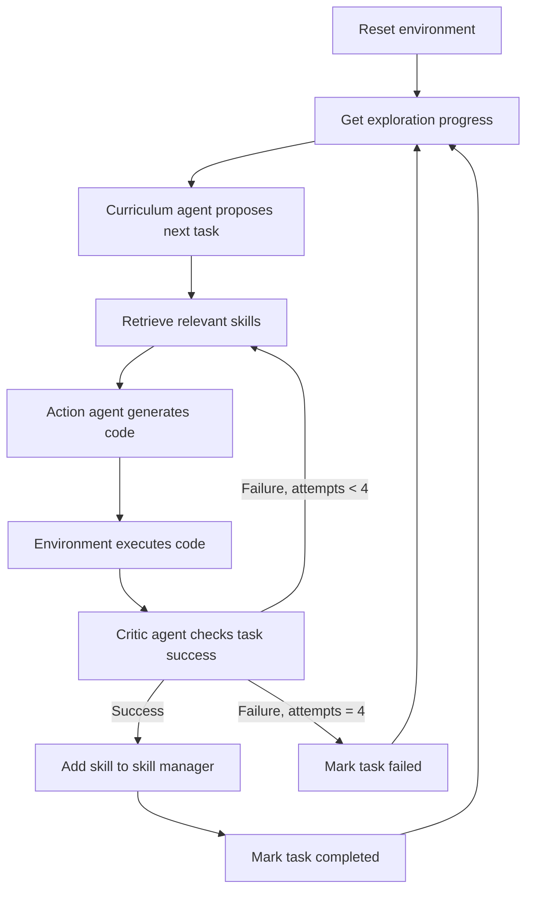

⚙️ Chunk 4 of the paper

## 📚 References (continued)

- [59] Driess et al. — *PaLM-E: An Embodied Multimodal Language Model*, arXiv:2303.03378, 2023.
- [60] Touvron et al. — *LLaMA: Open and Efficient Foundation Language Models*, arXiv:2302.13971, 2023.
- [61] Guss et al. — *MineRL: A Large-Scale Dataset of Minecraft Demonstrations*, IJCAI 2019, pp. 2442–2448.
- [62] Guss et al. — *The MineRL 2019 Competition on Sample Efficient Reinforcement Learning Using Human Priors*, arXiv:1904.10079, 2019.
- [63] Guss et al. — *The MineRL 2020 Competition on Sample Efficient Reinforcement Learning Using Human Priors*, arXiv:2101.11071, 2021.
- [64] Kanervisto et al. — *MineRL Diamond 2021 Competition: Overview, Results, and Lessons Learned*, arXiv:2202.10583, 2022.
- [65] Johnson et al. — *The Malmo Platform for Artificial Intelligence Experimentation*, IJCAI 2016, pp. 4246–4247.
- [66] Lin et al. — *Juewu-MC: Playing Minecraft with Sample-Efficient Hierarchical Reinforcement Learning*, arXiv:2112.04907, 2021.
- [67] Mao et al. — *SEIHAI: A Sample-Efficient Hierarchical AI for the MineRL Competition*, arXiv:2111.08857, 2021.
- [68] Skrynnik et al. — *Hierarchical Deep Q-Network from Imperfect Demonstrations in Minecraft*, Cogn. Syst. Res., 65:74–78, 2021.
- [69] Hafner et al. — *Mastering Diverse Domains through World Models*, arXiv:2301.04104, 2023.
- [70] Volum et al. — *Craft an Iron Sword: Dynamically Generating Interactive Game Characters by Prompting LLMs Tuned on Code*, Wordplay Workshop 2022, pp. 25–43.
- [71] Yuan et al. — *Plan4MC: Skill Reinforcement Learning and Planning for Open-World Minecraft Tasks*, arXiv:2303.16563, 2023.
- [72] Bommasani et al. — *On the Opportunities and Risks of Foundation Models*, arXiv:2108.07258, 2021.
- [73] Chowdhery et al. — *PaLM: Scaling Language Modeling with Pathways*, arXiv:2204.02311, 2022.
- [74] Chung et al. — *Scaling Instruction-Finetuned Language Models*, arXiv:2210.11416, 2022.
- [75] Duan et al. — *A Survey of Embodied AI: From Simulators to Research Tasks*, IEEE Trans. Emerg. Top. Comput. Intell., 6(2):230–244, 2022.
- [76] Batra et al. — *Rearrangement: A Challenge for Embodied AI*, arXiv:2011.01975, 2020.
- [77] Ravichandar et al. — *Recent Advances in Robot Learning from Demonstration*, Annual Review of Control, Robotics, and Autonomous Systems, 3:297–330, 2020.
- [78] Collins et al. — *A Review of Physics Simulators for Robotic Applications*, IEEE Access, 9:51416–51431, 2021.
- [79] Min et al. — *FILM: Following Instructions in Language with Modular Methods*, ICLR 2021.
- [80] Blukis et al. — *A Persistent Spatial Semantic Representation for High-Level Natural Language Instruction Execution*, CoRL 2021.
- [81] Nair et al. — *DERA: Enhancing Large Language Model Completions with Dialog-Enabled Resolving Agents*, arXiv:2303.17071, 2023.
- [82] Park et al. — *Generative Agents: Interactive Simulacra of Human Behavior*, arXiv:2304.03442, 2023.
- [83] Wu et al. — *SPRING: GPT-4 Out-Performs RL Algorithms by Studying Papers and Reasoning*, arXiv:2305.15486, 2023.
- [84] Nijkamp et al. — *A Conversational Paradigm for Program Synthesis*, arXiv:2203.13474, 2022.
- [85] Le et al. — *CodeRL: Mastering Code Generation through Pretrained Models and Deep Reinforcement Learning*, arXiv:2207.01780, 2022.
- [86] Chen, Liu, Song — *Execution-Guided Neural Program Synthesis*, ICLR 2019.
- [87] Chen, Song, Tian — *Latent Execution for Neural Program Synthesis*, arXiv:2107.00101, 2021.
- [88] Ellis et al. — *Write, Execute, Assess: Program Synthesis with a REPL*, NeurIPS 2019, pp. 9165–9174.
- [89] Li et al. — *Competition-Level Code Generation with AlphaCode*, arXiv:2203.07814, 2022.
- [90] Cobbe et al. — *Training Verifiers to Solve Math Word Problems*, arXiv:2110.14168, 2021.
- [91] Ni et al. — *LEVER: Learning to Verify Language-to-Code Generation with Execution*, arXiv:2302.08468, 2023.
- [92] Skreta et al. — *Errors Are Useful Prompts: Instruction Guided Task Programming with Verifier-Assisted Iterative Prompting*, arXiv:2303.14100, 2023.

---

## 🔬 A. Method

### A.1 VOYAGER Algorithm

📌 High-level control loop coordinating the four agents (curriculum, action, critic, skill manager) against the environment.



```python
def voyager(
    environment,       # environment that uses code as action space
    curriculum_agent,  # curriculum agent for proposing the next task
    action_agent,       # action agent for code generation
    critic_agent,        # critic agent for self-verification
    skill_manager,        # skill manager for adding new skills and skill retrieval
):
    agent_state = environment.reset()
    while True:
        exploration_progress = curriculum_agent.get_exploration_progress(
            curriculum_agent.get_completed_tasks(),
            curriculum_agent.get_failed_tasks(),
        )
        task = curriculum_agent.propose_next_task(agent_state, exploration_progress)

        code = None
        environment_feedback = None
        execution_errors = None
        critique = None
        success = False

        # try at most 4 rounds before moving on to the next task
        for i in range(4):
            skills = skill_manager.retrieve_skills(task, environment_feedback)
            code = action_agent.generate_code(
                task, code, environment_feedback, execution_errors, critique, skills
            )
            agent_state, environment_feedback, execution_errors = environment.step(code)
            success, critique = critic_agent.check_task_success(task, agent_state)
            if success:
                break

        if success:
            skill_manager.add_skill(code)
            curriculum_agent.add_completed_task(task)
        else:
            curriculum_agent.add_failed_task(task)
```

### A.2 Prompting

> GPT-4 and GPT-3.5 expose three message roles used to structure the conversation:

| Role | Purpose |
|------|---------|
| **System** | High-level instruction guiding model behavior for the whole conversation; sets tone and objective |
| **User** | Detailed instruction guiding the assistant's next immediate response |
| **Assistant** | A response message generated by the model |

⚠️ To save tokens, VOYAGER does **not** use multi-round conversations — a system prompt and user prompt are concatenated to produce each agent's response.

### A.3 Automatic Curriculum

#### A.3.1 Components in the Prompt

The GPT-4 input prompt is composed of:

1. **Directives** — encourage diverse behavior and impose constraints so proposed tasks are achievable and verifiable.
2. **Agent's current state:**
   - **Inventory** — item/count dictionary, e.g. `{cobblestone: 4, furnace: 1, stone_pickaxe: 1, oak_planks: 7, dirt: 6, wooden_pickaxe: 1, crafting_table: 1, raw_iron: 4, coal: 1}`
   - **Equipment** — armor/weapons equipped
   - **Nearby blocks** — block names within 32-block radius (e.g. `dirt`, `water`, `spruce_planks`, `grass_block`, `dirt_path`, `sugar_cane`, `fern`)
   - **Other recently seen blocks** — blocks not currently nearby or in inventory
   - **Nearby entities** — entity names within 32-block radius (e.g. `pig`, `cat`, `villager`, `zombie`)
   - **Seen chests** — external containers; contents shown once opened, otherwise "Unknown"
   - **Biome** — e.g. `plains`, `flower_forest`, `meadow`, `river`, `beach`, `forest`, `snowy_slopes`, `frozen_peaks`, `old_growth_birch_forest`, `ocean`, `sunflower_plains`, `stony_shore`
   - **Time** — one of `sunrise`, `day`, `noon`, `sunset`, `night`, `midnight`
   - **Health and hunger bars** — max value 20
   - **Position** — 3D coordinate $(x, y, z)$
3. **Previously completed and failed tasks**
4. **Additional context** — see A.3.2
5. **Chain-of-thought prompting** — GPT-4 is asked to reason about current progress before suggesting the next task

#### A.3.2 Additional Context

🔬 GPT-3.5 self-asks questions to generate additional context. Each question is paired with a concept used to retrieve the most relevant document from a wiki knowledge base. The retrieved document is fed back to GPT-3.5 to self-answer the question.

> Using the wiki knowledge base is optional, since GPT-3.5 already has good Minecraft game-mechanics knowledge — but it helps when GPT-3.5 lacks pre-training in a specific domain.

#### A.3.3 Warm-up Schedule

📌 A warm-up schedule gradually incorporates the agent's state and additional context into the prompt, scaled by how many tasks the agent has completed — exposing the prompt to increasingly more information as exploration progresses.
