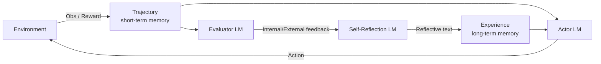

⚙️ Chunk 1 of the paper

# Reflexion: Language Agents with Verbal Reinforcement Learning

**Authors:** Noah Shinn (Northeastern), Federico Cassano (Northeastern), Edward Berman (Northeastern), Ashwin Gopinath (MIT), Karthik Narasimhan (Princeton), Shunyu Yao (Princeton)

**Code:** https://github.com/noahshinn024/reflexion

## 📌 Abstract

LLM-based agents that act in external environments (games, compilers, APIs) are hard to improve via traditional RL, since that requires large numbers of training samples and costly fine-tuning. The paper introduces **Reflexion**, a framework where agents improve not by updating model weights but by **verbally reflecting** on feedback from a task and storing that reflection in an episodic memory buffer, which then informs future attempts.

Key results:
- 91% pass@1 on HumanEval (vs. GPT-4's 80% at the time)
- Works with multiple feedback types (scalar or free-form language) and sources (external or self-generated)
- Evaluated across decision-making, reasoning, and coding tasks

---

## 1. Introduction

Prior agent frameworks (ReAct, SayCan, Toolformer, HuggingGPT, generative agents, WebGPT) show LLMs can act as autonomous decision-makers by generating text/actions used in API calls. Because these models are too large and expensive to fine-tune easily, teaching them has mostly relied on in-context examples rather than gradient-based RL.

> 🔬 **Core idea:** Reflexion turns environment feedback (binary/scalar) into a **verbal, textual summary** that's added to the agent's context in the next episode — functioning like a "semantic gradient signal." This mirrors how humans reflect on past failures to improve future attempts.

The paper explores three ways of generating this reflective feedback:
1. Simple binary environment feedback
2. Pre-defined heuristics for common failure modes
3. Self-evaluation (LLM-based binary classification, or self-written unit tests for code)

### Advantages of Reflexion vs. traditional RL
- ✅ Lightweight — no LLM fine-tuning required
- ✅ Supports nuanced feedback (targeted action-level critique) vs. hard-to-assign scalar/vector rewards
- ✅ Produces an explicit, interpretable episodic memory
- ✅ Gives explicit hints for future episodes

⚠️ **Limitation:** Performance depends on the LLM's own self-evaluation ability (or hand-written heuristics), and there's no formal guarantee of success.

### Task categories tested
1. **Decision-making** — long trajectories of sequential actions
2. **Reasoning** — knowledge-intensive, single-step generation
3. **Programming** — using external tools like compilers/interpreters

### Headline results
- **AlfWorld** (decision-making): +22% absolute over strong baselines across 12 learning trials
- **HotPotQA** (reasoning): +20%
- **HumanEval** (Python coding): +11%

### Contributions
- A new "verbal reinforcement" paradigm where a policy = agent memory + LLM parameters
- Empirical demonstration that self-reflection meaningfully improves performance in a handful of trials
- **LeetcodeHardGym**: a new RL gym with 40 hard Leetcode problems across 19 languages
- State-of-the-art results on multiple code-generation benchmarks

---

## 2. Related Work

### Reasoning & decision-making
| Approach | Self-refine | Hidden constraints | Decision-making | Binary reward | Memory |
|---|---|---|---|---|---|
| Self-Refine [15] | ✓ | ✗ | ✗ | ✗ | ✗ |
| Beam search [27] | ✓ | ✓ | ✓ | ✓ | ✗ |
| **Reflexion (ours)** | ✓ | ✓ | ✓ | ✓ | ✓ |

- **Self-Refine** [15]: iterative self-evaluation/self-improvement conditioned on task constraints, but limited to single-generation reasoning tasks.
- **Pryzant et al.** [21]: similar semantic prompt-optimization, also single-generation only.
- **Paul et al.** [20]: fine-tunes separate critic models for intermediate feedback.
- **Xie et al.** [27]: stochastic beam search over actions for more efficient decision-making search with foresight.
- **Yoran et al. [31] / Nair et al. [16]**: use decider models across multiple generations.
- **Kim et al.** [10]: fixed-step retry pattern without an evaluation step.
- **Goodman** [9]: qualitative evaluation step suggesting optimizations to the prior generation.

Reflexion's distinction: it layers **self-reflection** on top of these ideas to build a persistent memory that lets an agent identify its own errors and derive lessons over time.

### Programming
| Approach | Test execution | Debugging | Self-generated tests | Multiple languages | Self-reflection |
|---|---|---|---|---|---|
| AlphaCode [14] | ✓ | ✗ | ✗ | ✓ | ✗ |
| CodeT [5] | ✓ | ✗ | ✓ | ✗ | ✗ |
| Self-Debugging [7] | ✓ | ✓ | ✗ | ✗ | ✗ |
| CodeRL [12] | ✓ | ✓ | ✗ | ✗ | ✗ |
| **Reflexion (ours)** | ✓ | ✓ | ✓ | ✓ | ✓ |

- **AlphaCode**: scores generations against hidden test cases.
- **CodeT**: scores implementations using self-generated unit tests.
- **Self-Debugging**: improves existing code using execution-environment feedback.
- **CodeRL**: actor-critic RL setup for debugging from execution feedback.
- Limitation of these: they either rely on ground-truth hidden tests (which breaks pass@1 eligibility) or don't use self-reflection to connect error identification with implementation improvement.

---

## 3. Reflexion: Reinforcement via Verbal Reflection

Three cooperating LLM-based modules:

- **Actor ($M_a$)** — generates text/actions
- **Evaluator ($M_e$)** — scores the Actor's outputs
- **Self-Reflection ($M_{sr}$)** — generates verbal reinforcement cues from the score + trajectory



### 🔬 Component details

**Actor**
Built on an LLM prompted to produce actions conditioned on observed state, similar to sampling an action $a_t$ from a policy $\pi_\theta$ at time $t$, receiving observation $o_t$. Explored variants include Chain-of-Thought and ReAct-style generation. A memory component `mem` (inspired by Brooks et al. [3]'s in-context policy iteration) supplies extra context.

**Evaluator**
Scores a generated trajectory. Because defining reward functions over semantic/text spaces is hard, the paper tries multiple variants:
- Exact-match (EM) grading for reasoning tasks
- Hand-written heuristics for decision-making tasks
- A separate LLM instance acting as evaluator for decision-making and programming tasks

**Self-Reflection**
Given a sparse (success/fail) signal, the trajectory, and existing memory, this model produces a specific, nuanced verbal critique — richer than a scalar reward — which is appended to memory `mem`. Example: in a multi-step task, if action $a_i$ led to failure via $a_{i+1}, a_{i+2}$, the model can state that action $a_i'$ should have been taken instead, and store that lesson for future trials.

**Memory**
- *Short-term memory* = the current trajectory history
- *Long-term memory* = accumulated outputs of the Self-Reflection model
Together these give the agent both fine-grained recent context and distilled lessons from past trials — a key differentiator from other LLM action-choice approaches.

### Algorithm: Reinforcement via Self-Reflection

```
Initialize Actor, Evaluator, Self-Reflection: M_a, M_e, M_sr
Initialize policy π_θ(a_i | s_i), θ = {M_a, mem}
Generate initial trajectory using π_θ
Evaluate τ_0 using M_e
Generate initial self-reflection sr_0 using M_sr
Set mem ← [sr_0]; t = 0

while M_e does not pass AND t < max_trials:
    Generate τ_t = [a_0, o_0, ..., a_i, o_i] using π_θ
    Evaluate τ_t using M_e
    Generate self-reflection sr_t using M_sr
    Append sr_t to mem
    t += 1

return
```

### The Reflexion process (narrative)

1. Trial 0: Actor produces trajectory $\tau_0$; Evaluator computes reward $r_0 = M_e(\tau_0)$.
2. Self-Reflection model turns $\{\tau_0, r_0\}$ into a summary $sr_0$, stored in `mem`.
3. The loop repeats — Actor, Evaluator, Self-Reflection — until the Evaluator judges the trajectory correct.
4. `mem` is capped at $\Omega$ stored experiences (typically 1–3) to respect context-length limits.

---

## 4. Experiments (overview)

Evaluated on:
- **HotPotQA** [28] — search-based QA (reasoning)
- **AlfWorld** [24] — multi-step household decision-making
- **HumanEval** [6], **MBPP** [2], and a new **LeetcodeHard** benchmark — code generation

**Headline gains:** +22% on AlfWorld, +20% on HotPotQA, +11% on HumanEval, all over strong baselines.

### 4.1 Sequential Decision-Making: AlfWorld

- Text-based multi-step household task suite (built on TextWorld [8]): finding hidden objects, moving objects, using one object on another (e.g., chilling a tomato in a fridge).
- 134 environments across six task types, following Yao et al. [30]'s setup.
- **Action generator:** ReAct [30], chosen for its success with explicit intermediate "thoughts" in long trajectories.
- **Self-evaluation methods** (since the environment only signals task completion):
  1. LLM-based natural language classification
  2. Hand-written heuristic — trigger self-reflection if the same action/response repeats >3 times in a row, or if an episode exceeds 30 actions (a sign of inefficient planning)
- **Baseline runs:** when self-reflection is triggered, it's skipped — the environment simply resets and a new trial starts.
- **Reflexion runs:** self-reflection is used to diagnose the mistake, update memory, then reset and retry.
- Memory is truncated to the last 3 self-reflections to control prompt length.
- Two domain-specific few-shot trajectories (same ones used by Yao et al. [30] with GPT-3) are provided to avoid syntax errors.

**Results:** ReAct+Reflexion solved 130/134 tasks (vs. plain ReAct, which plateaus between trials 6–7), continuing to learn and solve additional tasks across 12 consecutive trials using the simple heuristic to catch hallucination/inefficiency.

**Analysis:** A frequent baseline failure mode is the agent incorrectly believing it's holding an item it doesn't actually have, then executing a long chain of actions without being able to backtrack to find the mistake — a case self-reflection specifically helps correct.

*(Continues in next chunk — AlfWorld analysis continues, followed by reasoning and programming experiments.)*
