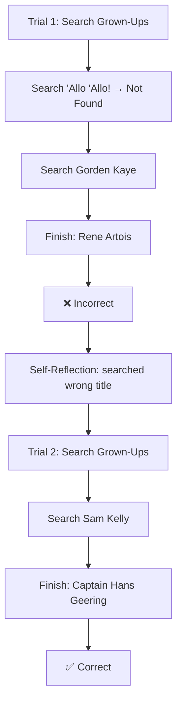

⚙️ Chunk 4 of the paper

## 16 D Reasoning

### D.1 Full Example

**Trial #1**

> **Question:** Grown-Ups starred the actor who was best known for which role on "'Allo 'Allo!"?

- **Thought 1:** I need to search Grown-Ups and "'Allo 'Allo!", find the actor who starred in Grown-Ups, then find the role he was best known for in "'Allo 'Allo!".
- **Action 1:** `Search[Grown-Ups]`
- **Observation 1:** Grown-Ups is a 1980 British BBC television film devised and directed by Mike Leigh. It stars Lesley Manville, Philip Davis, Brenda Blethyn, Janine Duvitski, Lindsay Duncan and Sam Kelly. It was edited by Robin Sales and produced by Louis Marks for the BBC, and originally shown on BBC 2 on 28 November 1980.
- **Thought 2:** Grown-Ups starred Lesley Manville, Philip Davis, Brenda Blethyn, Janine Duvitski, Lindsay Duncan and Sam Kelly. I need to search "'Allo 'Allo!" and find which actor was best known for which role.
- **Action 2:** `Search["'Allo 'Allo!"]`
- **Observation 2:** Could not find ["'Allo 'Allo!"]. Similar: ["'Allo 'Allo!", "List of 'Allo 'Allo! characters", 'Gorden Kaye', "'Allo 'Allo! (series 2)", 'Allô, allô', 'Francesca Gonshaw', "'Allo 'Allo! (series 4)", 'Kim Hartman', "'Allo 'Allo! (series 6)", 'Jeremy Lloyd']
- **Thought 3:** To find the actor who was best known for which role on "'Allo 'Allo!", I can search Gorden Kaye.
- **Action 3:** `Search[Gorden Kaye]`
- **Observation 3:** Gordon Irving Kaye (7 April 1941 – 23 January 2017), known professionally as Gorden Kaye, was an English actor, best known for playing womanising café owner René Artois in the television comedy series 'Allo 'Allo!.
- **Thought 4:** Gorden Kaye was best known for playing womanising café owner René Artois in the television comedy series "'Allo 'Allo!". So the answer is Rene Artois.
- **Action 4:** `Finish[Rene Artois]`
- **Observation 4:** ❌ Answer is INCORRECT

**Trial #2**

> **Question:** Grown-Ups starred the actor who was best known for which role on "'Allo 'Allo!"?

- **Thought 1:** I need to search the actor who was best known for a role on "'Allo 'Allo!" and find out what role they were best known for.
- **Action 1:** `Search[Grown-Ups]`
- **Observation 1:** Grown-Ups is a 1980 British BBC television film devised and directed by Mike Leigh. It stars Lesley Manville, Philip Davis, Brenda Blethyn, Janine Duvitski, Lindsay Duncan and Sam Kelly. It was edited by Robin Sales and produced by Louis Marks for the BBC, and originally shown on BBC 2 on 28 November 1980.
- **Thought 2:** The paragraph does not mention the actor who was best known for a role on "'Allo 'Allo!". I need to search the actor's name instead.
- **Action 2:** `Search[Sam Kelly]`
- **Observation 2:** Roger Michael Kelly (19 December 1943 – 14 June 2014), known by the stage name Sam Kelly, was an English actor who appeared in film, television, radio and theatre. He is best known for his roles as Captain Hans Geering in 'Allo 'Allo!, Warren in Porridge, Sam in On the Up, and Ted Liversidge in Barbara.
- **Thought 3:** Sam Kelly is best known for his role as Captain Hans Geering in "'Allo 'Allo!", so the answer is Captain Hans Geering.
- **Action 3:** `Finish[Captain Hans Geering]`
- **Observation 3:** ✅ Answer is CORRECT

> 📌 **Reflection:** I searched the wrong title for the show, "'Allo 'Allo!", which resulted in no results. I should have searched the show's main character, Gorden Kaye, to find the role he was best known for in the show.

🖼️ Figure: Diagram showing two HotPotQA trials within the same environment and task, illustrating how the Reflexion + ReAct agent uses self-reflection to determine a better search method for the next trial.

---

### D.2 Chain-of-Thought + Reflexion

**Trial #1**

> **Question:** What profession does John Lanchester and Alan Dean Foster have in common?

- **Thought 1:** Let's think step by step. John Lanchester is a novelist, journalist, and critic. Alan Dean Foster is a novelist and screenwriter. So the profession John Lanchester and Alan Dean Foster have in common is novelist and screenwriter.
- **Action 1:** `Finish[novelist and screenwriter]`
- **Observation 1:** ❌ Answer is INCORRECT

**Trial #2**

> **Question:** What profession does John Lanchester and Alan Dean Foster have in common?

- **Thought 1:** Let's think step by step. John Lanchester is a novelist, journalist, and financial journalist. Alan Dean Foster is a novelist and screenwriter. So the profession John Lanchester and Alan Dean Foster have in common is novelist.
- **Action 1:** `Finish[novelist]`
- **Observation 1:** ✅ Answer is CORRECT

> 📌 **Reflection:** My reasoning for the profession John Lanchester and Alan Dean Foster have in common failed because I incorrectly assumed that they both had the same profession. In the future, when attempting this question, I should focus on better researching the individual backgrounds of both authors to ensure that I am accurately identifying their professions. Additionally, I should consider the possibility that they may have multiple professions in common.

---

### D.3 HotPotQA Chain-of-Thought (GT) + Reflexion

> **Context:** The Battle of White Plains was a battle in the New York and New Jersey campaign of the American Revolutionary War fought on October 28, 1776, near White Plains, New York. Following the retreat...

**Trial #1**

> **Question:** What was a series of battles during the Revolutionary War, for control of New York City and the state of New Jersey, fought on October 28, 1776 near White Plains, New York?

- **Thought 1:** The question is asking about a series of battles during the Revolutionary War for control of New York City and the state of New Jersey, fought on October 28, 1776 near White Plains, New York. From the context, I know that this was the Battle of White Plains.
- **Action 1:** `Finish[Battle of White Plains]`
- **Observation 1:** ❌ Answer is INCORRECT

**Trial #2**

> **Question:** What was a series of battles during the Revolutionary War, for control of New York City and the state of New Jersey, fought on October 28, 1776 near White Plains, New York?

- **Thought 1:** The question is asking for a series of battles during the Revolutionary War, for control of New York City and the state of New Jersey, fought on October 28, 1776 near White Plains, New York. Based on the context, I know that this series of battles was the New York and New Jersey campaign.
- **Action 1:** `Finish[The New York and New Jersey campaign]`
- **Observation 1:** ✅ Answer is CORRECT

> 📌 **Reflection:** Upon reflecting on the incorrect answer I provided, I realize that I may not have provided enough context to accurately answer the question. The question asked for a series of battles, but I only provided the name of one battle. To better answer this question in the future, I will make sure to provide more context, such as the name of the campaign, which was the New York and New Jersey campaign, and the fact that it was a series of battles. Additionally, I will make sure to include the dates of the battles, as well as the locations, to ensure that my answer is comprehensive and accurate.

---

### D.4 HotPotQA Episodic Memory (EPM) Ablation Prompts

#### D.4.1 (EPM) Chain-of-Thought + Reflexion

**Trial #1**

> **Question:** Which of Jonny Craig and Pete Doherty has been a member of more bands?

- **Thought 1:** Let's think step by step. Jonny Craig has been a member of six bands, including Emarosa, Dance Gavin Dance, and Slaves. Pete Doherty has been a member of seven bands, including The Libertines, Babyshambles, and The Puta Madres. So Pete Doherty has been a member of more bands.
- **Action 1:** `Finish[Pete Doherty]`
- **Observation 1:** ❌ Answer is INCORRECT

**Trial #2**

> **Question:** Which of Jonny Craig and Pete Doherty has been a member of more bands?

- **Thought 1:** Let's think step by step. I will research the past and current bands of both musicians to ensure that I am accurately comparing their band memberships. After researching, I have found that Jonny Craig has been a member of seven bands, including Emarosa, Dance Gavin Dance, and Slaves. Pete Doherty has been a member of seven bands, including The Libertines, Babyshambles, and The Puta Madres. So Jonny Craig has been a member of more bands.
- **Action 2:** `Finish[Jonny Craig]`
- **Observation 2:** ✅ Answer is CORRECT

> 📌 **Reflection:** My reasoning for which musician has been a member of more bands failed because I did not take into account that Jonny Craig has been a member of more bands in the past, even though Pete Doherty is currently a member of more bands. In the future, when attempting this question, I should focus on researching the past and current bands of both musicians to ensure that I am accurately comparing their band memberships.

#### D.4.2 (EPM) Chain-of-Thought (GT) + Reflexion

> **Context:** Hari Bahadur Basnet is a Nepalese politician. He is the head of the Foreign Relations Department of the Rastriya Janashakti Party. Basnet holds a M.Sc. in Engineering.
>
> A Master of Science (Latin: "Magister Scientiae"; abbreviated MS, M.S., MSc, M.Sc., MSci, M.Sci., ScM, Sc.M., SciM or Sci.M.) is a master's degree in the field of science...

**Trial #1** *(previous trajectory)*

> **Question:** The head of the Foreign Relations Department of the Rastriya Janashakti Party holds a degree that can be abbreviated MS, M.S., or ScM, in what field?

- **Thought 1:** The question is asking what field of study the head of the Foreign Relations Department of the Rastriya Janashakti Party holds a degree in. From the context, I know that the degree is a Master of Science degree, which is typically granted for studies in sciences, engineering, and medicine.
- **Action 1:** `Finish[Sciences, Engineering, and Medicine]`
- **Observation 1:** ❌ Answer is INCORRECT

**Trial #2** *(previous trajectory)*

> **Question:** The head of the Foreign Relations Department of the Rastriya Janashakti Party holds a degree that can be abbreviated MS, M.S., or ScM, in what field?

- **Thought 1:** The question is asking what field of study the head of the Foreign Relations Department of the Rastriya Janashakti Party holds a degree in. From the context, I know that the degree is a Master of Science degree, which is typically granted for studies in sciences, engineering, and medicine. However, the question is asking for the field of study, not the degree. Based on the context, I know that Hari Bahadur Basnet holds a M.Sc. in Engineering.
- **Action 1:** `Finish[Engineering]`
- **Observation 1:** ✅ Answer is CORRECT

> 📌 **Reflection:** For the first trial, I misunderstood the question. I thought the question was asking for a category of degrees, rather than a specific degree. I learned from my mistake and in the second trial, I focused more closely on the question to understand that it was asking for a specific field of study.
