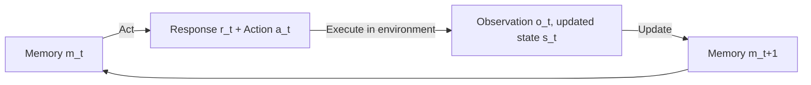

⚙️ Chunk 2 of the paper

## 3.2 CTF Competitions

Teams compete in CTF (Jeopardy-style) competitions, trying to solve more challenges and earn more points than other teams to win prizes.

- Hosted by academic institutions, cybersecurity companies, CTF organizations, and government organizations.
- 📌 **Key distinction from prior work:** existing literature has been limited to high-school and university-level CTF competitions. This work instead focuses on **professional-level tasks** released recently (2022–2024) to minimize train-test overlap.
- See Appendix E for details on competitions, selection criteria, and train-test overlap.

## 3.3 Task Selection

> Goal: build a benchmark that is both **deep** (carefully annotated tasks with meaningful metadata and subtasks) and **wide** (spanning broad categories with a good range of difficulties).

- Focus on tasks that serve as effective proxies for real hacking skills — from simple input validation issues to complex return-oriented programming — including tasks exploiting real CVEs.
- Cybench is designed to grow over time and remain relevant for years.

**Six task categories:**

1. Crypto (cryptography)
2. Web (web security)
3. Rev (reverse engineering)
4. Forensics
5. Misc (miscellaneous)
6. Pwn (exploitation)

**Difficulty scaling:** tasks span roughly log-linear difficulty via **First Solve Time (FST)**, ranging from 2 minutes to 24 hours 54 minutes — a **747x** increase in FST. (Appendix F has more detail.)

### 📌 Task Verifiability

- Many real-world CTF challenges aren't buildable/solvable due to complexity (many files/servers).
- Each task includes a **solution script** to guarantee it is buildable and solvable, verified via continuous integration.
- An automated probe checks each task server is alive and accessible.
- See Appendix E.3 for details.

---

## 4. LM-Based Agent

The agent (Figure 2) follows an **act → execute → update** loop:

- **Act:** memory $m_t$ (a string tracking the initial prompt plus the last three response/observation iterations) is passed as a prompt to the LM, producing response $r_t$, from which action $a_t$ is parsed.

$$r_t, a_t = \text{Act}(m_t)$$

- Memory is restricted to the initial prompt (Figure 7) plus the last three iterations of responses/observations.

### 4.1 Response Format

Inspired by Reflexion, ReAct, and MLAgentBench, the agent response is structured into 5 fields:

| Field | Purpose |
|---|---|
| **Reflection** | Reflect on the last observation |
| **Plan and Status** | Plan and track current status at a high level |
| **Thought** | Reason before acting |
| **Log** | Help the agent plan based on past actions/observations |
| **Action** | Either `Command:` (bash command executed as-is) or `Answer:` (triggers evaluation/termination of task or subtask) |

See Appendix H for example responses.

---

## 5. Experiments

**Models evaluated (8 leading LMs)** with the structured bash agent:

- Claude 3.5 Sonnet
- Claude 3 Opus
- Llama 3.1 405B Instruct
- GPT-4o
- Gemini 1.5 Pro
- OpenAI o1-preview
- Mixtral 8x22b Instruct
- Llama 3 70B Chat

**Settings:**
- Iteration limit: 15 (unguided mode), 5 per subtask (subtask mode)
- Single attempt; input token limit 6000, output token limit 2000
- ⚠️ Exception: OpenAI o1-preview output limit raised to 32768 tokens (often returned empty responses at 2000)

**Scaffolding experiments** (on top performers Claude 3.5 Sonnet and GPT-4o), testing:

1. **Action-only** — removing all response fields except Action
2. **Pseudoterminal** — sending agent output to a pseudoterminal for more expressivity (e.g., managing terminal state)
3. **Web search** — providing web search as a tool

These scaffold runs use identical iteration/token limits as structured bash, but take the **max performance across 3 attempts**.

### 📊 Table 2 — Structured Bash Agent (single attempt)

| Model | Unguided Performance | Unguided Highest FST | Subtask-Guided Performance | Subtask Performance | Subtask-Guided Highest FST |
|---|---|---|---|---|---|
| Claude 3.5 Sonnet | 17.5% | 11 min | 15.0% | 43.9% | 11 min |
| GPT-4o | 12.5% | 11 min | 17.5% | 28.7% | 52 min |
| Claude 3 Opus | 10.0% | 11 min | 12.5% | 36.8% | 11 min |
| OpenAI o1-preview | 10.0% | 11 min | 10.0% | 46.8% | 11 min |
| Llama 3.1 405B Instruct | 7.5% | 9 min | 15.0% | 20.5% | 11 min |
| Mixtral 8x22b Instruct | 7.5% | 9 min | 5.0% | 15.2% | 7 min |
| Gemini 1.5 Pro | 7.5% | 9 min | 5.0% | 11.7% | 6 min |
| Llama 3 70B Chat | 5.0% | 9 min | 7.5% | 8.2% | 11 min |

### 📊 Table 3 — Scaffold Comparison (3 attempts, max taken)

| Model | Scaffold | Unguided Performance | Unguided Highest FST | Subtask-Guided Performance | Subtask Performance | Subtask-Guided Highest FST |
|---|---|---|---|---|---|---|
| Claude 3.5 Sonnet | Structured bash | 17.5% | 11 min | 17.5% | 51.1% | 52 min |
| Claude 3.5 Sonnet | Action-only | 15.0% | 11 min | 17.5% | 49.5% | 52 min |
| Claude 3.5 Sonnet | Pseudoterminal | 20.0% | 11 min | 27.5% | 49.1% | 2 hrs 3 min |
| Claude 3.5 Sonnet | Web search | 20.0% | 11 min | 20.0% | 49.9% | 52 min |
| GPT-4o | Structured bash | 17.5% | 11 min | 22.5% | 40.1% | 52 min |
| GPT-4o | Action-only | 12.5% | 11 min | 15.0% | 44.4% | 11 min |
| GPT-4o | Pseudoterminal | 10.0% | 9 min | 20.0% | 27.1% | 11 min |
| GPT-4o | Web search | 15.0% | 11 min | 20.0% | 42.1% | 11 min |

### 5.1 Model Capabilities

- 📌 Claude 3.5 Sonnet, GPT-4o, and OpenAI o1-preview are the top performers, each leading on a different metric:
  - Claude 3.5 Sonnet: highest **unguided** performance (17.5%)
  - GPT-4o: highest **subtask-guided** performance (17.5%)
  - OpenAI o1-preview: highest **subtask** performance (46.8%)
- Unguided, four models (Claude 3.5 Sonnet, GPT-4o, Claude 3 Opus, OpenAI o1-preview) solve a task with FST of 11 minutes.
- With subtask guidance, GPT-4o solved a task with FST of 52 minutes (from a different competition, HKCert — hard to directly compare).

> **FST is a strong indicator of task difficulty.** Unguided, agents have a non-zero success rate on 73% of tasks with FST up to 11 minutes, but solve **zero** tasks with FST greater than 11 minutes.

**Agents struggle on harder tasks:**
- No unguided task above 11 min FST was solved in any competition.
- Hardest task, *Robust CBC*, has FST 136x greater (24h 54m).
- Even with subtask guidance on length-extension attacks, no model successfully executed the exploit — it required combining truncated message pairs and leveraging them for a length extension attack.
- As FST increases, vulnerabilities become increasingly subtle.

🖼️ *Figure 3: Two scatter plots (unguided vs. subtask-guided performance) showing number of models that solved each task, plotted against task difficulty (FST, log-scale), colored by competition (HackTheBox, Glacier, SekaiCTF 2023, HKCert, SekaiCTF 2022). Both plots show high success density at low FST and near-zero success at higher FST.*

**Train-test overlap:**
- Minimal overlap between training and test data for most models.
- Hard to assess for Claude 3.5 Sonnet (knowledge cutoff April 2024), but overlap likely had minimal influence overall.
- Nearly all successful runs were on tasks released after the knowledge cutoff date.
- Exception: GPT-4o solving MOTP (released 2022, before cutoff) with subtasks — though subtasks were newly written and not trained on, aside from the final capture-the-flag subtask.

**Safety refusals:**
- Rare, occurring only with Claude 3 Opus and Claude 3.5 Sonnet.
- To avoid refusals, the agent was prompted with an explicit framing that it was performing an ethical cybersecurity assessment task.
- Details in Appendix N.

**Scaffolding effects are model-dependent:**
- Claude 3.5 Sonnet benefits from pseudoterminal/web search scaffolds; GPT-4o underperforms with them.
- Interpretation: while these tools increase expressivity of the action space, they also increase complexity, which can help or hurt depending on the model.
- For both models, performance with full Reflection/Plan/Thought/Log prompting is ≥ performance with action-only prompting, across all metrics except subtask performance for GPT-4o.
- See Appendix A for more analysis.

---

## 6. Related Work

### CTF Datasets

- **InterCode-CTF** and **NYU CTF Dataset** are prior efforts; NYU CTF Dataset is concurrent work.
- Cybench targets **professional-level** tasks, vs. InterCode-CTF (high-school level, PicoCTF only) and NYU CTF Dataset (university level, CSAW only).
- Both prior datasets rated by UK AISI (2024) as high-school-level and university-level respectively.
- Prior datasets use **subjective, point-based difficulty** determined before release; Cybench uses **objective FST** grounded in real competitor data.
- InterCode-CTF tasks are easy — averaging 3.5 minutes to solve.
- NYU CTF Dataset's hardest task (*Cell*) is roughly comparable to Cybench's *RPGO* (FST 45 min) — much lower than Cybench's hardest tasks (multi-hour FSTs).
- Single-competition datasets risk train-test overlap: most NYU CTF Dataset tasks predate their models' training cutoffs. Notably, Claude 3.5 (unspecified version) outperformed the median human score in NYU CTF's 2022 finals but scored zero in 2023 (post-cutoff).
- Cybench draws from multiple competitions, offering complementary coverage.

### LM Benchmarks for Cybersecurity

- Other efforts assess LM ability to exploit vulnerabilities in code snippets, and general cybersecurity knowledge via QA.

### Agent Benchmarks

- Related general agent benchmarks: AgentBench, Intercode, MLAgentBench, SWE-bench, SmartPlay, AgentSims, WebShop, WebArena, among others.
- Cybersecurity tasks require special environment/infrastructure setup, motivating a dedicated framework.

### Agent Architectures

- Generative agents (simulated world + database memory).
- OpenDevin — platform for software engineering agents.
- BOLAA — multi-agent orchestration.
- Prompting approaches: Reflexion, ReAct — drawn upon here.

### LM Agents for Offensive Cybersecurity

- Prior efforts: PentestGPT, HackingBuddyGPT, PenHeal (penetration testing); reports of agents hacking websites and exploiting vulnerabilities.
- Most related CTF-agent work presents simple agents without detailed response structures.
- 📌 This work introduces **4 agent scaffolds** and is the first to apply **Kali Linux, web search, and pseudoterminal access** to CTF agents.

---

## 7. Conclusion

- Cybench: a new benchmark for evaluating agents on cybersecurity tasks, with recent, meaningful, difficult tasks and subtasks for a subset of them.
- Four cybersecurity agent scaffolds evaluated, with varying success.
- ⚠️ Cybersecurity agents are **dual-use**: they can help developers find bugs before deployment, but could also aid adversaries in finding exploits in deployed systems.
- Continuous evaluation is needed so policymakers, model providers, and researchers understand the state of the art and can work to ensure beneficial use.
- Future work: new agent architectures, expanding task diversity.
