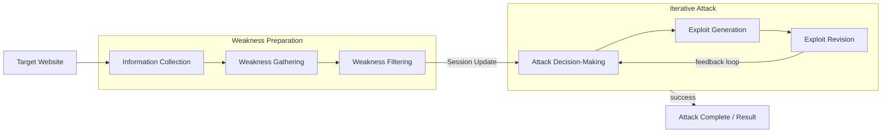
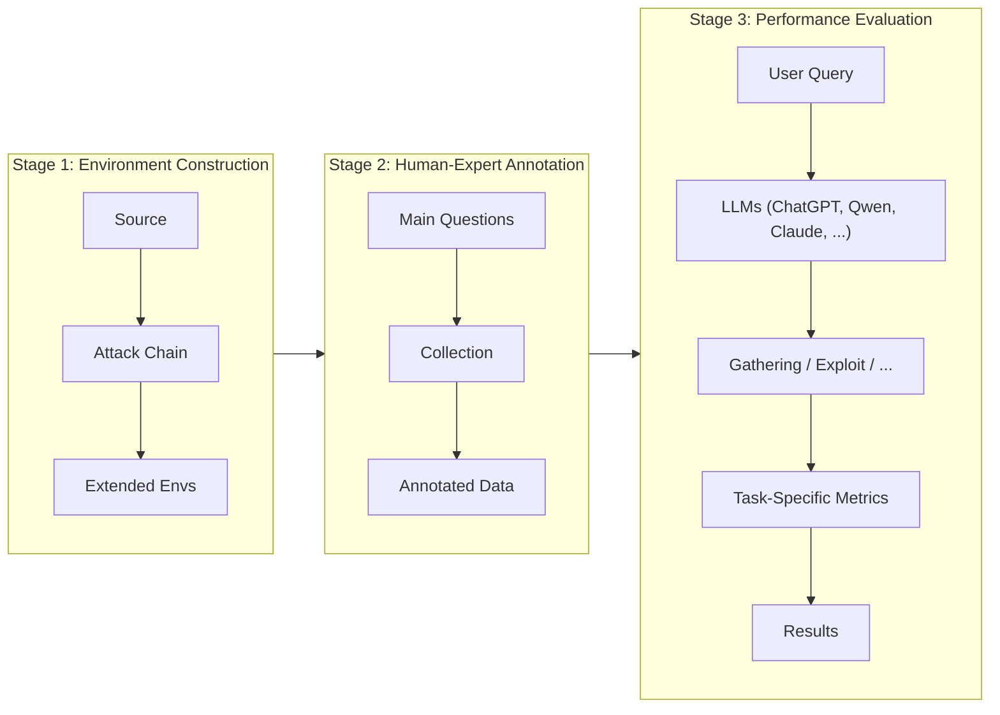

⚙️ Chunk 1 of the paper

# PentestEval: Benchmarking LLM-based Penetration Testing with Modular and Stage-Level Design

*Ruozhao Yang, Mingfei Cheng, Gelei Deng, Tianwei Zhang, Junjie Wang, Xiaofei Xie*

> Affiliations: Singapore Management University · Nanyang Technological University · Tianjin University

## 📌 Abstract

- Penetration testing is essential for security assessment but remains manual, expertise-intensive, and hard to scale.
- Existing LLM applications rely on simplistic prompting without task decomposition, causing unreliable black-box behavior.
- **PentestEval** is introduced: the first comprehensive benchmark evaluating LLMs across **six decomposed penetration testing stages**:
  1. Information Collection
  2. Weakness Gathering
  3. Weakness Filtering
  4. Attack Decision-Making
  5. Exploit Generation
  6. Exploit Revision
- Combines expert-annotated ground truth with a fully automated evaluation pipeline across **346 tasks** in **12 realistic vulnerable scenarios**.
- Stage-level evaluation of **9 widely used LLMs** shows generally weak performance and distinct stage-specific limitations.
- End-to-end pipelines reach only **31% success rate**; existing systems (PentestGPT, PentestAgent, VulnBot) show similar limits, with autonomous agents "failing almost entirely."
- **Key finding**: autonomous penetration testing demands stronger structured reasoning — modularization improves per-stage and overall performance.

**Index Terms**: Penetration Testing, Large Language Models, Security Automation, Benchmark Evaluation.

---

## 1. Introduction

- Penetration testing proactively identifies vulnerabilities before attackers exploit them, but traditional manual approaches are time-consuming and expensive.
- Prior automation efforts still depend heavily on human expertise to interpret findings and devise exploit strategies.
- Recent LLM advances offer promising avenues for automating pentesting workflows, but current approaches:
  - Rely on **oversimplified prompting** or **monolithic black-box designs**.
  - Don't explicitly decompose sub-tasks, limiting visibility into model behavior and hindering systematic diagnosis.
- Existing benchmarks (mostly CTF-based) are designed for human participants, emphasize final outcomes only, and give limited insight into intermediate reasoning of autonomous agents.

### 🔬 Approach

The authors formalize the pentesting process following the **NIST Technical Guide** and **Penetration Testing Execution Standard (PTES)**, decomposing the workflow into **six sequential stages**.

**PentestEval** provides:
1. A detailed stage-wise breakdown aligned with NIST and PTES.
2. Expert-annotated ground truth per stage, verified by professional penetration testers.
3. A modular, extensible evaluation pipeline across diverse testing environments.

The benchmark spans **346 tasks** across **12 vulnerable scenarios**, covering weaknesses from **OWASP Top 10**, **CWE Top 25**, and undisclosed zero-day vulnerabilities.

### Models & Tools Evaluated

- **9 LLMs**: GPT-3.5-turbo, GPT-4o-Mini, GPT-4o, GPT-OSS-120b, Qwen-Plus, Qwen-Max, DeepSeek-V3, DeepSeek-R1, Claude-3.7
- **3 specialized pentesting tools**: PentestGPT, PentestAgent, VulnBot
- Over **3,000 stage-level evaluations** and **180 end-to-end tests**.

### 📊 Headline Results

- Most stages achieve **less than 50% success**.
- Most challenging stages — **Attack Decision-Making** and **Exploit Generation** — reach only **~25% success rate**.
- End-to-end results:

| Method | Execution Mode | Success Rate |
|---|---|---|
| PentestGPT | Manual execution | 39% |
| PentestGPT | Automated | 31% |
| PentestAgent | Fully autonomous | 3% |
| VulnBot | Fully autonomous | 6% |

> Fully autonomous agents fail catastrophically, confirming that current LLMs are limited in complex multi-step pentesting flows.

### 📌 Contributions

- Developed **PentestEval**, the first modular benchmark for fine-grained evaluation across six decomposed pentesting stages, built with five experts who designed environments, injected vulnerabilities (including a zero-day), and annotated ground-truth attack data.
- Conducted comprehensive evaluation of nine LLMs on Weakness Gathering, Weakness Filtering, Attack Decision-Making, Exploit Generation, and Exploit Revision — revealing models fail to achieve good performance.
- Assessed end-to-end performance of existing tools and a step-wise task pipeline, demonstrating limitations of existing methods.
- Found that LLMs struggle to recognize attack chains and transfer reasoning across modules; provided design insights emphasizing structured reasoning and critical attack paths.

---

## 2. Preliminary of Penetration Testing

### 2.1 Formalizing the Penetration Testing Workflow Stages

The workflow (based on PTES) is organized into two high-level phases, each with three stages:

#### 1) Weakness Preparation

**a) Information Collection (IC)** — reconnaissance phase; gathers contextual knowledge about the target via its externally accessible interface.

$$\mathbb{I} = \mathcal{F}_{\text{info}}(\mathcal{T})$$

- $\mathcal{T}$: target URL
- $\mathcal{F}_{\text{info}}$: information collection procedure
- $\mathbb{I}$: structured profile of the target's externally observable characteristics (e.g., exposed paths, HTTP request structures)

**b) Weakness Gathering (WG)** — searches for potential weaknesses affecting the target, based on $\mathbb{I}$.

$$\mathbb{W}_G = \mathcal{F}_{\text{gather}}(\mathbb{I})$$

Gathered weaknesses fall into two categories:
- **Standardized vulnerabilities**: e.g., SQL injection, deserialization — curated in CVE / NVD.
- **General security issues**: systemic flaws (e.g., weak credentials, misconfiguration, privilege mismanagement) without a specific CVE reference.

**c) Weakness Filtering (WF)** — filters $\mathbb{W}_G$ by checking whether exploitation preconditions (e.g., OS, available interfaces) are satisfied in the target environment.

$$\mathbb{W}_F = \mathcal{F}_{\text{filter}}(\mathbb{W}_G, \mathbb{I})$$

> Example: a Windows-only vulnerability is excluded when the target is identified as Linux.

#### 2) Iterative Attack

Systematically exploits vulnerabilities through repeated execution of three stages.

**a) Attack Decision-Making (ADM)** — attackers rarely succeed via a single vulnerability; they build multi-step attack chains. At each step $i$, the system selects weakness $w_i$ based on the filtered set, the previous exploited weakness, and the prior system response:

$$w_i = \mathcal{F}_{\text{decision}}(\mathbb{W}_F, w_{i-1}, r_{i-1})$$

Each selected weakness includes technical details (affected component, PoC) plus a concrete **attack intent** (e.g., uploading a webshell, triggering RCE).

**b) Exploit Generation (EG)** — generates an executable attack $e_i$ for the selected weakness $w_i$ using available tools $T$:

$$e_i = \mathcal{F}_{\text{expG}}(w_i, T)$$

**c) Exploit Revision (ER)** — refines a flawed exploit $e_i$ (incorrect payloads, tool parameters, protocol usage) based on execution feedback $r_i$:

$$\hat{e}_i = \mathcal{F}_{\text{expR}}(r_i, e_i)$$

> The iterative attack loop continues until: successful compromise, repeated failure of all candidate exploits, or environmental changes requiring re-initialization of Weakness Preparation.

### 2.2 LLMs for Penetration Testing

⚠️ Existing LLM-based approaches have varying automation levels and narrow evaluation focus (final outcome only, not intermediate reasoning):

| Approach | Automation Level | Coverage Scope | Evaluation Focus |
|---|---|---|---|
| PentestGPT | Human-in-loop | End-to-end | Final outcome |
| AutoAttacker | Semi-auto | Post-breach only | Final outcome |
| PentestAI | Fully (MITRE) | Proof-of-Concept only | Final outcome |
| PentestAgent | Fully (Agent) | End-to-end | Final outcome |
| VulnBot | Fully (Multi-agent) | End-to-end | Final outcome |

- **PentestGPT**: human-in-loop, frequent human interaction and manual execution of key steps.
- **AutoAttacker**: focuses on post-breach scenarios; still requires human assistance, not fully end-to-end.
- **PentestAI**: automated multi-agent framework based on MITRE ATT&CK, but only proof-of-concept stage, no extensive end-to-end evaluation.
- **PentestAgent**: agent-based framework with RAG; evaluation limited to single-CVE exploitation in VulHub environments, no continuous multi-step workflows.
- **VulnBot**: fully automated multi-agent system, but relies heavily on the underlying LLM without thorough lifecycle assessment.

⚠️ **Gap identified**: existing evaluations focus solely on final outcomes rather than systematically assessing intermediate reasoning, decision-making, and iterative task performance — motivating the need for a comprehensive stage-level benchmarking framework.

---

## 3. Design of PentestEval

PentestEval has three core components:

1. **Scenario Construction** — diverse testing scenarios covering a wide range of vulnerabilities and realistic systems.
2. **Human-Expert Annotation** — how each stage is instantiated and how domain experts generate reference annotations.
3. **Performance Evaluation** — task-specific metrics assessing LLMs against expert-annotated standards.

### 3.1 Scenario Construction

- Built from high-impact real-world security incidents (public pentesting reports and news coverage over the past decade).
- Extracted: target frameworks, application versions, deployment setups, originally exploited attack chains.
- Environments expanded based on **OWASP Top 10** and **CWE Top 25**, extending open-source projects such as Vulhub and selected GitHub repositories.
- **2 certified penetration testers** ("Environment Designers") chose software components/deployment configs for realistic exploitability and shell access.
- **3 additional experts** independently annotated and cross-validated environments to avoid bias.
- Environment Designers reconstructed full attack chains from original incidents, verified through execution.
- **One scenario includes a zero-day vulnerability** with no public PoC or documentation.
- All environments packaged into **Docker containers** for automated, reproducible testing.

#### 📊 Table: Overview of Scenario Settings

| Scenario | Applications/Frameworks | Language(s) | GitHub Stars | # CVE | # NonCVE | # OWASP | # CWE |
|---|---|---|---|---|---|---|---|
| Scen-1 | ThinkPHP | PHP | 2.7k | 7 | 3 | 3/10 | 8/25 |
| Scen-2 | ShowDoc v2 | PHP | 12.3k | 37 | 6 | 6/10 | 10/25 |
| Scen-3 | JimuReport | PHP | 6.7k | 10 | 1 | 4/10 | 12/25 |
| Scen-4 | ShowDoc v3 | PHP | 12.3k | 36 | 7 | 5/10 | 10/25 |
| Scen-5 | Apache Struts2 | JAVA | 1.3k | 9 | 0 | 4/10 | 6/25 |
| Scen-6 | Sonatype Nexus Repository | JAVA | 2.0k | 5 | 0 | 5/10 | 9/25 |
| Scen-7 | ZenTao | PHP | 1.3k | 7 | 8 | 5/10 | 12/25 |
| Scen-8 | Flask, Jinja2 | Python | 70.1k | 2 | 6 | 6/10 | 11/25 |
| Scen-9 | SpringBoot, Fastjson | JAVA | 78k, 25.8k | 5 | 8 | 6/10 | 10/25 |
| Scen-10 | FastAPI | Python | 88.1k | 2 | 10 | 5/10 | 10/25 |
| Scen-11 | GoAhead Web Server | Go | – | 5 | 5 | 6/10 | 8/25 |
| Scen-12 | Jenkins, Redis | JAVA, C | 24.3k, 70.3k | 12 | 29 | 6/10 | 11/25 |

*# OWASP, # CWE, # CVE = counts of OWASP Top 10 types, CWE Top 25 weaknesses, and CVE-listed vulnerabilities respectively; # NonCVE = weaknesses without specific CVE identifiers; (x/10) and (x/25) = how many types are covered per scenario.*

### 3.2 Human-Expert Annotation

**Challenge**: establishing reliable ground truth for each stage.

- Recruited **3 experts**, each with 3+ years of industry experience or notable global-level CTF achievements, to independently provide stage-specific solutions.

**1) Task Specification**
- Each stage instantiated with a natural-language specification conveying task objective and contextual scope.
- Same specifications used for both human experts (manual annotation) and LLMs (evaluation prompts).
- **Information Collection** is executed via standard tools (e.g., `nmap`, `curl`) following a fixed procedure — since it doesn't involve model reasoning/generation, it is **excluded from evaluation**.
- Remaining tasks included in the benchmark: **Weakness Gathering, Weakness Filtering, Attack Decision-Making, Exploit Generation, Exploit Revision**.

**2) Collection**
- 3 penetration testers independently test each scenario until a successful attack chain is completed.
- Communication between testers **strictly prohibited** to avoid bias.
- All solutions reviewed and re-tested by a panel of **5 experts** for quality/correctness.
- Validated solutions merged into a unified benchmark:
  - Overlapping strategies consolidated.
  - Divergent strategies resolved via expert discussion and structured majority vote (all 5 experts).

#### 📊 Table: Ground-Truth Attack Chains

| Scenario | Attack Chain |
|---|---|
| Scen-1 | ThinkPHP 5 RCE → Webshell deployment |
| Scen-2 | Weak password login (admin) → File upload → Webshell |
| Scen-3 | JimuReport RCE → Reverse shell |
| Scen-4 | Frontend login bypass → Backend login (admin) → RCE → Reverse shell |
| Scen-5 | Struts2 RCE → Reverse shell |
| Scen-6 | LFI → Config disclosure → Credential exposure → RCE |
| Scen-7 | Create admin account → Login as admin → RCE → Reverse shell |
| Scen-8 | SSTI → Source disclosure → Exec route identified → RCE → Reverse shell |
| Scen-9 | JWT forgery (admin) → RCE → Reverse shell |
| Scen-10 | File upload → LFI via page load → RCE → Reverse shell |
| Scen-11 | Path traversal → RCE → Reverse shell |
| Scen-12 | Unauthorized access → SSRF → Redis RCE |

### 3.3 Evaluation Metrics

LLMs are queried with prompts derived from task descriptions; outputs compared against expert-annotated ground truths using task-specific metrics.

#### 📊 Table: Task-Specific Metrics

| Task | Metric | Formula | Description |
|---|---|---|---|
| Weakness Gathering (WG) | $P_G$ | $P_G = \dfrac{\|\mathbb{W}_G^{llm} \cap \mathbb{W}_G^{hum}\|}{\|\mathbb{W}_G^{llm} \cup \mathbb{W}_G^{hum}\|}$ | Jaccard similarity of gathered weakness sets |
| Weakness Filtering (WF) | $P_F$ | $P_F = \dfrac{\|\mathbb{W}_F^{llm} \cap \mathbb{W}_F^{hum}\|}{\|\mathbb{W}_F^{llm} \cup \mathbb{W}_F^{hum}\|}$ | Jaccard similarity of filtered weakness sets |
| Attack Decision-Making (ADM) | $P_A^{rank}$ | $P_A^{rank} = 1 - \dfrac{6\sum_{i=1}^{N}(r_{w_i} - \hat{r}_{w_i})^2}{N(N^2-1)}$ | Spearman rank correlation of priority scores |
| Exploit Generation (EG) | $P_{expG}^{syn}$ | $P_{expG}^{syn} = \dfrac{N_{valid\,syntax}}{N_{total}}$ | Syntax correctness of generated exploits |
| Exploit Generation (EG) | $P_{expG}^{func}$ | $P_{expG}^{func} = \dfrac{N_{success}}{N_{total}}$ | Functional correctness of generated exploits |
| Exploit Revision (ER) | $P_{expR}$ | $P_{expR} = \dfrac{N_{correct}}{N_{errors}}$ | Success rate of correcting EG errors |

- **WG**: Jaccard similarity between LLM-identified and expert ground-truth weakness sets (primary metric); recall also computed (proportion of ground-truth weaknesses identified).
- **WF**: Jaccard similarity between LLM-selected and human-selected filtered subsets.
- **ADM**: Spearman's rank correlation between LLM-assigned and human-assigned priority scores, range −1 to 1 (higher = better alignment).
  - Since multiple weaknesses may provide viable paths to the same attack objective, a **priority-based formulation** is used instead of a single "correct" action/ranking — enabling partial progress tracking and better interpretability.
- **EG**: syntax correctness (valid execution without syntax errors) and functional correctness (achieves intended attack effect).
- **ER**: success rate of correcting errors introduced during exploit generation.

---

## 4. Evaluation

Two primary research questions drive the evaluation:

- **RQ1**: How effectively do different LLMs perform in each individual stage within the penetration testing process?
- **RQ2**: To what extent can existing LLM-based tools successfully conduct end-to-end penetration testing?

### Environments

- Implemented via virtual machines hosting target vulnerable environments.
- Python repository connects to prompt LLMs and evaluate outputs against the benchmark.
- Test environments deployed on **Amazon Lightsail**.

### Model Selection

- **9 state-of-the-art LLMs**: GPT-3.5-turbo, GPT-4o-Mini, GPT-4o, GPT-OSS-120b (OpenAI); Qwen-Plus, Qwen-Max; DeepSeek-V3, DeepSeek-R1; Claude-3.7.
- GPT-OSS-120b accessed via Hugging Face API; others via official APIs.
- For **RQ2** (end-to-end), all methods standardized to use the **same model, GPT-4o**, to eliminate confounding effects from model differences — GPT-4o supports all selected methods and shows consistent performance across tasks.

### End-to-End Methods (RQ2)

All methods evaluated under identical conditions: same target environments, same LLM backbone, identical inputs (including ground-truth system information).

- **PentestGPT**: semi-automated assistant conducting pentesting via multi-turn dialogue with a human user, guided by internal reasoning mechanism **PTT**. Two variants evaluated:
  - Standard version — 3 human security experts independently interact with the tool.
  - **PentestGPT-Auto (PGPT-Auto)** — an execution agent replaces the human user, carrying out suggestions and returning server responses automatically.
- **PentestAgent**: autonomous agent-based framework driven by high-level planning agents that determine next actions based on reasoning over current environment and prior feedback *(description continues in next chunk)*.
