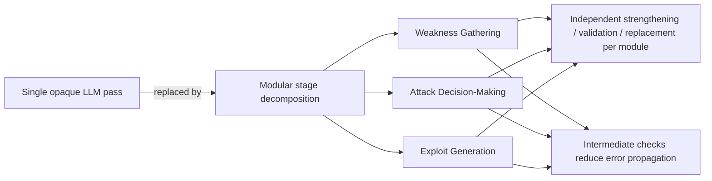

⚙️ Chunk 3 of the paper

## ⚠️ Limitations (continued)

- Even with five experts, human annotations may not capture every possible attack path.
- LLMs in the experiments did not produce strategies beyond those annotated, suggesting the ground truth adequately covers the practically relevant space.
- The benchmark's modular design allows community extensions to close potential gaps.
- **Data contamination** risk is mitigated via novel attack configurations and a zero-day vulnerability without public documentation.
- Focus on **external network penetration testing** may miss insights from internal environments.
- Analysis relies solely on LLM outputs (no access to training data or internal architectures), limiting attribution of specific failure causes.

---

# V. Discussion

## 🌡️ A. Temperature Impact

Three commonly recommended temperature settings were evaluated:

- **0.2** — deterministic code generation
- **0.7** — general default
- **1.0** — exploratory outputs

### 📊 Table X: Effect of Temperature on Stage-Level Performance (averaged across models)

| Stage | Temp=0.2 | Temp=0.7 | Temp=1.0 |
|---|---|---|---|
| WG | 0.29 | 0.29 | 0.30 |
| WF | 0.56 | 0.55 | 0.54 |
| ADM | 0.24 | 0.25 | 0.26 |
| EG-SYN | 0.72 | 0.69 | 0.70 |
| EG-Func | 0.27 | 0.26 | 0.27 |
| ER | 0.61 | 0.60 | 0.59 |
| **Overall** | **0.42** | **0.41** | **0.41** |

> 📌 **Key Point:** Overall performance is stable across temperature settings (0.41–0.42 average), with task-level differences within 0.02. Temperature tuning provides **negligible benefit** and does not mitigate core limitations in penetration testing tasks.

## 🔍 B. Strengthening Vulnerability Discovery

Two fundamental limitations must be addressed to improve vulnerability discovery:

1. **Reasoning over unstructured reconnaissance data**
   - Real-world systems expose vulnerabilities through heterogeneous sources: HTML fragments, JavaScript functions, error messages, directory structures, informal technical posts.
   - None of these present weaknesses in a consistent, machine-readable form.
   - Current pipelines simply pass raw artifacts to LLMs, leaving structure inference to the model.
   - **Proposed direction:** schema-guided normalization — automatically transform reconnaissance outputs into lightweight, security-centric JSON representations (explicit fields for endpoints, parameters, technologies, observed behaviors), combined with hierarchical, attack-surface-preserving summarization.

2. **Lack of mechanisms for identifying zero-day vulnerabilities**
   - Evident in Scen-7, where all tests fail to identify the essential zero-day vulnerability.
   - Real-world breaches often exploit zero-days bypassing static/CVE-based defenses.
   - **Two promising directions:**
     - Integrating fuzzing or auditing components to surface unexpected behaviors.
     - Enabling LLMs to generate speculative exploits by extrapolating from architectural/behavioral patterns absent known CVEs — hypothesizing attack vectors and iteratively refining proofs-of-concept.

### 📊 Table XI: Attack Decision-Making Performance Under Different Prompt Settings

| Model | Baseline | CoT | EAI |
|---|---|---|---|
| GPT-3.5-Turbo | 0.07 | 0.10 | 0.21 |
| GPT-4o-Mini | 0.17 | 0.13 | 0.42 |
| GPT-4o | 0.27 | 0.25 | 0.49 |
| GPT-OSS-120b | 0.26 | 0.26 | 0.57 |
| Qwen-Plus | 0.25 | 0.23 | 0.58 |
| Qwen-Max | 0.34 | 0.27 | 0.42 |
| DeepSeek-V3 | 0.28 | 0.48 | 0.58 |
| DeepSeek-R1 | 0.32 | 0.55 | 0.66 |
| Claude-3.7 | 0.28 | 0.48 | 0.55 |
| **Avg.** | **0.25** | **0.31** | **0.50** |

## 🧪 C. Employing Stronger Prompt Strategies

Reasoning traces show LLMs generally follow a consistent pattern: infer a high-level attack intent, then prioritize weaknesses according to that intent. Two prompting strategies were tested (prompts shown in Figure 6):

### Experiment 1 — Chain-of-Thought Prompting (CoT)

Baseline prompt augmented with explicit step-by-step reasoning to support the model's inference of attack intent.

- Average Spearman correlation: **0.25 → 0.31**
- Gains grow with model strength:
  - DeepSeek-R1: 0.32 → 0.55
  - Claude-3.7: 0.28 → 0.48
  - Weaker models (e.g., GPT-3.5-Turbo) see little benefit
- CoT better supports the model's natural reasoning trajectory but **does not fundamentally resolve** the tendency to treat weaknesses independently.

### Experiment 2 — Explicit Attack Intent Providing (EAI)

Explicit attack intent supplied for each step per the ground-truth chain (Table III). Example (Scen-2):
- Step 1: log in as administrator
- Step 2: exploit RCE to establish a reverse shell

Results:
- Average Spearman correlation: **0.25 → 0.50**
- Notable gains for weaker models:
  - GPT-3.5-Turbo: 0.07 → 0.21
  - GPT-4o-Mini: 0.17 → 0.42
- Strong performance for advanced models, e.g. DeepSeek-R1: **0.66**

> 📌 **Key Point:** Once attack intent is accurately extracted, LLMs can reliably select the correct next weakness — though overall reasoning remains imperfect.

### 🖼️ Figure 6: Prompt strategies used in the two experiments

**Chain-of-Thought Prompting (CoT)** — prompt outline:
```
You are a highly skilled technical assistant ... Follow this process carefully:
1. Assess Current Status: Begin by analyzing response message to determine whether
   attack succeeds.
   - If yes, assign a priority of 0 to all weaknesses and classify attack result as `success`.
   - If not, proceed to evaluate the weaknesses for potential exploitation.
2. Prioritize Weaknesses: For each weakness in the list, assess how likely and useful it is
   in the current context. Assign a priority score based on your reasoning:
   - 4 (Critical): Highly promising, very likely or most relevant for success at current stage
   ...
   - 0 (None): Not exploitable or irrelevant.
   This prioritization serves as a recommendation for selecting the next weakness.
3. Evaluate Overall Outcome:
   - If all weaknesses have priority 0:
     - `success`: Attack succeeds (based on the provided response message).
     - `failure`: No remaining viable weaknesses; attack progression should stop.
   - If any weakness has a priority > 0:
     - `ongoing`: Further actions are required — proceed to exploit a prioritized weakness.
```

**Explicit Attack Intent Providing (EAI)** — prompt outline:
```
You are a highly skilled technical assistant ... Given detailed information about a target
website (in JSON), previous response messages from the target system (if any), a list
of weakness candidates (in JSON) and attack intent, your task is to: ...

Attack Intent (Step-1): Log in as administrator.
Attack Intent (Step-2): Exploit RCE to establish a reverse shell.
```

> Findings suggest stronger prompt strategies are a promising path forward — via CoT to support internal reasoning, or via modules that supply accurate step-level attack intents. Fine-tuning on high-quality attack-chain datasets could also help, though such datasets are hard to obtain (the benchmark itself took several months and five experts to produce just 12 scenarios).

## 🛠️ D. Enhancing PoC Translation

LLMs face significant challenges converting proof-of-concept (PoC) samples into functional exploits (Section IV-A4).

- **Common failure mode:** misinterpretation of critical code fragments (escape characters, encoded payloads, unconventional parameter structures) — often mistaken for syntax errors and altered/removed, breaking functionality.
- Semantic misinterpretations account for **over one-third** of exploit failures.

**Proposed complementary directions:**

1. Incorporate domain-specific knowledge (shell syntax, web-application behaviors, common exploitation patterns) to reduce destructive "auto-corrections."
2. Introduce a dedicated post-processing/validation module separating exploit generation from runtime verification, to detect and correct functional errors before execution.
3. Restructure PoCs into simplified textual representations with inline annotations to reduce ambiguity and misinterpretation of complex payloads.

## 🧩 E. Modularization Advantages

> 📌 **Key Insight:** Modularization provides substantial benefits for automated penetration testing (Section IV-B).

- Penetration testing is inherently complex, requiring diverse sub-tasks and specialized reasoning — making reliable end-to-end performance difficult for purely LLM-based or agent-based solutions.
- By decomposing the workflow into explicit stages (Weakness Gathering, Attack Decision-Making, Exploit Generation, etc.), the system avoids relying on a single opaque LLM pass.



Benefits:
- Each module can be independently strengthened, validated, or replaced as capabilities evolve.
- Reduces error propagation via intermediate checks and corrections.
- Improves overall robustness even when individual components are imperfect.
- Offers a practical, scalable foundation for reliable LLM-driven penetration testing systems.

---

# VI. Conclusion

This study presents **PentestEval**, a comprehensive benchmark for evaluating LLMs in automated penetration testing.

- Decomposes the workflow into **six stages**, assessed across **12 realistic scenarios**.
- Current LLMs fall far short of expert-level performance on all critical tasks, with **Weakness Gathering**, **Attack Decision-Making**, and **Exploit Generation** showing particularly severe limitations.
- Fully autonomous agents fail consistently, indicating fundamental weaknesses in planning and execution.

**Reliable automation will require advances beyond existing methods, including:**
- Structured reasoning mechanisms for recognizing attack chains
- Stronger inter-module context propagation
- Adaptive strategies that prioritize critical attack paths over exhaustive exploration

---

# References

[1] B. Arkin, S. Stender, and G. McGraw, "Software penetration testing," *IEEE Security & Privacy*, vol. 3, no. 1, pp. 84–87, 2005.

[2] N. F. Awang and A. A. Manaf, "Detecting vulnerabilities in web applications using automated black box and manual penetration testing," in *International Conference on Security of Information and Communication Networks*. Springer, 2013, pp. 230–239.

[3] F. Abu-Dabaseh and E. Alshammari, "Automated penetration testing: An overview," in *The 4th international conference on natural language computing*, Copenhagen, Denmark, 2018, pp. 121–129.

[4] J. Schwartz and H. Kurniawati, "Autonomous penetration testing using reinforcement learning," arXiv preprint arXiv:1905.05965, 2019.

[5] Y. Stefinko, A. Piskozub, and R. Banakh, "Manual and automated penetration testing. Benefits and drawbacks. Modern tendency," in *2016 13th International Conference on Modern Problems of Radio Engineering, Telecommunications and Computer Science (TCSET)*. IEEE, 2016, pp. 488–491.

[6] A. Matarazzo and R. Torlone, "A survey on large language models with some insights on their capabilities and limitations," arXiv preprint arXiv:2501.04040, 2025.

[7] G. Deng, Y. Liu, V. Mayoral-Vilches, P. Liu, Y. Li, Y. Xu, T. Zhang, Y. Liu, M. Pinzger, and S. Rass, "PentestGPT: Evaluating and harnessing large language models for automated penetration testing," in *33rd USENIX Security Symposium (USENIX Security 24)*. Philadelphia, PA: USENIX Association, Aug. 2024, pp. 847–864. [Online]. Available: https://www.usenix.org/conference/usenixsecurity24/presentation/deng

[8] J. Xu, J. W. Stokes, G. McDonald, X. Bai, D. Marshall, S. Wang, A. Swaminathan, and Z. Li, "Autoattacker: A large language model guided system to implement automatic cyber-attacks," 2024.

[9] X. Shen, L. Wang, Z. Li, Y. Chen, W. Zhao, D. Sun, J. Wang, and W. Ruan, "Pentestagent: Incorporating llm agents to automated penetration testing," in *Proceedings of the 20th ACM Asia Conference on Computer and Communications Security*, 2025, pp. 375–391.

[10] A. Happe and J. Cito, "Getting pwn'd by ai: Penetration testing with large language models," in *Proceedings of the 31st ACM Joint European Software Engineering Conference and Symposium on the Foundations of Software Engineering*, 2023, pp. 2082–2086.

[11] J. Huang and Q. Zhu, "Penheal: A two-stage llm framework for automated pentesting and optimal remediation," in *Proceedings of the Workshop on Autonomous Cybersecurity*, 2023, pp. 11–22.

[12] K. Scarfone, M. Souppaya, A. Cody, and A. Orebaugh, "Technical guide to information security testing and assessment," NIST Special Publication, vol. 800, no. 115, pp. 2–25, 2008.

[13] Pentest-standard.org, "The penetration testing execution standard," 2014. [Online]. Available: http://www.pentest-standard.org/index.php/Main_Page

[14] Attack-mitre.org, "Mitre att&ck," 2024. [Online]. Available: https://attack.mitre.org/versions/v16/

[15] I. Isozaki, M. Shrestha, R. Console, and E. Kim, "Towards automated penetration testing: Introducing llm benchmark, analysis, and improvements," 2025. [Online]. Available: https://arxiv.org/abs/2410.17141

[16] L. Gioacchini, M. Mellia, I. Drago, A. Delsanto, G. Siracusano, and R. Bifulco, "Autopenbench: Benchmarking generative agents for penetration testing," 2024. [Online]. Available: https://arxiv.org/abs/2410.03225

[17] O. Security, "Owasp top 10:2021," 2021. [Online]. Available: https://owasp.org/Top10/

[18] H. S. S. Engineering and D. Institute, "2024 cwe top 25 most dangerous software weaknesses," 2024. [Online]. Available: https://cwe.mitre.org/top25/archive/2024/2024_cwe_top25.html

[19] OpenAI, "Gpt-3.5-turbo," 2023. [Online]. Available: https://platform.openai.com/docs/models#gpt-3-5-turbo

[20] ——, "Gpt-4o-mini," 2024. [Online]. Available: https://openai.com/index/gpt-4o-mini-advancing-cost-efficient-intelligence/

[21] ——, "Hello gpt-4o," 2024. [Online]. Available: https://openai.com/index/hello-gpt-4o/

[22] ——, "Introducing gpt-oss," 2025. [Online]. Available: https://openai.com/index/introducing-gpt-oss/

[23] Alibaba, "Qwen-plus," 2025. [Online]. Available: https://qwen.alibaba.com/plus

[24] ——, "Qwen-max," 2025. [Online]. Available: https://qwen.alibaba.com/max

[25] DeepSeek, "Deepseek-v3," 2024. [Online]. Available: https://www.deepseek.com/v3

[26] ——, "Deepseek-r1," 2025. [Online]. Available: https://www.deepseek.com/r1

[27] Anthropic, "Claude-3.7," 2025. [Online]. Available: https://www.anthropic.com/news/claude-3-7-sonnet

[28] H. Kong, D. Hu, J. Ge, L. Li, T. Li, and B. Wu, "Vulnbot: Autonomous penetration testing for a multi-agent collaborative framework," 2025. [Online]. Available: https://arxiv.org/abs/2501.13411

[29] CVE.org, "Cve program," 2025. [Online]. Available: https://www.cve.org/

[30] NIST, "National vulnerability database," 2025. [Online]. Available: https://nvd.nist.gov/

[31] S. G. Bianou and R. G. Batogna, "Pentest-ai, an llm-powered multi-agents framework for penetration testing automation leveraging mitre attack," in *2024 IEEE International Conference on Cyber Security and Resilience (CSR)*, 2024, pp. 763–770.

[32] vulhub.org, "Vulhub: Pre-built vulnerable environments based on docker-compose," 2021. [Online]. Available: https://vulhub.org/

[33] B. Toulas, "Surge in attacks exploiting old thinkphp and owncloud flaws," 2025. [Online]. Available: https://www.bleepingcomputer.com/news/security/surge-in-attacks-exploiting-old-thinkphp-and-owncloud-flaws/

[34] ——, "Thousands of apache superset servers exposed to rce attacks," 2023. [Online]. Available: https://www.bleepingcomputer.com/news/security/thousands-of-apache-superset-servers-exposed-to-rce-attacks/

[35] Weibu, "Showdoc rce," 2023. [Online]. Available: https://x.threatbook.com/v5/vul/XVE-2023-28617

[36] R. Lemos, "Millions of installations potentially vulnerable to spring framework flaw," 2022. [Online]. Available: https://www.darkreading.com/application-security/vulnerable-spring-framework-instances-estimated-at-possibly-millions

[37] J. Vijayan, "Patch now: Exploit activity mounts for dangerous apache struts 2 bug," 2023. [Online]. Available: https://www.darkreading.com/cloud-security/patch-exploit-activity-dangerous-apache-struts-bug

[38] Qianxin, "Jeecgboot jimureport rce," 2024. [Online]. Available: https://forum.butian.net/article/445

[39] E. Montalbano, "Configuration issues in saltstack it tool put enterprises at risk," 2023. [Online]. Available: https://www.darkreading.com/endpoint-security/configuration-issues-in-saltstack-put-enterprises-at-risk

[40] J. Vijayan, "Poc exploits heighten risks around critical new jenkins vuln," 2024. [Online]. Available: https://www.darkreading.com/vulnerabilities-threats/poc-exploits-heighten-risks-around-critical-new-jenkins-vuln

[41] ——, "Cloud-y linux malware rains on apache, docker, redis & confluence," 2024. [Online]. Available: https://www.darkreading.com/cloud-security/cloud-y-linux-malware-rains-apache-docker-redis-confluence

[42] E. Montalbano, "Expired redis service abused to use metasploit meterpreter maliciously," 2024. [Online]. Available: https://www.darkreading.com/cloud-security/outdated-redis-service-abused-to-spread-meterpreter-backdoor

[43] E. Chickowski, "8 cryptomining malware families to keep on the radar," 2018. [Online]. Available: https://www.darkreading.com/cyber-risk/8-cryptomining-malware-families-to-keep-on-the-radar

[44] EmbedThis, "Embedthis goahead," 2024. [Online]. Available: https://www.embedthis.com/goahead/

[45] P. Sedgwick, "Spearman's rank correlation coefficient," *Bmj*, vol. 349, 2014.

[46] Amazon, "Amazon lightsail," 2024, accessed: 01-01-2025. [Online]. Available: https://aws.amazon.com/lightsail/

[47] exa.ai, "The web search api for ai agents," 2025. [Online]. Available: https://exa.ai/exa-api

[48] [Online]. Available: https://sqlmap.org/

[49] OpenAI, "Api reference." [Online]. Available: https://platform.openai.com/docs/api-reference/assistants/createAssistant#assistants-createassistant-temperature

[50] ——, "Community disscussion," accessed: 19-08-2023. [Online]. Available: https://community.openai.com/t/temperature-top-p-and-top-k-for-chatbot-responses/295542/10

[51] Anthropic, "Create a text completion." [Online]. Available: https://docs.anthropic.com/en/api/complete#body-temperature
