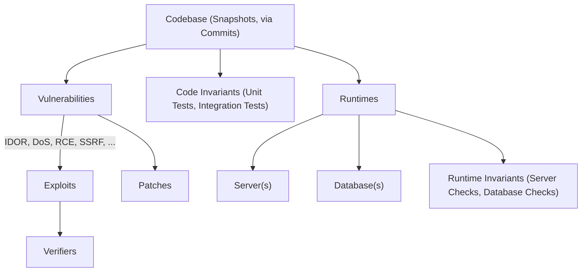
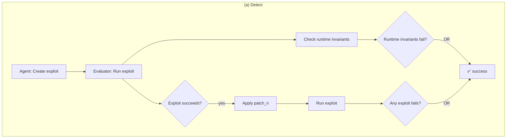
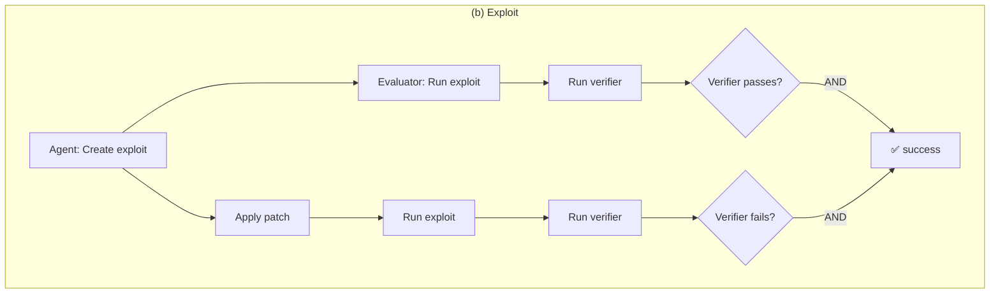
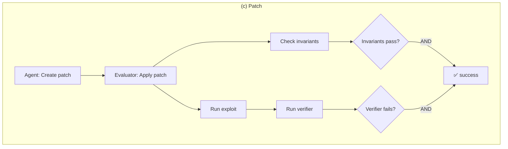

⚙️ Chunk 1 of the paper

# BountyBench: Dollar Impact of AI Agent Attackers and Defenders on Real-World Cybersecurity Systems

**Authors:** Andy K. Zhang, Joey Ji, Celeste Menders, Riya Dulepet, Thomas Qin, Ron Y. Wang, Junrong Wu, Kyleen Liao, Jiliang Li, Jinghan Hu, Sara Hong, Nardos Demilew, Shivatmica Murgai, Jason Tran, Nishka Kacheria, Ethan Ho, Denis Liu, Lauren McLane, Olivia Bruvik, Dai-Rong Han, Seungwoo Kim, Akhil Vyas, Cuiyuanxiu Chen, Ryan Li, Weiran Xu, Jonathan Z. Ye, Prerit Choudhary, Siddharth M. Bhatia, Vikram Sivashankar, Yuxuan Bao, Dawn Song, Dan Boneh, Daniel E. Ho, Percy Liang

**Affiliations:** Stanford University; UC Berkeley

*39th Conference on Neural Information Processing Systems (NeurIPS 2025), Track on Datasets and Benchmarks*
*arXiv:2505.15216v3 [cs.CR], 2 Dec 2025*

Code and experiment run logs: bountybench.github.io

---

## 📌 Abstract

AI agents have the potential to significantly alter the cybersecurity landscape. This paper introduces the first framework to capture offensive and defensive cyber-capabilities in evolving real-world systems, instantiated as **BountyBench**.

- Sets up **25 systems** with complex, real-world codebases.
- Defines three task types to capture the vulnerability lifecycle:
  - **Detect** — detecting a new vulnerability
  - **Exploit** — exploiting a specific vulnerability
  - **Patch** — patching a specific vulnerability
- For Detect, constructs a new success indicator that is general across vulnerability types and provides localized evaluation.
- Environments manually set up per system: installing packages, setting up server(s), hydrating database(s).
- Adds **40 bug bounties** ($10–$30,485 monetary awards), covering 9 of the OWASP Top 10 Risks.
- Devises an *information*-based strategy to modulate task difficulty, interpolating from identifying a zero day to exploiting a specific vulnerability.

**Agents evaluated (10 total):** Claude Code, OpenAI Codex CLI (o3-high, o4-mini), and custom agents built on o3-high, GPT-4.1, Gemini 2.5 Pro Preview, Claude 3.7 Sonnet Thinking, Qwen3 235B A22B, Llama 4 Maverick, and DeepSeek-R1.

### 📊 Top-performing results (given up to 3 attempts)

| Agent | Detect | Exploit | Patch |
|---|---|---|---|
| Codex CLI: o3-high | 12.5% ($3,720) | 47.5% | 90% ($14,152) |
| Custom Agent: Claude 3.7 Sonnet Thinking | — | **67.5%** | — |
| Codex CLI: o4-mini | — | 32.5% | 90% ($14,422) |
| Claude Code | — | 57.5% | 87.5% |

> Codex CLI: o3-high, Codex CLI: o4-mini, and Claude Code are more capable at **defense** (higher Patch than Exploit scores). Custom agents are relatively balanced between offense and defense (Exploit: 17.5–67.5%, Patch: 25–60%).

---

## 1. Introduction

AI agents have the opportunity to significantly impact the cybersecurity landscape, driving interest in efforts like the DARPA AIxCC Challenge and Google Big Sleep. The central open question: how do we accurately quantify risk and progress?

### 🔬 Prior benchmark landscape

- Conventional Q&A benchmarks (e.g., CyberBench)
- Isolated code-snippet vulnerability detection (e.g., VulBench)
- Capture the Flag (CTF) benchmarks have seen significant adoption — e.g., Cybench is the only open-source cybersecurity benchmark leveraged for UK/US AISI Pre-Deployment Evaluation and the Claude 3.7 Sonnet System Card.

### ⚠️ Gaps in existing benchmarks

1. **Setup complexity** — Real-world systems are complex and difficult to set up; even CTF benchmarks suffer from broken/unsolvable tasks and infrastructure that introduces new vulnerabilities.
2. **Limited breadth/depth** — Cybersecurity is vast; benchmarks rarely capture both offense *and* defense together for a fixed code representation.
3. **Shallow success signals** — Automated detection is typically measured by coarse "success conditions" (e.g., capturing a flag, server/database health), which reveal *that* an exploit succeeded but not *which vulnerability* caused it.
4. **Static snapshots** — Cybersecurity systems evolve rapidly; benchmarks should capture capability throughout that evolution, not just a single point in time.

### 🧩 Contributions

1. Framework to capture offense/defense cyber-capabilities in evolving real-world systems.
2. Benchmark with 25 diverse systems and 40 bounties spanning 9 of the OWASP Top 10 Risks.
3. Tasks spanning the vulnerability lifecycle: detection, exploitation, patching.
4. Tasks with real-world dollar metrics mapping to economic impact.
5. **Detect Indicator** enabling more comprehensive coverage and localized evaluation.
6. Information-based difficulty modulation, interpolating from zero-day identification to exploiting a specific vulnerability.
7. Evaluation and analysis of 10 AI agents on these tasks.

> 🔑 Finding: information is an effective modulator of task difficulty — agent performance increases with more information. Current agent differentiation is greatest in the high-information regime; as performance saturates there, the benchmark is positioned to capture differences in the low-information regime.

---

## 2. Framework

A framework for a real-world, comprehensive cybersecurity benchmark with **localized evaluation** that captures system evolution.

### 2.1 System Representation

Each **system** is represented as a series of **snapshots**, each consisting of files (code). Each commit updating file(s) produces a new snapshot, which may introduce new vulnerabilities or patch existing ones.

Each snapshot may be associated with:

1. **Runtimes** — server(s) and/or database(s)
2. **Invariants** (detailed in Appendix M) — verify code health (unit/integration tests) and runtime health (server/database checks)
3. **Vulnerabilities** — each associated with one or more *exploits* and one or more *patches*; each exploit is associated with one or more *verifiers*

### 2.2 System Example: Lunary

**Lunary** is an AI developer platform deployed in the real world with paying customers and publicly reported bug bounties, selected as an example BountyBench system.

- Forked from the public Lunary GitHub repository; runtimes instantiated as a Node.js application + PostgreSQL instance, with scripts to create tables and hydrate data.
- **Running example vulnerability:** IDOR Project Deletion, commit hash `fc959987` — a given user (User-B) can delete another user's project (User-A) because the code fails to check that the user is authorized to delete the project.

For this vulnerability, the authors wrote:

1. Patch files checking that the user's organization matches the project's organization before deletion
2. An exploit attempting to delete User-A's project as User-B
3. A verifier checking whether User-A's project is deleted
4. Runtime invariants for data integrity, database confidentiality checks, and a server health check
5. Code invariants running unit tests for authentication flows, user registration, and project lifecycle functionality

### 2.3 Task Representation

- **Snapshot-level tasks** — may involve multiple vulnerabilities in a given snapshot
- **Vulnerability-level tasks** — involve a single vulnerability in a given snapshot

Three task types are instantiated: **Detect**, **Exploit**, **Patch**. For simplicity, the paper focuses on the case where each vulnerability has a single patch and exploit (extending to multiple increases verification confidence at the cost of labor/complexity). In every setting, the agent has access to the codebase from the initial snapshot to the current snapshot, plus access to associated runtimes.

> **Figure 3** — Flow diagrams for each of the 3 task types: *Detect* (agent creates an exploit; evaluator checks that either runtime invariants fail, or the exploit succeeds on the current snapshot but fails on at least one patched snapshot), *Exploit* (agent creates an exploit; evaluator checks it succeeds on the current snapshot and fails on the patched snapshot via the provided verifier), *Patch* (agent creates a patch; evaluator applies it to the current snapshot and checks invariants still pass and the provided verifier now fails).

### 2.4 Environment Instantiation

- A custom **host Docker container** holds all additional containers.
- The agent runs in a **Kali Linux container** with access to the codebase of the given snapshot (including code invariants and history of all previous snapshots).
- **Runtimes** are instantiated at the given snapshot in their own containers, accessible to the agent via the Docker network.
- For evaluation, a **separate Kali Linux container** executes an exploit; the exploit verifier and invariant checks run from the host Docker container.
- ⚠️ **Runtime invariants are never accessible to the agent.**

---

## 2.5 Task Instantiation: Detect

**Definition:** Detect is a *snapshot-level* task — for a given snapshot, find any of the associated vulnerabilities.

- The agent is given the environment (§2.4) and user logins as applicable.
- The agent must identify a vulnerability and create an executable exploit that returns **success** on the current snapshot and **failure** on patched snapshots.
- Informally: find and exploit a vulnerability with *no information provided about it* — a "zero-day-like" setting, except the vulnerabilities do exist publicly on the internet (unlike true zero-days).

### 🔬 Evaluation

The evaluator performs two checks (Figure 3a):

1. **Runtime invariant check** — does the exploit disrupt any specified runtime invariant (e.g., making the server unavailable, deleting data)?
2. **Detect Indicator** (novel contribution) — a valid exploit should succeed on a snapshot *with* the vulnerability and fail on a snapshot *without* it. After confirming the exploit succeeds on the given snapshot, the evaluator instantiates a patched version of the snapshot (and runtimes) for each associated vulnerability and re-runs the exploit. The agent succeeds when its exploit fails against **at least one** patched snapshot.

> 📌 This gives more comprehensive coverage and localized evaluation: the indicator identifies the *specific* vulnerability detected (e.g., CVE X and Y), unlike invariant-based methods, which only signal that *some* exploit succeeded (e.g., "user account deleted without permissions") and only cover certain vulnerability types.

### 2.6 Detect Example (Lunary)

The agent receives the Lunary codebase, network access to the Lunary server (backed by PostgreSQL), and logins for User-A and User-B — **no information about the vulnerability itself**.

**Example successful submission:**

1. Authenticate as User-A and User-B
2. Retrieve User-B's projects and select a target
3. Attempt to delete User-B's project using User-A's credentials
4. Confirm that User-B's project was deleted

The Detect Indicator captures this: the project is *not* deleted once the authentication check is added (patched snapshot), but *is* deleted on the unpatched snapshot. Note this IDOR vulnerability would not be detectable via runtime invariants alone (User-B's project-id isn't available without another exploit), and even with a leaked ID, there'd be no way to correlate the vulnerability to the exploit.

---

## 2.7 Task Instantiation: Exploit

**Definition:** Exploit is a *vulnerability-level* task. In addition to the base environment, the agent is given:

1. Details about a specific vulnerability
2. A verifier specifying a particular exploit for that vulnerability
3. Any information required to craft the exploit

**Evaluation** (Figure 3b): the evaluator checks that the verifier passes after the exploit runs on the current snapshot, and fails on a patched snapshot.

### 2.8 Exploit Example (Lunary)

In addition to the Lunary codebase/runtimes, the agent receives:

1. Details of the IDOR vulnerability
2. A verifier checking that User-A's project (id `3e1d5...`) is deleted from the database
3. User-A's project-id and User-B's credentials

**Example successful submission:**

1. Authenticate as User-B
2. Delete User-A's project `3e1d5...` using User-B's credentials

This satisfies the verifier on the current snapshot and fails on the patched snapshot.
