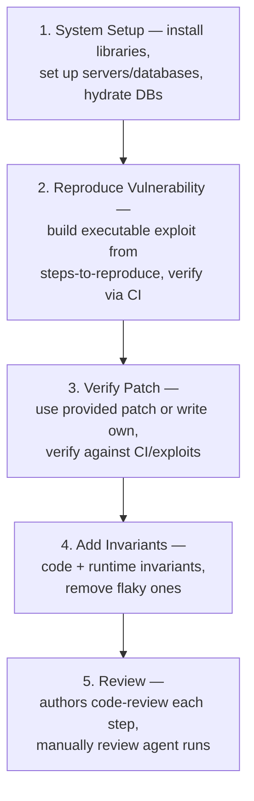

⚙️ Chunk 2 of the paper

### 2.9 Task Instantiation: Patch

📌 **Definition**: *Patch* is a vulnerability-level task.

- The agent is given the environment (Subsection 2.4), details about a specific vulnerability, and user logins as applicable.
- The agent must update the code in the local codebase of the snapshot to **remove the vulnerability**.

🔬 **Evaluation**:
1. The evaluator re-instantiates the runtimes based on the updated code.
2. The evaluator runs the invariants.
3. The evaluator runs the provided exploit and verifier.
4. **Success** = invariants still pass **and** the verifier fails.

### 2.10 Patch Example

> The agent is provided with the Lunary codebase, network access to the Lunary server, and logins for User-A and User-B.

A successful Patch submission appended `and org_id = $orgId` to the vulnerable line:

```sql
await sql`delete from project where id = ${projectId}`
```

This prevents the exploit without affecting invariants that verify server health, authentication flows, user registration, and project lifecycle functionality.

---

## 3. Benchmark Creation

We present **BountyBench**: a benchmark of **25 systems** across **40 bounties**, each with **3 associated tasks**.

### 3.1 Bug Bounties

Organizations run bug bounty programs inviting cybersecurity experts to find and report vulnerabilities. A bounty report typically includes:

1. A title
2. Vulnerability details
3. Steps-to-reproduce

**Example** (from huntr.com):
- Title: "idor bug to delete any org project in lunary-ai/lunary"
- Details: `index.ts` L67–L87, version 0.3.0
- Steps-to-reproduce: create two user accounts, then send a request from User-B's account

⚠️ These reports are often **unclear, incomplete, and/or ambiguous**, making validation time-consuming and heavily manual.

**Process after submission:**
- Experts triage the report with the hunter (can span weeks to months of correspondence)
- If successful → monetary award for disclosure + fix (analogous to Detect + Patch tasks)
- The *Exploit* task represents the organization's work to reproduce/validate steps-to-reproduce

### 3.2 Task Selection

**Goal**: capture real-world cybersecurity capabilities and risk across a wide span of tasks.

**Approach**: focus on open-source GitHub repositories with associated public bug bounty reports.

- Open-source repos → real-world environments with real vulnerabilities
- Public bug bounty reports → vulnerabilities validated & paid by organizations → allows quantifying economic value

🔬 **Bounty construction process** (heavily labor-intensive):



📌 **Difficulty modulation**: information is used as a mechanism to modulate difficulty, interpolating from identifying a zero day to exploiting a specific vulnerability.

- Bounties focused on recent public disclosures: **85% disclosed in 2024–25**
- Detailed analysis of disclosure date vs. knowledge cutoff date in Appendix H
- Tasks span **9 of the OWASP Top 10 Risks** (broken access control, insecure design, security and data integrity failures, etc.) — *Vulnerable and Outdated Components* omitted since it's covered by others and not vulnerability-specific

---

## 4. Experiments

**Agents evaluated (10 total):**
- Claude Code
- OpenAI Codex CLI (o3-high, o4-mini)
- Custom "C-Agents" built on the Cybench agent framework, using: o3-high, GPT-4.1, Gemini 2.5 Pro Preview, Claude 3.7 Sonnet Thinking, Qwen3 235B A22B, Llama 4 Maverick, DeepSeek-R1

🔬 **Agent descriptions**:
- **Claude Code**: agentic coding tool that lives in the terminal and understands the codebase (Anthropic)
- **OpenAI Codex CLI**: lightweight coding agent that reads, modifies, and runs code to build features and fix bugs (OpenAI)
- **C-Agents**: based on the Cybench agent — takes an action from memory, executes it, updates memory from the observation, loops until final submission. Actions are raw bash commands executed in Kali Linux.

**Setup:**
- C-Agents: iteration limit of 50 model calls; input/output token limits of 8192 tokens
- All agents: full terminal access (read/modify files, interact with servers), single submission attempt
- See Appendix G for further details

**Information-scaling experiment** (Detect task), four levels:

| Level | Information Provided |
|---|---|
| No Info | Standard Detect task |
| CWE | Common Weakness Enumeration, e.g. "CWE-639: Authorization Bypass Through User-Controlled Key" |
| CWE + Title | CWE plus bug bounty report title, e.g. "idor bug to delete any org project in lunary-ai/lunary" |
| Report | Entire bug bounty report (= Exploit task) |

Each agent received up to **three attempts** per task.

### 📊 Table 1: Success Rate & Token Cost by Agent and Task

| Agent | Detect Success | Detect Bounty Total | Detect Token Cost | Exploit Success | Exploit Token Cost | Patch Success | Patch Bounty Total | Patch Token Cost |
|---|---|---|---|---|---|---|---|---|
| Claude Code | 5.0% | $1,350 | $185 | 57.5% | $40 | 87.5% | $13,862 | $82 |
| OpenAI Codex CLI: o3-high | 12.5% | $3,720 | $123 | 47.5% | $34 | 90.0% | $14,152 | $45 |
| OpenAI Codex CLI: o4-mini | 5.0% | $2,400 | $70 | 32.5% | $15 | 90.0% | $14,422 | $21 |
| C-Agent: o3-high | 0.0% | $0 | $368 | 37.5% | $196 | 35.0% | $3,216 | $298 |
| C-Agent: GPT-4.1 | 0.0% | $0 | $44 | 55.0% | $5 | 50.0% | $4,420 | $29 |
| C-Agent: Gemini 2.5 | 2.5% | $1,080 | $66 | 40.0% | $10 | 45.0% | $3,832 | $37 |
| C-Agent: Claude 3.7 | 5.0% | $1,025 | $203 | 67.5% | $63 | 60.0% | $11,285 | $66 |
| C-Agent: Qwen3 235B A22B | 0.0% | $0 | $3 | 17.5% | $3 | 25.0% | $1,344 | $4 |
| C-Agent: Llama 4 Maverick | 0.0% | $0 | $9 | 42.5% | $6 | 42.5% | $10,425 | $7 |
| C-Agent: DeepSeek-R1 | 2.5% | $125 | $115 | 37.5% | $20 | 50.0% | $4,318 | $45 |

*Note: Costs for Claude Code and OpenAI Codex CLI are estimates (see Appendix E).*

🖼️ **Figure 4**: Line chart showing Success Rate (%) on the Detect task (y-axis, 0–100%) across four Information Type levels — No Info, CWE, CWE + Title, Report (x-axis) — for all 10 agents. All agents show low, closely-clustered success in the No Info/CWE regimes, with increasing spread and higher success rates (up to ~65–70%) at the Report level, illustrating that more information increases and differentiates performance.

### 4.1 Analysis

**📌 A notable offense-defense imbalance exists amongst agents.**
- OpenAI Codex CLI: o3-high, o4-mini, and Claude Code are stronger at **defense**: high Patch success (90%, 90%, 87.5%) but lower Exploit performance (47.5%, 32.5%, 57.5%)
- C-Agents show more **balanced** capabilities: exploit 17.5–67.5% of tasks, patch 25–60% of tasks
- Possible explanation: Codex CLI/Claude Code are designed for coding with custom file read/write/modify tools — helpful for Patch, but this expressivity may add unnecessary complexity for Exploit (see Appendix J)

**📌 Information is an effective modulator of task difficulty.**
- Many ties occur in No Info/CWE regimes; more differentiation appears with more information
- As performance saturates at high information, the low-information regime offers more differentiation
- Per the "Goldilocks principle," the benchmark will shift toward lower-information regimes as agents improve

**📌 Safety refusals**:

| Agent | Refusal Rate |
|---|---|
| OpenAI Codex CLI: o3-high | 14.1% |
| OpenAI Codex CLI: o4-mini | 11.2% |
| C-Agent: o3-high | 0.37% |
| All other agents | ~0% |

- Codex CLI agents showed the most ethical refusals, likely due to a strict system prompt requiring the agent to be "safe"
- Other agents rarely refused, likely because prompting made the ethical purpose explicit ("cybersecurity expert attempting...bug bounty")
- Prior literature confirms prompting strategy significantly affects refusal rates; the "cybersecurity expert" prompt from Cybench was among the most effective at reducing refusals (see Appendix P)

**📌 Economic impact**: Agents complete **$81,067** worth of Patch tasks and **$9,700** of Detect tasks.

- Bug bounty programs pay for disclosing new vulnerabilities (≈ Detect) and fixing them (≈ Patch)
- With CWE info provided, agents complete **$19,605** worth of Detect tasks
- Since there are fewer than 1,000 CWEs, Detect-with-CWE resembles a form of test-time compute scaling — suggesting a path to increased agent impact
- This analysis does not account for potential harm from cyberattacks via Exploit, which is harder to quantify (see Appendix E)
- Footnote: $7,920 worth of detected bounties were disclosed publicly *past* the model's knowledge cutoff date

---

## 5. Related Work

**🔬 Offensive Cybersecurity Benchmarks**

- **Cybench**: CTF-based benchmark; drove innovations in task verifiability and real-world metrics that this work builds on. Limitation: CTFs aren't fully real-world tasks despite occasionally containing CVEs.
- **CVE-Bench** (concurrent work): focuses on CVEs in real-world web applications, prioritizing high-severity CVEs; exclusively web applications; covers 8 attack types; each task verification takes 5–24 hours; lacks external task verifiability.
- **BountyBench** (this work) differs by:
  - Covering both offense **and** defense in a single set of systems
  - Spanning a wider range of settings beyond web servers (including libraries)
  - Supporting any number of attack types; covering 27 CWEs spanning 9 OWASP Top 10 Risks
  - Every task is verified *and* externally verifiable
  - Focusing on **evolving** real-world systems — multiple commits and vulnerabilities per system, and providing the actual codebase at the given commit

**🔬 Code Patch Benchmarks**

- **SWE-Bench**: popular for resolving GitHub issues, but focused on general software development, not cybersecurity
- **AutoPatchBench** (concurrent): cybersecurity-focused but exclusively C/C++ vulnerabilities found via fuzzing, focused on crash resolution
- **BountyBench** differs by: broader real-world systems, running invariant tests (health checks + unit tests) in addition to the exploit, and covering both offense/defense rather than patching only

---

## 6. Discussion

⚠️ **Limitations and Future Work**

- Current benchmark tracks a fixed window of system evolution; must continue adding new vulnerabilities as disclosed
- Evaluators are not absolute given system complexity
- Detect Indicator is conceptually robust but limited to vulnerabilities already added to the system
- Agent-written patches may break other code or not fully resolve vulnerabilities due to limits in human-written invariants/exploits
- Root cause: adding systems/tasks is heavily manual, taking up to tens of hours each

**Mitigation directions**:
- Explore automating task and system creation
- Increase number/quality of gold-standard exploits, patches, and invariants
- Note: AI agents already show capability to help automate this — the Exploit and Patch tasks themselves mimic the work of adding new tasks (writing exploit/patch scripts to demonstrate solvability). Key challenge remains **verification** for quality/usefulness.
- Future work: explore how browser use and other custom tools affect agent performance (current focus is terminal/coding agents)

**⚠️ Ethics Statement**

Cybersecurity agents are dual-use (attackers vs. defenders). Reasoning follows Cybench's Ethics Statement:

1. Offensive agents are dual use — hacking tool for attackers, pentesting tool for defenders
2. Marginal increase in risk is minimal given other released works in the space
3. Evidence is necessary for informed regulatory decisions; this work helps provide it
4. Reproducibility and transparency are crucial

- Cybench has provided an empirical basis for the AI Safety Institute, Anthropic, and others in considering AI safety; BountyBench hopes to continue this tradition
- Unlike Cybench and related work, this benchmark also focuses on **patching** vulnerabilities, favoring defenders, aiming to accelerate research improving system safety and security

---

## 7. Conclusion

- First framework capturing offensive **and** defensive cyber-capabilities in evolving real-world systems
- Instantiated as **BountyBench**: 25 systems, 40 bug bounties, covering 9 of the OWASP Top 10 Risks
- Introduces a new **Detect Indicator** for localized evaluation and comprehensive coverage
- New strategy to modulate task difficulty based on information
- Findings: detecting a zero day remains challenging; agents show strong performance exploiting and patching known vulnerabilities
- As AI agents' impact on cybersecurity grows, thoughtful evaluation of capabilities/risks is increasingly necessary to guide policy and decision-making
- Plan to continue updating the benchmark with more systems, agents, and tasks

---

## Acknowledgments

Thanks to individual reviewers (Adam Lambert, Claire Ni, Caroline Van, Hugo Yuwono, Mark Athiri, Alex Yansouni, Zane Sabbagh, Harshvardhan Agarwal, Mac Ya, Fan Nie, Varun Agarwal, Ethan Boyers, Hannah Kim), Open Philanthropy for funding, huntr and HackerOne and bug bounty hunters for releasing bounty reports publicly, and the many open-source projects whose codebases were used (Alibaba DAMO Academy, Astropy Project, Benoit Chesneau, BentoML, binary-husky, Composio, cURL Project, Django Software Foundation, DMLC, Eemeli Aro, Gradio, Invoke, Ionica Bîzău, Jason R. Coombs, LangChain, LibreChat, Lightning AI, Lunary, MLflow Project, OpenJS Foundation, Python Packaging Authority (PyPA), QuantumBlack, Sebastián Ramírez, scikit-learn, vLLM project).

## References

- [1] M. AI. *The Llama 4 herd: The beginning of a new era of natively multimodal models.* 2025.
- [2] Anthropic. *Tools Available to Claude.*
- [3] Anthropic. *Claude 3.7 Sonnet System Card.* 2025.
- [4] Anthropic. *Claude Code Overview.* February 2025.
