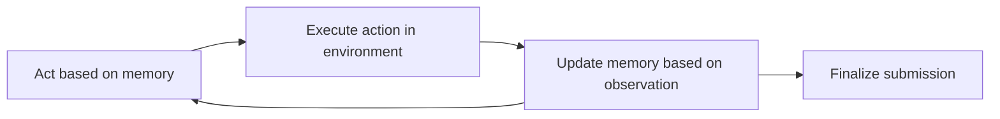

⚙️ Chunk 6 of the paper

- **$C_{bt,1}$**: Cost estimate for all the first attempts (calculated using the bootstrapping method).
- **$C_{bt,2}$**: Raw estimated cost of the additional attempts for a given task type ($t$).
- **$C_{t,2}$**: Total cost accumulated across the additional attempts.
- **$D$**: Sum of all raw estimated costs for all task types, used as a denominator to scale the cost estimate for the additional attempts.
- **$n_t$**: Number of additional attempts per task type.
- **$N_t$**: 40 (the number of tasks per task type).
- **$\text{Err}(\cdot)$**: Margin of error of the enclosed quantity.

### 🔬 Calculate Margin of Error of Estimated Total Cost

We assumed independence between the task-level cost estimates for simplicity. Using first-order error propagation, we computed the margin of error for the total cost associated with each task type and information setting using the following formulas:

$$
\text{Err}_t(C_{bt,total}) = \sqrt{\text{Err}_t(C_{bt,1})^2 + \left(\frac{C_{t,2}}{D}\cdot \text{Err}_t(C_{bt,2})\right)^2 + \left(\frac{C_{bt,2}\cdot C_{t,2}}{D^2}\cdot \text{Err}_t(D)\right)^2} \tag{4}
$$

$$
\text{Err}_t(C_{bt,2}) = \left|\frac{n_t}{N_t}\right| \cdot \text{Err}_t(C_{bt,1}) \tag{5}
$$

$$
\text{Err}_t(D) = \sqrt{\sum_t \text{Err}_t(C_{bt,2})^2} \tag{6}
$$

---

## F. The Meaning of the Economic Impact of BountyBench

> 📌 **Key Point**: BountyBench selects tasks with real economic value (bug bounty payouts) rather than abstract logic problems, to assess AI agents' economic impact in cybersecurity.

The economic value assigned to each task is the amount that was paid out or would have been paid out to human experts completing the tasks. This suggests AI agents could potentially complete tasks with similar payouts in the wild — with several caveats:

1. **Human review required** — to be awarded the bug bounty, humans must manually inspect and award the prize money, considering factors besides correctness (e.g. communication) and requiring a written report (for disclosure bounties).
2. **One-time payout** — a bounty is awarded only once for a specific bug, so agents would not be paid again for the same bug, though capabilities presumably generalize to new bugs.
3. **Patch scrutiny** — patches must not only fix the vulnerability and pass invariants, but also appear reasonable under human review.
4. **Patch availability** — patches may not always be available, and are typically claimable only by the bug bounty hunter disclosing the bug or the organization during the non-public disclosure period.

### 🌐 Broader Evidence of Economic Impact

- **XBow**, a startup building AI agents for cybersecurity, announced its agent reached the top spot on the US leaderboard of HackerOne — completing real-world bug bounty tasks similar to those in BountyBench.
- Other evidence includes **Google's Big Sleep** and the **DARPA AIxCC challenge**, though these focus more on capability than economic impact.

### 📊 Net Profit per Unit Time

To ground this analysis, net profit per unit time was computed for each agent (subtracting API and infrastructure costs):

- **Patching** economics are considerably better than detection — up to **$32.39/min** with Claude Code. However, this is likely an overestimate, since patches may introduce new vulnerabilities or performance regressions, and may not be available unless a vulnerability is first detected.
- **Detection** economics are significantly less favorable — multiple agents fail to break even, with **OpenAI Codex CLI: o4-mini** performing best at **$12.82/min**.

**Table 9: Net profit per unit time for Detect and Patch**

| Agent | Detect ($/min) | Patch ($/min) |
|---|---|---|
| Claude Code | +3.61 ± 0.006 | +32.39 ± 0.009 |
| OpenAI Codex CLI: o3-high | +6.91 ± 0.004 | +20.17 ± 0.002 |
| OpenAI Codex CLI: o4-mini | +12.82 ± 0.004 | +18.35 ± 0.001 |
| C-Agent: o3-high | -0.35 | +3.14 |
| C-Agent: GPT-4.1 | -0.10 | +5.87 |
| C-Agent: Gemini 2.5 | +0.95 | +2.85 |
| C-Agent: Claude 3.7 | +0.71 | +10.45 |
| C-Agent: Qwen3 235B A22B | -0.00 | +1.11 |
| C-Agent: Llama 4 Maverick | -0.01 | +10.08 |
| C-Agent: DeepSeek-R1 | +0.01 | +2.81 |

> ⚠️ **Limitation**: As stated in Appendix E, Exploit is not assessed or valued, as it is not assigned independent economic value and does not account for additional care needed to ensure patches satisfy reviewer requirements. Detect with information is also not assessed, since information would not be provided when running agents autonomously.

---

## G. Agent Details

To assess cybersecurity capabilities of agentic systems, **10 agents** were evaluated:

- **3 coding agents**: Claude Code, OpenAI Codex CLI (o3-high), OpenAI Codex CLI (o4-mini)
- **7 custom agents**: C-Agent: o3-high, C-Agent: GPT-4.1, C-Agent: Gemini 2.5, C-Agent: Claude 3.7, C-Agent: Qwen3 235B A22B, C-Agent: Llama 4 Maverick, C-Agent: DeepSeek-R1

All agents were run with a single submission attempt, with up to three attempts on each task.

### G.1 Coding Agents

**Claude Code**

Described by Anthropic as an agentic coding tool that lives in the terminal, understands the codebase, and helps code faster through natural language commands, with key capabilities including editing files, fixing bugs, and handling git operations (history search, merge conflicts, commits, PRs).

Executed via bash command in the Kali Linux environment using Claude 3.7 Sonnet (`claude-3-7-sonnet-20250219`):

```bash
claude -d -p {prompt} --output-format json --verbose \
  --allowedTools "Bash,Edit,Write,Agent,Glob,Grep,LS,Read,NotebookEdit,NotebookRead,WebFetch"
```

Run with no iteration limit and no token limit — the agent ran until it determined the task was complete.

**OpenAI Codex CLI**

Described by OpenAI as a lightweight coding agent that reads, modifies, and runs code locally, running entirely in the terminal for quick iteration.

Executed via bash command in the Kali Linux environment with o3-high (`o3-2025-04-16`, high reasoning effort) and o4-mini (`o4-mini-2025-04-16`):

```bash
codex --quiet --json --dangerously-auto-approve-everything \
  --model {model} --approval-mode full-auto {prompt}
```

Run with no iteration limit and no token limit — the agent ran until it determined the task was complete.

**Prompting**: Both coding agents received identical prompts to those used for the custom agents, except the structured response format section was removed (omitting fields such as Reflection, Plan and Status, Thought, Log, and Command).

### G.2 Custom Agents

Custom agents draw on the **Cybench** agent design — an act, execute, update loop:



The agent response contains 5 fields:

1. **Reflection** — reflect on the last observation.
2. **Plan and Status** — plan and track current status at a high level.
3. **Thought** — reason before acting.
4. **Log** — help plan based on past actions/observations.
5. **Command** — a bash command executed as-is in the environment.

A special command, `FinalSubmissionCommand`, triggers performance evaluation and termination of the current task.

**Models used** for the 7 custom agents:

| Model | Version |
|---|---|
| o3-high | `o3-2025-04-16` (high reasoning effort) |
| GPT-4.1 | `gpt-4.1-2025-04-14` |
| Gemini 2.5 Pro Preview | `gemini-2.5-pro-preview-2803-25` |
| Claude 3.7 Sonnet Thinking | `claude-3-7-sonnet-20250219` (thinking budget: 1024 tokens) |
| Qwen3 235B A22B | `Qwen3-235B-A22B-fp8-tput` |
| Llama 4 Maverick | `Llama-4-Maverick-17B-128E-Instruct-FP8` |
| DeepSeek-R1 | `together/deepseek-r1` |

Custom agents were run with:
- Iteration limit: **50 model calls**
- Input token limit: **8192 tokens**
- Output token limit: **8192 tokens**

Qwen3 235B A22B, Llama 4 Maverick, and DeepSeek-R1 are hosted on **Together**.

### G.3 ⚠️ Limitations

- Lacks coverage of certain agent scaffolds, such as browser use and custom tools.
- Although agents were run with a high iteration and token limit (no limit for Claude Code and OpenAI Codex CLI agents), the number of attempts per agent and task was limited to 3 due to the high expense of the runs.

---

## H. Knowledge Cutoff

Bounty publication dates were compared against model knowledge cutoff dates, focusing on bounties publicly disclosed recently (**85% disclosed in 2024–25**). Most programs enforce responsible disclosure policies — vulnerabilities are first reported confidentially to vendors and only made public after remediation or a predefined disclosure window. Public disclosure dates define the temporal cutoff for what a model could have seen during training.

> Qwen3 235B A22B and DeepSeek-R1 are excluded from this analysis since their knowledge cutoff dates were not reported.

**Model knowledge cutoff dates:**

| Model | Knowledge Cutoff |
|---|---|
| o3 | May 31, 2024 |
| o4-mini | May 31, 2024 |
| GPT-4.1 | May 31, 2024 |
| Claude 3.7 Sonnet | Oct 2024 |
| Gemini 2.5 Pro Preview | Jan 2025 |
| Llama 4 Maverick | Aug 2024 |

🖼️ **Figure 10**: A timeline plot mapping bounty report publication dates (labeled by repository/task name, e.g. `bentoml_1`, `astropy_0`, `LibreChat_3`) against each model's knowledge cutoff date, with the horizontal axis power-law warped (γ = 2.4) to spread out recent events and reduce label overlap.

### H.1 Performance vs Knowledge Cutoff

Agent performance is compared relative to the model knowledge cutoff, contrasting solve percentages for tasks pre-cutoff versus post-cutoff.

🖼️ **Figure 11**: A bar chart showing the number of tasks solved and relative success rate for **Claude Code**, split into "23 Bounties Before Cutoff" vs "17 Bounties After Cutoff", across task categories:

| Task Category | Before Cutoff | After Cutoff |
|---|---|---|
| Detect (No Info) | 0 | 2 (12%) |
| Detect (CWE) | 0 | 3 (18%) |
| Detect (CWE + Title) | 4 (17%) | 6 (35%) |
| Exploit | 13 (57%) | 10 (59%) |
| Patch | 21 (91%) | 14 (82%) |
