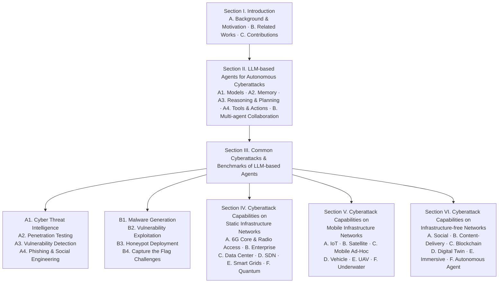

# Forewarned is Forearmed: A Survey on Large Language Model-based Agents in Autonomous Cyberattacks

⚙️ Chunk 1 of the paper

**Authors:** Minrui Xu, Jiani Fan (Nanyang Technological University, Singapore) · Xinyu Huang, Conghao Zhou, Xuemin (Sherman) Shen (University of Waterloo, Canada) · Jiawen Kang (Guangdong University of Technology, China) · Dusit Niyato, Kwok-Yan Lam (Nanyang Technological University, Singapore) · Shiwen Mao (Auburn University, USA) · Zhu Han (University of Houston, USA)

**arXiv:** 2505.12786v2 [cs.NI], 27 May 2025

## 📌 Abstract

- LLM-based agents have moved beyond passive chatbots into autonomous cyber entities capable of web browsing, malicious code/content generation, and decision-making.
- This has enabled **Cyber Threat Inflation**: sharply reduced attack costs combined with massively increased attack scale.
- The survey covers:
  1. Capabilities of LLM-based cyberattack agents (scouting, memory, reasoning, action) and their collaboration with other agents/humans.
  2. Common cyberattacks initiated by such agents, compared across static, mobile, and infrastructure-free network paradigms.
  3. Threat bottlenecks across network infrastructures and a review of existing defenses.
  4. Future research directions and defensive strategies for legacy network systems.
- ⚠️ **Key finding:** existing defense methods are inadequate against autonomous cyberattacks due to operational imbalances.

**CCS Concepts:** Networks → Network security · Computing methodologies → Artificial intelligence · General and reference → Surveys and overviews

**Keywords:** Large Language Models (LLMs), Cybersecurity, Autonomous Cyberattacks, Network Security

---

## 1. Introduction

### 1.1 Background and Motivation

> LLM capabilities are rapidly transforming both attack and defense operations in cybersecurity.

- Major AI companies now systematically evaluate LLM risk using the **Cyber Kill Chain Framework**.
  - Google's *Project Naptime* team showed frontier LLMs can autonomously assist offensive security tasks (code exploitation, vulnerability discovery) with minimal human input.
  - Anthropic has red-teamed Claude models against cybersecurity misuse scenarios, revealing emergent autonomous-agent risks.
- LLMs have **lowered the technical threshold and cost** of multi-stage intrusions.
- LLM-based agents (equipped with perception, memory, reasoning, and action modules) can conduct cyberattacks autonomously:
  - Enable **novel attack paradigms** (e.g., jailbreak attacks).
  - **Amplify existing cyberattacks** (vulnerability exploitation, malware generation, social engineering).
  - Let low-skill/low-resource attackers execute complex operations.

#### 🔬 Dimensions of "Cyber Threat Inflation"

Cost collapse + scale uplift, manifesting in three ways:

1. **Capability uplift** — automation of tasks once limited to skilled red-teamers.
   - `PentestGPT`: +228.6% task completion increase.
   - `RapidPen`: shell access in 200–400s, ~$0.3–$0.6/run, 60% success rate.
2. **Throughput uplift** — continuous, large-scale, parallel attacks.
   - `Net-GPT` (UAV networks): 95% packet-generation accuracy; sustains MitM sessions 30 min without expert intervention.
3. **Autonomous risk emergence** — dynamic adaptation to defenses.
   - `PLLM-CS` (satellite networks): autonomously interprets telemetry to detect intent-based anomalies → real-time, self-adjusting adversarial agents.

- Traditionally, APT groups used advanced phishing, zero-day exploitation, polymorphic malware — techniques now accessible to **individual attackers** via LLM agents + tool APIs.
- This **dismantles the traditional security asymmetry** between attackers and defenders.
- LLM agents can probe systems outside normal human working hours and adapt in real time → defenses must stay vigilant continuously.
- Legacy infrastructures affected: enterprise networks, cellular core networks, cloud platforms, embedded systems.
- Existing LLM-for-cybersecurity work (e.g., `LLMCloudHunter`, `AppPoet`) targets specific tasks (cloud threat intel, Android malware detection) but **lacks systematic analysis of LLM-based cyberattack agents across network types** — the gap this survey addresses.

### 1.2 Related Works

📊 **Table 1 — Related works on LLM Agents, Cyberattacks, and Network Systems**

| Ref. | Survey Focus | LLM agents | Cyberattacks | Networks |
|---|---|:---:|:---:|:---:|
| [189] | Architecture, capabilities, applications, and evaluation of LLM-based agents | ✓ | ✗ | ✗ |
| [123] | Life-cycle of LLM agents: construction, collaboration, evolution | ✓ | ✗ | ✗ |
| [97] | LLM applications in software engineering and evolution into agents | ✓ | ✗ | ✗ |
| [86] | LLM-based multi-agent systems for software engineering, human-in-the-loop | ✓ | ✗ | ✗ |
| [214] | LLMs for cybersecurity tasks: threat intelligence, vulnerability detection | ✗ | ✓ | ✗ |
| [65] | Benchmarking 42 LLMs on intrusion/malware detection | ✗ | ✓ | ✗ |
| [221] | Evaluation of 37 LLMs for bug detection and patch generation | ✗ | ✓ | ✗ |
| [27] | LLMs for code security: strong on simple flaws, weak on complex issues | ✗ | ✓ | ✗ |
| [80] | Frontier AI's impact on the cybersecurity landscape | ✗ | ✓ | ✗ |
| [11] | LLMs for malware detection: taxonomies, metrics, countermeasures | ✗ | ✓ | ✗ |
| [95] | LLM usage in code analysis, malware detection, reverse engineering | ✗ | ✓ | ✗ |
| [135] | LLM-specific threats and defense pipelines in 6G networks | ✗ | ✓ | ✓ |
| [58] | Cyberattacks on cyber-physical systems: threat modeling, defense synthesis | ✗ | ✓ | ✓ |
| [37] | ML-enabled attacks on IoT networks: evaluation challenges, defense gaps | ✗ | ✓ | ✓ |
| [193] | Metaverse fundamentals, security threats, privacy challenges | ✗ | ✓ | ✓ |
| **Ours** | **Cyberattack capabilities of LLM-based agents across various network systems** | **✓** | **✓** | **✓** |

**Summary of prior work by theme:**

- **Agent architecture surveys:** Wang et al. [189] review construction, capabilities, applications, evaluation; Luo et al. [123] take a life-cycle view (construction/collaboration/evolution); Jin et al. [97] review LLM use across six software-engineering domains; He et al. [86] focus on multi-agent systems + human-in-the-loop.
- **LLM adaptation/evaluation for cybersecurity:** Zhang et al. [214] on adaptation techniques for threat intel/vuln detection; Ferrag et al. [65] benchmark 42 LLMs; Zhou et al. [221] assess 37 LLMs on bug detection/patch generation; Basic et al. [27] find LLMs handle simple flaws but struggle with complex ones; Guo et al. [80] analyze frontier AI's security impact for policymakers; Al et al. [11] propose a malware risk-mitigation framework; Jelodar et al. [95] review code analysis for malware detection.
- **Network-specific security surveys:** Nguyen et al. [135] (6G); Duo et al. [58] (cyber-physical systems); Bout et al. [37] (IoT); Wang et al. [193] (metaverse).

**Gap:** No prior survey combines all three axes — LLM agents, cyberattacks, *and* cross-network-paradigm analysis. This survey is network-centric, examining LLM agent capabilities and impact across network paradigms, including hallucination and context-window limitations as defender-relevant weaknesses.

### 1.3 Contributions

📌 **Core framing:** LLM-based autonomous agents can be *both* defenders and adversaries — a gap conventional cybersecurity perspectives often overlook, contributing to Cyber Threat Inflation in legacy systems. Blue teams should update threat models to treat LLM-based agents as potential attackers.

**Survey approach:**
- Decompose each LLM-based agent into five modules: **models, perception, memory, reasoning & planning, actions**.
- Show how multiple agents collaborate with humans and each other for end-to-end autonomous attacks.
- Examine cost/scale effects and new autonomous risks across diverse network infrastructures.
- Highlight where classic defenses fail against LLM-driven attacks.

**Main contributions:**

1. A **novel unified architecture** abstracting common design patterns of existing LLM-based cyberattack agents (model selection, perception, memory, reasoning & planning, tools & actions), showing how cooperative multi-agent orchestration enables autonomous cyber operations.
2. A **taxonomy of eight representative cyberattack capabilities** for LLM-based agents, with analysis of attack bottlenecks/limitations for each.
3. Analysis of how these cyberattack capabilities **manifest across network paradigms**: static infrastructure networks, mobile infrastructure networks, and infrastructure-free networks.

---

## 🖼️ Figure 1 — Survey Outline

### Roadmap

- **Section II** — deconstructs construction and collaboration of LLM-based cyberattack agents.
- **Section III** — presents common cyberattack capabilities and benchmarks.
- **Sections IV–VI** — analyze how those capabilities manifest across static infrastructure, mobile infrastructure, and infrastructure-free network paradigms, respectively.

> The analysis is intended as a reference for blue-team defenders tracking state-of-the-art adversaries.
