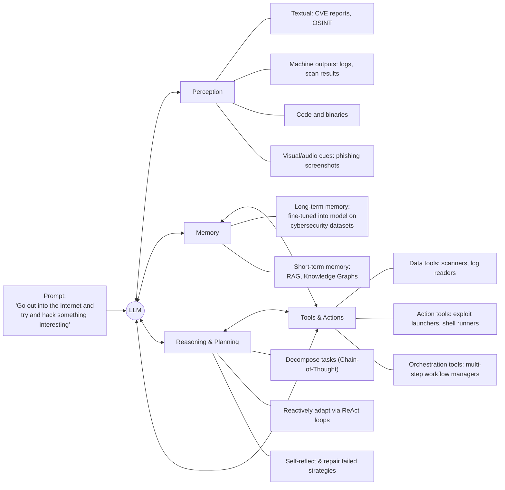
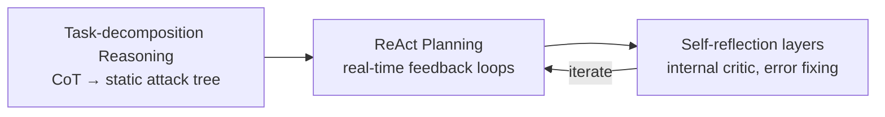
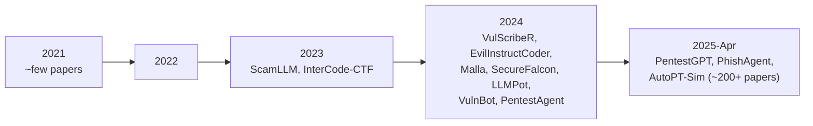

⚙️ Chunk 2 of the paper

## 2 Large Language Model-based Agents in Autonomous Cyberattacks

Cyberattack agents are built on top of LLMs with external modules that map high-level natural-language objectives to concrete offensive actions.

🖼️ Figure: Modular architecture diagram (Fig. 2) showing an LLM-based cyberattack agent construction, where a user prompt ("Go out into the internet and try and hack something interesting for me") flows into an LLM core connected to four surrounding modules: Perception, Memory, Reasoning & Planning, and Tools & Actions.

> This architecture enables the agent to ingest diverse input types, store and retrieve contextual knowledge, adaptively plan multi-stage attacks, and interact with tools to perform cyberattacks.

The core module is an LLM, while **perception, memory, reasoning, and actuation** are provided by external APIs or tool wrappers.

---

### 2.1 LLM-based Agent Construction

#### 2.1.1 Models

📌 **Key Point:** Agents typically use state-of-the-art pretrained models (GPT-3.5/4, Llama) as their "brain" due to strong world knowledge and reasoning.

- Larger context and better reasoning in newer LLMs → more potent attacks.
- Cloud-based LLMs are common, but attackers may prefer **local open-source models** to evade detection via API logs.
- Fine-tuning smaller open-source LLMs for security tasks addresses cost/exposure limitations:
  - **Hackphyr** (Rigaki et al.) — 7B-parameter local red-team agent; runs on a single GPU; matches GPT-4 and outperforms GPT-3.5-turbo on complex network intrusion scenarios due to training on a purpose-built cybersecurity dataset.
  - **AttackLLM** (Ahmed et al.) — for industrial control systems (ICS); combines data-centric and design-centric methods to generate diverse, realistic attack scenarios without expensive physical testbeds; shown to exceed human-crafted attack patterns in quality and diversity.

⚠️ **Limitation:** LLMs have context size limits, knowledge cutoffs, and hallucination tendencies — these can be estimated via benchmarks/evaluation systems, and defenders can exploit them once identified.

**Table 2. Comparison of state-of-the-art LLMs (May 2025)**
*(Context window in tokens, speed in tokens/second, prices in USD per million tokens)*

| Company | Model | Parameters | Context Window | Speed | Input Price | Output Price | MMLU |
|---|---|---|---|---|---|---|---|
| OpenAI | GPT-o3 | — | 1M | 77 | $10.00 | $40.00 | 0.853 |
| OpenAI | GPT-4o | — | 128k | 164 | $5.00 | $15.00 | 0.803 |
| Meta | Llama 4 Maverick | 400B | 1M | 121 | $0.20 | $0.85 | 0.809 |
| Meta | Llama 3.3 | 70B | 128k | 110 | $0.59 | $0.70 | 0.713 |
| Google | Gemini 2.5 | — | 1M | 160 | $1.25 | $10.00 | 0.800 |
| Google | Gemini 2.0 | — | 1M | 205 | $0.07 | $0.30 | 0.724 |
| Anthropic | Claude 3.7 Sonnet | — | 200k | 77 | $3.00 | $15.00 | 0.803 |
| Anthropic | Claude 3.5 Haiku | — | 200k | 66 | $0.80 | $4.00 | 0.634 |
| Mistral AI | Mixtral 8×7B | 56B | 33k | 80 | $0.70 | $0.70 | 0.387 |
| DeepSeek | R1 | 671B | 130k | 24.6 | $0.55 | $2.219 | 0.844 |
| xAI | Grok 3 | 2.7T | 1M | 49 | $3.00 | $15.00 | 0.799 |

**Benchmarks and Evaluation**

- Early studies gave broad capability evaluations but lacked task-level granularity.
- **CS-Eval** (Yu et al.) — eleven cybersecurity tasks (e.g., vulnerability management, penetration testing) covering knowledge, reasoning, and application.
- **AgentHarm** (Andriushchenko et al.) — 110 harmful tasks across eleven categories (fraud, cybercrime, harassment); found even advanced models follow unsafe instructions.
- **HarmBench** (Mazeika et al.) — wide array of harmful behaviors (textual + multimodal); found no model is fully robust, even with strong alignment techniques.
- **R-Judge** (Yuan et al.) — evaluates risk awareness in multi-step decisions.

---

#### 2.1.2 Perception

Perception acquires multimodal information from the environment, ingesting heterogeneous inputs and transforming them into structured representations for reasoning and action.

An autonomous cyberattack agent encounters at least **four distinct sensory channels**:

1. **Textual OSINT and Human Prose** — tweets, dark-web forum discussions, CVE advisories, incident response blogs.
2. **Machine Traces** — Nmap/Masscan scan banners, Nessus XML outputs, system log entries, NetFlow/PCAP packet captures.
3. **Program Artefacts** — source code snippets, AST/CFG fragments, disassembled binaries, container manifests.
4. **Diagrammatic and Audiovisual Cues** — phishing webpage screenshots, network topology diagrams, VoIP samples (vishing).

📊 State-of-the-art LLMs already show strong situational awareness — e.g., **GPT-4 achieves ~F1 0.94** classifying cyber threat posts from Twitter feeds.

> Incoming artefacts are tokenized and embedded with the LLM encoder → vectors enter the short-term buffer → condensed into schema triples for the long-term store, enabling retrieval and planning.

---

#### 2.1.3 Memory

LLM-based agents require a dual-memory architecture to consider both static cybersecurity knowledge and dynamic environmental information.

**Long-term Memory** — static repository of cybersecurity knowledge internalized during pretraining/fine-tuning; provides foundational expertise on vulnerabilities, exploits, attack vectors, defensive protocols.

| Resource | Description |
|---|---|
| PRIMUS | 18GB corpus aggregating open-source cybersecurity data (advisories, exploit scripts, traffic captures) for LLM pretraining |
| ATTACKER | Named-entity recognition benchmark for attribution tasks |
| SECQA | Cybersecurity-focused Q&A corpus |
| CMDCALIPER | Semantic mapping of command-line activities |

**Short-term Memory** — dynamic, real-time information handling, limited by context windows, addressed via:

1. **Retrieval-Augmented Generation (RAG)** — accesses external knowledge sources without retraining, enabling use of latest threat intel.
   - Daneshvar et al.: a RAG-enhanced vulnerability scanner improves vulnerability detection accuracy by **70%**.
2. **Knowledge Graphs (KGs)** — structured memory where nodes = systems/vulnerabilities, edges = relationships.
   - Extraction tools: **ATTACKG**, **CTI-KG**, **CTI-NEXUS** — build threat KGs from reports.
   - KGs help maintain operational coherence across multi-stage attacks.

> RAG enables millisecond-level recall of short-term memory, while the KG provides triples for causal reasoning.

---

#### 2.1.4 Reasoning and Planning

Unlike static bots, LLM-based agents reason through failures and change tactics dynamically. Modern foundation models (GPT-4o, GPT-o3) expose latent chain-of-thought (CoT) traces even before task-decomposition scaffolding is applied.

Three core reasoning methods:

1. **Task-decomposition Reasoning**
   - Agent exposes CoT to perform multi-step reasoning on complex tasks.
   - Repeated CoT prompting → agent develops an **attack tree** where each node is a prerequisite/sub-goal.
   - Tree-/graph-of-thoughts prompting lets the agent branch early and explore multiple candidate paths in parallel.

2. **ReAct Planning**
   - After an initial plan, the agent enters a **Reason-Act loop**, enabling dynamic re-planning.
   - Immediate follow-up reasoning after each action → marked increase in exploit success rate.
   - ⚠️ Feeding misleading/confusing information can derail the agent's reasoning (defensive implication).

3. **Self-reflection and Auto-repair**
   - Agents embed a lightweight "critic" reviewing the latest CoT/action log, flagging contradictions/dead ends, triggering self-correction.
   - **Crimson agent** — couples scenario simulation with rule-based sanity checks; e.g., a low-privilege shell success automatically triggers privilege-escalation suggestions.
     - Builds a comprehensive **CVE-to-ATT&CK Mapping** dataset.
     - Uses **Retrieval-Aware Training**.
     - 7B-parameter model + **LoRA** fine-tuning → results comparable to GPT-4 with lower hallucination/error rates.

---

#### 2.1.5 Action and Tools

LLM-based autonomous agents interface with external tools/system commands to bridge language and cyber operations, standardized into three categories:

| Tool Category | Purpose | Examples |
|---|---|---|
| **Data tools** | Passive information gathering/recon | File-system readers, port scanners, vulnerability enumerators, HTTP request handlers |
| **Action tools** | Active environment manipulation | File-system operations, network scans, exploit payload launches, authentication attempts |
| **Orchestration tools** | Coordinate complex workflows | Sequencing sub-actions, delegating subtasks, building multi-stage attack chains |

📌 Agents are provided a **predefined, controlled set** of callable tools/APIs — defenders can monitor usage of powerful admin/network tools, preventing unauthorized automated operations via whitelists or two-factor authentication.

**Tool-using benchmarks and safety findings:**

- **AI Cyber Risk Benchmark** (Ristea et al.) — tests LLM agents' exploit capabilities in controlled environments.
- Fang et al. — demonstrated an LLM agent with web tools that found and exploited vulnerabilities through attack stages.
- Kim et al. — warn that web-enabled LLMs, once acting on the open internet, can perform unintended or malicious operations.
- ⚠️ Strict controls are imposed on tool access; agents typically confined to isolated testbeds to mitigate real-world risk.
- **CyberSecEval suite** (Bhatt et al.) — standardized evaluation framework testing agents across cybersecurity tasks within a controlled environment.

🖼️ Figure: Timeline (Fig. 3) plotting cumulative number of papers on LLM-based agents in cyberattacks from 2021 to April 2025, rising steeply from near 0 in 2021 to over 200 by early 2025, annotated with example systems across categories (Cyber Threat Intelligence, Penetration Testing, Vulnerability Detection, Phishing and Social Engineering, Malware Generation, Vulnerability Exploitation, Honeypot, Capture the Flag Challenges) — including ScamLLM, InterCode-CTF (2021–2023), VulScribeR, EvilInstructCoder, Malla, SecureFalcon, LLMPot, VulnBot, PentestAgent, PentestGPT, PhishAgent, AutoPT-Sim (2024–2025).

---

### 2.2 Multi-agent Collaboration

Multiple LLM-based agents can collaborate on a complex attack (e.g., one scans, another exploits, another exfiltrates).

- **Audit-LLM** (Song et al.) — insider threat detection framework using three agent types: **planner agents, specialist agents, analyst agents** to analyze security logs.
- Multi-agent cyberattacks can also adopt **adversarial/competitive roles**: one agent as attacker, another as defender/cautious evaluator, effectively red-teaming each other.
- Wang et al. — explore an RL-driven agent that autonomously attacks other LLM-based systems, iteratively improving offensive and defensive tactics through simulation.

---

### 2.3 Lessons Learned for Blue Teams

1. **Utilize Model Limitations** — Attackers use SOTA LLMs, but each has context length limits, knowledge cutoffs, and hallucination tendencies. Defenders aware of the specific LLM in use can exploit these weaknesses.
2. **Designed Traps in Multi-Stage Attacks** — LLM agents can complete recon, exploitation, and post-exploitation faster than humans (no pauses needed). Blue teams can implement automated incident response with specific reasoning delays during the OODA loop to interrupt the attack chain.
3. **Leverage Multi-Agent Defense** — Deploy multiple defensive LLM-based agents (one monitors networks, one watches files, one responds to threats) working together via shared data to counter varied attacks.

---

## 3 Common Cyberattacks and Benchmarks of LLM-based Agents

> Each LLM ability maps differently across cyberattack types, with perception and memory dominating reconnaissance tasks while reasoning, planning, and tool orchestration drive exploitation workflows (see Table 3). LLM-based agent frameworks for cyberattacks are listed in Table 4.

### 3.1 Threat Intelligence Gathering and Target Selection

LLMs process and synthesize intelligence from diverse sources, transforming it into actionable intelligence.

#### 3.1.1 Cyber Threat Intelligence (CTI)

- CTI capability uses a **retrieval-reasoning-action** framework with perceptual processing.
- **VulScribeR** (Daneshvar et al.) — RAG-powered framework that mutates, injects, and extends code to generate realistic vulnerable samples; boosts deep-learning vulnerability-detector F1 scores by up to **69.9%** at minimal cost.
- **LocalIntel** (Mitra et al.) — fuses public feeds with internal wikis and confidential reports for organization-specific intelligence; **Qwen1.5-7B-Chat** delivers **93% accurate contextualization** across 58 zero-day triggers while reducing [content continues in next chunk]...
